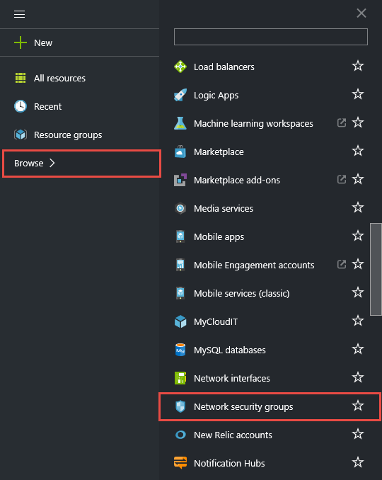

<properties 
   pageTitle="How to create NSGs in ARM mode using the preview portal | Microsoft Azure"
   description="Learn how to create and deploy NSGs in ARM using the preview portal"
   services="virtual-network"
   documentationCenter="na"
   authors="telmosampaio"
   manager="carolz"
   editor="tysonn"
   tags="azure-resource-manager"
/>
<tags 
   ms.service="virtual-network"
   ms.devlang="na"
   ms.topic="article"
   ms.tgt_pltfrm="na"
   ms.workload="infrastructure-services"
   ms.date="09/16/2015"
   ms.author="telmos" />

# How to manage NSGs using the preview portal

[AZURE.INCLUDE [virtual-networks-create-nsg-selectors-arm-include](../../includes/virtual-networks-create-nsg-selectors-arm-include.md)]

[AZURE.INCLUDE [virtual-networks-create-nsg-intro-include](../../includes/virtual-networks-create-nsg-intro-include.md)]

[AZURE.INCLUDE [azure-arm-classic-important-include](../../includes/azure-arm-classic-important-include.md)] This article covers the Resource Manager deployment model. You can also [create NSGs in the classic deployment model](virtual-networks-create-nsg-classic-ps.md).

[AZURE.INCLUDE [virtual-networks-create-nsg-scenario-include](../../includes/virtual-networks-create-nsg-scenario-include.md)]

## Deploy the ARM template by using click to deploy

At this time, you cannot create an NSG from the preview. However, you manage existing NSGs. Before you can manage NSGs, use the sample template available in the public repository to create the resources described in the scenario above. Deploy [this this template](http://github.com/telmosampaio/azure-templates/tree/master/201-IaaS-WebFrontEnd-SQLBackEnd-NSG), click **Deploy to Azure**, replace the default parameter values if necessary, and follow the instructions in the portal.

## Create rules in an existing NSG

To create rules in an existing NSG from the preview portal, follow the steps below.

1. From a browser, navigate to http://portal.azure.com and, if necessary, sign in with your Azure account.
2. Click **Browse>** > **Network security groups**.

3. In the list of NSGs, click **NSG-FrontEnd** > **Inbound security rules**

4. In the list of **Inbound security rules**, click **Add**.

5. In the **Add inbound security rule** blade, create a rule named *web-rule* with priority of *200* allowing access via *TCP* to port *80* to any VM from any source, and then click **OK**. Notice hos most of these settings are default values already.

6. After a few seconds you will see the new rule in the NSG.

