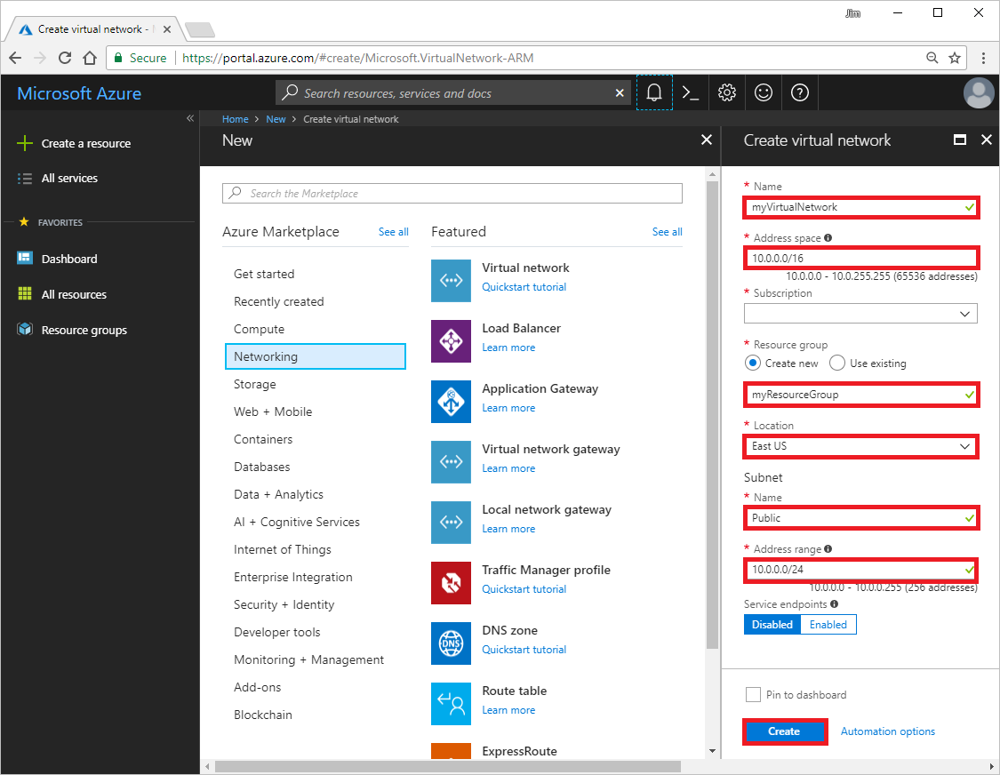
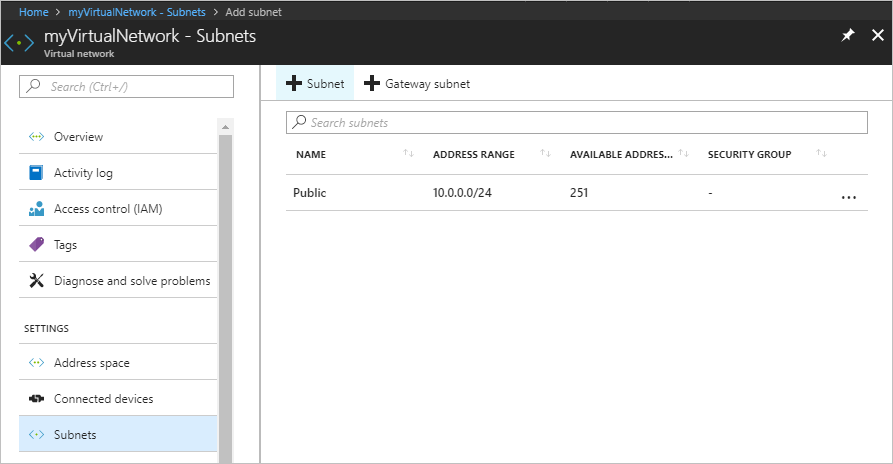
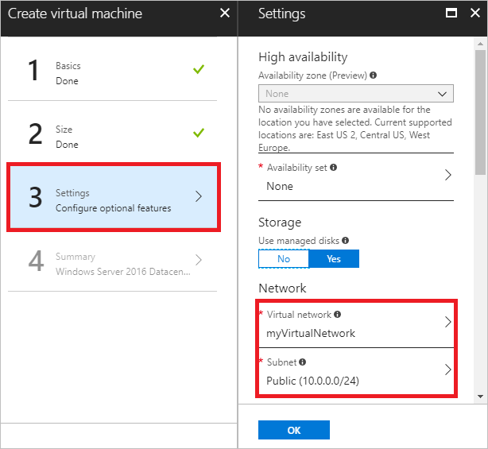

# Create a virtual network with multiple subnets using the Azure portal

A virtual network enables several types of Azure resources to communicate with the Internet and privately with each other. Creating multiple subnets in a virtual network enables you to segment your network so that you can filter or control the flow of traffic between subnets. In this article you learn how to:

> [!div class="checklist"]
> * Create a virtual network
> * Create a subnet
> * Test network communication between virtual machines

If you don’t have an Azure subscription, create a [free account](https://azure.microsoft.com/free/?WT.mc_id=A261C142F) before you begin.

## Log in to Azure 

Log in to the Azure portal at http://portal.azure.com.

## Create a virtual network

1. Select **+ Create a resource** on the upper, left corner of the Azure portal.
2. Select **Networking**, and then select **Virtual network**.
3. As shown in the following picture, enter *myVirtualNetwork* for **Name**, **myResourceGroup** for **Resource group**, *Public* for Subnet **Name**, 10.0.0.0/24 for Subnet **Address range**, select a **Location** and your **Subscription**, accept the remaining defaults, and then select **Create**:

    

    The **Address space** and **Address range** are specified in CIDR notation. The specified **Address space** includes the IP addresses 10.0.0.0-10.0.255.254. The **Address Range** specified for a subnet, must be within the **Address space** defined for the virtual network. Azure DHCP assigns IP addresses from a subnet address range to resources  deployed in a subnet. Azure only assigns the addresses 10.0.0.4-10.0.0.254 to resources deployed within the **Public** subnet, because Azure reserves the first four addresses (10.0.0.0-10.0.0.3 for the subnet, in this example) and the last address (10.0.0.255 for the subnet, in this example) in each subnet.

## Create a subnet

1. In the **Search resources, services, and docs** box at the top of the portal, begin typing *myVirtualNetwork*. When **myVirtualNetwork** appears in the search results, select it.
2. Select **Subnets** and then select **+ Subnet**, as shown in the following picture:

     
     
3. In the **Add subnet** box that appears, enter *Private* for **Name**, enter *10.0.1.0/24* for **Address range**, and then select **OK**.  A subnet address range cannot overlap with the address ranges of other subnets within a virtual network. 

Before deploying Azure virtual networks and subnets for production use, we recommend that you thoroughly familiarize yourself with address space [considerations](virtual-network-manage-network.md#create-a-virtual-network) and [virtual network limits](../azure-subscription-service-limits.md?toc=%2fazure%2fvirtual-network%2ftoc.json#azure-resource-manager-virtual-networking-limits). Once resources are deployed into subnets, some virtual network and subnet changes, such as changing address ranges, can require redeployment of existing Azure resources deployed within subnets.

## Test network communication

A virtual network enables several types of Azure resources to communicate with the Internet and privately with each other. One type of resource you can deploy into a virtual network is a virtual machine. Create two virtual machines in the virtual network so you can test network communication between them and the Internet in a later step.

### Create virtual machines

1. Select **+ Create a resource** on the upper, left corner of the Azure portal.
2. Select **Compute**, and then select **Windows Server 2016 Datacenter**. You can select a different operating system, but the remaining steps assume you selected **Windows Server 2016 Datacenter**. 
3. Select or enter the following information for **Basics**, then select **OK**:
    - **Name**: *myVmWeb*
    - **Resource group**: Select **Use existing** and then select *myResourceGroup*.
    - **Location**: Select *East US*.

    The **User name** and **Password** you enter are used in a later step. The password must be at least 12 characters long and meet the [defined complexity requirements](../virtual-machines/windows/faq.md?toc=%2fazure%2fvirtual-network%2ftoc.json#what-are-the-password-requirements-when-creating-a-vm). The **Location** and **Subscription** selected must be the same as the location and subscription the virtual network is in. It's not required that you select the same resource group that the virtual network was created in, but the same resource group is selected for this tutorial.
4. Select a VM size under **Choose a size**.
5. Select or enter the following information for **Settings**, then select **OK**:
    - **Virtual network**: Ensure that **myVirtualNetwork** is selected. If not, select **Virtual network** and then select **myVirtualNetwork** under **Choose virtual network**.
    - **Subnet**: Ensure that **Public** is selected. If not, select **Subnet** and then select **Public** under **Choose subnet**, as shown in the following picture:
    
        
 
6. Under **Create** in the **Summary**, select **Create** to start the virtual machine deployment.
7. Complete steps 1-6 again, but enter *myVmMgmt* for the **Name** of the virtual machine and select **Private** for the **Subnet**.

The virtual machines take a few minutes to create. Do not continue with the remaining steps until both virtual machines are created.

The virtual machines created in this article have one [network interface](virtual-network-network-interface.md) with one IP address that is dynamically assigned to the network interface. After you've deployed the VM, you can [add multiple public and private IP addresses, or change the IP address assignment method to static](virtual-network-network-interface-addresses.md#add-ip-addresses). You can [add network interfaces](virtual-network-network-interface-vm.md#vm-add-nic), up to the limit supported by the [VM size](../virtual-machines/windows/sizes.md?toc=%2fazure%2fvirtual-network%2ftoc.json) that you select when you create a virtual machine. You can also [enable single root I/O virtualization (SR-IOV)](create-vm-accelerated-networking-powershell.md) for a VM, but only when you create a VM with a VM size that supports the capability.

### Communicate between virtual machines and with the internet

1. In the *Search* box at the top of the portal, begin typing *myVmMgmt*. When **myVmMgmt** appears in the search results, select it.
2. Create a remote desktop connection to the *myVmMgmt* virtual machine by selecting **Connect**, as shown in the following picture:

      

3. To connect to the VM, open the downloaded RDP file. If prompted, select **Connect**.
4. Enter the user name and password you specified when creating the virtual machine (you may need to select **More choices**, then **Use a different account**, to specify the credentials you entered when you created the virtual machine), then select **OK**.
5. You may receive a certificate warning during the sign-in process. Select **Yes** to proceed with the connection.
6. In a later step, ping is used to communicate with the *myVmMgmt* virtual machine from the *myVmWeb* virtual machine. Ping uses ICMP, which is denied through the Windows Firewall, by default. Enable ICMP through the Windows firewall by entering the following command from a command prompt:

    ```
    netsh advfirewall firewall add rule name=Allow-ping protocol=icmpv4 dir=in action=allow
    ```

    Though ping is used in this article, allowing ICMP through the Windows Firewall for production deployments is not recommended.
7. For security reasons, it's common to limit the number of virtual machines that can be remotely connected to in a virtual network. In this tutorial, the *myVmMgmt* virtual machine is used to manage the *myVmWeb* virtual machine in the virtual network. To remote desktop to the *myVmWeb* virtual machine from the *myVmMgmt* virtual machine, enter the following command from a command prompt:

    ``` 
    mstsc /v:myVmWeb
    ```
8. To communicate to the *myVmMgmt* virtual machine from the *myVmWeb* virtual machine, enter the following command from a command prompt:

    ```
    ping myvmmgmt
    ```

    You receive output similar to the following example output:
    
    ```
    Pinging myvmmgmt.dar5p44cif3ulfq00wxznl3i3f.bx.internal.cloudapp.net [10.0.1.4] with 32 bytes of data:
    Reply from 10.0.1.4: bytes=32 time<1ms TTL=128
    Reply from 10.0.1.4: bytes=32 time<1ms TTL=128
    Reply from 10.0.1.4: bytes=32 time<1ms TTL=128
    Reply from 10.0.1.4: bytes=32 time<1ms TTL=128
    
    Ping statistics for 10.0.1.4:
        Packets: Sent = 4, Received = 4, Lost = 0 (0% loss),
    Approximate round trip times in milli-seconds:
        Minimum = 0ms, Maximum = 0ms, Average = 0ms
    ```
      
    You can see that the address of the *myVmMgmt* virtual machine is 10.0.1.4. 10.0.1.4 was the first available IP address in the address range of the *Private* subnet that you deployed the *myVmMgmt* virtual machine to in a previous step.  You see that the fully qualified domain name of the virtual machine is *myvmmgmt.dar5p44cif3ulfq00wxznl3i3f.bx.internal.cloudapp.net*. Though the *dar5p44cif3ulfq00wxznl3i3f* portion of the domain name is different for your virtual machine, the remaining portions of the domain name are the same. 

    By default, all Azure virtual machines use the default Azure DNS service. All virtual machines within a virtual network can resolve the names of all other virtual machines in the same virtual network using Azure's default DNS service. Instead of using Azure's default DNS service, you can use your own DNS server or the private domain capability of the Azure DNS service. For details, see [Name resolution using your own DNS server](virtual-networks-name-resolution-for-vms-and-role-instances.md#name-resolution-using-your-own-dns-server) or [Using Azure DNS for private domains](../dns/private-dns-overview.md?toc=%2fazure%2fvirtual-network%2ftoc.json).

9. To install Internet Information Services (IIS) for Windows Server on the *myVmWeb* virtual machine, enter the following command from a PowerShell session:

    ```powershell
    Install-WindowsFeature -name Web-Server -IncludeManagementTools
    ```

10. After the installation of IIS is complete, disconnect the *myVmWeb* remote desktop session, which leaves you in the *myVmMgmt* remote desktop session. Open a web browser and browse to http://myvmweb. You see the IIS welcome page.
11. Disconnect the *myVmMgmt* remote desktop session.
12. Find the public IP address of the *myVmWeb* virtual machine. When Azure created the *myVmWeb* virtual machine, a public IP address resource named *myVmWeb* was also created and assigned to the virtual machine. You can see that 52.170.5.92 was assigned for **Public IP address** to the *myVmMgmt* virtual machine in the picture in step 2. To find the public IP address assigned to the *myVmWeb* virtual machine, search for *myVmWeb* in the portal's search box, then select it when it appears in the search results.

    Though a virtual machine isn't required to have a public IP address assigned to it, Azure assigns a public IP address to each virtual machine you create, by default. To communicate from the Internet to a virtual machine, a public IP address must be assigned to the virtual machine. All virtual machines can communicate outbound with the Internet, whether or not a public IP address is assigned to the virtual machine. To learn more about outbound Internet connections in Azure, see [Outbound connections in Azure](../load-balancer/load-balancer-outbound-connections.md?toc=%2fazure%2fvirtual-network%2ftoc.json).
13. On your own computer, browse to the public IP address of the *myVmWeb* virtual machine. The attempt to view the IIS welcome page from your own computer fails. The attempt fails because when the virtual machines were deployed, Azure created a network security group for each virtual machine, by default. 

     A network security group contains security rules that allow or deny inbound and outbound network traffic by port and IP address. The default network security group Azure created allows communication over all ports between resources in the same virtual network. For Windows virtual machines, the default network security group denies all inbound traffic from the Internet over all ports, accept TCP port 3389 (RDP). As a result, by default, you can also RDP directly to the *myVmWeb* virtual machine from the Internet, even though you might not want port 3389 open to a web server. Since web browsing communicates over port 80, communication fails from the Internet because there is no rule in the default network security group allowing traffic over port 80.

## Clean up resources

When no longer needed, delete the resource group and all resources it contains: 

1. Enter *myResourceGroup* in the **Search** box at the top of the portal. When you see **myResourceGroup** in the search results, select it.
2. Select **Delete resource group**.
3. Enter *myResourceGroup* for **TYPE THE RESOURCE GROUP NAME:** and select **Delete**.

## Next steps

In this tutorial, you learned how to deploy a virtual network with multiple subnets. You also learned that when you create a Windows virtual machine, Azure creates a network interface that it attaches to the virtual machine, and creates a network security group that only allows traffic over port 3389, from the Internet. Advance to the next tutorial to learn how to filter network traffic to subnets, rather than to individual virtual machines.

> [!div class="nextstepaction"]
> [Filter network traffic to subnets](./virtual-networks-create-nsg-arm-pportal.md)
