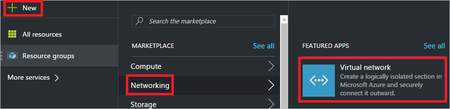
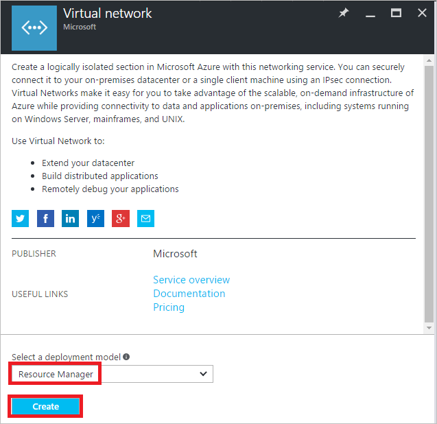
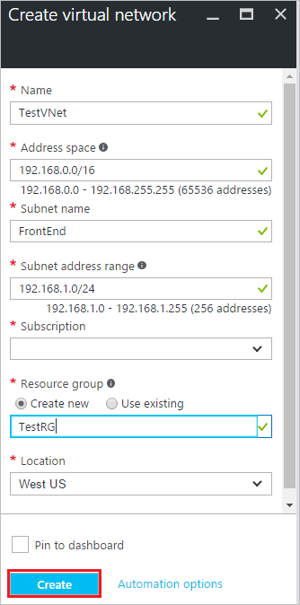
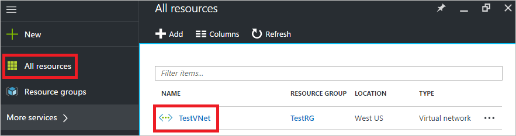
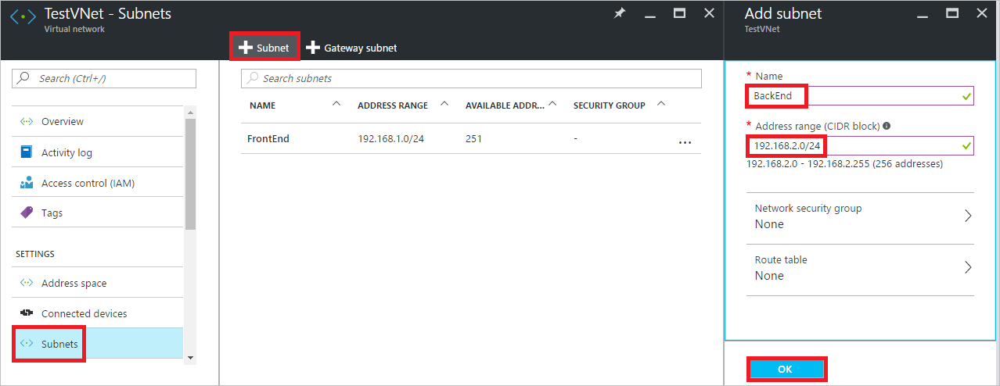
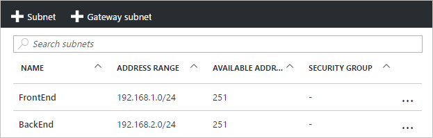

# Create a virtual network using the Azure portal

[!INCLUDE [virtual-networks-create-vnet-intro](../../includes/virtual-networks-create-vnet-intro-include.md)]

Azure has two deployment models: Azure Resource Manager and classic. Microsoft recommends creating resources through the Resource Manager deployment model. To learn more about the differences between the two models, read the [Understand Azure deployment models](../azure-resource-manager/resource-manager-deployment-model.md) article.
 
This article explains how to create a VNet through the Resource Manager deployment model using the Azure portal. You can also create a VNet through Resource Manager using other tools or create a VNet through the classic deployment model by selecting a different option from the following list:

> [!div class="op_single_selector"]
> * [Portal](virtual-networks-create-vnet-arm-pportal.md)
> * [PowerShell](virtual-networks-create-vnet-arm-ps.md)
> * [CLI](virtual-networks-create-vnet-arm-cli.md)
> * [Template](virtual-networks-create-vnet-arm-template-click.md)
> * [Portal (Classic)](virtual-networks-create-vnet-classic-pportal.md)
> * [PowerShell (Classic)](virtual-networks-create-vnet-classic-netcfg-ps.md)
> * [CLI (Classic)](virtual-networks-create-vnet-classic-cli.md)

[!INCLUDE [virtual-networks-create-vnet-scenario-include](../../includes/virtual-networks-create-vnet-scenario-include.md)]

## Create a virtual network

To create a virtual network using the Azure portal, complete the following steps:

1. From a browser, navigate to http://portal.azure.com and, if necessary, sign in with your Azure account.
2. Click **New** > **Networking** > **Virtual network**, as shown in the following picture:

	

3. In the **Virtual network** blade that appears, ensure that *Resource Manager* is selected and click **Create**, as shown in the following picture:

	
	
4. In the **Create virtual network** blade that appeared, enter *TestVNet* for **Name**, *192.168.0.0/16* for **Address space**, *FrontEnd* for **Subnet name** *192.168.1.0/24* for **Subnet address range**, *TestRG* for **Resource group**, select your **Subscription**, a **Location** and click the **Create** button, as shown in the following picture:

	

	Alternatively, you can select an existing resource group. To learn more about resource groups, read the [Resource Manager overview](../azure-resource-manager/resource-group-overview.md#resource-groups) article. You can also select a different location. To learn more about Azure locations and regions, read the [Azure regions](https://azure.microsoft.com/regions) article.

5. The portal only enables you to create one subnet when creating a VNet. For this scenario, a second subnet must be created after the VNet is created. To create the second subnet, click **All resources**, then click **TestVNet** in the **All resources** blade, as shown in the following picture:

	

6. In the **TestVNet** blade that appears, click **Subnet**, then click **+Subnet**, enter *BackEnd* for **Name**, *192.168.2.0/24* for **Address range** in the **Add subnet** blade, then click **OK**, as shown in the following picture:

	

7. The two subnets are listed, as shown in the following picture:
	
	

This article explained how to create a virtual network with two subnets for testing. Before creating a virtual network for production use, we recommend reading the [Virtual network overview](virtual-networks-overview.md) and [Virtual network plan and design](virtual-network-vnet-plan-design-arm.md) articles to fully understand virtual networks and all settings. 

## Next steps

Learn how to connect:

- A virtual machine (VM) to a virtual network by reading the [Create a Windows VM](../virtual-machines/virtual-machines-windows-hero-tutorial.md) or [Create a Linux VM](../virtual-machines/linux/quick-create-portal.md) articles. Instead of creating a VNet and subnet in the steps of the articles, you can select an existing VNet and subnet to connect a VM to.
- The virtual network to other virtual networks by reading the [Connect VNets](../vpn-gateway/vpn-gateway-howto-vnet-vnet-resource-manager-portal.md) article.
- The virtual network to an on-premises network using a site-to-site virtual private network (VPN) or ExpressRoute circuit. Learn how by reading the [Connect a VNet to an on-premises network using a site-to-site VPN](../vpn-gateway/vpn-gateway-howto-multi-site-to-site-resource-manager-portal.md) and [Link a VNet to an ExpressRoute circuit](../expressroute/expressroute-howto-linkvnet-portal-resource-manager.md) articles.