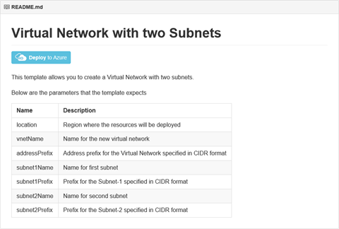
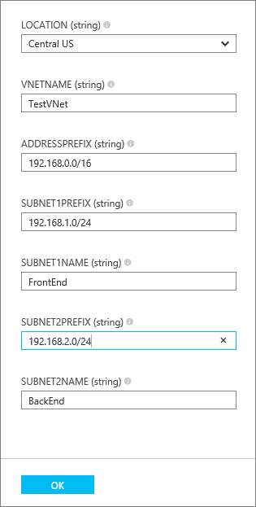
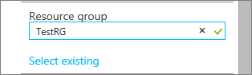
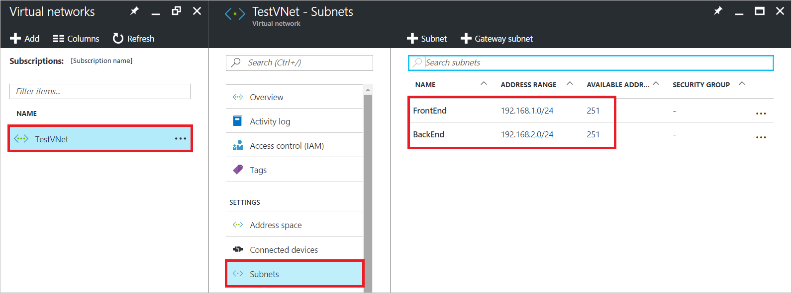

---
title: Create a virtual network | Azure Resource Manager template | Microsoft Docs
description: Learn how to create a virtual network using an Azure Resource Manager template.
services: virtual-network
documentationcenter: ''
author: jimdial
manager: timlt
editor: tysonn
tags: azure-resource-manager

ms.assetid: 69530861-2f97-4a6e-b336-a7baf2690044
ms.service: virtual-network
ms.devlang: na
ms.topic: article
ms.tgt_pltfrm: na
ms.workload: infrastructure-services
ms.date: 03/15/2016
ms.author: jdial
ms.custom: H1Hack27Feb2017 

---
# Create a virtual network using an Azure Resource Manager template

[!INCLUDE [virtual-networks-create-vnet-intro](../../includes/virtual-networks-create-vnet-intro-include.md)]

Azure has two deployment models: Azure Resource Manager and classic. Microsoft recommends creating resources through the Resource Manager deployment model. To learn more about the differences between the two models, read the [Understand Azure deployment models](../azure-resource-manager/resource-manager-deployment-model.md) article.
 
This article explains how to create a VNet through the Resource Manager deployment model using an Azure Resource Manager template. You can also create a VNet through Resource Manager using other tools or create a VNet through the classic deployment model by selecting a different option from the following list:

> [!div class="op_single_selector"]
- [Portal](virtual-networks-create-vnet-arm-pportal.md)
- [PowerShell](virtual-networks-create-vnet-arm-ps.md)
- [CLI](virtual-networks-create-vnet-arm-cli.md)
- [Template](virtual-networks-create-vnet-arm-template-click.md)
- [Portal (Classic)](virtual-networks-create-vnet-classic-pportal.md)
- [PowerShell (Classic)](virtual-networks-create-vnet-classic-netcfg-ps.md)
- [CLI (Classic)](virtual-networks-create-vnet-classic-cli.md)

You will learn how to download and modify and existing ARM template from GitHub, and deploy the template from GitHub, PowerShell, and the Azure CLI.

If you are simply deploying the ARM template directly from GitHub, without any changes, skip to [deploy a template from github](#deploy-the-arm-template-by-using-click-to-deploy).

[!INCLUDE [virtual-networks-create-vnet-scenario-include](../../includes/virtual-networks-create-vnet-scenario-include.md)]

## Download and understand the Azure Resource Manager template
You can download the existing template for creating a VNet and two subnets from GitHub, make any changes you might want, and reuse it. To do so, complete the following steps:

1. Navigate to [the sample template page](https://github.com/Azure/azure-quickstart-templates/tree/master/101-vnet-two-subnets).
2. Click **azuredeploy.json**, and then click **RAW**.
3. Save the file to a a local folder on your computer.
4. If you are familiar with templates, skip to step 7.
5. Open the file you just saved and look at the contents under **parameters** in line 5. ARM template parameters provide a placeholder for values that can be filled out during deployment.
   
   | Parameter | Description |
   | --- | --- |
   | **location** |Azure region where the VNet will be created |
   | **vnetName** |Name for the new VNet |
   | **addressPrefix** |Address space for the VNet, in CIDR format |
   | **subnet1Name** |Name for the first VNet |
   | **subnet1Prefix** |CIDR block for the first subnet |
   | **subnet2Name** |Name for the second VNet |
   | **subnet2Prefix** |CIDR block for the second subnet |
   
   > [!IMPORTANT]
   > Azure Resource Manager templates maintained in GitHub can change over time. Make sure you check the template before using it.
   > 
   > 
6. Check the content under **resources** and notice the following:
   
   * **type**. Type of resource being created by the template. In this case, **Microsoft.Network/virtualNetworks**, which represent a VNet.
   * **name**. Name for the resource. Notice the use of **[parameters('vnetName')]**, which means the name will provided as input by the user or a parameter file during deployment.
   * **properties**. List of properties for the resource. This template uses the address space and subnet properties during VNet creation.
7. Navigate back to [the sample template page](https://github.com/Azure/azure-quickstart-templates/tree/master/101-vnet-two-subnets).
8. Click **azuredeploy-paremeters.json**, and then click **RAW**.
9. Save the file to a a local folder on your computer.
10. Open the file you just saved and edit the values for the parameters. Use the following values below to deploy the VNet described in the scenario:

	```json
        {
          "location": {
            "value": "Central US"
          },
          "vnetName": {
              "value": "TestVNet"
          },
          "addressPrefix": {
              "value": "192.168.0.0/16"
          },
          "subnet1Name": {
              "value": "FrontEnd"
          },
          "subnet1Prefix": {
            "value": "192.168.1.0/24"
          },
          "subnet2Name": {
              "value": "BackEnd"
          },
          "subnet2Prefix": {
              "value": "192.168.2.0/24"
          }
        }
	```

11. Save the file.


## Deploy the template using PowerShell

Complete the following steps to deploy the template you downloaded by using PowerShell:

1. Install and configure Azure PowerShell by completing the steps in the [How to Install and Configure Azure PowerShell](/powershell/azure/overview) article.
2. Run the following command to create a new resource group:

	```powershell
	New-AzureRmResourceGroup -Name TestRG -Location centralus
	```

	The command creates a resource group named *TestRG* in the *Central US* azure region. For more information about resource groups, visit [Azure Resource Manager Overview](../azure-resource-manager/resource-group-overview.md).

	Expected output:

        ResourceGroupName : TestRG
        Location          : centralus
        ProvisioningState : Succeeded
        Tags              :
        Permissions       :
                            Actions  NotActions
                            =======  ==========
                            *
        ResourceId        : /subscriptions/[Id]/resourceGroups/TestRG

3. Run the following command to deploy the new VNet using the template and parameter files you downloaded and modified above:

	```powershell
	New-AzureRmResourceGroupDeployment -Name TestVNetDeployment -ResourceGroupName TestRG `
	-TemplateFile C:\ARM\azuredeploy.json -TemplateParameterFile C:\ARM\azuredeploy-parameters.json
	```

	Expected output:
   
        DeploymentName    : TestVNetDeployment
        ResourceGroupName : TestRG
        ProvisioningState : Succeeded
        Timestamp         : [Date and time]
        Mode              : Incremental
        TemplateLink      :
        Parameters        :
                            Name             Type                       Value
                            ===============  =========================  ==========
                            location         String                     Central US
                            vnetName         String                     TestVNet
                            addressPrefix    String                     192.168.0.0/16
                            subnet1Prefix    String                     192.168.1.0/24
                            subnet1Name      String                     FrontEnd
                            subnet2Prefix    String                     192.168.2.0/24
                            subnet2Name      String                     BackEnd
   
        Outputs           :
4. Run the following command to view the properties of the new VNet:

	```powershell
	Get-AzureRmVirtualNetwork -ResourceGroupName TestRG -Name TestVNet
	```

    Expected output:

        Name              : TestVNet
        ResourceGroupName : TestRG
        Location          : centralus
        Id                : /subscriptions/[Id]/resourceGroups/TestRG/providers/Microsoft.Network/virtualNetworks/TestVNet
        Etag              : W/"[Id]"
        ProvisioningState : Succeeded
        Tags              :
        AddressSpace      : {
                              "AddressPrefixes": [
                                "192.168.0.0/16"
                              ]
                            }
        DhcpOptions       : {
                              "DnsServers": null
                            }
        NetworkInterfaces : null
        Subnets           : [
                              {
                                "Name": "FrontEnd",
                                "Etag": "W/\"[Id]\"",
                                "Id": "/subscriptions/[Id]/resourceGroups/TestRG/providers/Microsoft.Network/virtualNetworks/TestVNet/subnets/FrontEnd",
                                "AddressPrefix": "192.168.1.0/24",
                                "IpConfigurations": [],
                                "NetworkSecurityGroup": null,
                                "RouteTable": null,
                                "ProvisioningState": "Succeeded"
                              },
                              {
                                "Name": "BackEnd",
                                "Etag": "W/\"[Id]\"",
                                "Id": "/subscriptions/xxxxxxxx-xxxx-xxxx-xxxx-xxxxxxxxxxxx/resourceGroups/TestRG/providers/Microsoft.Network/virtualNetworks/TestVNet/subnets/BackEnd",
                                "AddressPrefix": "192.168.2.0/24",
                                "IpConfigurations": [],
                                "NetworkSecurityGroup": null,
                                "RouteTable": null,
                                "ProvisioningState": "Succeeded"
                              }
                            ]

## Deploy the template using click-to-deploy

You can reuse pre-defined Azure Resource Manager templates uploaded to a GitHub repository maintained by Microsoft and open to the community. These templates can be deployed straight out of GitHub, or downloaded and modified to fit your needs. To deploy a template that creates a VNet with two subnets, complete the following steps:

1. From a browser, navigate to [https://github.com/Azure/azure-quickstart-templates](https://github.com/Azure/azure-quickstart-templates).
2. Scroll down the list of templates, and click **101-vnet-two-subnets**. Check the **README.md** file, as shown below.

	

3. Click **Deploy to Azure**. If necessary, enter your Azure login credentials. 
4. In the **Parameters** blade, enter the values you want to use to create your new VNet, and then click **OK**. The following figure shows the values for the scenario:
   
    

5. Click **Resource group** and select a resource group to add the VNet to, or click **Create new** to add the VNet to a new resource group. The following figure shows the resource group settings for a new resource group called **TestRG**:

    

6. If necessary, change the **Subscription** and **Location** settings for your VNet.
7. If you do not want to see the VNet as a tile in the **Startboard**, disable **Pin to Startboard**.
8. Click **Legal terms**, read the terms, and click **Buy** to agree. 
9. Click **Create** to create the VNet.
   
    

10. Once the deployment is complete, in the Azure portal click **More services**, type *virtual networks* in the filter box that appears, then click Virtual networks to see the Virtual networks blade. In the blade, click *TestVNet*. In the *TestVNet* blade, click **Subnets** to see the created subnets, as shown in the following picture:
    
     

## Next steps

Learn how to connect:

- A virtual machine (VM) to a virtual network by reading the [Create a Windows VM](../virtual-machines/virtual-machines-windows-hero-tutorial.md) or [Create a Linux VM](../virtual-machines/linux/quick-create-portal.md) articles. Instead of creating a VNet and subnet in the steps of the articles, you can select an existing VNet and subnet to connect a VM to.
- The virtual network to other virtual networks by reading the [Connect VNets](../vpn-gateway/vpn-gateway-vnet-vnet-rm-ps.md) article.
- The virtual network to an on-premises network using a site-to-site virtual private network (VPN) or ExpressRoute circuit. Learn how by reading the [Connect a VNet to an on-premises network using a site-to-site VPN](../vpn-gateway/vpn-gateway-howto-multi-site-to-site-resource-manager-portal.md) and [Link a VNet to an ExpressRoute circuit](../expressroute/expressroute-howto-linkvnet-arm.md) articles.
