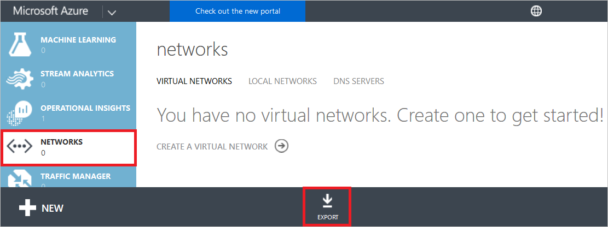
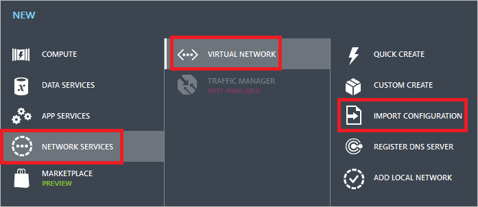
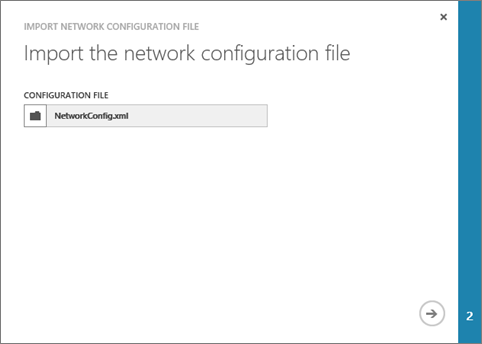
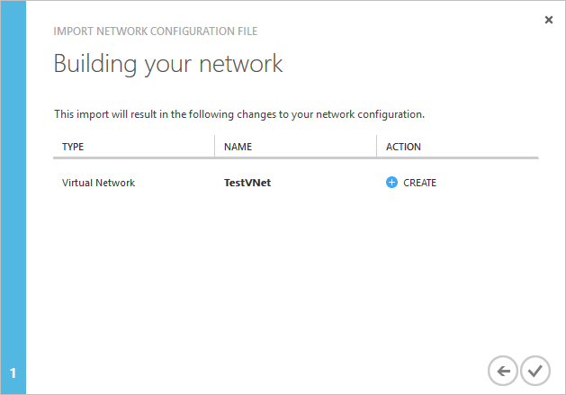
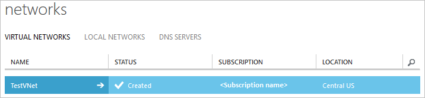

# Create a virtual network (classic) with a netcfg file using the Azure classic portal
[!INCLUDE [virtual-networks-create-vnet-selectors-classic-include](../../includes/virtual-networks-create-vnet-selectors-classic-include.md)]

[!INCLUDE [virtual-networks-create-vnet-intro](../../includes/virtual-networks-create-vnet-intro-include.md)]

[!INCLUDE [azure-arm-classic-important-include](../../includes/azure-arm-classic-important-include.md)]

This article explains how to create a virtual network with a netcfg file through the classic deployment model using the Azure classic portal. You can also [create a virtual network through the classic deployment model without using a netcfg file](virtual-networks-create-vnet-classic-pportal.md) or [create a virtual network through the Azure Resource Manager deployment model](virtual-networks-create-vnet-arm-pportal.md) using the Azure portal.

[!INCLUDE [virtual-networks-create-vnet-scenario-include](../../includes/virtual-networks-create-vnet-scenario-include.md)]

## How to create a VNet with a network config file in the Microsoft Azure classic portal
Azure uses an xml file to define all VNets available to a subscription. You can download this file and edit it to create VNets through the classic deployment model or to modify or delete existing VNets. This article explains how to download this file, referred to as a network configuration (or netcfg) file, add a VNet to it, and upload the file to create the VNet. To learn more about the network configuration file, review the [Azure virtual network configuration schema](https://msdn.microsoft.com/library/azure/jj157100.aspx).

To create a VNet using a netcfg file through the Azure classic portal, complete the following steps:

1. From a browser, navigate to http://manage.windowsazure.com and, if necessary, sign in with your Azure account.
2. Scroll down the list of services, click **NETWORKS**, then **EXPORT**, as shown in the following picture:

	
3. In the **Export network configuration** dialog box, select the subscription you want to export the virtual network configuration from, then click the check mark button at the bottom-right corner of the box.
4. Follow your browser instructions to save the **NetworkConfig.xml** file. Make sure you note where you are saving the file.
5. Open the file you saved in step 4 using any XML or text editor application, and look for the `<VirtualNetworkSites>` element within the `<VirtualNetworkConfiguration>` element. If you have any existing VNets, each is listed in its own `<VirtualNetworkSite>` element. If the file does not contain a `<VirtualNetworkSites>` element within the `<VirtualNetworkConfiguration>` element, create one.
6. If your existing NetworkConfig file doesn't have any VNets in it, your NetworkConfig.xml file will resemble the following example after you add the VNet described in this scenario to it:

	```xml
	<NetworkConfiguration xmlns="http://schemas.microsoft.com/ServiceHosting/2011/07/NetworkConfiguration">
	  <VirtualNetworkConfiguration>
	    <VirtualNetworkSites>
	      <VirtualNetworkSite name="TestVNet" Location="Central US">
	        <AddressSpace>
	          <AddressPrefix>192.168.0.0/16</AddressPrefix>
	        </AddressSpace>
	        <Subnets>
	          <Subnet name="FrontEnd">
	            <AddressPrefix>192.168.1.0/24</AddressPrefix>
	          </Subnet>
	          <Subnet name="BackEnd">
	            <AddressPrefix>192.168.2.0/24</AddressPrefix>
	          </Subnet>
	        </Subnets>
	      </VirtualNetworkSite>
	    </VirtualNetworkSites>
	  </VirtualNetworkConfiguration>
	</NetworkConfiguration>
	```
7. Save the network configuration file.
8. In the Azure classic portal, click **NEW**, **NETWORK SERVICES**, **VIRTUAL NETWORK**, and click **IMPORT CONFIGURATION** as shown in the following picture:

	
10. In the **Import the network configuration file** dialog box, click **BROWSE FOR FILE...**, navigate to the folder you saved the file to in step 7, select the file, and click **Open**, as shown in the following picture:

	

	In the bottom-right corner of the box, click the arrow button to move to the next step.

9. In the **Building your network** dialog box, notice the entry for the new VNet, as shown in the following picture:

	
10. To create the VNet, click the check mark button in the bottom-right corner of the box in the previous picture. After a few seconds the VNet appears in the list of available VNets, as shown in the following picture:

	
