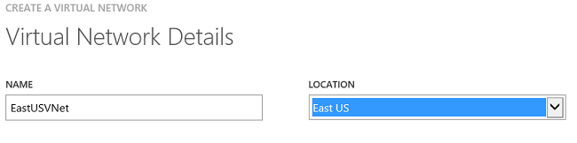
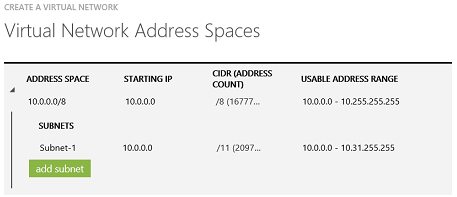

<properties 
   pageTitle="How to create a Virtual Network (VNet)"
   description="Learn how to create a virtual network (VNet)"
   services="virtual-network"
   documentationCenter="na"
   authors="telmosampaio"
   manager="carolz"
   editor="tysonn" />
<tags 
   ms.service="virtual-network"
   ms.devlang="na"
   ms.topic="article"
   ms.tgt_pltfrm="na"
   ms.workload="infrastructure-services"
   ms.date="06/08/2015"
   ms.author="telmos" />

# How to create a Virtual Network (VNet)

When you create a VNet, your services and VMs within the VNet can communicate securely with each other without having to go out through the Internet. Creating an Azure VNet is a relatively fast and easy process if the VNet isn’t intended to be connected to other VNets or to your on-premises network, since you will not need to acquire and configure a VPN device, or coordinate the IP addresses you choose with other VNets or the local network.

>[AZURE.WARNING] Don’t use this procedure to create a VNet that will later be connected other VNets or your on-premises network. If you want to create a secure cross-premises or hybrid connection, see [About Virtual Network Secure Cross-Premises Connectivity](vpn-gateway-cross-premises-options.md). If you want to create a VNet that connects to another VNet, see [Configure a VNet to VNet Connection](../vpn-gateway/virtual-networks-configure-vnet-to-vnet-connection.md).

## Configure your VNet

1. Log in to the **Azure Management Portal**.

1. In the lower left-hand corner of the screen, click **New**. In the navigation pane, click **Network Services**, and then click **Virtual Network**. Click **Custom Create** to begin the configuration wizard.

1. On the **Virtual Network Details** page, enter the information below:

	

	- **Name -** Name your VNet. For example, we created the name *EastUSVNet*. You can create whatever name you’d like. You will use this VNet name when you deploy your VMs and services, so it’s best not to make the name too complicated.

	- **Location –** Select the location (region) from the drop-down. The location is directly related to the physical location where you want your resources (VMs) to reside when you deploy them to this VNet. For example, if you want your VMs to be physically located in *East US*, select that location region. You can’t change the region associated with your VNet after you create it.

1. On the **DNS Servers and VPN Connectivity** page, don’t make any changes. Just move forward to the next page by clicking the arrow. By default, Azure provides basic name resolution for your VNet. It’s possible that your name resolution requirements are more complex than can be handled by the basic Azure name resolution. In that case, you may later want to add a virtual machine running DNS to your VNet. For more information about Azure name resolution and DNS, see [Name Resolution (DNS)](../virtual-network/virtual-networks-name-resolution-for-vms-and-role-instances.md).

1. The **Virtual Network Address Spaces** page is where you enter the address space that you want to use for this VNet. Unless you require a certain internal IP address range for your VMs or you want to create a specific subnet for VMs that will receive a static DIP, you don’t need to make any changes on this page. If you do want to create multiple subnets, you can do so on this page by clicking **add subnet**.

	Additional Information: 

	- The ranges on this page contain the dynamic internal IP addresses (DIPs) that your VMs will receive when you deploy them to this VNet. These IP addresses are for communicating within the VNet only. They are not IP addresses for internet endpoints.

	- Because you aren’t going to connect this private VNet to your on-premises network by using a cross-premises VPN configuration, you won’t need to coordinate these settings with your existing on-premises network IP address ranges. If you think you may want to create a cross-premises configuration later, you’ll need to coordinate the address spaces now with the ranges that already exist on your local site to avoid routing issues. Changing the ranges later can be somewhat complicated, especially if you have overlapping address ranges.

	

1. Click the checkmark on the lower right of the **Virtual Network Address Spaces** page and your VNet will be created. When your VNet has been created, you will see **Created** listed under **Status** on the **networks** page in the Management Portal.

1. Once your VNet has been created, you can create VMs and PaaS instances within the VNet. Be sure to select **From Gallery** when creating a new VM in order to have the option of selecting your VNet. Note that if you have already existing VMs and PaaS instances deployed, they cannot simply be moved to your new VNet. This is because the network configuration settings that they’ll need are added during deployment.

## Adding virtual machines to your VNet

After you create your VNet, you can add new VMs to it. It’s important to create the VNet first, then deploy the VM. After a VM has been deployed, you can’t move it to a VNet without redeploying it. If you use the Management Portal to create your VMs, the interface to deploy your VM to a VNet is only available when you select **New/ Compute/ Virtual Machine/  From Gallery**. When you go through the wizard to create your VM, on the **Virtual machine configuration** page, you’ll see **Region/Affinity Group/Virtual Network**. From the drop-down list, select the already-created VNet. For more information about creating virtual machines, see [Azure virtual machines](../virtual-machines).

## Next Steps

[How to manage Virtual Network (VNet) Properties](../virtual-networks-settings)

[How to manage DNS servers used by a virtual network (VNet)](../virtual-networks-manage-dns-in-vnet)

[How to use public IP addresses in a virtual network](../virtual-networks-public-ip-within-vnet)

[How to delete a Virtual Network (VNet)](../virtual-networks-delete-vnet)
 
