<properties
   pageTitle="Create VNet Peering using the Azure portal | Microsoft Azure"
   description="Learn how to create a virtual network using the Azure portal in Resource Manager."
   services="virtual-network"
   documentationCenter=""
   authors="narayanannamalai"
   manager="jefco"
   editor=""
   tags="azure-resource-manager"/>

<tags
   ms.service="virtual-network"
   ms.devlang="na"
   ms.topic="hero-article"
   ms.tgt_pltfrm="na"
   ms.workload="infrastructure-services"
   ms.date="08/02/2016"
   ms.author="narayanannamalai"/>

# Create a virtual network peering using the Azure portal

[AZURE.INCLUDE [virtual-networks-create-vnet-selectors-arm-include](../../includes/virtual-networks-create-vnetpeering-selectors-arm-include.md)]

[AZURE.INCLUDE [virtual-networks-create-vnet-intro](../../includes/virtual-networks-create-vnetpeering-intro-include.md)]

[AZURE.INCLUDE [virtual-networks-create-vnet-scenario-basic-include](../../includes/virtual-networks-create-vnetpeering-scenario-basic-include.md)]

To create a VNet peering based on the scenario above by using the Azure portal, follow the steps below.

1. From a browser, navigate to http://portal.azure.com and, if necessary, sign in with your Azure account.
2. To establish VNET peering, you need to create two links, one for each direction, between two VNets. You can create VNET peering link for VNET1 to VNET2 first. On the portal, 
Click **Browse** > **choose Virtual Networks** 

	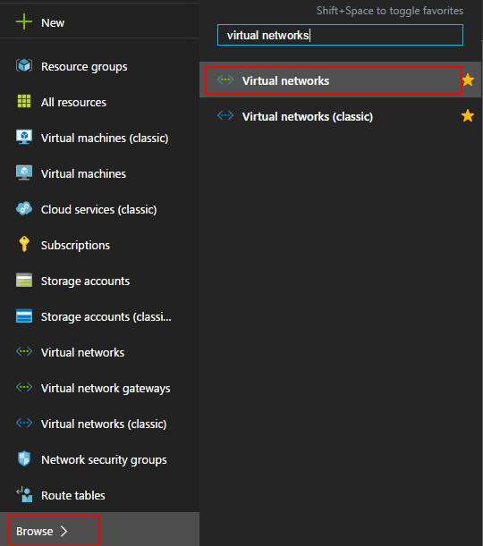

3. In Virtual Networks blade, choose VNET1, click Peerings, then click Add

	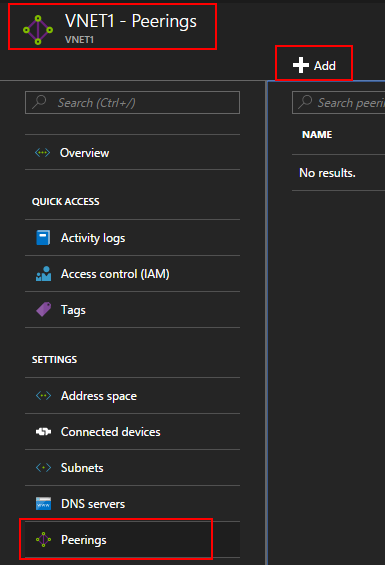

4. In the Add Peering blade, give a peering link name LinkToVnet2, choose the subscription and the peer Virtual Network VNET2, click OK.

	

5. Once this VNET peering link is created. You can see the link state as following:

	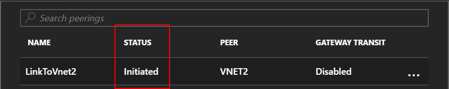

6. Next create the VNET peering link for VNET2 to VNET1. In Virtual Networks blade, choose VNET2, click Peerings, then click Add 

	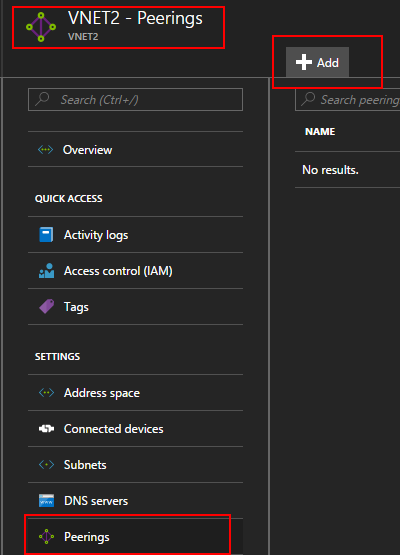

7. In the Add Peering blade, give a peering link name LinkToVnet1, choose the subscription and the peer Virtual Network, Click OK.

	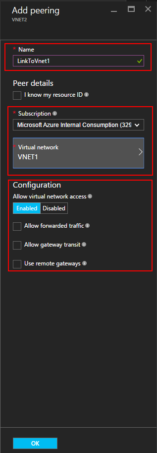

8. Once this VNET peering link is created. You can see the link state as following:

	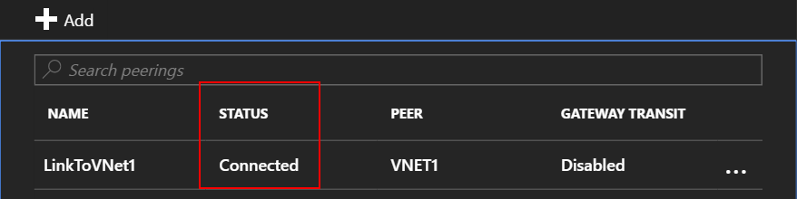

9. Check the state for LinkToVnet2 and it now changes to Connected as well.  

	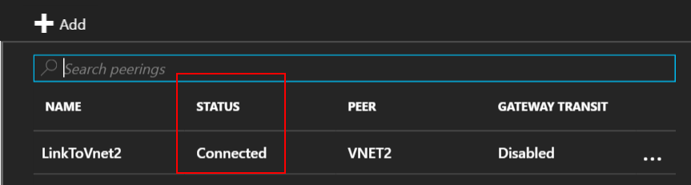

10. NOTE: VNET peering is only established if both links are connected. 

There are a few configurable properties for each link:

|Option|Description|Default|
|:-----|:----------|:------|
|AllowVirtualNetworkAccess|Whether address space of Peer VNet to be included as part of the Virtual_network Tag|Yes|
|AllowForwardedTraffic|Allows traffic not originated from peered VNet is accepted or dropped|No|
|AllowGatewayTransit|Allows the peer VNet to use your VNet gateway|No|
|UseRemoteGateways|Use your peer’s VNet gateway. The peer VNet must have a gateway configured and AllowGatewayTransit is selected. You cannot use this option if you have a gateway configured|No|

Each link in VNet peering has a set of above properties. From portal, you can click the VNet Peering Link and change any available options, click Save to make the change effect.

[AZURE.INCLUDE [virtual-networks-create-vnet-scenario-crosssub-include](../../includes/virtual-networks-create-vnetpeering-scenario-crosssub-include.md)]

1. From a browser, navigate to http://portal.azure.com and, if necessary, sign in with your Azure account.
2. In this example we will use two subscriptions A and B and two users UserA and UserB with privileges in the subscriptions respectively
3. On the portal, Click Browse, choose Virtual Networks. Click the VNET and click Add.

    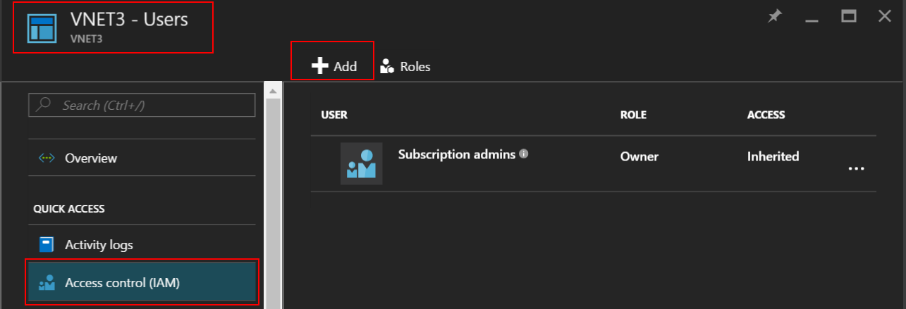

4. On the Add access blade, click select a role and choose Network Contributor, click Add Users, type the UserB sign in name, and click OK.

    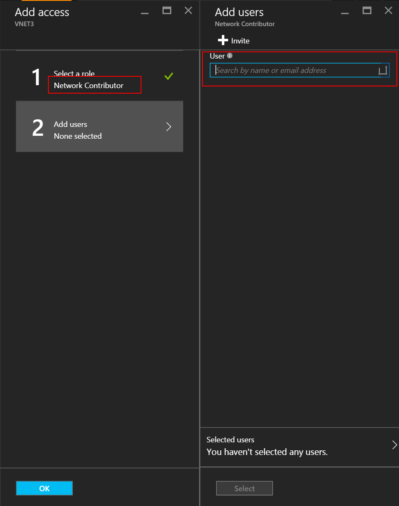

    This is not a requirement, peering can be established even if users individually raise peering requests for thier respective Vnets as long as the requests match. Adding privileged user of the other VNet as users in the local VNet makes it easier to do setup in portal. 

5. Then login to Azure portal with UserB who is the privilege user for SubscriptionB. Follow above steps to add UserA as Network Contributor.

    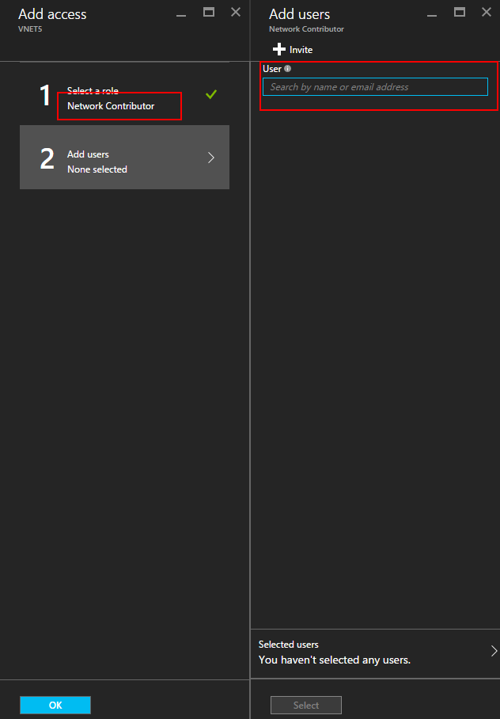

    NOTE: You can log off and log on both user sessions in browser to ensure the authorization is enabled successfully.

6. Login to the portal as UserA, navigate to the VNET3 blade, click Peering, check ‘I Know my resource ID” checkbox and type the resource ID for VNET5 in below format.

    /subscriptions/<Subscription- ID>/resourceGroups/<ResourceGroupName>/providers/Microsoft.Network/VirtualNetwork/<VNET name>

    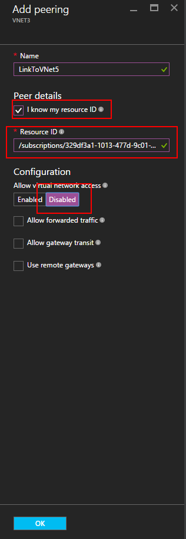

7. Login to the portal as UserB and follow above step to create peering link from VNET5 to VNet3. 

    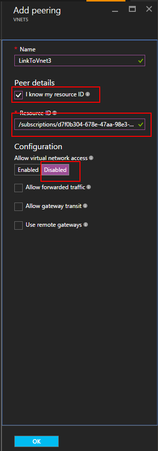

8. Peering will be established and any Virtaul machine in VNet3 should be able to communicate with any virtual machine in VNet5

[AZURE.INCLUDE [virtual-networks-create-vnet-scenario-transit-include](../../includes/virtual-networks-create-vnetpeering-scenario-transit-include.md)]

1. As a first step, VNET peering links from HubVnet to VNET1. Please note Allow Forwarded Traffic option is not selected for the link.

    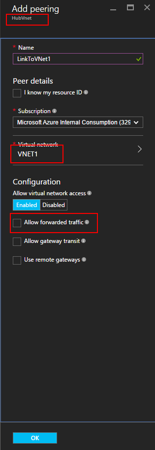

2. As a next step, peering links from VNET1 to HubVnet can be created. Please note ‘Allow forwarded traffic’ option is selected. 

    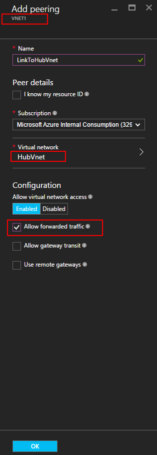

3. After peering is established, you can refer to this [article](virtual-network-create-udr-arm-ps.md) and define User Defined Route(UDR) to redirect VNet1 traffic through a virtual appliance to use its capabilities. When you specify the Next Hop address in route, you can set it to the IP address of virtual appliance in peer VNet HubVNet

## Remove VNet Peering

1.	From a browser, navigate to http://portal.azure.com and, if necessary, sign in with your Azure account.
2.	Go to virtual network blade, click Peerings, click the Link you want to remove, click button Delete. 

    

3. Once you remove one link in VNET peering, the  peer link state will go to disconnected.

    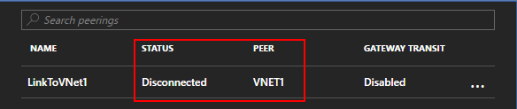

4. In this state, you cannot re-create the link until the peer link state changes to Initiated. We recommend you remove the both links before you re-create the VNET peering. 
