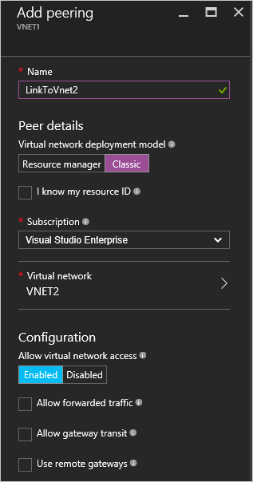
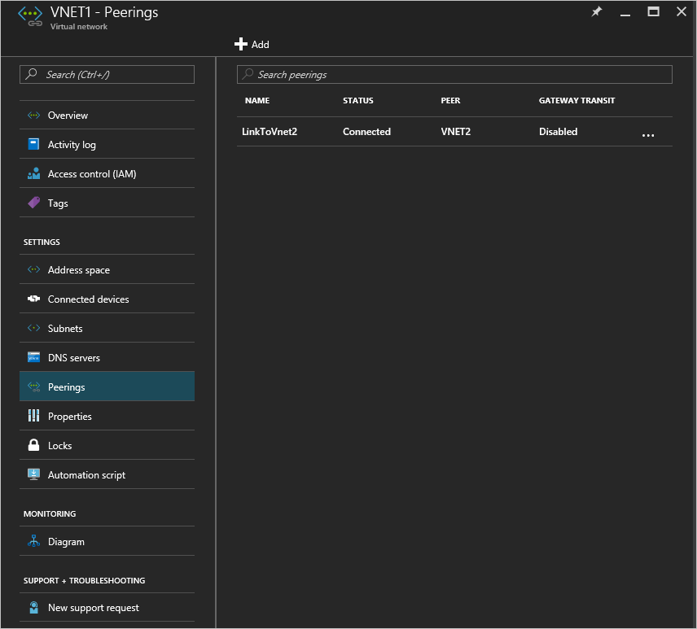

# Create a virtual network peering using the Azure portal
[!INCLUDE [virtual-networks-create-vnet-selectors-arm-include](../../includes/virtual-networks-create-vnetpeering-selectors-arm-include.md)]

[!INCLUDE [virtual-networks-create-vnet-intro](../../includes/virtual-networks-create-vnetpeering-intro-include.md)]

[!INCLUDE [virtual-networks-create-vnet-scenario-basic-include](../../includes/virtual-networks-create-vnetpeering-scenario-basic-include.md)]

To create a VNet peering based on the scenario by using the Azure portal, complete the following steps:

1. From a browser, navigate to http://portal.azure.com and, if necessary, sign in with your Azure account.
2. To establish a VNet peering, you need to create two links, one for each direction, between two VNets. You can create VNet peering link for VNet1 to VNet2 first. In the Azure portal, click **Browse** > **choose Virtual networks**

	
3. In the **Virtual networks** blade, choose *VNET1*, click **Peerings**, then click **Add**, as shown in the following picture:

	
4. In the **Add Peering** blade, enter *LinkToVnet2* for **Name**, choose a subscription, and the peer **Virtual network** *VNET2*, then click **OK**.

	
5. Once the VNet peering link is created, you'll see the link state, as shown in the following picture:

	
6. Create the VNet peering link for VNET2 to VNET1. In the **Virtual Networks** blade, choose *VNET2*, click **Peerings**, then click **Add**, as shown in the following picture:

	
7. In the **Add peering** blade, enter *LinkToVnet1* for **Name**, choose the subscription, select *VNET1* for **Virtual network**, then click **OK**.

	
8. Once the VNet peering link is created, you'll see the link state, as shown in the following picture:

	
9. Check the state for **LinkToVnet2** and it now changes to *Connected* as well.  
	
	

	> [!NOTE]
	> VNET peering is only established if both links are connected.
	> 
	> 

There are a few configurable properties for each link:

| Option | Description | Default |
|:--- |:--- |:--- |
| AllowVirtualNetworkAccess |Whether address space of Peer VNet to be included as part of the Virtual_network Tag |Yes |
| AllowForwardedTraffic |Whether traffic not originating from a peered VNet is accepted or dropped |No |
| AllowGatewayTransit |Allows the peer VNet to use your VNet gateway |No |
| UseRemoteGateways |Use your peer’s VNet gateway. The peer VNet must have a gateway configured with AllowGatewayTransit selected. You cannot use this option if you have a gateway configured. |No |

Each link in a VNet peering has the previous set of properties. From the portal, you can click the **VNet Peering** link and change any available options, click **Save** to apply changes.

[!INCLUDE [virtual-networks-create-vnet-scenario-crosssub-include](../../includes/virtual-networks-create-vnetpeering-scenario-crosssub-include.md)]

1. From a browser, navigate to http://portal.azure.com and, if necessary, sign in with your Azure account.
2. In this example, UserA has administrative permissions to SubscriptionA, and UserB has administrative permissions to SubscriptionB. Both subscriptions are associated to the same Azure Active Directory tenant. You cannot create a peering between subscriptions associated to different Azure Active Directory tenants.
3. In the portal, click **Browse**, choose **Virtual networks**. Click the VNet you want to setup peering for.
4. In the blade for the VNet you selected, click **Access control**, then click **Add**, as shown in the following picture:

	
4. On the **Add access** blade, click a role and choose **Network Contributor**, click **Add users**, type the UserB sign in name, and click OK.

	

5. Login to the Azure portal as UserB, who is the privileged user for SubscriptionB. Follow the previous steps to add UserA to the Network Contributor role, as shown in the following picture:

	

	> [!NOTE]
	> You can log off and log on both user sessions in the browser to ensure the authorization is enabled successfully.
	>
	>

	> [!IMPORTANT]
	> If the peering you're creating is between two VNets created through the Azure Resource Manager deployment model, continue with the remaining steps in this section. If the two VNets were created through different deployment models, skip the remaining steps of this section and complete the steps in the [Peering virtual networks created through different deployment models](#x-model) section of this article.

6. Login to the portal as UserA, navigate to the VNET3 blade, click **Peering**, check the **I Know my resource ID** checkbox and type the resource ID for VNET5 in the format shown in the following example:
   
    /subscriptions/{SubscriptionID}/resourceGroups/{ResourceGroupName}/providers/Microsoft.Network/virtualNetworks/{VNETname}
   
    
7. Login to the portal as UserB and follow the previous steps to create a peering link from VNET5 to VNet3.
   
    
8. Peering will be established. Any VM connected to VNet3 should be able to communicate with any VM connected to VNet5.

[!INCLUDE [virtual-networks-create-vnet-scenario-transit-include](../../includes/virtual-networks-create-vnetpeering-scenario-transit-include.md)]

1. As a first step, VNET peering links from HubVnet to VNET1. Note that Allow Forwarded Traffic option is not selected for the link.
   
    
2. As a next step, peering links from VNET1 to HubVnet can be created. Note that Allow forwarded traffic option is selected.
   
    
3. After peering is established, you can refer to this [article](virtual-network-create-udr-arm-ps.md) and define User Defined Route(UDR) to redirect VNet1 traffic through a virtual appliance to use its capabilities. When you specify the Next Hop address in route, you can set it to the IP address of virtual appliance in peer VNet HubVNet

[!INCLUDE [virtual-networks-create-vnet-scenario-asmtoarm-include](../../includes/virtual-networks-create-vnetpeering-scenario-asmtoarm-include.md)]

1. From a browser, navigate to http://portal.azure.com and, if necessary, sign in with your Azure account.
2. If you are creating a peering between VNets deployed through different deployment models in the *same* subscription, skip to step 3. The ability to create a VNet peering between VNets deployed through different deployment models in *different* subscriptions is in **preview** release. Capabilities in preview release do not have the same level of reliability and service level agreement as general release capabilities. If you are creating a peering between VNets deployed through different deployment models in different subscriptions you must first complete the following tasks:
	- Register the preview capability in your Azure subscription by entering the following commands from PowerShell: `Register-AzureRmProviderFeature -FeatureName AllowClassicCrossSubscriptionPeering -ProviderNamespace Microsoft.Network` and `Register-AzureRmResourceProvider -ProviderNamespace Microsoft.Network` This step cannot be completed in the portal.
	- Complete steps 1-6 in the [Peering across subscriptions](#x-sub) section of this article.
3. To establish VNET peering in this scenario, you need to create only one link, from the virtual network in Azure resource manager to the one in classic. That is, from **VNET1** to **VNET2**. On the portal, Click **Browse** > choose **Virtual Networks**
4. In the Virtual networks blade, choose **VNET1**. Click **Peerings**, then click **Add**.
5. In the **Add Peering** blade, name your link. Here it is called **LinkToVNet2**. Under Peer details, select **Classic**.
6. Choose the subscription and the peer Virtual Network **VNET2**. Then click OK.

	
7. Once this VNet peering link is created, the two virtual networks are peered and you will be able to see the following:

	

## Remove VNet Peering
1. From a browser, navigate to http://portal.azure.com and, if necessary, sign in with your Azure account.
2. Go to virtual network blade, click Peerings, click the Link you want to remove, then click **Delete**.

	
3. Once you remove one link in VNET peering, the  peer link state will go to disconnected.

	
4. In this state, you cannot re-create the link until the peer link state changes to Initiated. We recommend you remove the both links before you re-create the VNET peering.

