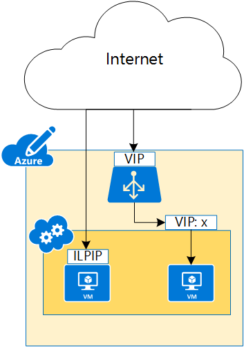

<properties 
   pageTitle="Instance level Public IP (ILPIP) | Microsoft Azure"
   description="Understanding ILPIP (PIP) and how to manage them"
   services="virtual-network"
   documentationCenter="na"
   authors="jimdial"
   manager="carmonm"
   editor="tysonn" />
<tags 
   ms.service="virtual-network"
   ms.devlang="na"
   ms.topic="article"
   ms.tgt_pltfrm="na"
   ms.workload="infrastructure-services"
   ms.date="02/10/2016"
   ms.author="jdial" />

# Instance level public IP overview
An instance level public IP (ILPIP) is a public IP address that you can assign directly to your VM or role instance, rather than to the cloud service that your VM or role instance reside in. This doesn’t take the place of the VIP (virtual IP) that is assigned to your cloud service. Rather, it’s an additional IP address that you can use to connect directly to your VM or role instance.

[AZURE.INCLUDE [learn-about-deployment-models](../../includes/learn-about-deployment-models-classic-include.md)] Learn how to [perform these steps using the Resource Manager model](virtual-network-ip-addresses-overview-arm.md). 

Make sure you understand how [IP addresses](virtual-network-ip-addresses-overview-classic.md) work in Azure.

>[AZURE.NOTE] In the past, an ILPIP was referred to as a PIP, which stands for public IP. 

As shown in Figure 1, the cloud service is accessed using a VIP, while the individual VMs are normally accessed using VIP:&lt;port number&gt;. By assigning an ILPIP to a specific VM, that VM can be accessed directly using that IP address.

When you create a cloud service in Azure, corresponding DNS A records are created automatically to allow access to the service through a fully qualified domain name (FQDN) instead of using the actual VIP. The same process happens for ILPIP, allowing access to the VM or role instance by FQDN instead of the ILPIP. For instance, if you create a cloud service named *contosoadservice*, and you configure a web role named *contosoweb* with two instances, Azure will register the following A records for the instances:

- contosoweb\_IN_0.contosoadservice.cloudapp.net
- contosoweb\_IN_1.contosoadservice.cloudapp.net 

>[AZURE.NOTE] You can assign only one ILPIP for each VM or role instance. You can use up to 5 ILPIP's per subscription. At this time, ILPIP is not supported for multi-NIC VMs.

## Why should I request an ILPIP?
If you want to be able to connect to your VM or role instance by an IP address assigned directly to it, rather than using the cloud service VIP:&lt;port number&gt;, request an ILPIP for your VM or your role instance.
- **Passive FTP** - By having an ILPIP on your VM, you can receive traffic on just about any port, you will not have to open up an endpoint to receive traffic. This enables scenarios like passive FTP where the ports are chosen dynamically.
- **Outbound IP** - Outbound traffic originating from the VM goes out with the ILPIP as the source and this uniquely identifies the VM to external entities.

## How to request an ILPIP during VM creation
The PowerShell script below creates a new cloud service named *FTPService*, then retrieves an image from Azure, and creates a VM named *FTPInstance* using the retrieved image, sets the VM to use an ILPIP, and adds the VM to the new service:

	New-AzureService -ServiceName FTPService -Location "Central US"
	$image = Get-AzureVMImage|?{$_.ImageName -like "*RightImage-Windows-2012R2-x64*"}
	New-AzureVMConfig -Name FTPInstance -InstanceSize Small -ImageName $image.ImageName `
	| Add-AzureProvisioningConfig -Windows -AdminUsername adminuser -Password MyP@ssw0rd!! `
	| Set-AzurePublicIP -PublicIPName ftpip | New-AzureVM -ServiceName FTPService -Location "Central US"

## How to retrieve ILPIP information for a VM
To view the ILPIP information for the VM created with the script above, run the following PowerShell command and observe the values for *PublicIPAddress* and *PublicIPName*:

	Get-AzureVM -Name FTPInstance -ServiceName FTPService

	DeploymentName              : FTPService
	Name                        : FTPInstance
	Label                       : 
	VM                          : Microsoft.WindowsAzure.Commands.ServiceManagement.Model.PersistentVM
	InstanceStatus              : ReadyRole
	IpAddress                   : 100.74.118.91
	InstanceStateDetails        : 
	PowerState                  : Started
	InstanceErrorCode           : 
	InstanceFaultDomain         : 0
	InstanceName                : FTPInstance
	InstanceUpgradeDomain       : 0
	InstanceSize                : Small
	HostName                    : FTPInstance
	AvailabilitySetName         : 
	DNSName                     : http://ftpservice888.cloudapp.net/
	Status                      : ReadyRole
	GuestAgentStatus            : Microsoft.WindowsAzure.Commands.ServiceManagement.Model.GuestAgentStatus
	ResourceExtensionStatusList : {Microsoft.Compute.BGInfo}
	PublicIPAddress             : 104.43.142.188
	PublicIPName                : ftpip
	NetworkInterfaces           : {}
	ServiceName                 : FTPService
	OperationDescription        : Get-AzureVM
	OperationId                 : 568d88d2be7c98f4bbb875e4d823718e
	OperationStatus             : OK

## How to remove an ILPIP from a VM
To remove the ILPIP added to the VM in the script above, run the following PowerShell command:
	
	Get-AzureVM -ServiceName FTPService -Name FTPInstance `
	| Remove-AzurePublicIP `
	| Update-AzureVM

## How to add an ILPIP to an existing VM
To add an ILPIP to the VM created using the script above, run the following command:

	Get-AzureVM -ServiceName FTPService -Name FTPInstance `
	| Set-AzurePublicIP -PublicIPName ftpip2 `
	| Update-AzureVM

## How to associate an ILPIP to a VM by using a service configuration file
You can also associate an ILPIP to a VM by using a service configuration (CSCFG) file. The sample xml below shows how to configure a cloud service to use an ILPIP named *MyPublicIP* for a role instance: 
	
	<?xml version="1.0" encoding="utf-8"?>
	<ServiceConfiguration serviceName="ReservedIPSample" xmlns="http://schemas.microsoft.com/ServiceHosting/2008/10/ServiceConfiguration" osFamily="4" osVersion="*" schemaVersion="2014-01.2.3">
	  <Role name="WebRole1">
	    <Instances count="1" />
	    <ConfigurationSettings>
	      <Setting name="Microsoft.WindowsAzure.Plugins.Diagnostics.ConnectionString" value="UseDevelopmentStorage=true" />
	    </ConfigurationSettings>
	  </Role>
      <NetworkConfiguration>
	    <VirtualNetworkSite name="VNet"/>
	    <AddressAssignments>
	      <InstanceAddress roleName="VMRolePersisted">
	        <Subnets>
	          <Subnet name="Subnet1"/>
	          <Subnet name="Subnet2"/>
	        </Subnets>
	        <PublicIPs>
	          <PublicIP name="MyPublicIP" domainNameLabel="MyPublicIP" />
	        </PublicIPs>
	      </InstanceAddress>
	    </AddressAssignments>
	  </NetworkConfiguration>
	</ServiceConfiguration>

## Next steps

- Understand how [IP addressing](virtual-network-ip-addresses-overview-classic.md) works in the classic deployment model.

- Learn about [Reserved IPs](virtual-networks-reserved-public-ip.md).
 