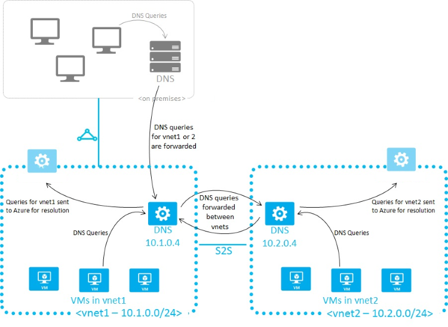
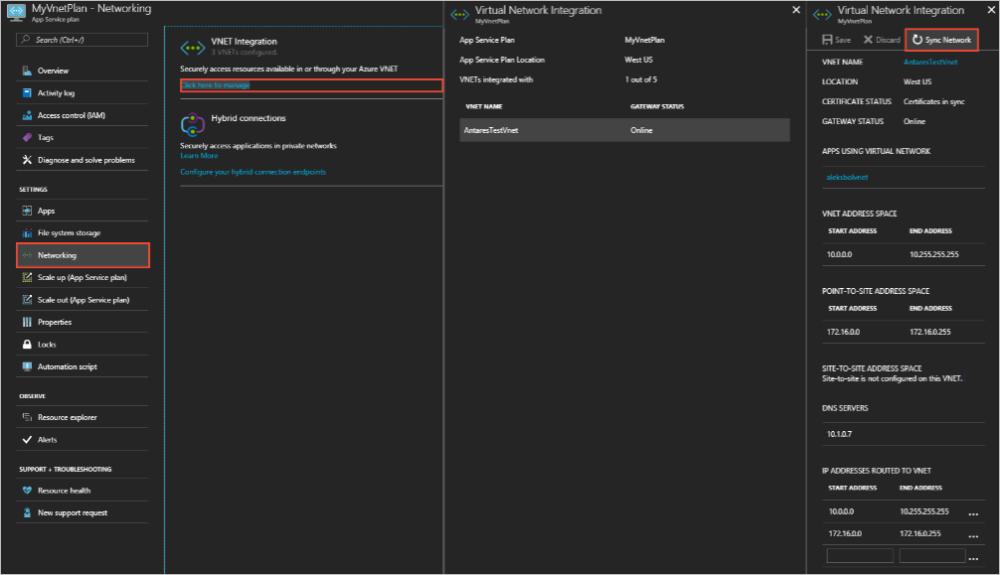

# Name resolution for resources in Azure virtual networks

Azure can be used to host IaaS, PaaS, and hybrid solutions. In order to facilitate communication between the virtual machines (VMs) and other resources deployed in a virtual network, it may be necessary to allow them to communicate with each other. The use of easily remembered and unchanging names simplifies the communication process, rather than relying on IP addresses.

When resources deployed in virtual networks need to resolve domain names to internal IP addresses, they can use one of four methods:

* [Azure DNS private zones](../dns/private-dns-overview.md)

* [Azure-provided name resolution](#azure-provided-name-resolution)

* [Name resolution that uses your own DNS server](#name-resolution-that-uses-your-own-dns-server) (which might forward queries to the Azure-provided DNS servers)

* [Azure DNS Private Resolver](../dns/dns-private-resolver-overview.md)

The type of name resolution you use depends on how your resources need to communicate with each other. The following table illustrates scenarios and corresponding name resolution solutions:

> [!NOTE]
> Azure DNS private zones is the preferred solution and gives you flexibility in managing your DNS zones and records. For more information, see [Using Azure DNS for private domains](../dns/private-dns-overview.md).

> [!NOTE]
> If you use Azure Provided DNS then appropriate DNS suffix will be automatically applied to your virtual machines.
> For all other options you must either use Fully Qualified Domain Names (FQDN) or manually apply appropriate DNS suffix to your virtual machines.

| **Scenario** | **Solution** | **DNS Suffix** |
| --- | --- | --- |
| Name resolution between VMs located in the same virtual network, or Azure Cloud Services role instances in the same cloud service. | [Azure DNS private zones](../dns/private-dns-overview.md) or [Azure-provided name resolution](#azure-provided-name-resolution) |Hostname or FQDN |
| Name resolution between VMs in different virtual networks or role instances in different cloud services. |[Azure DNS private zones](../dns/private-dns-overview.md), [Azure DNS Private Resolver](../dns/dns-private-resolver-overview.md), or Customer-managed DNS servers forwarding queries between virtual networks for resolution by Azure (DNS proxy). See [Name resolution using your own DNS server](#name-resolution-that-uses-your-own-dns-server). |FQDN only |
| Name resolution from an Azure App Service (Web App, Function, or Bot) using virtual network integration to role instances or VMs in the same virtual network. |[Azure DNS Private Resolver](../dns/dns-private-resolver-overview.md) or customer-managed DNS servers forwarding queries between virtual networks for resolution by Azure (DNS proxy). See [Name resolution using your own DNS server](#name-resolution-that-uses-your-own-dns-server). |FQDN only |
| Name resolution from App Service Web Apps to VMs in the same virtual network. |[Azure DNS Private Resolver](../dns/dns-private-resolver-overview.md) or customer-managed DNS servers forwarding queries between virtual networks for resolution by Azure (DNS proxy). See [Name resolution using your own DNS server](#name-resolution-that-uses-your-own-dns-server). |FQDN only |
| Name resolution from App Service Web Apps in one virtual network to VMs in a different virtual network. |[Azure DNS Private Resolver](../dns/dns-private-resolver-overview.md) or customer-managed DNS servers forwarding queries between virtual networks for resolution by Azure (DNS proxy). See [Name resolution using your own DNS server](#name-resolution-that-uses-your-own-dns-server). |FQDN only |
| Resolution of on-premises computer and service names from VMs or role instances in Azure. |[Azure DNS Private Resolver](../dns/dns-private-resolver-overview.md) or customer-managed DNS servers (on-premises domain controller, local read-only domain controller, or a DNS secondary synced using zone transfers, for example). See [Name resolution using your own DNS server](#name-resolution-that-uses-your-own-dns-server). |FQDN only |
| Resolution of Azure hostnames from on-premises computers. |Forward queries to a customer-managed DNS proxy server in the corresponding virtual network, the proxy server forwards queries to Azure for resolution. See [Name resolution using your own DNS server](#name-resolution-that-uses-your-own-dns-server). |FQDN only |
| Reverse DNS for internal IPs. |[Azure DNS private zones](../dns/private-dns-overview.md), [Azure-provided name resolution](#azure-provided-name-resolution), [Azure DNS Private Resolver](../dns/dns-private-resolver-overview.md), or [Name resolution using your own DNS server](#name-resolution-that-uses-your-own-dns-server). |Not applicable |
| Name resolution between VMs or role instances located in different cloud services, not in a virtual network. |Not applicable. Connectivity between VMs and role instances in different cloud services isn't supported outside a virtual network. |Not applicable|

## Azure-provided name resolution

Azure provided name resolution provides only basic authoritative DNS capabilities. Azure manages the DNS zone names and records if you use the DNS provided by Azure. You aren't able to control the DNS zone names or the life cycle of DNS records. If you need a fully featured DNS solution for your virtual networks, you can use [Azure DNS private zones](../dns/private-dns-overview.md) with [Customer-managed DNS servers](#name-resolution-that-uses-your-own-dns-server) or an [Azure DNS Private Resolver](../dns/dns-private-resolver-overview.md).

Along with resolution of public DNS names, Azure provides internal name resolution for VMs and role instances that reside within the same virtual network or cloud service. VMs and instances in a cloud service share the same DNS suffix, so the host name alone is sufficient. But in virtual networks deployed using the classic deployment model, different cloud services have different DNS suffixes. In this situation, you need the FQDN to resolve names between different cloud services. In virtual networks deployed using the Azure Resource Manager deployment model, the DNS suffix is consistent across the all virtual machines within a virtual network, so the FQDN isn't needed. DNS names can be assigned to both VMs and network interfaces. Although Azure-provided name resolution doesn't require any configuration, it's not the appropriate choice for all deployment scenarios, as detailed in the previous table.

> [!NOTE]
> When using cloud services web and worker roles, you can also access the internal IP addresses of role instances using the Azure Service Management REST API. For more information, see the [Service Management REST API Reference](/previous-versions/azure/ee460799(v=azure.100)). The address is based on the role name and instance number.
>

### Features

Azure-provided name resolution includes the following features:

* Ease of use. No configuration is required.

* High availability. You don't need to create and manage clusters of your own DNS servers.

* You can use the service with your own DNS servers, to resolve both on-premises and Azure host names.

* You can use name resolution between VMs and role instances within the same cloud service, without the need for an FQDN.

* You can use name resolution between VMs in virtual networks that use the Azure Resource Manager deployment model, without need for an FQDN. Virtual networks in the classic deployment model require an FQDN when you're resolving names in different cloud services.

* You can use host names that best describe your deployments, rather than working with autogenerated names.

### Considerations

Points to consider when you're using Azure-provided name resolution:

* The Azure-created DNS suffix can't be modified.

* DNS lookup is scoped to a virtual network. DNS names created for one virtual network can't be resolved from other virtual networks.

* You can't manually register your own records.

* WINS and NetBIOS aren't supported. You can't see your VMs in Windows Explorer.

* Host names must be DNS-compatible. Names must use only 0-9, a-z, and '-', and can't start or end with a '-'.

* DNS query traffic is throttled for each VM. Throttling shouldn't affect most applications. If request throttling is observed, ensure that client-side caching is enabled. For more information, see [DNS client configuration](#dns-client-configuration).

* Use a different name for each virtual machine in a virtual network to avoid DNS resolution issues.

* Only VMs in the first 180 cloud services are registered for each virtual network in a classic deployment model. This limit doesn't apply to virtual networks in Azure Resource Manager.

* The Azure DNS IP address is 168.63.129.16. This address is a static IP address and doesn't change.

### Reverse DNS Considerations

Reverse DNS for VMs is supported in all Azure Resource Manager based virtual networks. Azure-managed reverse DNS (PTR) records of form **\[vmname\].internal.cloudapp.net** are automatically added to when you start a VM, and removed when the VM is stopped (deallocated). See the following example:

```cmd
C:\>nslookup -type=ptr 10.11.0.4
Server:  UnKnown
Address:  168.63.129.16

Non-authoritative answer:
4.0.11.10.in-addr.arpa  name = myeastspokevm1.internal.cloudapp.net
```
The **internal.cloudapp.net** reverse DNS zone is Azure-managed and can't be directly viewed or edited. Forward lookup on the FQDN of form **\[vmname\].internal.cloudapp.net** resolves to the IP address assigned to the virtual machine.

If an [Azure DNS private zone](../dns/private-dns-overview.md) is linked to the virtual network with a [virtual network link](../dns/private-dns-virtual-network-links.md) and [autoregistration](../dns/private-dns-autoregistration.md) is enabled on that link, then reverse DNS queries return two records. One record is of the form **\[vmname\].[privatednszonename]** and the other is of the form **\[vmname\].internal.cloudapp.net**. See the following example:

```cmd
C:\>nslookup -type=ptr 10.20.2.4
Server:  UnKnown
Address:  168.63.129.16

Non-authoritative answer:
4.2.20.10.in-addr.arpa  name = mywestvm1.internal.cloudapp.net
4.2.20.10.in-addr.arpa  name = mywestvm1.azure.contoso.com
```

When two PTR records are returned as shown previously, then forward lookup of either FQDN returns the IP address of the VM.

Reverse DNS lookups are scoped to a given virtual network, even if it's peered to other virtual networks. Reverse DNS queries for IP addresses of virtual machines located in peered virtual networks return **NXDOMAIN**.

> [!NOTE]
> Reverse DNS (PTR) records are not stored in a forward private DNS zone. Reverse DNS records are stored in a reverse DNS (in-addr.arpa) zone. The default reverse DNS zone associated with a vnet isn't viewable or editable.

You can disable the reverse DNS function in a virtual network by creating your own reverse lookup zone using [Azure DNS private zones](../dns/private-dns-overview.md), and then linking this zone to your virtual network. For example, if the IP address space of your virtual network is 10.20.0.0/16, then you can create an empty private DNS zone **20.10.in-addr.arpa** and link it to the virtual network. This zone overrides the default reverse lookup zones for the virtual network. This zone is empty. Reverse DNS returns **NXDOMAIN** unless you manually create these entries.

Autoregistration of PTR records isn't supported. If you wish to create entries, enter them manually. You must disable autoregistration in the virtual network if it's enabled for other zones. This limitation is due to [restrictions](../dns/private-dns-autoregistration.md#restrictions) that permit only one private zone to be linked if autoregistration is enabled. See the [private DNS quickstart guide](../dns/private-dns-getstarted-portal.md) for details on how to create a private DNS zone and link it to a virtual network.

> [!NOTE]
> Since Azure DNS private zones are global, you can create a reverse DNS lookup to span across multiple virtual networks. To do this, create an [Azure DNS private zone](../dns/private-dns-overview.md) for reverse lookups (an **in-addr.arpa** zone), and link it to the virtual networks. You'll have to manually manage the reverse DNS records for the VMs.

## DNS client configuration

This section covers client-side caching and client-side retries.

### Client-side caching

Not every DNS query needs to be sent across the network. Client-side caching helps reduce latency and improve resilience to network blips, by resolving recurring DNS queries from a local cache. DNS records contain a time-to-live (TTL) mechanism, which allows the cache to store the record for as long as possible without impacting record freshness. Thus, client-side caching is suitable for most situations.

The default Windows DNS client has a DNS cache built-in. Some Linux distributions don't include caching by default. If you find that there isn't a local cache already, add a DNS cache to each Linux VM.

There are many different DNS caching packages available (such as dnsmasq). Here's how to install dnsmasq on the most common distributions:

# [RHEL, CentOS](#tab/redhat)

**RHEL/CentOS (uses NetworkManager)**:
  
1. Install the dnsmasq package with the following command:

    ```bash
    sudo yum install dnsmasq
    ```
  
1. Enable the dnsmasq service with the following command: 

    ```bash
    systemctl enable dnsmasq.service
    ```

1. Start the dnsmasq service with the following command:

    ```bash
    systemctl start dnsmasq.service
    ```

1. Use a text editor to add **`prepend domain-name-servers 127.0.0.1;`**  to **/etc/dhclient-eth0.conf**:

1. Use the following command to restart the network service:

    ```bash
    service network restart
    ```

# [openSUSE, SLES](#tab/suse) 

**openSUSE/SLES (uses netconf)**:
  
1. Install the dnsmasq package with the following command:

    ```bash
    sudo zypper install dnsmasq
    ```

1. Enable the dnsmasq service with the following command:

    ```bash
    systemctl enable dnsmasq.service
    ```

1. Start the dnsmasq service with the following command:

    ```bash
    systemctl start dnsmasq.service
    ```

1. Use a text editor to edit **/etc/sysconfig/network/config**. Change **`NETCONFIG_DNS_FORWARDER=""`** to **dnsmasq**.

1. Use the following command to update **resolv.conf** to set the cache as the local DNS resolver:

    ```bash
    netconfig update
    ```

# [Ubuntu, Debian](#tab/ubuntu)

**Ubuntu/Debian (uses resolvconf)**:
  
1. Use the following command to install the dnsmasq package:

    ```bash
    sudo apt-get install dnsmasq
    ```

---

> [!NOTE]
> The dnsmasq package is only one of many DNS caches available for Linux. Before using it, check its suitability for your particular needs, and check that no other cache is installed.

### Client-side retries

DNS is primarily a UDP protocol. Because the UDP protocol doesn't guarantee message delivery, retry logic is handled in the DNS protocol itself. Each DNS client (operating system) can exhibit different retry logic, depending on the creator's preference:

* Windows operating systems retry after one second, and then again after another two seconds, four seconds, and another four seconds.
* The default Linux setup retries after five seconds. We recommend changing the retry specifications to five times, at one-second intervals.

Check the current settings on a Linux VM with `cat /etc/resolv.conf`. Look at the *options* line, for example:

```output
options timeout:1 attempts:5
```

The resolv.conf file is autogenerated, and shouldn't be edited. The specific steps for adding the *options* line vary by distribution:

# [RHEL, CentOS](#tab/redhat)

**RHEL/CentOS (uses NetworkManager)**:

1. Use a text editor to add the line **`RES_OPTIONS="options timeout:1 attempts:5"`** to the file **/etc/sysconfig/network-scripts/ifcfg-eth0**.

1. Use the following command to restart the NetworkManager service:

    ```bash
    systemctl restart NetworkManager.service
    ```

# [openSUSE, SLES](#tab/suse) 

**openSUSE/SLES (uses netconf)**:

1. Use a text editor to add `**timeout:1 attempts:5**` to the **`NETCONFIG_DNS_RESOLVER_OPTIONS=""`** parameter in **/etc/sysconfig/network/config**.

1. Use the following command to update the netconfig:

    ```bash
    netconfig update
    ```

# [Ubuntu, Debian](#tab/ubuntu)

* **Ubuntu/Debian (uses resolvconf)**:

1. Use a text editor to add the **`options`** line to **/etc/resolvconf/resolv.conf.d/tail**.

1. Use the following command to update the resolvconf:

    ```bash
    resolvconf -u
    ```

---

## Name resolution that uses your own DNS server

This section covers VMs, role instances, and web apps.

> [!NOTE]
> [Azure DNS Private Resolver](../dns/dns-private-resolver-overview.md) replaces the need to use VM-based DNS servers in a virtual network. The following section is provided if you wish to use a VM-based DNS solution, however there are many benefits to using Azure DNS Private Resolver, including cost reduction, built-in high availability, scalability, and flexibility. 

### VMs and role instances

Your name resolution needs might go beyond the features provided by Azure. For example, you might need to use Microsoft Windows Server Active Directory domains, resolve DNS names between virtual networks. To cover these scenarios, Azure enables you to use your own DNS servers.

DNS servers within a virtual network can forward DNS queries to the recursive resolvers in Azure. This procedure enables you to resolve host names within that virtual network. For example, a domain controller (DC) running in Azure can respond to DNS queries for its domains, and forward all other queries to Azure. Forwarding queries allows VMs to see both your on-premises resources (via the DC) and Azure-provided host names (via the forwarder). Access to the recursive resolvers in Azure is provided via the virtual IP 168.63.129.16.

> [!IMPORTANT]
> If VPN Gateway is being used in this set up along with custom DNS Server IP's on VNet then Azure DNS IP (168.63.129.16) needs to be added in the list as well to maintain undisrupted service.

DNS forwarding also enables DNS resolution between virtual networks, and allows your on-premises machines to resolve Azure-provided host names. In order to resolve a VM's host name, the DNS server VM must reside in the same virtual network, and be configured to forward host name queries to Azure. Because the DNS suffix is different in each virtual network, you can use conditional forwarding rules to send DNS queries to the correct virtual network for resolution. The following image shows two virtual networks and an on-premises network doing DNS resolution between virtual networks, by using this method. An example DNS forwarder is available in the [Azure Quickstart Templates gallery](https://azure.microsoft.com/resources/templates/dns-forwarder) and [GitHub](https://github.com/Azure/azure-quickstart-templates/tree/master/demos/dns-forwarder).

> [!NOTE]
> A role instance can perform name resolution of VMs within the same virtual network. It does so by using the FQDN, which consists of the VM's host name and **internal.cloudapp.net** DNS suffix. However, in this case, name resolution is only successful if the role instance has the VM name defined in the [Role Schema (.cscfg file)](/previous-versions/azure/reference/jj156212(v=azure.100)).
> `<Role name="<role-name>" vmName="<vm-name>">`
>
> Role instances that need to perform name resolution of VMs in another virtual network (FQDN by using the **internal.cloudapp.net** suffix) have to do so by using the method described in this section (custom DNS servers forwarding between the two virtual networks).
>



When you're using Azure-provided name resolution, Azure Dynamic Host Configuration Protocol (DHCP) provides an internal DNS suffix (**.internal.cloudapp.net**) to each VM. This suffix enables host name resolution because the host name records are in the **internal.cloudapp.net** zone. When you're using your own name resolution solution, this suffix isn't supplied to VMs because it interferes with other DNS architectures (like domain-joined scenarios). Instead, Azure provides a nonfunctioning placeholder (*reddog.microsoft.com*).

If necessary, you can determine the internal DNS suffix by using PowerShell or the API:

* For virtual networks in Azure Resource Manager deployment models, the suffix is available via the [network interface REST API](/rest/api/virtualnetwork/networkinterfaces), the [Get-AzNetworkInterface](/powershell/module/az.network/get-aznetworkinterface) PowerShell cmdlet, and the [az network nic show](/cli/azure/network/nic#az-network-nic-show) Azure CLI command.

If forwarding queries to Azure doesn't suit your needs, provide your own DNS solution or deploy an [Azure DNS Private Resolver](../dns/dns-private-resolver-overview.md). 

If you provide your own DNS solution, it needs to:

* Provide appropriate host name resolution, via [DDNS](virtual-networks-name-resolution-ddns.md), for example. If you're using DDNS, you might need to disable DNS record scavenging. Azure DHCP leases are long, and scavenging might remove DNS records prematurely.

* Provide appropriate recursive resolution to allow resolution of external domain names.

* Be accessible (TCP and UDP on port 53) from the clients it serves, and be able to access the internet.

* Be secured against access from the internet, to mitigate threats posed by external agents.

> [!NOTE]
> * For best performance, when you're using Azure VMs as DNS servers, IPv6 should be disabled.
> * NSGs act as firewalls for your DNS resolver endpoints. You should modify or override your NSG security rules to allow access for UDP Port 53 (and optionally TCP Port 53) to your DNS listener endpoints. Once custom DNS servers are set on a network, then the traffic through port 53 will bypass the NSG's of the subnet.

> [!IMPORTANT]
> If you're using Windows DNS Servers as Custom DNS Servers forwarding DNS requests to Azure DNS Servers, make sure you increase the Forwarding Timeout value more than 4 seconds to allow Azure Recursive DNS Servers to perform proper recursion operations.
> 
> For more information about this issue, see [Forwarders and conditional forwarders resolution timeouts](https://learn.microsoft.com/troubleshoot/windows-server/networking/forwarders-resolution-timeouts).
> 
> This recommendation may also apply to other DNS Server platforms with forwarding timeout value of 3 seconds or less.
> 
> Failing to do so may result in Private DNS Zone records being resolved with public IP addresses.

### Web apps

Suppose you need to perform name resolution from your web app built by using App Service, linked to a virtual network, to VMs in the same virtual network. In addition to setting up a custom DNS server that has a DNS forwarder that forwards queries to Azure (virtual IP 168.63.129.16), perform the following steps:

1. Enable virtual network integration for your web app, if not done already, as described in [Integrate your app with a virtual network](../app-service/overview-vnet-integration.md?toc=%2fazure%2fvirtual-network%2ftoc.json).

1. In the Azure portal, for the App Service plan hosting the web app, select **Sync Network** under **Networking**, **Virtual Network Integration**.

    

If you need to perform name resolution from your vnet-linked web app (built by using App Service) to VMs in a different vnet that is **not linked** to the same private zone, use custom DNS servers or [Azure DNS Private Resolvers](../dns/dns-private-resolver-overview.md) on both vnets.

To use custom DNS servers:

* Set up a DNS server in your target virtual network, on a VM that can also forward queries to the recursive resolver in Azure (virtual IP 168.63.129.16). An example DNS forwarder is available in the [Azure Quickstart Templates gallery](https://azure.microsoft.com/resources/templates/dns-forwarder/) and [GitHub](https://github.com/Azure/azure-quickstart-templates/tree/master/demos/dns-forwarder).

* Set up a DNS forwarder in the source virtual network on a VM. Configure this DNS forwarder to forward queries to the DNS server in your target virtual network.

* Configure your source DNS server in your source virtual network's settings.

* Enable virtual network integration for your web app to link to the source virtual network, following the instructions in [Integrate your app with a virtual network](../app-service/overview-vnet-integration.md?toc=%2fazure%2fvirtual-network%2ftoc.json).

* In the Azure portal, for the App Service plan hosting the web app, select **Sync Network** under **Networking**, **Virtual Network Integration**.

To use an Azure DNS Private Resolver, see [Ruleset links](../dns/private-resolver-endpoints-rulesets.md#ruleset-links).

## Specify DNS servers

When you're using your own DNS servers, Azure enables you to specify multiple DNS servers per virtual network. You can also specify multiple DNS servers per network interface (for Azure Resource Manager), or per cloud service (for the classic deployment model). DNS servers specified for a network interface or cloud service get precedence over DNS servers specified for the virtual network.

> [!NOTE]
> Network connection properties, such as DNS server IPs, should not be edited directly within VMs. This is because they might get erased during service heal when the virtual network adaptor gets replaced. This applies to both Windows and Linux VMs.

When you're using the Azure Resource Manager deployment model, you can specify DNS servers for a virtual network and a network interface. For details, see [Manage a virtual network](manage-virtual-network.md) and [Manage a network interface](virtual-network-network-interface.md).

> [!NOTE]
> If you opt for custom DNS server for your virtual network, you must specify at least one DNS server IP address; otherwise, virtual network will ignore the configuration and use Azure-provided DNS instead.

> [!NOTE]
> If you change the DNS settings for a virtual network or virtual machine that is already deployed, for the new DNS settings to take effect, you must perform a DHCP lease renewal on all affected VMs in the virtual network. For VMs running the Windows OS, you can do this by typing `ipconfig /renew` directly in the VM. The steps vary depending on the OS. See the relevant documentation for your OS type.

## Next steps

Azure Resource Manager deployment model:

* [Manage a virtual network](manage-virtual-network.md)

* [Manage a network interface](virtual-network-network-interface.md)
