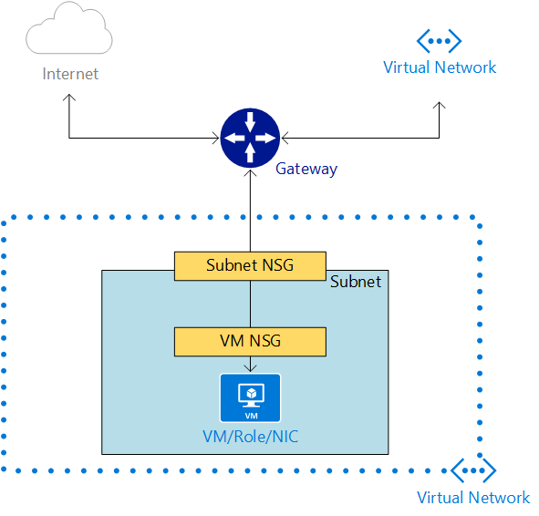

<properties 
   pageTitle="What is a Network Security Group (NSG)"
   description="Learn about Network Security Groups (NSG)"
   services="virtual-network"
   documentationCenter="na"
   authors="telmosampaio"
   manager="carolz"
   editor="tysonn" />
<tags 
   ms.service="virtual-network"
   ms.devlang="na"
   ms.topic="article"
   ms.tgt_pltfrm="na"
   ms.workload="infrastructure-services"
   ms.date="08/13/2015"
   ms.author="telmos" />

# What is a Network Security Group (NSG)?

You can use an NSG to control traffic to one or more virtual machine (VM) instances in your virtual network. A network security group is a top level object that is associated to your subscription An NSG contains access control rules that allow or deny traffic to VM instances. The rules of an NSG can be changed at any time, and changes are applied to all associated instances. To use an NSG, you must have a VNet that is associated with a region (location). 

>[AZURE.WARNING] NSGs are not compatible with VNets that are associated with an affinity group. If you don’t have a regional VNet and you want to control traffic to your endpoints, please see [What is a Network Access Control List (ACL)?](./virtual-networks-acl.md). You can also [migrate your VNet to a regional VNet](./virtual-networks-migrate-to-regional-vnet.md).

You can associate an NSG to a VM, or to a subnet within a VNet. When associated with a VM, the NSG applies to all the traffic that is sent and received by the VM instance. When applied to a subnet within your VNet, it applies to all the traffic that is sent and received by ALL the VM instances in the subnet. A VM or subnet can be associated with only 1 NSG, and each NSG can contain up to 200 rules. You can have 100 NSGs per subscription.

>[AZURE.NOTE] Endpoint-based ACLs and network security groups are not supported on the same VM instance. If you want to use an NSG and have an endpoint ACL already in place, first remove the endpoint ACL. For information about how to do this, see [Managing Access Control Lists (ACLs) for Endpoints by using PowerShell](virtual-networks-acl-powershell.md).

## How does a network security group work?

Network security groups are different than endpoint-based ACLs. Endpoint ACLs work only on the public port that is exposed through the input endpoint. An NSG works on one or more VM instances and controls all the traffic that is inbound and outbound on the VM.

A network security group has a *Name*, is associated to a *Region*, and has a descriptive label. It contains two types of rules, **Inbound** and **Outbound**. The Inbound rules are applied on the incoming packets to a VM and the Outbound rules are applied to the outgoing packets from the VM. The rules are applied at the host where the VM is located. An incoming or outgoing packet has to match an **Allow** rule for it be permitted, if not it will be dropped.

Rules are processed in the order of priority. For example, a rule with a lower priority number (e.g. 100) is processed before rules with a higher priority numbers (e.g. 200). Once a match is found, no more rules are processed.

A rule specifies the following:

- **Name:** A unique identifier for the rule

- **Type:** Inbound/Outbound

- **Priority:** <You can specify an integer between 100 and 4096>

- **Source IP Address:** CIDR of source IP range

- **Source Port Range:** <integer or range between 0 and 65536>

- **Destination IP Range:** CIDR of the destination IP Range

- **Destination Port Range:** <integer or range between 0 and 65536>

- **Protocol:** <TCP, UDP or ‘*’ is allowed>

- **Access:** Allow/Deny

### Default Rules

An NSG contains default rules. The default rules cannot be deleted, but because they are assigned the lowest priority, they can be overridden by the rules that you create. The default rules describe the default settings recommended by the platform. As illustrated by the default rules below, traffic originating and ending in a VNet is allowed both in Inbound and Outbound directions.

While connectivity to the Internet is allowed for Outbound direction, it is by default blocked for Inbound direction. There is a default rule to allow Azure’s load balancer (LB) to probe the health of the VM. You can override this rule if the VM or set of VMs under the NSG does not participate in the load balanced set.

The default rules are:

**Inbound**

| Name                              | Priority | Source IP          | Source Port | Destination IP  | Destination Port | Protocol | Access |
|-----------------------------------|----------|--------------------|-------------|-----------------|------------------|----------|--------|
| ALLOW VNET INBOUND                | 65000    | VIRTUAL_NETWORK    | *           | VIRTUAL_NETWORK | *                | *        | ALLOW  |
| ALLOW AZURE LOAD BALANCER INBOUND | 65001    | AZURE_LOADBALANCER | *           | *               | *                | *        | ALLOW  |
| DENY ALL INBOUND                  | 65500    | *                  | *           | *               | *                | *        | DENY   |

**Outbound**

| Name                    | Priority | Source IP       | Source Port | Destination IP  | Destination Port | Protocol | Access |
|-------------------------|----------|-----------------|-------------|-----------------|------------------|----------|--------|
| ALLOW VNET OUTBOUND     | 65000    | VIRTUAL_NETWORK | *           | VIRTUAL_NETWORK | *                | *        | ALLOW  |
| ALLOW INTERNET OUTBOUND | 65001    | *               | *           | INTERNET        | *                | *        | ALLOW  |
| DENY ALL OUTBOUND       | 65500    | *               | *           | *               | *                | *        | DENY   |

### Special Infrastructure Rules

NSG rules are explicit. No traffic is allowed or denied beyond what is specified in the NSG rules. However, there are two types of traffic that are always allowed regardless of the Network Security group specification. These provisions are made to support the infrastructure.

- **Virtual IP of the Host Node:** Basic infrastructure services such as DHCP, DNS, and Health monitoring are provided through the virtualized host IP address 168.63.129.16. This public IP address belongs to Microsoft and will be the only virtualized IP address used in all regions for this purpose. This IP address maps to the physical IP address of the server machine (host node) hosting the virtual machine. The host node acts as the DHCP relay, the DNS recursive resolver, and the probe source for the load balancer health probe and the machine health probe. Communication to this IP address should not be considered as an attack.

- **Licensing (Key Management Service):** Windows images running in the virtual machines should be licensed. To do this, a licensing request is sent to the Key Management Service host servers that handle such queries. This will always be on outbound port 1688.

### Default Tags

Default tags are system-provided identifiers to address a category of IP addresses. Default tags can be specified in customer defined rules. The default tags are as follows:

- **VIRTUAL_NETWORK -** This default tag denotes all of your network address space. It includes the virtual network address space (IP CIDR in Azure) as well as all connected on-premises address space (Local Networks). This also includes VNet to VNet address spaces.

- **AZURE_LOADBALANCER -** This default tag denotes Azure’s Infrastructure load balancer. This will translate to an Azure datacenter IP where Azure’s health probes will originate. This is needed only if the VM or set of VMs associated with the NSG is participating in a load balanced set.

- **INTERNET -** This default tag denotes the IP Address space that is outside the virtual network and reachable by public Internet. This range includes Azure owned public IP space as well.

### Ports and Port Ranges

Network security group rules can be specified on a single source/destination port, or on a port range. This is particularly useful in cases where you want to open a wide range of ports for an application, such as FTP. The range can only be sequential and cannot be mixed with individual port specification.

To specify a range of ports, use the ‘-’ sign, as shown below in the *DestinationPortRange* parameter:

	Get-AzureNetworkSecurityGroup -Name ApptierSG `
	| Set-AzureNetworkSecurityRule -Name FTP -Type Inbound -Priority 600 -Action Allow `
		-SourceAddressPrefix INTERNET -SourcePortRange * `
		-DestinationAddressPrefix * -DestinationPortRange 100-500 -Protocol *

### ICMP Traffic

The current NSG rules only allow for protocols ‘TCP’ or ‘UDP’. There is not a specific tag for ‘ICMP’. However, ICMP traffic is allowed within a Virtual Network by default through the Inbound VNet rules that allow traffic from/to any port and protocol  ‘*’ within the VNet.

## Associating NSGs

Associating an NSG to a VM - When an NSG is directly associated to a VM, the Network access rules in the NSG are directly applied to all traffic that is destined to the VM. Whenever the NSG is updated for rule changes, the changes are reflected in the traffic handling within minutes. When the NSG is dis-associated from the VM, the state goes back to whatever it was before the NSG, i.e. the system defaults before the introduction if NSG will be used.

Associating an NSG to a Subnet - When an NSG is associated to a subnet, the Network access rules in the NSG are applied to all the VMs in the subnet. Whenever the access rules in the NSG are updated the changes are applied to all Virtual machines in the subnet within minutes.

Associating an NSG to a Subnet and a VM - It is possible that you can associate an NSG to a VM and a different NSG to the subnet where the VM resides. This is supported and in this case the VM gets two layers of protection. On the Inbound traffic the packet goes through the access rules specified in the subnet followed by rules in the VM and in the Outbound case it goes through the rules specified in the VM first before going through the rules specified in the subnet, as illustrated in the diagram below.

When an NSG is associated with a VM or subnet, the network access control rules becomes very explicit. The platform will not insert any implicit rule to allow traffic to a particular port. In this case, if you create an endpoint in the VM, you also have to create a rule to allow traffic from the Internet. If you don’t do this, the VIP:<Port> will not be accessible from outside.

For example: You create a new VM and also create a new NSG. You associate the NSG to the VM. The VM can communicate to other VMs in the virtual network through the ALLOW VNET INBOUND rule. The VM can also make outbound connections to the Internet using the ALLOW INTERNET OUTBOUND rule. Later, you create an endpoint on port 80 to receive traffic to your website running in the VM. Packets destined to port 80 on the VIP (public Virtual IP address) from the Internet will not reach the VM until you add a rule similar to the following (below) to the NSG.

| Name | Priority | Source IP | Source Port | Destination IP | Destination Port | Protocol | Access |
|------|----------|-----------|-------------|----------------|------------------|----------|--------|
| WEB  | 100      | INTERNET  | *           | *              | 80               | TCP      | ALLOW  |

## Design considerations

You must understand how VMs communicate with infrastructure services, and PaaS service hosted hosted by Azure when designing your NSGs. Most Azure PaaS services, such as SQL databases and storage, can only be accessed through a public facing Internet address. The same is true for load balancing probes.

A common scenario in Azure is the segregation of VMs and PaaS roles in subnets based on whether these objects required access to the internet or not. In such scenario, you might have a subnet with VMs or role instances that require access to Azure Paas services, such as SQL databases and storage, but that do not require any inbound or outbound communication to the public Internet. 

Imagine the following NSG rule for such a scenario:

| Name | Priority | Source IP | Source Port | Destination IP | Destination Port | Protocol | Access |
|------|----------|-----------|-------------|----------------|------------------|----------|--------|
|NO INTERNET|100| VIRTUAL_NETWORK|&#42;|INTERNET|&#42;|TCP|DENY| 

Since the rule is denying all access from the virtual network to the Internet, VMs will not be able to access any Azure PaaS service that requires a public Internet endpoint, such as SQL databases. 

Instead of using a deny rule, consider using a rule to allow access from the virtual network to the Internet, but deny access from the Internet to the virtual network, as shown below:

| Name | Priority | Source IP | Source Port | Destination IP | Destination Port | Protocol | Access |
|------|----------|-----------|-------------|----------------|------------------|----------|--------|
|TO INTERNET|100| VIRTUAL_NETWORK|&#42;|INTERNET|&#42;|TCP|ALLOW|
|FROM INTERNET|110| INTERNET|&#42;|VIRTUAL_NETWORK|&#42;|TCP|DENY| 

>[AZURE.WARNING] Azure uses a special subnet referred to as the **Gateway** subnet to handle VPN gateway to other VNets and on-premises networks. Associating an NSG to this subnet will cause your VPN gateway to stop functioning as expected. Do NOT associate NSGs to gateway subnets!

## Planning - network security group workflow

Here are the basic workflow steps when using network security groups.

### Workflow – Create and associate an NSG

1. Create a network security group (NSG).

1. Add network security rules, unless the default rules are sufficient.

1. Associate the NSG to a VM.

1. Update the VM.

1. After update, the NSG rules will take effect immediately.

### Workflow – Update an existing NSG

1. Add, delete, or update a rule in an existing NSG.

1. All VMs associated with the NSG will get the updates within minutes. A VM update is not required when the NSG rule is already associated with the VM.

### Workflow – Changing an NSG association

1. Associate a new NSG to a VM that is already associated to another NSG.

1. Update the VM.

1. The rules from the new NSG will take effect within minutes.

## How to create, configure, and manage your network security groups

At this time, NSGs can be configured and modified by using PowerShell cmdlets and REST APIs only. You cannot configure NSGs by using the Management Portal. The PowerShell cmdlets below will help you create, configure, and manage your NSGs.

**Create a Network Security Group**

	New-AzureNetworkSecurityGroup -Name "MyVNetSG" -Location uswest `
		-Label "Security group for my Vnet in West US"

**Add or Update rules**

	Get-AzureNetworkSecurityGroup -Name "MyVNetSG" `
	| Set-AzureNetworkSecurityRule -Name WEB -Type Inbound -Priority 100 `
		-Action Allow -SourceAddressPrefix 'INTERNET'  -SourcePortRange '*' `
		-DestinationAddressPrefix '*' -DestinationPortRange '*' -Protocol TCP

**Delete a rule from an NSG**

	Get-AzureNetworkSecurityGroup -Name "MyVNetSG" `
	| Remove-AzureNetworkSecurityRule -Name WEB

**Associate an NSG to a VM**

	Get-AzureVM -ServiceName "MyWebsite" -Name "Instance1" `
	| Set-AzureNetworkSecurityGroupConfig -NetworkSecurityGroupName "MyVNetSG" `
	| Update-AzureVM

**View NSGs associated to a VM**

	Get-AzureVM -ServiceName "MyWebsite" -Name "Instance1" `
	| Get-AzureNetworkSecurityGroupAssociation

**Remove an NSG from a VM**

	Get-AzureVM -ServiceName "MyWebsite" -Name "Instance1" `
	| Remove-AzureNetworkSecurityGroupConfig -NetworkSecurityGroupName "MyVNetSG" `
	| Update-AzureVM

**Associate an NSG to a subnet**

	Get-AzureNetworkSecurityGroup -Name "MyVNetSG" `
	| Set-AzureNetworkSecurityGroupToSubnet -VirtualNetworkName 'VNetUSWest' `
		-SubnetName 'FrontEndSubnet'

**View NSGs associated to a subnet**

	Get-AzureNetworkSecurityGroupForSubnet -SubnetName 'FrontEndSubnet' `
		-VirtualNetworkName 'VNetUSWest' 

**Remove an NSG from the subnet**

	Get-AzureNetworkSecurityGroup -Name "MyVNetSG" `
	| Remove-AzureNetworkSecurityGroupFromSubnet -VirtualNetworkName 'VNetUSWest' `
		-SubnetName 'FrontEndSubnet'

**Delete an NSG**

	Remove-AzureNetworkSecurityGroup -Name "MyVNetSG"

**Get the details of an NSG along with rules**

	Get-AzureNetworkSecurityGroup -Name "MyVNetSG" -Detailed
 
**View all Azure PowerShell cmdlets realted to NSGs**

	Get-Command *azurenetworksecuritygroup*
