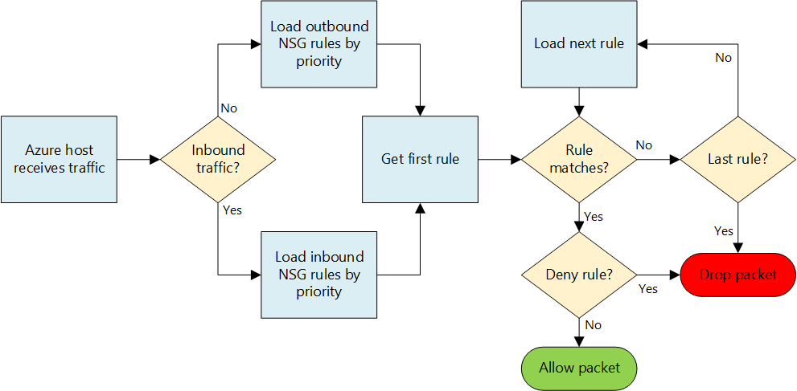
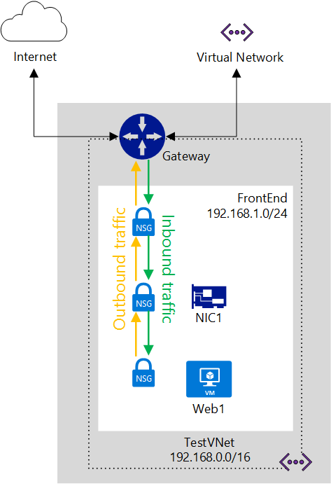
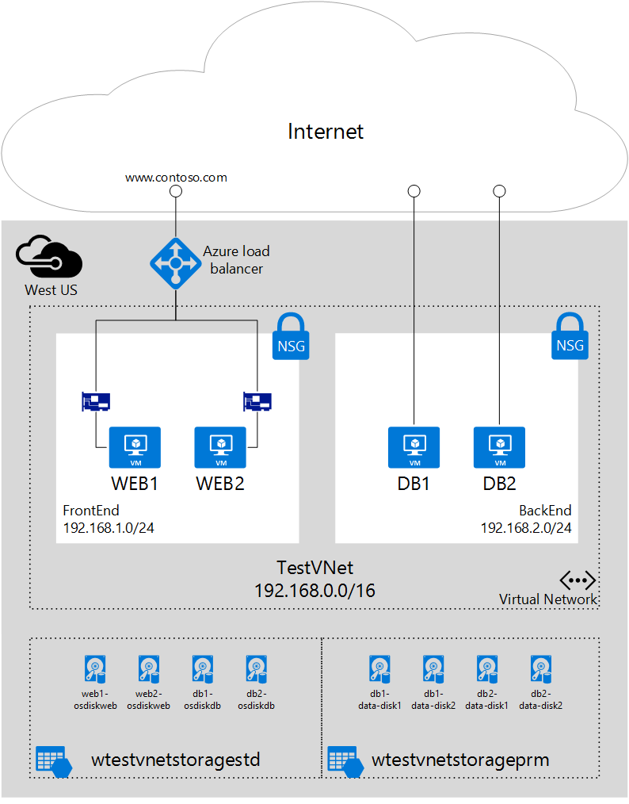

<properties 
   pageTitle="What is a Network Security Group (NSG)"
   description="Learn about the distributed firewall in Azure using Network Security Groups (NSGs), and how to use NSGs to isolate and control traffic flow within your virtual networks (VNets)."
   services="virtual-network"
   documentationCenter="na"
   authors="jimdial"
   manager="carmonm"
   editor="tysonn" />
<tags 
   ms.service="virtual-network"
   ms.devlang="na"
   ms.topic="get-started-article"
   ms.tgt_pltfrm="na"
   ms.workload="infrastructure-services"
   ms.date="02/11/2016"
   ms.author="jdial" />

# What is a Network Security Group (NSG)?

Network security group (NSG) contains a list of Access Control List (ACL) rules that allow or deny network traffic to your VM instances in a Virtual Network. NSGs can be associated with either subnets or individual VM instances within that subnet. When a NSG is associated with a subnet, the ACL rules apply to all the VM instances in that subnet. In addition, traffic to an individual VM can be restricted further by associating a NSG directly to that VM.

## NSG resource

NSGs contain the following properties.

|Property|Description|Constraints|Considerations|
|---|---|---|---|
|Name|Name for the NSG|Must be unique within the region Can contain letters, numbers, underscores, periods and hyphens Must start with a letter or number Must end with a letter, number, or underscore Can have up to 80 characters|Since you may need to create several NSGs, make sure you have a naming convention that makes it easy to identify the function of your NSGs|
|Region|Azure region where the NSG is hosted|NSGs can only be applied to resources within the region it is created|See [limits](#Limits) below to understand how many NSGs you can have in a region|
|Resource group|Resource group the NSG belongs to|Although an NSG belongs to a resource group, it can be associated to resources in any resource group, as long as the resource is part of the same Azure region as the NSG|Resource groups are used to manage multiple resources together, as a deployment unit You may consider grouping the NSG with resources it is associated to|
|Rules|Rules that define what traffic is allowed, or denied||See [NSG rules](#Nsg-rules) below| 

>[AZURE.NOTE] Endpoint-based ACLs and network security groups are not supported on the same VM instance. If you want to use an NSG and have an endpoint ACL already in place, first remove the endpoint ACL. For information about how to do this, see [Managing Access Control Lists (ACLs) for Endpoints by using PowerShell](virtual-networks-acl-powershell.md).

### NSG rules

NSG rules contain the following properties.

|Property|Description|Constraints|Considerations|
|---|---|---|---|
|**Name**|Name for the rule|Must be unique within the region Can contain letters, numbers, underscores, periods and hyphens Must start with a letter or number Must end with a letter, number, or underscore Can have up to 80 characters|You may have several rules within an NSG, so make sure you follow a naming convention that allows you to identify the function of your rule|
|**Protocol**|Protocol to match for the rule|TCP, UDP, or \*|Using \* as a protocol includes ICMP (East-West traffic only), as well as UDP and TCP and may reduce the number of rules you need At the same time, using \* might be too broad an approach, so make sure you only use when really necessary|
|**Source port range**|Source port range to match for the rule|Single port number from 1 to 65535, port range (i.e. 1-65635), or \* (for all ports)|Source ports could be ephemeral. Unless your client program is using a specific port, please use "*" in most cases. Try to use port ranges as much as possible to avoid the need for multiple rules Multiple ports or port ranges cannot be grouped by a comma
|**Destination port range**|Destination port range to match for the rule|Single port number from 1 to 65535, port range (i.e. 1-65535), or \* (for all ports)|Try to use port ranges as much as possible to avoid the need for multiple rules Multiple ports or port ranges cannot be grouped by a comma
|**Source address prefix**|Source address prefix or tag to match for the rule|Single IP address (i.e. 10.10.10.10), IP subnet (i.e. 192.168.1.0/24), [default tag](#Default-Tags), or * (for all addresses)|Consider using ranges, default tags, and * to reduce the number of rules|
|**Destination address prefix**|Destination address prefix or tag to match for the rule|single IP address (i.e. 10.10.10.10), IP subnet (i.e. 192.168.1.0/24), [default tag](#Default-Tags), or * (for all addresses)|Consider using ranges, default tags, and * to reduce the number of rules|
|**Direction**|Direction of traffic to match for the rule|inbound or outbound|Inbound and outbound rules are processed separately, based on direction|
|**Priority**|Rules are checked in the order of priority, once a rule applies, no more rules are tested for matching|Number between 100 and 4096|Consider creating rules jumping priorities by 100 for each rule, to leave space for new rules to come between existing rules|
|**Access**|Type of access to apply if the rule matches|allow or deny|Keep in mind that if an allow rule is not found for a packet, the packet is dropped|

NSGs contain two sets of rules: inbound and outbound. The priority for a rule must be unique within each set. 

 

The figure above shows how NSG rules are processed.

### Default Tags

Default tags are system-provided identifiers to address a category of IP addresses. You can use default tags in the **source address prefix** and **destination address prefix** properties of any rule. There are three default tags you can use.

- **VIRTUAL_NETWORK:** This default tag denotes all of your network address space. It includes the virtual network address space (CIDR ranges defined in Azure) as well as all connected on-premises address spaces and connected Azure VNets (local networks).

- **AZURE_LOADBALANCER:** This default tag denotes Azure’s Infrastructure load balancer. This will translate to an Azure datacenter IP where Azure’s health probes originate.

- **INTERNET:** This default tag denotes the IP address space that is outside the virtual network and reachable by public Internet. This range includes [Azure owned public IP space](https://www.microsoft.com/download/details.aspx?id=41653) as well.

### Default Rules

All NSGs contain a set of default rules. The default rules cannot be deleted, but because they are assigned the lowest priority, they can be overridden by the rules that you create. 

As illustrated by the default rules below, traffic originating and ending in a virtual network is allowed both in Inbound and Outbound directions. While connectivity to the Internet is allowed for Outbound direction, it is by default blocked for Inbound direction. There is a default rule to allow Azure’s load balancer to probe the health of your VMs and role instances. You can override this rule, if you are not using a load balanced set.

**Inbound default rules**

| Name                              | Priority | Source IP          | Source Port | Destination IP  | Destination Port | Protocol | Access |
|-----------------------------------|----------|--------------------|-------------|-----------------|------------------|----------|--------|
| ALLOW VNET INBOUND                | 65000    | VIRTUAL_NETWORK    | *           | VIRTUAL_NETWORK | *                | *        | ALLOW  |
| ALLOW AZURE LOAD BALANCER INBOUND | 65001    | AZURE_LOADBALANCER | *           | *               | *                | *        | ALLOW  |
| DENY ALL INBOUND                  | 65500    | *                  | *           | *               | *                | *        | DENY   |

**Outbound default rules**

| Name                    | Priority | Source IP       | Source Port | Destination IP  | Destination Port | Protocol | Access |
|-------------------------|----------|-----------------|-------------|-----------------|------------------|----------|--------|
| ALLOW VNET OUTBOUND     | 65000    | VIRTUAL_NETWORK | *           | VIRTUAL_NETWORK | *                | *        | ALLOW  |
| ALLOW INTERNET OUTBOUND | 65001    | *               | *           | INTERNET        | *                | *        | ALLOW  |
| DENY ALL OUTBOUND       | 65500    | *               | *           | *               | *                | *        | DENY   |

## Associating NSGs

You can associate an NSG to VMs, NICs, and subnets, depending on the deployment model you are using.

[AZURE.INCLUDE [learn-about-deployment-models-both-include.md](../../includes/learn-about-deployment-models-both-include.md)]
 
- **Associating an NSG to a VM (classic deployments only).** When you associate an NSG to a VM, the network access rules in the NSG are applied to all traffic that destined and leaving the VM. 

- **Associating an NSG to a NIC (Resource Manager deployments only).** When you associate an NSG to a NIC, the network access rules in the NSG are applied only to that NIC. That means that in a multi-NIC VM, if an NSG is applied to a single NIC, it does not affect traffic bound to other NICs. 

- **Associating an NSG to a subnet (all deployments)**. When you associate an NSG to a subnet, the network access rules in the NSG are applied to all the IaaS and PaaS resources in the subnet. 

You can associate different NSGs to a VM (or NIC, depending on the deployment model) and the subnet that a NIC or VM is bound to. When that happens, all network access rules are applied to the traffic, by priority in each NSG,  in the following order:

- **Inbound traffic**
	1. NSG applied to subnet. 
	
           If subnet NSG has a matching rule to deny traffic, packet will be dropped here.
	2. NSG applied to NIC (Resource Manager) or VM (classic). 
	   
           If VM\NIC NSG has a matching rule to deny traffic, packet will be dropped at VM\NIC, although subnet NSG has a matching rule to allow traffic.
- **Outbound traffic**
	1. NSG applied to NIC (Resource Manager) or VM (classic). 
	  
           If VM\NIC NSG has a matching rule to deny traffic, packet will be dropped here.
	2. NSG applied to subnet.
	   
           If subnet NSG has a matching rule to deny traffic, packet will be dropped here, although VM\NIC NSG has a matching rule to allow traffic.

	

>[AZURE.NOTE] Although you can only associate a single NSG to a subnet, VM, or NIC; you can associate the same NSG to as many resources as you want.

## Implementation
You can implement NSGs in the classic or Resource Manager deployment models using the different tools listed below.

|Deployment tool|Classic|Resource Manager|
|---|---|---|
|Classic portal|![No][red]|![No][red]|
|Azure portal|![Yes][green]|![Yes][green]|
|PowerShell|![Yes][green]|![Yes][green]|
|Azure CLI|![Yes][green]|![Yes][green]|
|ARM template|![No][red]|![Yes][green]|

|**Key**|![Yes][green] Supported. Click for article.|![No][red] Not Supported.|
|---|---|---|

## Planning

Before implementing NSGs, you need to answer the questions below:	

1. What types of resources do you want to filter traffic to or from (NICs in the same VM, VMs or other resources such as cloud services or application service environments connected to the same subnet, or between resources connected to different subnets)?

2. Are the resources you want to filter traffic to/from connected to subnets in existing VNets or will they be connected to new VNets or subnets?
 
For more information on planning for network security in Azure, read the [best practices for cloud services and network security](../best-practices-network-security.md). 

## Design considerations

Once you know the answers to the questions in the [Planning](#Planning) section, review the following before defining your NSGs.

### Limits

You need to consider the following limits when designing your NSGs.

|**Description**|**Default Limit**|**Implications**|
|---|---|---|
|Number of NSGs you can associate to a subnet, VM, or NIC|1|This means you cannot combine NSGs. Ensure all the rules needed for a given set of resources are included in a single NSG.|
|NSGs per region per subscription|100|By default, a new NSG is created for each VM you create in the Azure portal. If you allow this default behavior, you will run out of NSGs quickly. Make sure you keep this limit in mind during your design, and separate your resources into multiple regions or subscriptions if necessary. |
|NSG rules per NSG|200|Use a broad range of IP and ports to ensure you do not go over this limit. |

>[AZURE.IMPORTANT] Make sure you view all the [limits related to networking services in Azure](../azure-subscription-service-limits.md#networking-limits) before designing your solution. Some limits can be increased by opening a support ticket.

### VNet and subnet design

Since NSGs can be applied to subnets, you can minimize the number of NSGs by grouping your resources by subnet, and applying NSGs to subnets.  If you decide to apply NSGs to subnets, you may find that existing VNets and subnets you have were not defined with NSGs in mind. You may need to define new VNets and subnets to support your NSG design. And deploy your new resources to your new subnets. You could then define a migration strategy to move existing resources to the new subnets. 

### Special rules

You need to take into account the special rules listed below. Make sure you do not block traffic allowed by those rules, otherwise your infrastructure will not be able to communicate with essential Azure services.

- **Virtual IP of the Host Node:** Basic infrastructure services such as DHCP, DNS, and Health monitoring are provided through the virtualized host IP address 168.63.129.16. This public IP address belongs to Microsoft and will be the only virtualized IP address used in all regions for this purpose. This IP address maps to the physical IP address of the server machine (host node) hosting the virtual machine. The host node acts as the DHCP relay, the DNS recursive resolver, and the probe source for the load balancer health probe and the machine health probe. Communication to this IP address should not be considered as an attack.

- **Licensing (Key Management Service):** Windows images running in the virtual machines should be licensed. To do this, a licensing request is sent to the Key Management Service host servers that handle such queries. This will always be on outbound port 1688.

### ICMP traffic

The current NSG rules only allow for protocols *TCP* or *UDP*. There is not a specific tag for *ICMP*. However, ICMP traffic is allowed within a Virtual Network by default through the Inbound VNet rule(Default rule 65000 inbound) that allows traffic from/to any port and protocol within the VNet.

### Subnets

- Consider the number of tiers your workload requires. Each tier can be isolated by using a subnet, with an NSG applied to the subnet. 
- If you need to implement a subnet for a VPN gateway, or ExpressRoute circuit, make sure you do **NOT** apply an NSG to that subnet. If you do so, your cross VNet or cross premises connectivity will not work.
- If you need to implement a virtual appliance, make sure you deploy the virtual appliance on its own subnet, so that your User Defined Routes (UDRs) can work correctly. You can implement a subnet level NSG to filter traffic in and out of this subnet. Learn more about [how to control traffic flow and use virtual appliances](virtual-networks-udr-overview.md).

### Load balancers

- Consider the load balancing and NAT rules for each load balancer being used by each of your workloads.These rules are bound to a back end pool that contains NICs (Resource Manager deployments) or VMs/role instances (classic deployments). Consider creating an NSG for each back end pool, allowing only traffic mapped through the rules implemented in the load balancers. That guarantees that traffic coming to the backend pool directly, without passing through the load balancer, is also filtered.
- In classic deployments, you create endpoints that map ports on a load balancer to ports on your VMs or role instances. You can also create your own individual public facing load balancer in a Resource Manager deployment. If you are restricting traffic to VMs and role instances that are part of a backend pool in a load balancer by using NSGs, keep in mind that the destination port for the incoming traffic is the actual port in the VM or role instance, not the port exposed by the load balancer. Also keep in mind that the source port and address for the connection to the VM is a port and address on the remote computer in the Internet, not the port and address exposed by the load balancer.
- Similar to public facing load balancers, when you create NSGs to filter traffic coming through an internal load balancer (ILB), you need to understand that the source port and address range applied are the ones from the computer originating the call, not the load balancer. And the destination port and address range are related to the computer receiving the traffic, not the load balancer.

### Other

- Endpoint-based ACLs and NSGs are not supported on the same VM instance. If you want to use an NSG and have an endpoint ACL already in place, first remove the endpoint ACL. For information about how to do this, see [Manage endpoint ACLs](virtual-networks-acl-powershell.md).
- In the Resource Manager deployment model, you can use an NSG associated to a NIC for VMs with multiple NICs to enable management (remote access) by NIC, therefore segregating traffic.
- Similar to the use of load balancers, when filtering traffic from other VNets, you must use the source address range of the remote computer, not the gateway connecting the VNets.
- Many Azure services cannot be connected to Azure Virtual Networks and therefore, traffic to and from them cannot be filtered with NSGs.  Read the documentation for the services you use to determine whether or not they can be connected to VNets.

## Sample deployment

To illustrate the application of the information in this article, we’ll define NSGs to filter network traffic for a two tier workload solution with the following requirements:

1. Separation of traffic between front end (Windows web servers) and back end (SQL database servers).
2. Load balancing rules forwarding traffic to the load balancer to all web servers on port 80.
3. NAT rules forwarding traffic coming in port 50001 on load balancer to port 3389 on only one VM in the front end.
4. No access to the front end or back end VMs from the Internet, with exception of requirement number 1.
5. No access from the front end or back end to the Internet.
6. Access to port 3389 to any web server in the front end, for traffic coming from the front end subnet itself.
7. Access to port 3389 to all SQL Server VMs in the back end from the front end subnet only.
8. Access to port 1433 to all SQL Server VMs in the back end from the front end subnet only.
9. Separation of management traffic (port 3389) and database traffic (1433) on different NICs in the back end VMs.

As seen in the diagram above, the *Web1* and *Web2* VMs are connected to the *FrontEnd* subnet, and the *DB1* and *DB2* VMs are connected to the *BackEnd* subnet.  Both subnets are part of the *TestVNet* VNet. All resources are assigned to the *West US* Azure region.

Requirements 1-6 (with exception of 3) above are all confined to subnet spaces. To minimize the number of rules required for each NSG, and to make it easy to add additional VMs to the subnets running the same workload types as the existing VMs, we can implement the following subnet level NSGs.

### NSG for FrontEnd subnet

**Incoming rules**

|Rule|Access|Priority|Source address range|Source port|Destination address range|Destination port|Protocol|
|---|---|---|---|---|---|---|---|
|allow HTTP|Allow|100|INTERNET|\*|\*|80|TCP|
|allow RDP from FrontEnd|Allow|200|192.168.1.0/24|\*|\*|3389|TCP|
|deny anything from Internet|Deny|300|INTERNET|\*|\*|\*|TCP|

**Outgoing rules**

|Rule|Access|Priority|Source address range|Source port|Destination address range|Destination port|Protocol|
|---|---|---|---|---|---|---|---|
|deny Internet|Deny|100|\*|\*|INTERNET|\*|\*|

### NSG for BackEnd subnet

**Incoming rules**

|Rule|Access|Priority|Source address range|Source port|Destination address range|Destination port|Protocol|
|---|---|---|---|---|---|---|---|
|deny Internet|Deny|100|INTERNET|\*|\*|\*|\*|

**Outgoing rules**

|Rule|Access|Priority|Source address range|Source port|Destination address range|Destination port|Protocol|
|---|---|---|---|---|---|---|---|
|deny Internet|Deny|100|\*|\*|INTERNET|\*|\*|

### NSG for single VM (NIC) in FrontEnd for RDP from Internet

**Incoming rules**

|Rule|Access|Priority|Source address range|Source port|Destination address range|Destination port|Protocol|
|---|---|---|---|---|---|---|---|
|allow RDP from Internet|Allow|100|INTERNET|*|\*|3389|TCP|

>[AZURE.NOTE] Notice how the source address range for this rule is **Internet**, and not the VIP for the load balancer; the source port is **\***, not 500001. Do not get confused between NAT rules/load balancing rules and NSG rules. The NSG rules are always related to the original source and final destination of traffic, **NOT** the load balancer between the two. 

### NSG for management NICs in BackEnd

**Incoming rules**

|Rule|Access|Priority|Source address range|Source port|Destination address range|Destination port|Protocol|
|---|---|---|---|---|---|---|---|
|allow RDP from front end|Allow|100|192.168.1.0/24|*|\*|3389|TCP|

### NSG for database access NICs in back end

**Incoming rules**

|Rule|Access|Priority|Source address range|Source port|Destination address range|Destination port|Protocol|
|---|---|---|---|---|---|---|---|
|allow SQL from front end|Allow|100|192.168.1.0/24|*|\*|1433|TCP|

Since some of the NSGs above need to be associated to individual NICs, you need to deploy this scenario as a Resource Manager deployment. Notice how rules are combined for subnet and NIC level, depending on how they need to be applied. 

## Next steps

- [Deploy NSGs in the classic deployment model](virtual-networks-create-nsg-classic-ps.md).
- [Deploy NSGs in Resource Manager](virtual-networks-create-nsg-arm-pportal.md).
- [Manage NSG logs](virtual-network-nsg-manage-log.md).

[green]: ./media/virtual-network-nsg-overview/green.png
[yellow]: ./media/virtual-network-nsg-overview/yellow.png
[red]: ./media/virtual-network-nsg-overview/red.png
