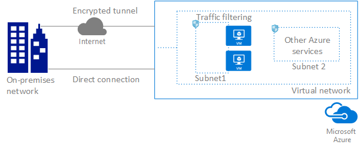

# Azure Virtual Network

The Azure Virtual Network service enables you to securely connect Azure resources to each other with virtual networks (VNets). A VNet is a representation of your own network in the cloud. A VNet is a logical isolation of the Azure cloud dedicated to your subscription. You can also connect VNets to your on-premises network. The following picture shows some of the capabilities of the Azure Virtual Network service:

To learn more about the following Azure Virtual Network capabilities, click the capability:
- **[Isolation:](#isolation)** VNets are isolated from one another. You can create separate VNets for development, testing, and production that use the same CIDR address blocks. Conversely, you can create multiple VNets that use different CIDR address blocks and connect networks together. You can segment a VNet into multiple subnets. Azure provides internal name resolution for VMs and Cloud Services role instances connected to a VNet. You can optionally configure a VNet to use your own DNS servers, instead of using Azure internal name resolution.
- **[Internet connectivity:](#internet)** All Azure Virtual Machines (VM) and Cloud Services role instances connected to a VNet have access to the Internet, by default. You can also enable inbound access to specific resources, as needed.
- **[Azure resource connectivity:](#within-vnet)** Azure resources such as Cloud Services and VMs can be connected to the same VNet. The resources can connect to each other using private IP addresses, even if they are in different subnets. Azure provides default routing between subnets, VNets, and on-premises networks, so you don't have to configure and manage routes.
- **[VNet connectivity:](#connect-vnets)** VNets can be connected to each other, enabling resources connected to any VNet to communicate with any resource on any other VNet.
- **[On-premises connectivity:](#connect-on-premises)** VNets can be connected to on-premises networks through private network connections between your network and Azure, or through a site-to-site VPN connection over the Internet.
- **[Traffic filtering:](#filtering)** VM and Cloud Services role instances network traffic can be filtered inbound and outbound by source IP address and port, destination IP address and port, and protocol.
- **[Routing:](#routing)** You can optionally override Azure's default routing by configuring your own routes, or using BGP routes through a network gateway.

## Network isolation and segmentation

You can implement multiple VNets within each Azure [subscription](../azure-glossary-cloud-terminology.md?toc=%2fazure%2fvirtual-network%2ftoc.json#subscription) and Azure [region](../azure-glossary-cloud-terminology.md?toc=%2fazure%2fvirtual-network%2ftoc.json#region). Each VNet is isolated from other VNets. For each VNet you can:
- Specify a custom private IP address space using public and private (RFC 1918) addresses. Azure assigns resources connected to the VNet a private IP address from the address space you assign.
- Segment the VNet into one or more subnets and allocate a portion of the VNet address space to each subnet.
- Use Azure-provided name resolution or specify your own DNS server for use by resources connected to a VNet. To learn more about name resolution in VNets, read the [Name resolution for VMs and Cloud Services](virtual-networks-name-resolution-for-vms-and-role-instances.md) article.

## Connect to the Internet
All resources connected to a VNet have outbound connectivity to the Internet by default. The private IP address of the resource is source network address translated (SNAT) to a public IP address by the Azure infrastructure. To learn more about outbound Internet connectivity, read the [Understanding outbound connections in Azure](..\load-balancer\load-balancer-outbound-connections.md?toc=%2fazure%2fvirtual-network%2ftoc.json#standalone-vm-with-no-instance-level-public-ip-address) article. You can change the default connectivity by implementing custom routing and traffic filtering.

To communicate inbound to Azure resources from the Internet, or to communicate outbound to the Internet without SNAT, a resource must be assigned a public IP address. To learn more about public IP addresses, read the [Public IP addresses](virtual-network-public-ip-address.md) article.

## Connect Azure resources
You can connect several Azure resources to a VNet, such as Virtual Machines (VM), Cloud Services, App Service Environments, and Virtual Machine Scale Sets. VMs connect to a subnet within a VNet through a network interface (NIC). To learn more about NICs, read the [Network interfaces](virtual-network-network-interface.md) article.

## Connect virtual networks

You can connect VNets to each other, enabling resources connected to either VNet to communicate with each other across VNets. You can use either or both of the following options to connect VNets to each other:
- **Peering:** Enables resources connected to different Azure VNets within the same Azure location to communicate with each other. The bandwidth and latency across the VNets is the same as if the resources were connected to the same VNet. To learn more about peering, read the [Virtual network peering](virtual-network-peering-overview.md) article.
- **VNet-to-VNet connection:** Enables resources connected to different Azure VNet within the same, or different Azure locations. Unlike peering, bandwidth is limited between VNets because traffic must flow through an Azure VPN Gateway. To learn more about connecting VNets with a VNet-to-VNet connection, read the [Configure a VNet-to-VNet connection](../vpn-gateway/vpn-gateway-howto-vnet-vnet-resource-manager-portal.md?toc=%2fazure%2fvirtual-network%2ftoc.json) article.

## Connect to an on-premises network

You can connect your on-premises network to a VNet using any combination of the following options:
- **Point-to-site virtual private network (VPN):** Established between a single PC connected to your network and the VNet. This connection type is great if you're just getting started with Azure, or for developers, because it requires little or no changes to your existing network. The connection uses the SSTP protocol to provide encrypted communication over the Internet between the PC and the VNet. The latency for a point-to-site VPN is unpredictable, since the traffic traverses the Internet.
- **Site-to-site VPN:** Established between your VPN device and an Azure VPN Gateway. This connection type enables any on-premises resource you authorize to access a VNet. The connection is an IPSec/IKE VPN that provides encrypted communication over the Internet between your on-premises device and the Azure VPN gateway. The latency for a site-to-site connection is unpredictable, since the traffic traverses the Internet.
- **Azure ExpressRoute:** Established between your network and Azure, through an ExpressRoute partner. This connection is private. Traffic does not traverse the Internet. The latency for an ExpressRoute connection is predictable, since traffic doesn't traverse the Internet.

To learn more about all the previous connection options, read the [Connection topology diagrams](../vpn-gateway/vpn-gateway-about-vpngateways.md?toc=%2fazure%2fvirtual-network%2ftoc.json#a-namediagramsaconnection-topology-diagrams) article.

## Filter network traffic
You can filter network traffic between subnets using either or both of the following options:
- **Network security groups (NSG):** Each NSG can contain multiple inbound and outbound security rules that enable you to filter traffic by source and destination IP address, port, and protocol. You can apply an NSG to each NIC in a VM. You can also apply an NSG to the subnet a NIC, or other Azure resource, is connected to. To learn more about NSGs, read the [Network security groups](virtual-networks-nsg.md) article.
- **Network virtual appliances (NVA):** An NVA is a VM running software that performs a network function, such as a firewall. View a list of available NVAs in the [Azure Marketplace](https://azuremarketplace.microsoft.com/marketplace/apps/category/networking?page=1&subcategories=appliances). NVAs are also available that provide WAN optimization and other network traffic functions. NVAs are typically used with user-defined or BGP routes. You can also use an NVA to filter traffic between VNets.

## Route network traffic

Azure creates route tables that enable resources connected to any subnet in any VNet to communicate with each other, by default. You can implement either or both of the following options to override the default routes Azure creates:
- **User-defined routes:** You can create custom route tables with routes that control where traffic is routed to for each subnet. To learn more about user-defined routes, read the [User-defined routes](virtual-networks-udr-overview.md) article.
- **BGP routes:** If you connect your VNet to your on-premises network using an Azure VPN Gateway or ExpressRoute connection, you can propagate BGP routes to your VNets.

## Pricing

There is no charge for virtual networks, subnets, route tables, or network security groups. Outbound Internet bandwidth usage, public IP addresses, virtual network peering, VPN Gateways, and ExpressRoute each have their own pricing structures. View the [Virtual network](https://azure.microsoft.com/pricing/details/virtual-network), [VPN Gateway](https://azure.microsoft.com/pricing/details/vpn-gateway), and [ExpressRoute](https://azure.microsoft.com/pricing/details/expressroute) pricing pages for more information.

## FAQ

To review frequently asked questions about Virtual Network, see the [Virtual Network FAQ](virtual-networks-faq.md) article.

## Next steps

- Create your first VNet, and connect a few VMs to it, by completing the steps in the [Create your first virtual network](virtual-network-get-started-vnet-subnet.md) article.
- Create a point-to-site connection to a VNet by completing the steps in the [Configure a point-to-site connection](../vpn-gateway/vpn-gateway-howto-point-to-site-resource-manager-portal.md?toc=%2fazure%2fvirtual-network%2ftoc.json) article.
