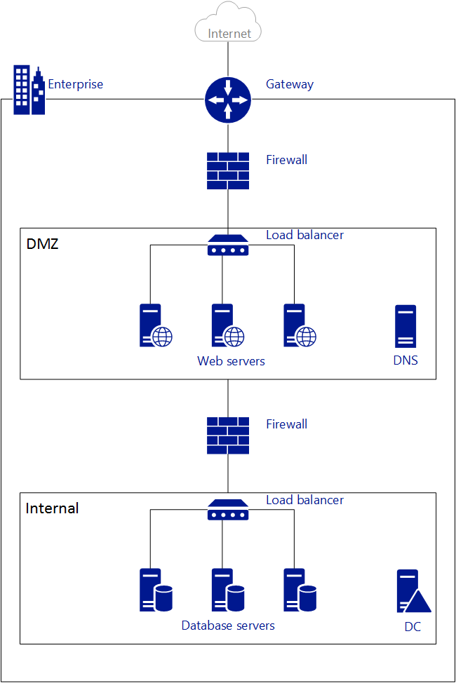
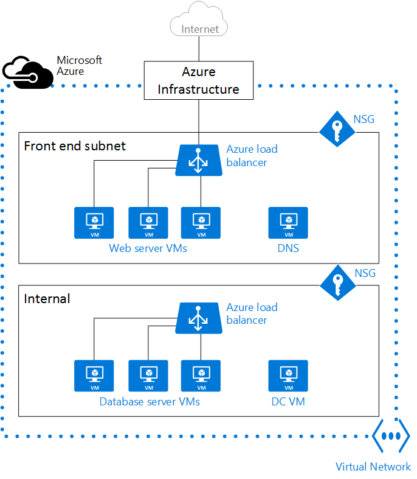

<properties
   pageTitle="Azure Virtual Network (VNet) Overview"
   description="Learn about virtual networks (VNets) in Azure."
   services="virtual-network"
   documentationCenter="na"
   authors="jimdial"
   manager="carmonm"
   editor="tysonn" />
<tags
   ms.service="virtual-network"
   ms.devlang="na"
   ms.topic="get-started-article"
   ms.tgt_pltfrm="na"
   ms.workload="infrastructure-services"
   ms.date="03/15/2016"
   ms.author="jdial" />

# Virtual Network Overview

An Azure virtual network (VNet) is a representation of your own network in the cloud.  It is a logical isolation of the Azure cloud dedicated to your subscription. You can fully control the IP address blocks, DNS settings, security policies, and route tables within this network. You can also further segment your VNet into subnets and launch Azure IaaS virtual machines (VMs) and/or [Cloud services (PaaS role instances)](../cloud-services/cloud-services-choose-me.md). Additionally, you can connect the virtual network to your on-premises network using one of the [connectivity options](../vpn-gateway/vpn-gateway-cross-premises-options.md) available in Azure. In essence, you can expand your network to Azure, with complete control on IP address blocks with the benefit of enterprise scale Azure provides.

To better understand VNets, take a look at the figure below, which shows a simplified on-premises network.

The figure above shows an on-premises network connected to the public Internet through a router. You can also see a firewall between the router and a DMZ hosting a DNS server and a web server farm. The web server farm is load balanced using a hardware load balancer that is exposed to the Internet, and consumes resources from the internal subnet. The internal subnet is separated from the DMZ by another firewall, and hosts Active Directory Domain Controller servers, database servers, and application servers.

The same network can be hosted in Azure as shown in the figure below.

Notice how the Azure infrastructure takes on the role of the router, allowing access from your VNet to the public Internet without the need of any configuration. Firewalls can be substituted by Network Security Groups (NSGs) applied to each individual subnet. And physical load balancers are substituted by internet facing and internal load balancers in Azure.

>[AZURE.NOTE] There are two deployment modes in Azure: classic (also known as Service Management) and Azure Resource Manager (ARM). Classic VNets could be added to an affinity group, or created as a regional VNet. If you have a VNet in an affinity group, it is recommended to [migrate it to a regional VNet](virtual-networks-migrate-to-regional-vnet.md).

## Virtual Network Benefits

- **Isolation**. VNets are completely isolated from one another. That allows you to create disjoint networks for development, testing, and production that use the same CIDR address blocks.

- **Access to the public Internet**. All IaaS VMs and PaaS role instances in a VNet can access the public Internet by default. You can control access by using Network Security Groups (NSGs).

- **Access to VMs within the VNet**. PaaS role instances and IaaS VMs can be launched in the same virtual network and they can connect to each other using private IP addresses even if they are in different subnets without the need to configure a gateway or use public IP addresses.

- **Name resolution**. Azure provides internal name resolution for IaaS VMs and PaaS role instances deployed in your VNet. You can also deploy your own DNS servers and configure the VNet to use them.

- **Security**. Traffic entering and exiting the virtual machines and PaaS role instances in a VNet can be controlled using Network Security groups.

- **Connectivity**. VNets can be connected to each other, and even to your on-premises datacenter, by using a site-to-site VPN connection, or ExpressRoute connection. To learn more about VPN gateways, visit [About VPN gateways](../vpn-gateway/vpn-gateway-about-vpngateways.md). To learn more about ExpressRoute, visit [ExpressRoute technical overview](../expressroute/expressroute-introduction.md).

    >[AZURE.NOTE] Make sure you create a VNet before deploying any IaaS VMs or PaaS role instances to your Azure environment. ARM based VMs require a VNet, and if you do not specify an existing VNet, Azure creates a default VNet that might have a CIDR address block clash with your on-premises network. Making it impossible for you to connect your VNet to your on-premises network.

## Subnets

Subnet is a range of IP addresses in the VNet, you can divide a VNet into multiple subnets for organization and security. VMs and PaaS role instances deployed to subnets (same or different) within a VNet can communicate with each other without any extra configuration. You can also configure route tables and NSGs to a subnet.

## IP addresses

There are two types of IP addresses assigned to resources in Azure: *public* and *private*. Public IP Addresses allow Azure resources to communicate with Internet and other Azure public-facing services like [Azure Redis Cache](https://azure.microsoft.com/services/cache/), [Azure Event Hubs](https://azure.microsoft.com/documentation/services/event-hubs/). Private IP Addresses allows communication between resources in a virtual network, along with those connected through a VPN, without using an Internet-routable IP addresses.

To learn more about IP addresses in Azure, visit [IP addresses in virtual network](virtual-network-ip-addresses-overview-arm.md)

## Azure load balancers

Virtual machines and cloud services in a Virtual network can be exposed to Internet using Azure Load balancers. Line of Business applications that are internal facing only can be load balanced using Internal load balancer.

- **External load balancer**. You can use an external load balancer to provide high availability for IaaS VMs and PaaS role instances accessed from the public Internet.

- **Internal load balancer**. You can use an internal load balancer to provide high availability for IaaS VMs and PaaS role instances accessed from other services in your VNet.

To learn more about load balancing in Azure, visit [Load balancer overview](../load-balancer/load-balancer-overview.md).

## Network Security Group (NSG)

You can create NSGs to control inbound and outbound access to network interfaces (NICs), VMs, and subnets. Each NSG contains one or more rules specifying whether or not traffic is approved or denied based on source IP address, source port, destination IP address, and destination port. To learn more about NSGs, visit [What is a Network Security Group](virtual-networks-nsg.md).

## Virtual appliances

A virtual appliance is just another VM in your VNet that runs a software based appliance function, such as firewall, WAN optimization, or intrusion detection. You can create a route in Azure to route your VNet traffic through a virtual appliance to use its capabilities.

For instance, NSGs can be used to provide security on your VNet. However, NSGs provide layer 4 Access Control List (ACL) to incoming and outgoing packets. If you want to use a layer 7 security model, you need to use a firewall appliance.

Virtual appliances depend on [user defined routes and IP forwarding](virtual-networks-udr-overview.md).

## Limits
There are limits on the number of Virtual Networks allowed in a subscription, please refer to [Azure Networking limits](../azure-subscription-service-limits.md#networking-limits) for more information.

## Pricing
There is no extra cost for using Virtual Networks in Azure. The compute instances launched within the Vnet will be charged the standard rates as described in [Azure VM Pricing](https://azure.microsoft.com/pricing/details/virtual-machines/). The [VPN Gateways](https://azure.microsoft.com/pricing/details/vpn-gateway/) and [Public IP Addresses] (https://azure.microsoft.com/pricing/details/ip-addresses/) used in the VNet will also be charged standard rates.

## Next steps

- [Create a VNet](virtual-networks-create-vnet-arm-pportal.md) and subnets.
- [Create a VM in a VNet](../virtual-machines/virtual-machines-windows-hero-tutorial.md).
- Learn about [NSGs](virtual-networks-nsg.md).
- Learn about [user defined routes and IP forwarding](virtual-networks-udr-overview.md).
