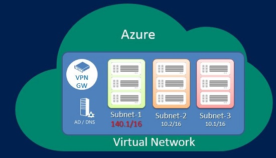
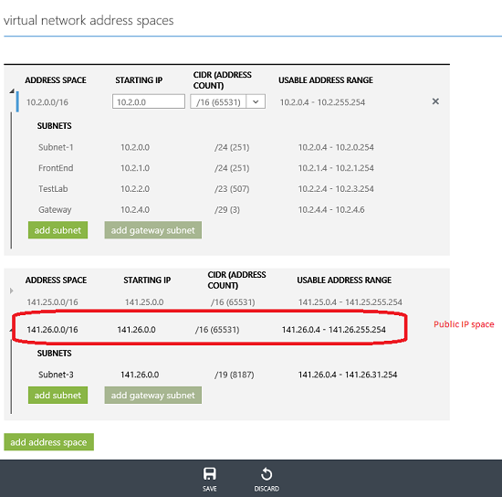

<properties 
   pageTitle="How to use public IP addresses in a virtual network"
   description="Learn how to configure a virtual network to use public IP addresses"
   services="virtual-network"
   documentationCenter="na"
   authors="telmosampaio"
   manager="carolz"
   editor="tysonn" />
<tags 
   ms.service="virtual-network"
   ms.devlang="na"
   ms.topic="article"
   ms.tgt_pltfrm="na"
   ms.workload="infrastructure-services"
   ms.date="06/08/2015"
   ms.author="telmos" />

# Public IP address space in a Virtual Network (VNet)

You can now add public IP address space to your VNets. Previously, you could only add RFC 1918 address blocks (private space) to your VNets. When you add a public IP address range, it will be treated as part of the private VNet IP address space that is only reachable within the VNet, interconnected VNets, and from your on-premises location.

Adding a public IP address space works conceptually like this:

## How do I add a public IP address range?

You add a public IP address range the same way you would add a private IP address range; by either using a *netcfg* file, or making the configuration in the portal. You can add a public IP address range when you create your VNet, or you can go back and add it afterward. The example below shows both public and private IP address space configured in the same virtual network.

## Are there any limitations?

There are a few IP address ranges that are not allowed:

- 224.0.0.0/4 (Multicast)

- 255.255.255.255/32 (Broadcast)

- 127.0.0.0/8 (loopback)

- 169.254.0.0/16 (link-local)

- 68.63.129.16/32 (Internal DNS)

## Next Steps

[How to manage Virtual Network (VNet) Properties](../virtual-networks-settings)

[How to manage DNS servers used by a virtual network (VNet)](../virtual-networks-manage-dns-in-vnet)

[How to delete a Virtual Network (VNet)](../virtual-networks-delete-vnet) 