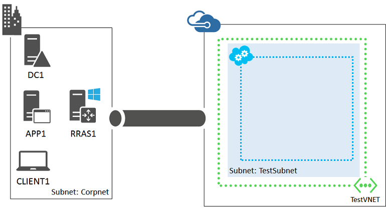

<properties 
	pageTitle="Hybrid cloud test environment | Microsoft Azure" 
	description="Learn how to create a hybrid cloud environment for IT pro or development testing, complete with a simplfied on-premises network." 
	services="virtual-network" 
	documentationCenter="" 
	authors="JoeDavies-MSFT" 
	manager="timlt" 
	editor=""
	tags="azure-service-management"/>

<tags 
	ms.service="virtual-network" 
	ms.workload="infrastructure-services" 
	ms.tgt_pltfrm="na" 
	ms.devlang="na" 
	ms.topic="article" 
	ms.date="07/08/2015" 
	ms.author="josephd"/>

# Set up a hybrid cloud environment for testing

This topic steps you through creating a hybrid cloud environment with Microsoft Azure for testing. Here is the resulting configuration.

This simulates a real hybrid production environment from your location on the Internet. It consists of:

-  A simplified on-premises network (the Corpnet subnet).
-  A cross-premises virtual network hosted in Azure (TestVNET).
-  A site-to-site VPN connection.
-  A secondary domain controller in the TestVNET virtual network.

This configuration provides a basis and common starting point from which you can:

-  Develop and test applications in a hybrid cloud environment.
-  Create test configurations of computers, some on the Corpnet subnet and some within the TestVNET virtual network, for hybrid cloud-based IT workloads.

There are five major phases to setting up this hybrid cloud test environment:

1.	Configure the computers on the Corpnet subnet.
2.	Configure RRAS1.
3.	Create the cross-premises Azure virtual network.
4.	Create the site-to-site VPN connection.
5.	Configure DC2. 

If you don't already have an Azure subscription, you can sign up for a free trial at [Try Azure](http://azure.microsoft.com/pricing/free-trial/). If you have an MSDN Subscription, see [Azure benefit for MSDN subscribers](http://azure.microsoft.com/pricing/member-offers/msdn-benefits-details/).

>[AZURE.NOTE] Virtual machines and virtual network gateways in Azure incur an ongoing monetary cost when they are running. This cost is billed against your free trial, MSDN subscription, or paid subscription. To reduce the costs of running this test environment when you are not using it, see [Minimizing the ongoing costs of this environment](#costs) in this topic for more information.

This configuration requires a test subnet of up to four computers connected directly to the Internet using a public IP address. If you don't have these resources, you can also [Set up a simulated hybrid cloud environment for testing](virtual-networks-setup-simulated-hybrid-cloud-environment-testing.md). The simulated hybrid cloud test environment requires only an Azure subscription.

## Phase 1: Configure the computers on the Corpnet subnet

Use the instructions in the "Steps for Configuring the Corpnet Subnet" section of the [Test Lab Guide: Base Configuration for Windows Server 2012 R2](http://www.microsoft.com/download/details.aspx?id=39638) to configure the DC1, APP1, and CLIENT1 computers on a subnet named Corpnet. **This subnet must be isolated from your organization network because it will be connected directly to the Internet through the RRAS1 computer.** 

Next, log on to DC1 with the CORP\User1 credentials. To configure the CORP domain so that computers and users use their local domain controller for authentication, run these commands from an administrator-level Windows PowerShell command prompt.

	New-ADReplicationSite -Name "TestLab" 
	New-ADReplicationSite -Name "TestVNET"
	New-ADReplicationSubnet –Name "10.0.0.0/8" –Site "TestLab"
	New-ADReplicationSubnet –Name "192.168.0.0/16" –Site "TestVNET

This is your current configuration.

 
## Phase 2: Configure RRAS1

RRAS1 provides traffic routing and VPN device services between the computers on the Corpnet subnet and the TestVNET virtual network. RRAS1 must have two network adapters installed.

First, install the operating system on RRAS1.

1.	Start the installation of Windows Server 2012 R2.
2.	Follow the instructions to complete the installation, specifying a strong password for the local administrator account. Log on using the local administrator account.
3.	Connect RRAS1 to a network that has Internet access and run Windows Update to install the latest updates for Windows Server 2012 R2.
4.	Connect one network adapter to the Corpnet subnet and the other directly to the Internet. RRAS1 can be located behind an Internet firewall but must not be behind a network address translator (NAT).

Next, configure the TCP/IP properties of RRAS1. You will need a public IP address configuration, including an address, subnet mask (or prefix length), and the default gateway and DNS servers of your Internet service provider (ISP).

Use these commands at an administrator-level Windows PowerShell command prompt on RRAS1. Prior to running these commands, fill in the variable values and remove the < and > characters. You can get the current names of the network adapters from the display of the **Get-NetAdapter** command.

	$corpnetAdapterName="<Name of the adapter attached to the Corpnet subnet>"
	$internetAdapterName="<Name of the adapter attached to the Internet>"
	[Ipaddress]$publicIP="<Your public IP address>"
	$publicIPpreflength=<Prefix length of your public IP address>
	[IPAddress]$publicDG="<Your ISP default gateway>"
	[IPAddress]$publicDNS="<Your ISP DNS server(s)>"
	Rename-NetAdapter –Name $corpnetAdapterName –NewName Corpnet
	Rename-NetAdapter –Name $internetAdapterName –NewName Internet
	New-NetIPAddress -InterfaceAlias "Internet" -IPAddress $publicIP -PrefixLength $publicIPpreflength –DefaultGateway $publicDG
	Set-DnsClientServerAddress -InterfaceAlias Internet -ServerAddresses $publicDNS
	New-NetIPAddress -InterfaceAlias "Corpnet" -IPAddress 10.0.0.2 -AddressFamily IPv4 -PrefixLength 24
	Set-DnsClientServerAddress -InterfaceAlias "Corpnet" -ServerAddresses 10.0.0.1
	Set-DnsClient -InterfaceAlias "Corpnet" -ConnectionSpecificSuffix corp.contoso.com
	New-NetFirewallRule –DisplayName “Allow ICMPv4-In” –Protocol ICMPv4
	New-NetFirewallRule –DisplayName “Allow ICMPv4-Out” –Protocol ICMPv4 –Direction Outbound
	Disable-NetAdapterBinding -Name "Internet" -ComponentID ms_msclient
	Disable-NetAdapterBinding -Name "Internet" -ComponentID ms_server
	ping dc1.corp.contoso.com

For the last command, verify that there are four responses from the IP address 10.0.0.1.

This is your current configuration.

## Phase 3: Create the cross-premises Azure Virtual Network

First, log on to the [Azure Management Portal](https://manage.windowsazure.com/) with your Azure subscription credentials and create a virtual network named TestVNET.

1.	In the task bar of the Azure Management Portal, click **New > Network Services > Virtual Network > Custom Create**.
2.	On the Virtual Network Details page, type **TestVNET** in **Name**.
3.	In **Location**, select the appropriate datacenter for your location.
4.	Click the Next arrow.
5.	On the DNS Servers and VPN Connectivity page, in **DNS servers**, type **DC1** in **Select or enter name**, type **10.0.0.1** in **IP address**, and then select **Configure a site-to-site VPN**.
6.	In **Local Network**, select **Specify a New Local Network**. 
7.	Click the Next arrow.
8.	On the Site-to-Site Connectivity page:
	- In **Name**, type **Corpnet**. 
	- In **VPN Device IP Address**, type the public IP address assigned to the Internet interface of RRAS1.
	- In **Address Space**, in the **Starting IP** column, type **10.0.0.0**. In **CIDR (Address Count)**, select **/8**, and then click **Add Address Space**.
9.	Click the Next arrow.
10.	On the Virtual Network Address Spaces page:
	- In **Address Space**, in **Starting IP**, select **192.168.0.0**.
	- In **Subnets**, click **Subnet-1** and replace the name with **TestSubnet**. 
	- In the **CIDR (Address Count)** column for the TestSubnet, click **/24 (256)**.
	- Click **Add Gateway Subnet**.
11.	Click the Complete icon. Wait until the virtual network is created before continuing.

Next, use the instructions in [How to install and configure Azure PowerShell](../install-configure-powershell.md) to install Azure PowerShell on your local computer.

Next, create a new cloud service for the TestVNET virtual network. You must pick a unique name. For example, you could name it TestVNET-*UniqueSequence*, in which *UniqueSequence* is an abbreviation of your organization. For example, if your organization is named Tailspin Toys, you could name the cloud service TestVNET-Tailspin.

You can test for the uniqueness of the name with the following Azure PowerShell command on your local computer.

	Test-AzureName -Service <Proposed cloud service name>

If this command returns "False", your proposed name is unique. Create the cloud service with this command.

	New-AzureService -Service <Unique cloud service name> -Location "<Same location name as your virtual network>"

Next, create a new storage account for the TestVNET virtual network. You must pick a unique name. You can test for the uniqueness of the storage account name with this command.

	Test-AzureName -Storage <Proposed storage account name>

If this command returns "False", your proposed name is unique. Create and set the storage account with these commands.

	New-AzureStorageAccount -StorageAccountName <Unique storage account name> -Location "<Same location name as your virtual network>"
	Set-AzureStorageAccount -StorageAccountName <Unique storage account name>

This is your current configuration.

 
## Phase 4: Create the site-to-site VPN connection

First, you create a virtual network gateway.

1.	In the Azure Management Portal on your local computer, click **Networks** in the left pane, and then verify that the **Status** column for TestVNET is set to **Created**.
2.	Click **TestVNET**. On the Dashboard page, you should see a status of **Gateway Not Created**.
3.	In the task bar, click **Create Gateway**, and then click **Dynamic Routing**. Click **Yes** when prompted. Wait until the gateway is complete and its status changes to **Connecting**. This could take a few minutes.
4.	From the Dashboard page, note the **Gateway IP Address**. This is the public IP address of the Azure VPN gateway for the TestVNET virtual network. You need this IP address to configure RRAS1.
5.	In the task bar, click **Manage Key**, and then click the copy icon next to the key to copy it to your clipboard. Paste this key into a document and save it. You need this key value to configure RRAS1. 

Next, configure RRAS1 with the Routing and Remote Access Service to act as the VPN device for the Corpnet subnet. Log on to RRAS1 as the local administrator and run these commands at a Windows PowerShell command prompt.

	Import-Module ServerManager
	Install-WindowsFeature RemoteAccess -IncludeManagementTools
	Add-WindowsFeature -name Routing -IncludeManagementTools

Next, configure RRAS1 to receive the site-to-site VPN connection from the Azure VPN gateway. Restart RRAS1, then log on as the local administrator and run these commands at a Windows PowerShell command prompt. You need to provide the IP address of the Azure VPN gateway and the key value.

	$PresharedKey="<Key value>"
	Import-Module RemoteAccess
	Install-RemoteAccess -VpnType VpnS2S
	Add-VpnS2SInterface -Protocol IKEv2 -AuthenticationMethod PSKOnly -Persistent -NumberOfTries 3 -ResponderAuthenticationMethod PSKOnly -Name S2StoTestVNET -Destination "<IP address of the Azure VPN gateway>" -IPv4Subnet @("192.168.0.0/24:100") -SharedSecret $PresharedKey
	Set-VpnServerIPsecConfiguration -EncryptionType MaximumEncryption
	Set-VpnServerIPsecConfiguration -SADataSizeForRenegotiationKilobytes 33553408
	New-ItemProperty -Path HKLM:\System\CurrentControlSet\Services\RemoteAccess\Parameters\IKEV2 -Name SkipConfigPayload -PropertyType DWord -Value 1
	Restart-Service RemoteAccess

Next, go to the Azure Management Portal on your local computer and wait until the TestVNET virtual network shows a status of **Connected**.

Next, configure RRAS1 to support translated traffic to Internet locations. On RRAS1:

1.	From the Start screen, type **rras**, and then click **Routing and Remote Access**. 
2.	In the console tree, open the server name, and then click **IPv4**.
3.	Right-click **General**, and then click **New Routing Protocol**.
4.	Click **NAT**, and then click **OK**.
5.	In the console tree, right-click **NAT**, click **New Interface**, click **Corpnet**, and then click **OK** twice.
6.	Right-click **NAT**, click **New Interface**, click **Internet**, and then click **OK**.
7.	On the **NAT** tab, click **Public interface connected to the Internet**, select **Enable NAT on this interface**, and then click **OK**.

Next, configure DC1, APP1, and CLIENT1 to use RRAS1 as its default gateway.
 
On DC1, run these commands at an administrator-level Windows PowerShell command prompt.

	New-NetRoute –DestinationPrefix "0.0.0.0/0" –InterfaceAlias "Ethernet" –NextHop 10.0.0.2
	Set-DhcpServerv4OptionValue –Router 10.0.0.2

If the name of the interface is not Ethernet, use the **Get-NetAdapter** command to determine the interface name.

On APP1, run this command at an administrator-level Windows PowerShell command prompt.

	New-NetRoute –DestinationPrefix "0.0.0.0/0" –InterfaceAlias "Ethernet" –NextHop 10.0.0.2

On CLIENT1, run this command at an administrator-level Windows PowerShell command prompt.

	ipconfig /renew

This is your current configuration.
 

## Phase 5: Configure DC2

First, create an Azure Virtual Machine for DC2 with these commands at the Azure PowerShell command prompt on your local computer.

	$ServiceName="<Your cloud service name from Phase 3>"
	$image = Get-AzureVMImage | where { $_.ImageFamily -eq "Windows Server 2012 R2 Datacenter" } | sort PublishedDate -Descending | select -ExpandProperty ImageName -First 1
	$vm1=New-AzureVMConfig -Name DC2 -InstanceSize Medium -ImageName $image
	$cred=Get-Credential –Message "Type the name and password of the local administrator account for DC2."
	$vm1 | Add-AzureProvisioningConfig -Windows -AdminUsername $cred.GetNetworkCredential().Username -Password $cred.GetNetworkCredential().Password 
	$vm1 | Add-AzureProvisioningConfig -Windows -AdminUsername $LocalAdminName -Password $LocalAdminPW	
	$vm1 | Set-AzureSubnet -SubnetNames TestSubnet
	$vm1 | Set-AzureStaticVNetIP -IPAddress 192.168.0.4
	$vm1 | Add-AzureDataDisk -CreateNew -DiskSizeInGB 20 -DiskLabel ADFiles –LUN 0 -HostCaching None
	New-AzureVM –ServiceName $ServiceName -VMs $vm1 -VNetName TestVNET

Next, log on to the new DC2 virtual machine.

1.	In the left pane of the Azure Management Portal, click **Virtual Machines**, and then click **Running** in the **Status** column for DC2.
2.	In the task bar, click **Connect**. 
3.	When prompted to open DC2.rdp, click **Open**.
4.	When prompted with a Remote Desktop Connection message box, click **Connect**.
5.	When prompted for credentials, use the following:
	- Name: **DC2\\**[Local administrator account name]
	- Password: [Local administrator account password]
6.	When prompted with a Remote Desktop Connection message box referring to certificates, click **Yes**.

Next, configure a Windows Firewall rule to allow traffic for basic connectivity testing. From an administrator-level Windows PowerShell command prompt on DC2, run:

	Set-NetFirewallRule -DisplayName "File and Printer Sharing (Echo Request - ICMPv4-In)" -enabled True
	ping dc1.corp.contoso.com

The ping command should result in four successful replies from IP address 10.0.0.1. This is a test of traffic across the site-to-site VPN connection.

Next, add an extra data disk as a new volume with the drive letter F:.

1.	In the left pane of Server Manager, click **File and Storage Services**, and then click **Disks**.
2.	In the contents pane, in the **Disks** group, click **disk 2** (with the **Partition** set to **Unknown**).
3.	Click **Tasks**, and then click **New Volume**.
4.	On the Before you begin page of the New Volume Wizard, click **Next**.
5.	On the Select the server and disk page, click **Disk 2**, and then click **Next**. When prompted, click **OK**.
6.	On the Specify the size of the volume page, click **Next**.
7.	On the Assign to a drive letter or folder page, click **Next**.
8.	On the Select file system settings page, click **Next**.
9.	On the Confirm selections page, click **Create**.
10.	When complete, click **Close**.

Next, configure DC2 as a replica domain controller for the corp.contoso.com domain. Run these commands from the Windows PowerShell command prompt on DC2.

	Install-WindowsFeature AD-Domain-Services -IncludeManagementTools
	Install-ADDSDomainController -Credential (Get-Credential CORP\User1) -DomainName "corp.contoso.com" -InstallDns:$true -DatabasePath "F:\NTDS" -LogPath "F:\Logs" -SysvolPath "F:\SYSVOL"

Note that you will be prompted to supply both the CORP\User1 password and a Directory Services Restore Mode (DSRM) password and to restart DC2.

Now that the TestVNET virtual network has its own DNS server (DC2), you must configure the TestVNET virtual network to use this DNS server.

1.	In the left pane of the Azure Management Portal, click **Networks**, and then click **TestVNET**.
2.	Click **Configure**.
3.	In **DNS Servers**, remove the **10.0.0.1** entry.
4.	In **DNS Servers**, add an entry with **DC2** as the name and **192.168.0.4** as the IP address. 
5.	In the command bar at the bottom, click **Save**.
6.	In the left pane of the Azure Management Portal, click **Virtual Machines**, and then click the **Status** column next to DC2.
7.	In the command bar, click **Restart**. Wait for DC2 to restart.

This is your current configuration.

 
Your hybrid cloud environment is now ready for testing.

## Additional resources

[Set up a SharePoint intranet farm in a hybrid cloud for testing](virtual-networks-setup-sharepoint-hybrid-cloud-testing.md)

[Set up a web-based LOB application in a hybrid cloud for testing](virtual-networks-setup-lobapp-hybrid-cloud-testing.md)

[Set up Office 365 Directory Synchronization (DirSync) in a hybrid cloud for testing](virtual-networks-setup-dirsync-hybrid-cloud-testing.md)

[Set up a simulated hybrid cloud environment for testing](virtual-networks-setup-simulated-hybrid-cloud-environment-testing.md)

[Azure hybrid cloud test environments](../virtual-machines/virtual-machines-hybrid-cloud-test-environments.md)

[Azure infrastructure services implementation guidelines](../virtual-machines/virtual-machines-infrastructure-services-implementation-guidelines.md)

## Minimizing the ongoing costs of this environment

To minimize the costs of running the virtual machines in this environment, perform your needed testing and demonstration as quickly as possible and then delete them or shut down the virtual machines when you are not using them. For example, you could use Azure automation and a runbook to automatically shut down the virtual machines in the Test_VNET virtual network at the end of each business day. For more information, see [Get started with Azure Automation](../automation-create-runbook-from-samples.md). 

The Azure VPN gateway is implemented as a set of two Azure virtual machines that incur an ongoing monetary cost. For the details, see [Pricing - Virtual Network](http://azure.microsoft.com/pricing/details/virtual-network/). To minimize the costs of the VPN gateway, create the test environment and perform your needed testing and demonstration as quickly as possible or delete the gateway with these steps. 

1.	From the Azure Management Portal on your local computer, click **Networks** in the left pane, click **TestVNET**, and then click **Dashboard**.
2.	In the task bar, click **Delete Gateway**. Click **Yes** when prompted. Wait until the gateway is deleted and its status changes to **The Gateway Was Not Created**.

If you delete the gateway and you want to restore the test environment, you must first create a new gateway.

1.	From the Azure Management Portal on your local computer, click **Networks** in the left pane, and then click **TestVNET**. On the Dashboard page, you should see a status of **The Gateway Was Not Created**.
2.	In the task bar, click **Create Gateway**, and then click **Dynamic Routing**. Click **Yes** when prompted. Wait until the gateway is complete and its status changes to **Connecting**. This could take a few minutes.
3.	From the Dashboard page, note the **Gateway IP Address**. This is the new public IP address of the Azure VPN gateway for the TestVNET virtual network. You need this IP address to re-configure RRAS1.
4.	In the task bar, click **Manage Key**, and then click the copy icon next to the key to copy it to your clipboard. Paste this key value into a document and save it. You need this key value to re-configure RRAS1. 

Next, log on to RRAS1 as the local administrator and run these commands at an administrator-level Windows PowerShell command prompt to reconfigure RRAS1 with the new public IP address and preshared key.

	$PresharedKey="<Key value>"
	Set-VpnS2SInterface -Name S2StoTestVNET -Destination "<IP address of the Azure VPN gateway>" -SharedSecret $PresharedKey

Next, go to the Azure Management Portal on your local computer and wait until the TestVNET virtual network shows a connected status.
 