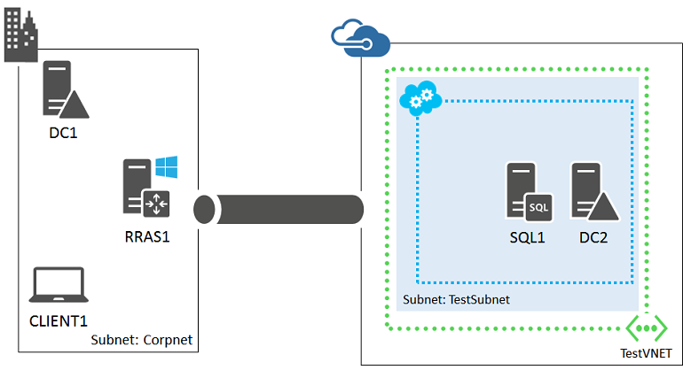

<properties 
	pageTitle="SharePoint 2013 farm test environment | Microsoft Azure" 
	description="Learn how to create a two-tier SharePoint Server 2013 intranet farm in a hybrid cloud environment for development or IT pro testing." 
	services="virtual-network" 
	documentationCenter="" 
	authors="JoeDavies-MSFT" 
	manager="timlt" 
	editor=""
	tags="azure-service-management"/>

<tags 
	ms.service="virtual-network" 
	ms.workload="infrastructure-services" 
	ms.tgt_pltfrm="na" 
	ms.devlang="na" 
	ms.topic="article" 
	ms.date="07/08/2015" 
	ms.author="josephd"/>

# Set up a SharePoint intranet farm in a hybrid cloud for testing

This topic steps you through creating a hybrid cloud environment for testing an intranet SharePoint farm hosted in Microsoft Azure. Here is the resulting configuration.

 
This configuration simulates a SharePoint in Azure production environment from your location on the Internet. It consists of:

- A simplified on-premises network (the Corpnet subnet).
- A cross-premises virtual network hosted in Microsoft Azure (TestVNET).
- A site-to-site VPN connection.
- A two-tier SharePoint farm and secondary domain controller in the TestVNET virtual network.

This configuration provides a basis and common starting point from which you can:

- Develop and test applications on a SharePoint intranet farm in a hybrid cloud environment.
- Perform testing of this hybrid cloud-based IT workload.

There are three major phases to setting up this hybrid cloud test environment:

1.	Set up the hybrid cloud environment for testing.
2.	Configure the SQL server computer (SQL1).
3.	Configure the SharePoint server (SP1).

If you do not already have an Azure subscription, you can sign up for a free trial at [Try Azure](http://azure.microsoft.com/pricing/free-trial/). If you have an MSDN Subscription, see [Azure benefit for MSDN subscribers](http://azure.microsoft.com/pricing/member-offers/msdn-benefits-details/).

## Phase 1: Set up the hybrid cloud environment

Use the instructions in the [Set up a hybrid cloud environment for testing](virtual-networks-setup-hybrid-cloud-environment-testing.md) topic. Because this test environment does not require the presence of the APP1 server on the Corpnet subnet, feel free to shut it down for now.

This is your current configuration.

> [AZURE.NOTE] For Phase 1, you can also set up the simulated hybrid cloud test environment. See [Set up a simulated hybrid cloud environment for testing](virtual-networks-setup-simulated-hybrid-cloud-environment-testing.md) for the instructions.
 
## Phase 2: Configure the SQL server computer (SQL1)

From the Azure Management Portal, start the DC2 computer if needed.

First, create a remote desktop connection to DC2 using the CORP\User1 credentials.

Next, create a SharePoint farm administrator account. Open an administrator-level Windows PowerShell prompt on DC2 and run this command.

	New-ADUser -SamAccountName SPFarmAdmin -AccountPassword (read-host "Set user password" -assecurestring) -name "SPFarmAdmin" -enabled $true -ChangePasswordAtLogon $false

When prompted to supply the SPFarmAdmin account password, type a strong password and record it in a secure location.

Next, create an Azure Virtual Machine for SQL1 with these commands at the Azure PowerShell command prompt on your local computer.

	$storageacct="<Name of the storage account for your TestVNET virtual network>"
	$ServiceName="<The cloud service name for your TestVNET virtual network>"
	$cred1=Get-Credential –Message "Type the name and password of the local administrator account for SQL1."
	$cred2=Get-Credential –UserName "CORP\User1" –Message "Now type the password for the CORP\User1 account."
	Set-AzureStorageAccount –StorageAccountName $storageacct
	$image= Get-AzureVMImage | where { $_.ImageFamily -eq "SQL Server 2014 RTM Standard on Windows Server 2012 R2" } | sort PublishedDate -Descending | select -ExpandProperty ImageName -First 1
	$vm1=New-AzureVMConfig -Name SQL1 -InstanceSize Large -ImageName $image
	$vm1 | Add-AzureProvisioningConfig -AdminUsername $cred1.GetNetworkCredential().Username -Password $cred1.GetNetworkCredential().Password -WindowsDomain -Domain "CORP" -DomainUserName "User1" -DomainPassword $cred2.GetNetworkCredential().Password -JoinDomain "corp.contoso.com"
	$vm1 | Set-AzureSubnet -SubnetNames TestSubnet
	$vm1 | Add-AzureDataDisk -CreateNew -DiskSizeInGB 100 -DiskLabel SQLFiles –LUN 0 -HostCaching None
	New-AzureVM –ServiceName $ServiceName -VMs $vm1 -VNetName TestVNET

Next, connect to the new SQL1 virtual machine *using the local administrator account*.

1.	In the left pane of the Azure Management Portal, click **Virtual Machines**, and then click **Running** in the Status column for SQL1.
2.	In the task bar, click **Connect**. 
3.	When prompted to open SQL1.rdp, click **Open**.
4.	When prompted with a Remote Desktop Connection message box, click **Connect**.
5.	When prompted for credentials, use these:
	- Name: **SQL1\\**[Local administrator account name]
	- Password: [Local administrator account password]
6.	When prompted with a Remote Desktop Connection message box referring to certificates, click **Yes**.

Next, configure Windows Firewall rules to allow traffic for basic connectivity testing and SQL Server. From an administrator-level Windows PowerShell command prompt on SQL1, run these commands.

	New-NetFirewallRule -DisplayName "SQL Server" -Direction Inbound –Protocol TCP –LocalPort 1433,1434,5022 -Action allow 
	Set-NetFirewallRule -DisplayName "File and Printer Sharing (Echo Request - ICMPv4-In)" -enabled True
	ping dc1.corp.contoso.com

The ping command should result in four successful replies from IP address 10.0.0.1.

Next, add the extra data disk as a new volume with the drive letter F:.

1.	In the left pane of Server Manager, click **File and Storage Services**, and then click **Disks**.
2.	In the contents pane, in the **Disks** group, click **disk 2** (with the **Partition** set to **Unknown**).
3.	Click **Tasks**, and then click **New Volume**.
4.	On the Before you begin page of the New Volume Wizard, click **Next**.
5.	On the Select the server and disk page, click **Disk 2**, and then click **Next**. When prompted, click **OK**.
6.	On the Specify the size of the volume page, click **Next**.
7.	On the Assign to a drive letter or folder page, click **Next**.
8.	On the Select file system settings page, click **Next**.
9.	On the Confirm selections page, click **Create**.
10.	When complete, click **Close**.

Run these commands at the Windows PowerShell command prompt on SQL1:

	md f:\Data
	md f:\Log
	md f:\Backup

Next, configure SQL Server 2014 to use the F: drive for new databases and for user account permissions.

1.	From the Start screen, type **SQL Server Management**, and then click **SQL Server 2014 Management Studio**.
2.	In **Connect to Server**, click **Connect**.
3.	In the Object Explorer tree pane, right-click **SQL1**, and then click **Properties**.
4.	In the **Server Properties** window, click **Database Settings**.
5.	Locate the **Database default locations** and set these values: 
	- For **Data**, type the path **f:\Data**.
	- For **Log**, type the path **f:\Log**.
	- For **Backup**, type the path **f:\Backup**.
	- Note that only new databases use these locations.
6.	Click the **OK** to close the window.
7.	In the **Object Explorer** tree pane, open **Security**.
8.	Right-click **Logins** and then click **New Login**.
9.	In **Login name**, type **CORP\User1**.
10.	On the **Server Roles** page, click **sysadmin**, and then click **OK**.
11.	In the **Object Explorer** tree pane, right-click **Logins**, and then click **New Login**.
12.	On the **General** page, in **Login name**, type **CORP\SPFarmAdmin**.
13.	On the **Server Roles** page, select **dbcreator**, and then click **OK**.
14.	Close Microsoft SQL Server Management Studio.

This is your current configuration.

 
## Phase 3: Configure the SharePoint server (SP1)

First, create an Azure Virtual Machine for SP1 with these commands at the Azure PowerShell command prompt on your local computer.

	$ServiceName="<The cloud service name for your TestVNET virtual network>"
	$cred1=Get-Credential –Message "Type the name and password of the local administrator account for SP1."
	$cred2=Get-Credential –UserName "CORP\User1" –Message "Now type the password for the CORP\User1 account."
	$image= Get-AzureVMImage | where { $_.Label -eq "SharePoint Server 2013 Trial" } | sort PublishedDate -Descending | select -ExpandProperty ImageName -First 1
	$vm1=New-AzureVMConfig -Name SP1 -InstanceSize Large -ImageName $image
	$vm1 | Add-AzureProvisioningConfig -AdminUsername $cred1.GetNetworkCredential().Username -Password $cred1.GetNetworkCredential().Password -WindowsDomain -Domain "CORP" -DomainUserName "User1" -DomainPassword $cred2.GetNetworkCredential().Password -JoinDomain "corp.contoso.com"
	$vm1 | Set-AzureSubnet -SubnetNames TestSubnet
	New-AzureVM –ServiceName $ServiceName -VMs $vm1 -VNetName TestVNET

Next, connect to the SP1 virtual machine with the CORP\User1 credentials.

Next, configure a Windows Firewall rule to allow traffic for basic connectivity testing. From an administrator-level Windows PowerShell command prompt on SP1, run these commands.

	Set-NetFirewallRule -DisplayName "File and Printer Sharing (Echo Request - ICMPv4-In)" -enabled True
	ping dc1.corp.contoso.com

The ping command should result in four successful replies from IP address 10.0.0.1.

Next, configure SP1 for a new SharePoint farm and a default team site.

1.	From the Start screen, type **SharePoint 2013 Products**, and then click **SharePoint 2013 Products Configuration Wizard**. When asked to allow the program to make changes to the computer, click **Yes**.
2.	On the Welcome to SharePoint Products page, click **Next**. 
3.	In the dialog box that notifies you that some services might need to be restarted during configuration, click **Yes**.
4.	On the Connect to a server farm page, click **Create a new server farm**, and then click **Next**.
5.	On the Specify Configuration Database Settings page, type **sql1.corp.contoso.com** in **Database server**, type **CORP\SPFarmAdmin** in **User name**, type the SPFarmAdmin account password in **Password**, and then click **Next**.
6.	On the Specify Farm Security Settings page, type **P@ssphrase** in both **Passphrase** and **Confirm passphrase**, and then click **Next**.
7.	On the Configure SharePoint Central Administration Web Application page, click **Next**.
8.	On the Completing the SharePoint Products Configuration Wizard page, click **Next**. The SharePoint Products Configuration Wizard might take a few minutes to complete.
9.	On the Configuration Successful page, click **Finish**. After completion, Internet Explorer launches with a tab named Initial Farm Configuration Wizard.
10.	In the **Help Make SharePoint Better** dialog box, click **No, I don’t wish to participate**, and then click **OK**.
11.	For **How do you want to configure your SharePoint farm?**, click **Start the Wizard**.
12.	On the Configure your SharePoint farm page, in **Service account**, click **Use existing managed account**.
13.	In **Services**, clear all the check boxes except the box next to **State Service**, and then click **Next**. The Working on it page might display for a while before it completes.
14.	On the Create Site Collection page, in **Title and description**, type **Contoso Corporation** in **Title**, specify the URL **http://sp1**/, and then click **OK**. The Working on it page might display for a while before it completes. This step creates a team site at the URL http://sp1.
15.	On the This completes the Farm Configuration Wizard page, click **Finish**. The Internet Explorer tab shows the SharePoint 2013 Central Administration site.
16.	Log on to the CLIENT1 computer with the CORP\User1 account credentials, and then start Internet Explorer.
17.	In the Address bar, type **http://sp1/** and then press ENTER. You should see the SharePoint team site for the Contoso Corporation. The site might take a while to render.

This is your current configuration.

 
Your SharePoint intranet farm in a hybrid cloud environment is now ready for testing.

## Additional resources

[SharePoint on Azure Infrastructure Services](http://msdn.microsoft.com/library/azure/dn275955.aspx)

[SharePoint Server Farm](../virtual-machines/virtual-machines-sharepoint-farm-azure-preview.md)

[Set up a hybrid cloud environment for testing](virtual-networks-setup-hybrid-cloud-environment-testing.md)

[Set up a web-based LOB application in a hybrid cloud for testing](virtual-networks-setup-lobapp-hybrid-cloud-testing.md)

[Set up Office 365 Directory Synchronization (DirSync) in a hybrid cloud for testing](virtual-networks-setup-dirsync-hybrid-cloud-testing.md)

[Set up a simulated hybrid cloud environment for testing](virtual-networks-setup-simulated-hybrid-cloud-environment-testing.md)

[Azure hybrid cloud test environments](../virtual-machines/virtual-machines-hybrid-cloud-test-environments.md)

[Azure infrastructure services implementation guidelines](../virtual-machines/virtual-machines-infrastructure-services-implementation-guidelines.md)
 