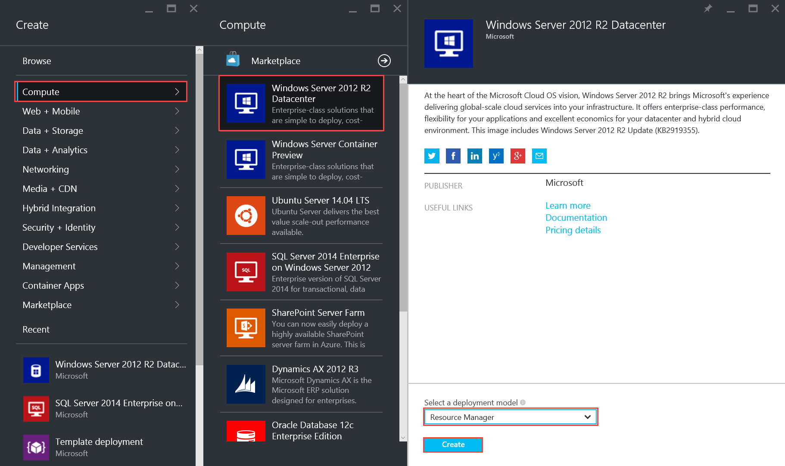
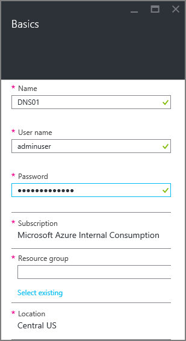
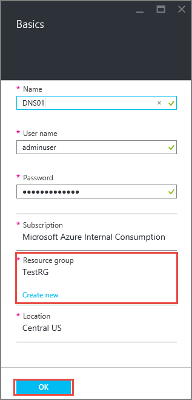
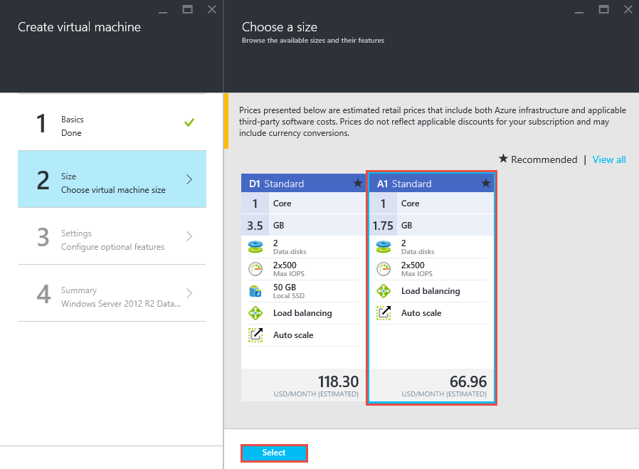
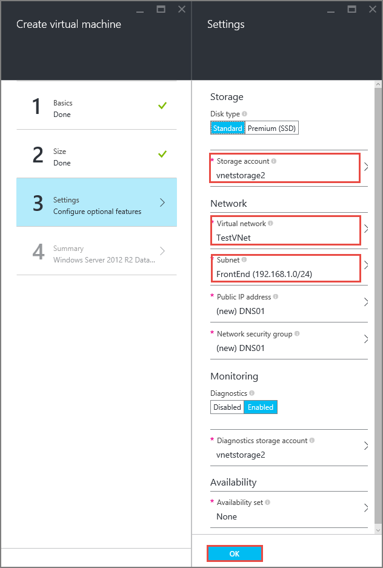
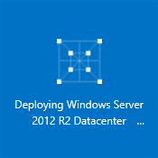
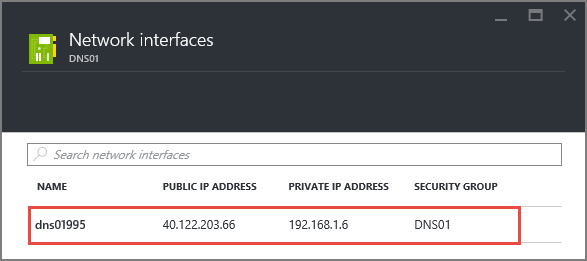
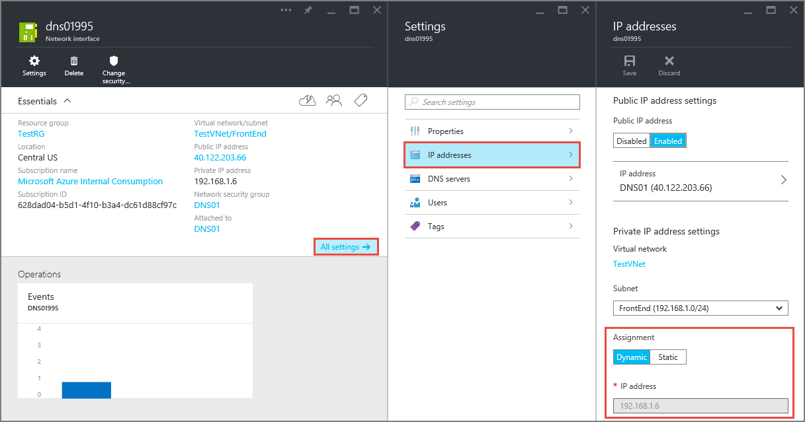
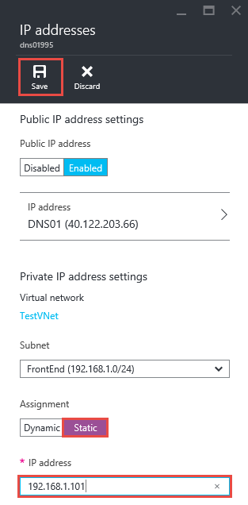

# Configure private IP addresses for a virtual machine using the Azure portal

> [!div class="op_single_selector"]
> * [Azure portal](virtual-networks-static-private-ip-arm-pportal.md)
> * [PowerShell](virtual-networks-static-private-ip-arm-ps.md)
> * [Azure CLI](virtual-networks-static-private-ip-arm-cli.md)
> * [Azure portal (Classic)](virtual-networks-static-private-ip-classic-pportal.md)
> * [PowerShell (Classic)](virtual-networks-static-private-ip-classic-ps.md)
> * [Azure CLI (Classic)](virtual-networks-static-private-ip-classic-cli.md)

[!INCLUDE [virtual-networks-static-private-ip-intro-include](../../includes/virtual-networks-static-private-ip-intro-include.md)]

[!INCLUDE [azure-arm-classic-important-include](../../includes/azure-arm-classic-important-include.md)]

This article covers the Resource Manager deployment model. You can also [manage static private IP address in the classic deployment model](virtual-networks-static-private-ip-classic-pportal.md).

[!INCLUDE [virtual-networks-static-ip-scenario-include](../../includes/virtual-networks-static-ip-scenario-include.md)]

The following sample steps expect a simple environment already created. If you want to run the steps as they are displayed in this document, first build the test environment described in [Create a virtual network](quick-create-portal.md).

## How to create a VM for testing static private IP addresses
You cannot set a static private IP address during the creation of a VM in the Resource Manager deployment mode by using the Azure portal. You must create the VM first, then set its private IP to be static.

To create a VM named *DNS01* in the *FrontEnd* subnet of a VNet named *TestVNet*, follow these steps:

1. From a browser, navigate to https://portal.azure.com and, if necessary, sign in with your Azure account.
2. Click **Create a resource** > **Compute** > **Windows Server 2012 R2 Datacenter**, notice that the **Select a deployment model** list already shows **Resource Manager**, and then click **Create**, as seen in the following figure.
   
    
3. In the **Basics** pane, enter the name of the VM to create (*DNS01* in the scenario), the local administrator account, and password, as seen in the following figure.
   
    
4. Make sure the **Location** selected is *Central US*, then click **Select existing** under **Resource group**, then click **Resource group** again, then click *TestRG*, and then click **OK**.
   
    
5. In the **Choose a size** pane, select **A1 Standard**, and then click **Select**.
   
        
6. In the **Settings** pane, be sure the properties are set with the following values, and then click **OK**.
   
    -**Storage account**: *vnetstorage*
   
   * **Network**: *TestVNet*
   * **Subnet**: *FrontEnd*
     
          
7. In the **Summary** pane, click **OK**. Notice the following tile displayed in your dashboard.
   
    

It’s recommended that you do not statically assign the private IP assigned to the Azure virtual machine within the operating system of a VM, unless necessary, such as when [assigning multiple IP addresses to a Windows VM](virtual-network-multiple-ip-addresses-portal.md). If you do manually set the private IP address within the operating system, ensure that it is the same address as the private IP address assigned to the Azure [network interface](virtual-network-network-interface-addresses.md#change-ip-address-settings), or you can lose connectivity to the virtual machine. Learn more about [private IP address](virtual-network-network-interface-addresses.md#private) settings. You should never manually assign the public IP address assigned to an Azure virtual machine within the virtual machine's operating system.

## How to retrieve static private IP address information for a VM
To view the static private IP address information for the VM created with the steps above, execute the following steps.

1. From the Azure portal, click **BROWSE ALL** > **Virtual machines** > **DNS01** > **All settings** > **Network interfaces** and then click on the only network interface listed.
   
    
2. In the **Network interface** pane, click **All settings** > **IP addresses** and notice the **Assignment** and **IP address** values.
   
    

## How to add a static private IP address to an existing VM
To add a static private IP address to the VM created using the steps above, follow these steps:

1. From the **IP addresses** pane shown above, click **Static** under **Assignment**.
2. Type *192.168.1.101* for **IP address**, and then click **Save**.
   
    

> [!NOTE]
> If after clicking **Save**, you notice that the assignment is still set to **Dynamic**, it means the IP address you typed is already in use. Try a different IP address.
> 
> 

It’s recommended that you do not statically assign the private IP assigned to the Azure virtual machine within the operating system of a VM, unless necessary, such as when [assigning multiple IP addresses to a Windows VM](virtual-network-multiple-ip-addresses-portal.md). If you do manually set the private IP address within the operating system, ensure that it is the same address as the private IP address assigned to the Azure [network interface](virtual-network-network-interface-addresses.md#change-ip-address-settings), or you can lose connectivity to the virtual machine. Learn more about [private IP address](virtual-network-network-interface-addresses.md#private) settings. You should never manually assign the public IP address assigned to an Azure virtual machine within the virtual machine's operating system.

## How to remove a static private IP address from a VM
To remove the static private IP address from the VM created above, complete the following step:

From the **IP addresses** pane shown above, click **Dynamic** under **Assignment**, and then click **Save**.

## Set IP addresses within the operating system

It’s recommended that you do not statically assign the private IP assigned to the Azure virtual machine within the operating system of a VM, unless necessary, such as when [assigning multiple IP addresses to a Windows VM](virtual-network-multiple-ip-addresses-portal.md). If you do manually set the private IP address within the operating system, ensure that it is the same address as the private IP address assigned to the Azure [network interface](virtual-network-network-interface-addresses.md#change-ip-address-settings), or you can lose connectivity to the virtual machine. Learn more about [private IP address](virtual-network-network-interface-addresses.md#private) settings. You should never manually assign the public IP address assigned to an Azure virtual machine within the virtual machine's operating system.

## Next steps

Learn about managing [IP address settings](virtual-network-network-interface-addresses.md).

