# Configure a private IP address for a VM using the Azure portal

[!INCLUDE [virtual-networks-static-private-ip-intro-include](../../includes/virtual-networks-static-private-ip-intro-include.md)]

[!INCLUDE [virtual-networks-static-ip-scenario-include](../../includes/virtual-networks-static-ip-scenario-include.md)]

The following sample steps expect a simple environment to already be created. If you want to run the steps as they're displayed in this document, first [create a virtual network](quick-create-portal.md#create-a-virtual-network). However, in step 3, use these values instead:

| Setting | Value |
| ------- | ----- |
| Name | *TestVNet* |
| Address space | *192.168.0.0/16* |
| Resource group | **TestRG** (if necessary, select **Create new** to create it) |
| Subnet - Name | *FrontEnd* |
| Subnet - Address range | *192.168.1.0/24* |

## Create a VM for testing static private IP addresses
When you create a VM in Resource Manager deployment mode, you can't set a static private IP address using the Azure portal. Instead, you create the VM first. Then you can set its private IP to be static.

To create a VM named *DNS01* in the *FrontEnd* subnet of a virtual network named *TestVNet*, follow these steps:

1. From the [Azure portal](https://portal.azure.com) menu, select **Create a resource**.

    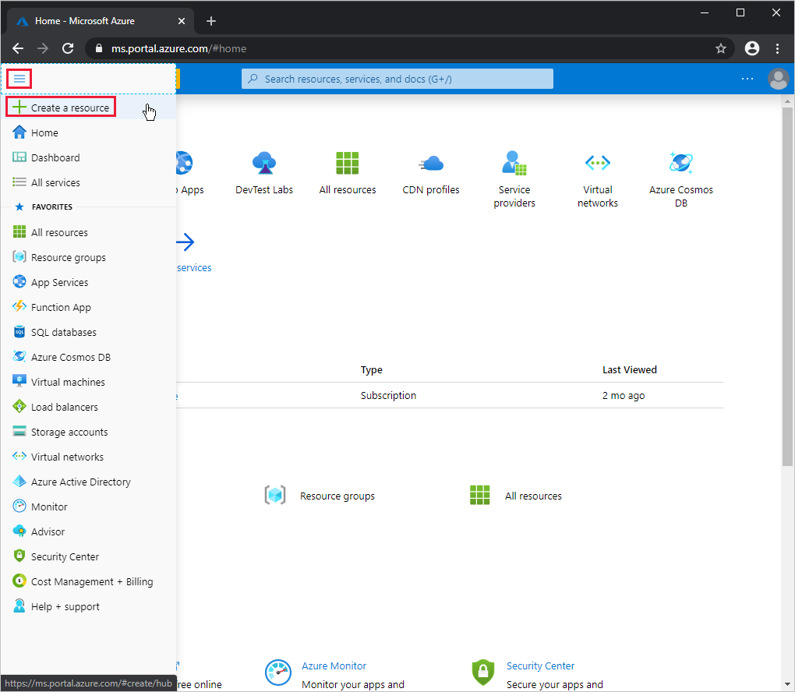
2. Select **Compute** > **Virtual machine**.

    
3. In **Basics**, specify values for items as described in the following table. Then select **Next&nbsp;:&nbsp;Disks** and then **Next&nbsp;:&nbsp;Networking**.

    | Item | Value |
    | --- | --- |
    | **Subscription** | Your current subscription |
    | **Resource group** | **TestRG** (select from dropdown list) |
    | **Virtual machine name** | *DNS01* |
    | **Region** | **(US) East US** |
    | **Image** | **Windows Server 2019 Datacenter** |
    | **Size** | **VM Size** of **B1ls**, **Offering** of **Standard** |
    | **Username** | The user name of your administrator account |
    | **Password** | The password for your administrator account's user name |
    | **Confirm password** | The password again |

    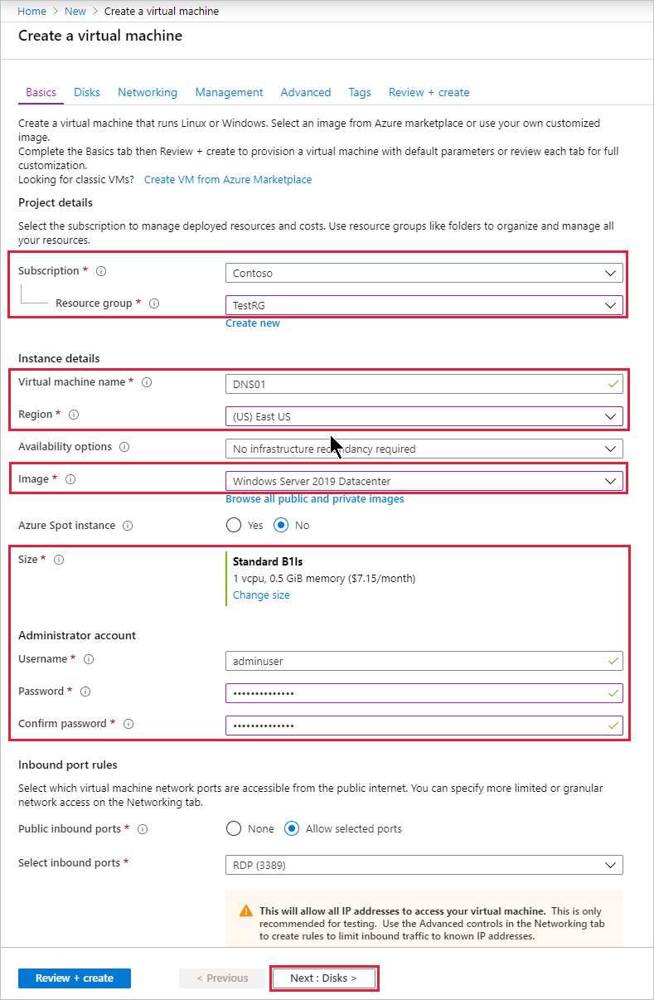
4. In **Networking**, specify values for items as described in the following table, and then select **Next**.

    | Item | Value |
    | --- | --- |
    | **Virtual network** | **TestVNet** |
    | **Subnet** | **FrontEnd** |

    
5. In **Management**, under **Diagnostics storage account**, choose **vnetstorage**. If that storage account doesn't appear in the list, select **Create new**, specify a **Name** of *vnetstorage*, and select **OK**. Finally, select **Review&nbsp;+&nbsp;create**.

    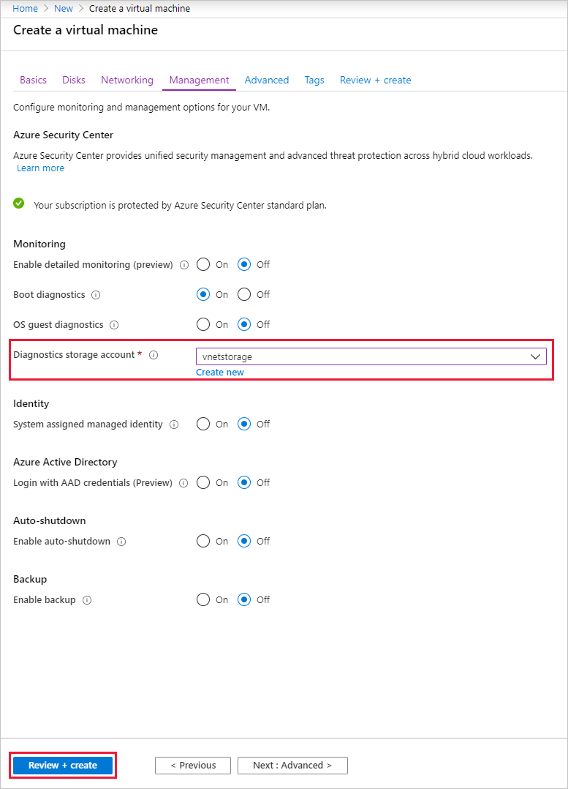
6. In **Review + create**, review the overview information, and then select **Create**.

    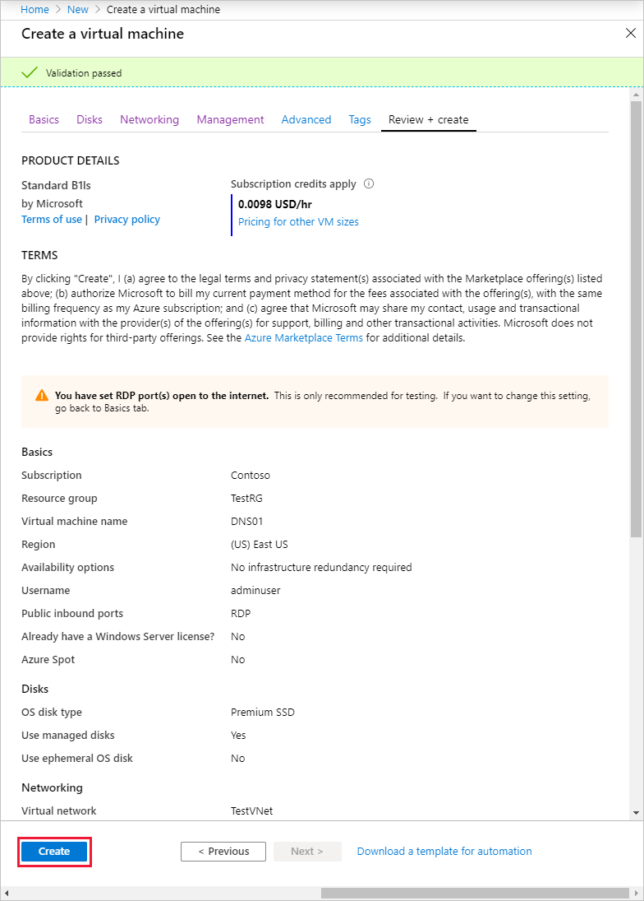

The following message appears once the VM is created.

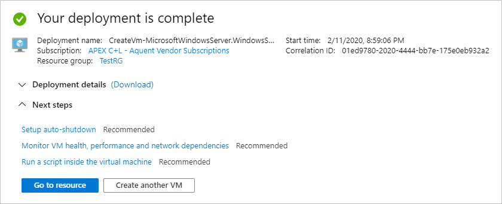

## Retrieve private IP address information for a VM
To view the private IP address information for your new VM:

1. Go to the [Azure portal](https://portal.azure.com) to find your VM. Search for and select **Virtual machines**.

    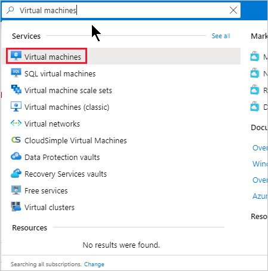

2. Select the name of your new VM (**DNS01**).

    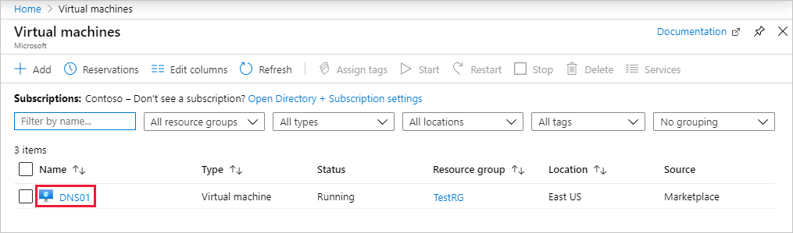

3. Choose **Networking**, and select the sole network interface listed.

    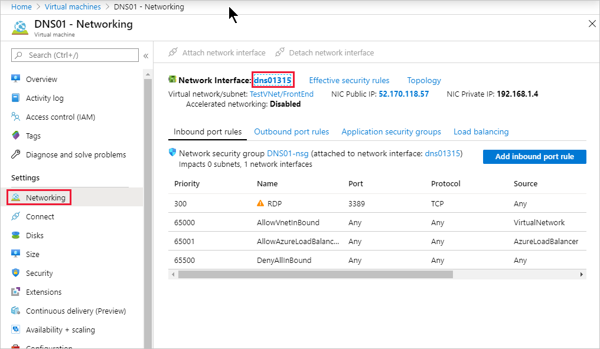

4. Choose **IP configurations**, and select the IP configuration listed in the table.

    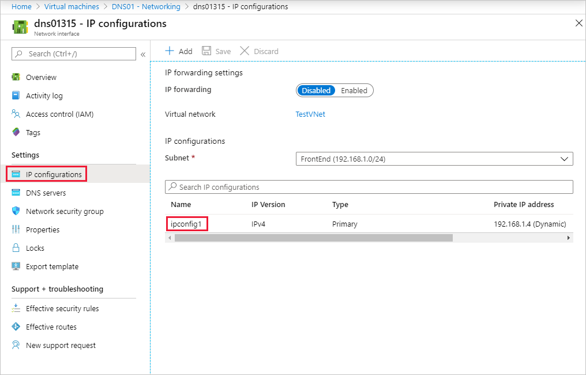

5. In **Private IP address settings**, under the **TestVNet/FrontEnd** virtual network/subnet, note the **Assignment** value (**Dynamic** or **Static**) and the **IP address**.

    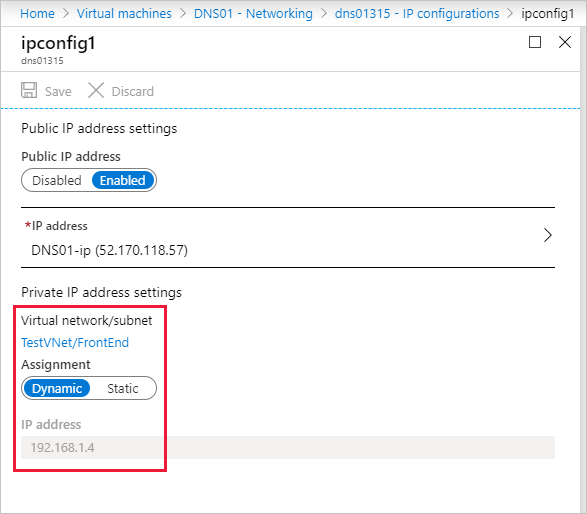

## Add a static private IP address to an existing VM
To add a static private IP address to your new VM:

1. In the IP configuration page, set the assignment for your private IP address to **Static**.
2. Change your private **IP address** to *192.168.1.101*, and then select **Save**.
   
    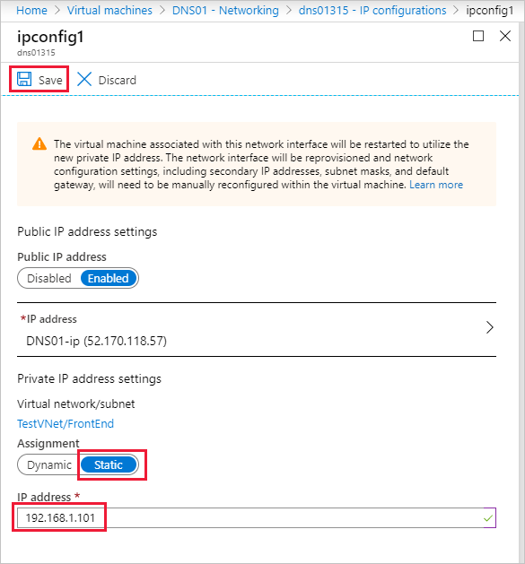

> [!NOTE]
> If you notice after selecting **Save** that the assignment is still set to **Dynamic**, the IP address you typed is already in use. Try another IP address.

## Remove a static private IP address from a VM
To remove the static private IP address from your VM:

In the IP configuration page, set the assignment for your private IP address to **Dynamic**, and then select **Save**.

## Set IP addresses within the operating system

From within the operating system of a VM, you shouldn't statically assign the *private* IP that's assigned to the Azure VM. Only do static assignment of a private IP when it's necessary, such as when [assigning many IP addresses to VMs](virtual-network-multiple-ip-addresses-portal.md). If you manually set the private IP address within the operating system, make sure it matches the private IP address assigned to the Azure [network interface](virtual-network-network-interface-addresses.md#change-ip-address-settings). Otherwise, you can lose connectivity to the VM. Learn more about [private IP address](virtual-network-network-interface-addresses.md#private) settings.

Also, you should never manually assign the *public* IP address assigned to an Azure virtual machine within the virtual machine's operating system.

## Next steps

Learn about managing [IP address settings](virtual-network-network-interface-addresses.md).
