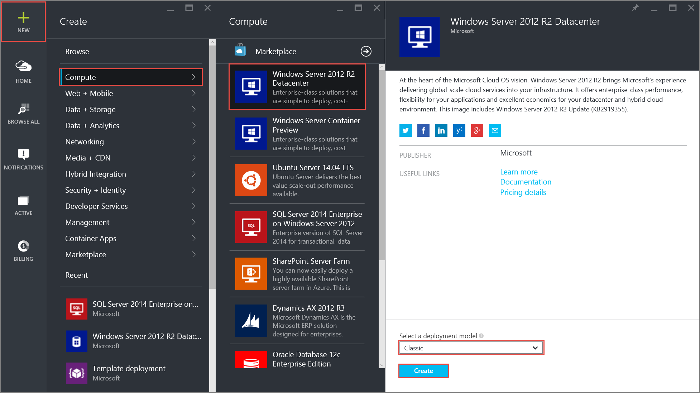

<properties 
   pageTitle="How to set a static private IP in classic mode using the Azure Portal| Microsoft Azure"
   description="Understanding static private IPs and how to manage them in classic mode using the Azure portal"
   services="virtual-network"
   documentationCenter="na"
   authors="jimdial"
   manager="carmonm"
   editor="tysonn"
   tags="azure-service-management"
/>
<tags 
   ms.service="virtual-network"
   ms.devlang="na"
   ms.topic="article"
   ms.tgt_pltfrm="na"
   ms.workload="infrastructure-services"
   ms.date="02/04/2016"
   ms.author="jdial" />

# How to set a static private IP address (classic) in the Azure portal

[AZURE.INCLUDE [virtual-networks-static-private-ip-selectors-classic-include](../../includes/virtual-networks-static-private-ip-selectors-classic-include.md)]

[AZURE.INCLUDE [virtual-networks-static-private-ip-intro-include](../../includes/virtual-networks-static-private-ip-intro-include.md)]

[AZURE.INCLUDE [azure-arm-classic-important-include](../../includes/azure-arm-classic-important-include.md)] This article covers the classic deployment model. You can also [manage a static private IP address in the Resource Manager deployment model](virtual-networks-static-private-ip-arm-pportal.md).

[AZURE.INCLUDE [virtual-networks-static-ip-scenario-include](../../includes/virtual-networks-static-ip-scenario-include.md)]

The sample steps below expect a simple environment already created. If you want to run the steps as they are displayed in this document, first build the test environment described in [create a vnet](virtual-networks-create-vnet-classic-pportal.md).

## How to specify a static private IP address when creating a VM
To create a VM named *DNS01* in the *FrontEnd* subnet of a VNet named *TestVNet* with a static private IP of *192.168.1.101*, follow the steps below:

1. From a browser, navigate to http://portal.azure.com and, if necessary, sign in with your Azure account.
2. Click **NEW** > **Compute** > **Windows Server 2012 R2 Datacenter**, notice that the **Select a deployment model** list already shows **Classic**, and then click **Create**.

	

3. In the **Create VM** blade, enter the name of the VM to be created (*DNS01* in our scenario), the local administrator account, and password.

	

4. Click **Optional Configuration** > **Network** > **Virtual Network**, and then click **TestVNet**. If **TestVNet** is not available, make sure you are using the *Central US* location and have created the test environment described at the beginning of this article.

	

5. In the **Network** blade, make sure the subnet currently selected is *FrontEnd*, then click **IP addresses**, under **IP address assignment** click **Static**, and then enter *192.168.1.101* for **IP Address** as seen below.

		

6. Click **OK** in the **IP addresses** blade, then click **OK** in the **Network** blade, and click **OK** in the **Optional config** blade.
7. In the **Create VM** blade, click **Create**. Notice the tile below displayed in your dashboard.

	

## How to retrieve static private IP address information for a VM

To view the static private IP address information for the VM created with the steps above, execute the steps below.

1. From the Azure Azure portal, click **BROWSE ALL** > **Virtual machines (classic)** > **DNS01** > **All settings** > **IP addresses** and notice the IP address assignment and IP address as seen below.

	

## How to remove a static private IP address from a VM
To remove the static private IP address from the VM created above, follow the steps below.
	
1. From the **IP addresses** blade shown above, click **Dynamic** to the right of **IP address assignment**, then click **Save**, and then click **Yes**.

	

## How to add a static private IP address to an existing VM
To add a static private IP address to the VM created using the steps above, follow the steps below:

1. From the **IP addresses** blade shown above, click **Static** to the right of **IP address assignment**.
2. Type *192.168.1.101* for **IP address**, then click **Save**, and then click **Yes**.

## Next steps

- Learn about [reserved public IP](virtual-networks-reserved-public-ip.md) addresses.
- Learn about [instance-level public IP (ILPIP)](virtual-networks-instance-level-public-ip.md) addresses.
- Consult the [Reserved IP REST APIs](https://msdn.microsoft.com/library/azure/dn722420.aspx).