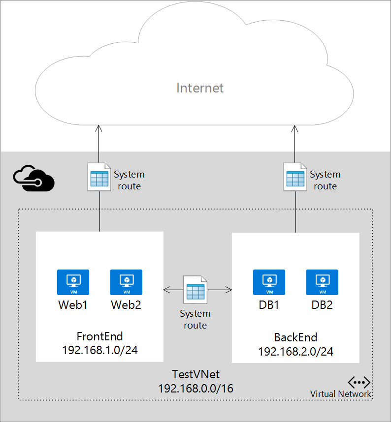
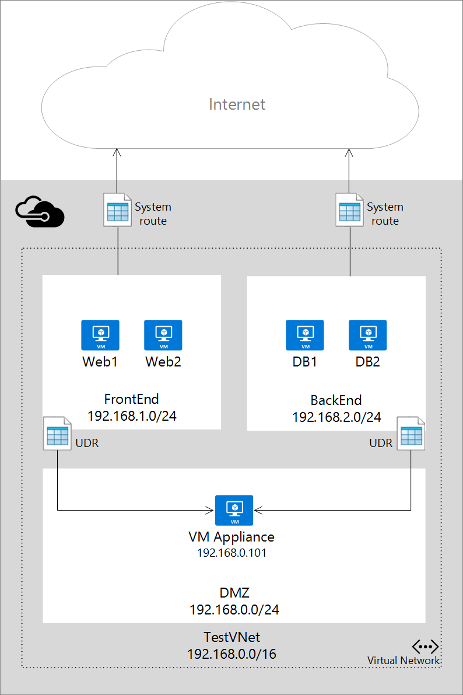

<properties 
   pageTitle="User Defined Routes and IP Forwarding Overview"
   description="Understanding UDR and IP Forwarding"
   services="virtual-network"
   documentationCenter="na"
   authors="telmosampaio"
   manager="adinah"
   editor="tysonn" />
<tags 
   ms.service="virtual-network"
   ms.devlang="na"
   ms.topic="article"
   ms.tgt_pltfrm="na"
   ms.workload="infrastructure-services"
   ms.date="06/09/2015"
   ms.author="telmos" />

# User Defined Routes and IP Forwarding
When you add virtual machines (VMs) to a virtual network (VNet) in Azure, you will notice that the VMs are able to communicate with other over the network, automatically. You do not need to specify a gateway, even though the VMs are in different subnets. The same is true for communication from the VMs to the public Internet, and even to your on-premises network when a hybrid connection from Azure to your own datacenter is present.

This flow of communication is possible because Azure uses a series of system routes to define how IP traffic flows. System routes control the flow of communication in the following scenarios:

- From within the same subnet.
- From a subnet to another within a VNet.
- From VMs to the Internet.
- From a VNet to another VNet through a VPN gateway.
- From a VNet to your on-premises network through a VPN gateway.

The figure below shows a simple setup with a VNet, two subnets, and a few VMs, along with the system routes that allow IP traffic to flow.

Although the use of system routes facilitates traffic automatically for your deployment, there are cases in which you want to control the routing of packets through a virtual appliance. You can do so by creating user defined routes that specify the next hop for packets flowing to a specific subnet to go to your virtual appliance instead, and enabling IP forwarding for the VM running as the virtual appliance.

The figure below shows an example of user defined routes and IP forwarding to force packets going from a frontend subnet to the Internet to pass through a virtual appliance, and all packets going from the frontend subnet to the backend subnet to go through a different appliance. Notice that traffic from the backend subnet to the frontend subnet is still going through the system route, bypassing the appliance.

## Routing
Packets are routed over a TCP/IP network based on a route table defined at each node on the physical network. A route table is a collection of individual routes used to decide where to forward packets based on the destination IP address. A route consists of the following:

- **Address Prefix**. The destination CIDR to which the route applies, such as 10.1.0.0/16.
- **Next hop type**. The type of Azure hop the packet should be sent to. Possible values are:
	- **Local**. Represents the local virtual network. For instance, if you have two subnets, 10.1.0.0/16 and 10.2.0.0/16 in the same virtual network, the route for each subnet in the route table will have a next hop value of *Local*.
	- **VPN Gateway**. Represents an Azure S2S VPN Gateway. 
	- **Internet**. Represents the default Internet gateway provided by the Azure Infrastructure 
	- **Virtual Appliance**. Represents a virtual appliance you added to your Azure virtual network.
	- **NULL**. Represents a black hole. Packets forwarded to a black hole will not be forwarded at all.
- **Nexthop Value**. The next hop value contains the IP address packets should be forwarded to. Next hop values are only allowed in routes where the next hop type is *Virtual Appliance*.

## System Routes
Every subnet created in a virtual network is automatically associated with a route table that contains the following system route rules:

- **Local Vnet Rule**: This rule is automatically created for every subnet in a virtual network. It specifies that there is a direct link between the VMs in the VNet and there is no intermediate next hop.
- **On-premises Rule**: This rule applies to all traffic destined to the on-premises address range and uses VPN gateway as the next hop destination.
- **Internet Rule**: This rule handles all traffic destined to the public Internet and uses the infrastructure internet gateway as the next hop for all traffic destined to the Internet.

## User Defined Routes
For most environments you will only need the system routes already defined by Azure. However, you may need to create a route table and add one or more routes in specific cases, such as:

- Force tunneling to the Internet via your on-premises network.
- Use of virtual appliances in your Azure environment.

In the scenarios above, you will have to create a route table and add user defined routes to it. You can have multiple route tables, and the same route table can be associated to one or more subnets. And each subnet can only be associated to a single route table. All VMs and cloud services in a subnet use the route table associated to that subnet.

Subnets rely on system routes until a route table is associated to the subnet. Once an association exists, routing is done based on Longest Prefix Match (LPM) among both user defined routes and system routes. If there is more than one route with the same LPM match then a route is selected based on its origin in the following order:

1. User defined route
1. BGP route (when ExpressRoute is used)
1. System route

To learn how to create user defined routes, see [How to Create Routes and Enable IP Forwarding in Azure](../virtual-networks-udr-how-to#How-to-manage-routes).

>[AZURE.IMPORTANT] User defined routes are only applied to Azure VMs and cloud services. For instance, if you want to add a firewall virtual appliance between your on-premises network and Azure, you will have to create a user defined route for your Azure route tables that forward all traffic going to the on-premises address space to the virtual appliance. However, incoming traffic from the on-premises address space will flow through your VPN gateway or ExpressRoute circuit straight to the Azure environment, bypassing the virtual appliance.

## BGP Routes
If you have an ExpressRoute connection between your on-premises network and Azure, you can enable BGP to propagate routes from your on-premises network to Azure. These BGP routes are used in the same way as system routes and user defined routes in each Azure subnet. For more information see [ExpressRoute Introduction](../expressroute-introduction).

>[AZURE.IMPORTANT] You can configure your Azure environment to use force tunneling through your on-premises network by creating a user defined route for subnet 0.0.0.0/0 that uses the VPN gateway as the next hop. However, this only works if you are using a VPN gateway, not ExpressRoute. For ExpressRoute, forced tunneling is configured through BGP.

## IP Forwarding
As describe above, one of the main reasons to create a user defined route is to forward traffic to a virtual appliance. A virtual appliance is nothing more than a VM that runs an application used to handle network traffic in some way, such as a firewall or a NAT device.

This virtual appliance VM must be able to receive incoming traffic that is not addressed to itself. To allow a VM to receive traffic addressed to other destinations, you must enable IP Forwarding for the VM. This is an Azure setting, not a setting in the guest operating system.

To learn how to enable IP forwarding for a VM in Azure, see [How to Create Routes and Enable IP Forwarding in Azure](../virtual-networks-udr-how-to#How-to-Manage-IP-Forwarding).

## Next Steps

- Learn how to [create routes](../virtual-networks-udr-how-to#How-to-manage-routes) and associate them to subnets.
- Learn how to [enable IP forwarding](../virtual-networks-udr-how-to#How-to-Manage-IP-Forwarding) for a VM running a virtual appliance. 