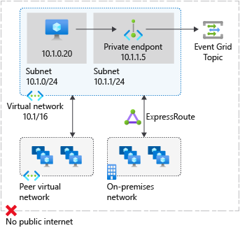
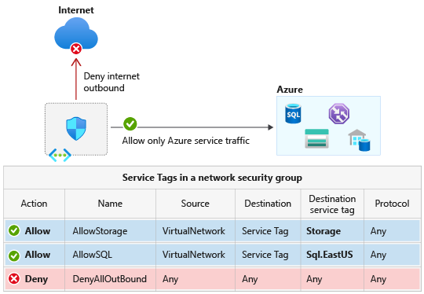

# Integrate Azure services with virtual networks for network isolation

Virtual Network (VNet) integration for an Azure service enables you to lock down access to the service to only your virtual network infrastructure. The VNet infrastructure also includes peered virtual networks and on-premises networks.

VNet integration provides Azure services the benefits of network isolation and can be accomplished by one or more of the following methods:
- [Deploying dedicated instances of the service into a virtual network](virtual-network-for-azure-services.md). The services can then be privately accessed within the virtual network and from on-premises networks.
- Using [Private Endpoint](../private-link/private-endpoint-overview.md) that connects you privately and securely to a service powered by [Azure Private Link](../private-link/private-link-overview.md). Private Endpoint uses a private IP address from your VNet, effectively bringing the service into your virtual network.
- Accessing the service using public endpoints by extending a virtual network to the service, through [service endpoints](virtual-network-service-endpoints-overview.md). Service endpoints allow service resources to be secured to the virtual network.
- Using [service tags](service-tags-overview.md) to allow or deny traffic to your Azure resources to and from public IP endpoints.

## Deploy dedicated Azure services into virtual networks

When you deploy dedicated Azure services in a virtual network, you can communicate with the service resources privately, through private IP addresses.

Deploying an dedicated Azure service into your virtual network provides the following capabilities:
- Resources within the virtual network can communicate with each other privately, through private IP addresses. Example, directly transferring data between HDInsight and SQL Server running on a virtual machine, in the virtual network.
- On-premises resources can access resources in a virtual network using private IP addresses over a Site-to-Site VPN (VPN Gateway) or ExpressRoute.
- Virtual networks can be peered to enable resources in the virtual networks to communicate with each other, using private IP addresses.
- Service instances in a virtual network are typically fully managed by the Azure service. This includes monitoring the health of the resources and scaling with load.
- Service instances are deployed into a subnet in a virtual network. Inbound and outbound network access for the subnet must be opened through network security groups, per guidance provided by the service.
- Certain services also impose restrictions on the subnet they are deployed in, limiting the application of policies, routes or combining VMs and service resources within the same subnet. Check with each service on the specific restrictions as they may change over time. Examples of such services are Azure NetApp Files, Dedicated HSM, Azure Container Instances, App Service.
- Optionally, services might require a delegated subnet as an explicit identifier that a subnet can host a particular service. By delegating, services get explicit permissions to create service-specific resources in the delegated subnet.
- See an example of a REST API response on a virtual network with a delegated subnet. A comprehensive list of services that are using the delegated subnet model can be obtained via the Available Delegations API.

For a list of services that can be deployed into a virtual network, see [Deploy dedicated Azure services into virtual networks](virtual-network-for-azure-services.md).

## Private Link and Private Endpoints

You can use private endpoints to allow ingress of events directly from your virtual network to Azure resource securely over a private link without going through the public internet. A private endpoint is a special network interface for an Azure service in your virtual network. When you create a private endpoint for your Azure resource, it provides secure connectivity between clients on your virtual network and your Azure resource. The private endpoint is assigned an IP address from the IP address range of your virtual network. The connection between the private endpoint and the Azure service uses a secure private link.

The following example shows private access of an Event Grid resource private endpoint that provides secure connectivity between clients on a virtual network and Event Grid resource.

For more information on Private Link and a list of Azure services that are supported, see [What is Private Link?](../private-link/private-link-overview.md)

## Service endpoints
VNet service endpoint provides secure and direct connectivity to Azure services over an optimized route over the Azure backbone network. Endpoints allow you to secure your critical Azure service resources to only your virtual networks. Service Endpoints enables private IP addresses in the VNet to reach the endpoint of an Azure service without needing a public IP address on the VNet.

For more information, see [Virtual network service endpoints](virtual-network-service-endpoints-overview.md)

## Service tags

A service tag represents a group of IP address prefixes from a given Azure service. Using service tags, you can define network access controls on [network security groups](./network-security-groups-overview.md#security-rules) or [Azure Firewall](../firewall/service-tags.md). By specifying the service tag name (for example, AzureEventGrid) in the appropriate source or destination field of a rule, you can allow or deny the traffic for the corresponding service.

You can use service tags to achieve network isolation and protect your Azure resources from the general Internet while accessing Azure services that have public endpoints. Create inbound/outbound network security group rules to deny traffic to/from **Internet** and allow traffic to/from **AzureCloud** or other [available service tags](service-tags-overview.md#available-service-tags) of specific Azure services.

For more information about Service Tags and Azure services that support them, see [Service Tags Overview](service-tags-overview.md)

## Next steps

- Learn how to [integrate your app with an Azure network](../app-service/web-sites-integrate-with-vnet.md).
- Learn how to [restrict access to resources using Service Tags](tutorial-restrict-network-access-to-resources.md).
- Learn how to [connect privately to an Azure Cosmos account using Azure Private Link](../private-link/tutorial-private-endpoint-cosmosdb-portal.md).