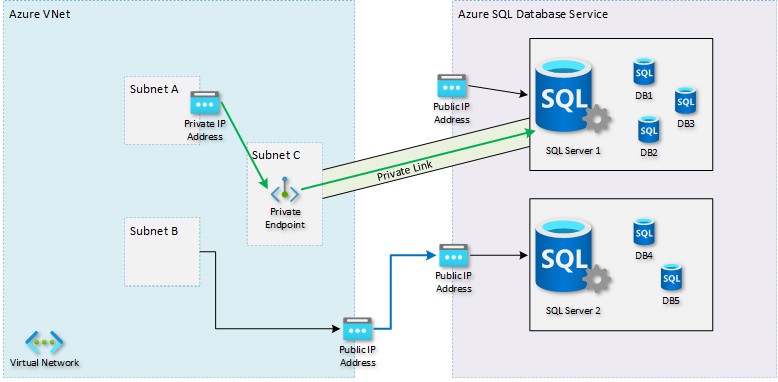
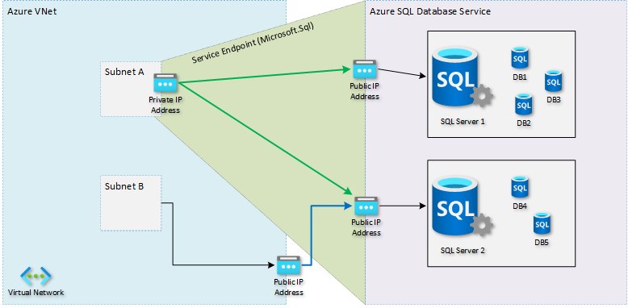

# Integrate Azure services with virtual networks for network isolation

Virtual Network (VNet) integration for an Azure service enables you to lock down access to the service to only your virtual network infrastructure. The VNet infrastructure also includes peered virtual networks and on-premises networks.

VNet integration provides Azure services the benefits of network isolation and can be accomplished by one or more of the following methods:
- [Deploying dedicated instances of the service into a virtual network](virtual-network-for-azure-services.md). The services can then be privately accessed within the virtual network and from on-premises networks.
- Using [Private Endpoint](../private-link/private-endpoint-overview.md) that connects you privately and securely to a service powered by [Azure Private Link](../private-link/private-link-overview.md). Private Endpoint uses a private IP address from your VNet, effectively bringing the service into your virtual network.
- Accessing the service using public endpoints by extending a virtual network to the service, through [service endpoints](virtual-network-service-endpoints-overview.md). Service endpoints allow service resources to be secured to the virtual network.
- Using [service tags](service-tags-overview.md) to allow or deny traffic to your Azure resources to and from public IP endpoints.

## Deploy dedicated Azure services into virtual networks

When you deploy dedicated Azure services in a virtual network, you can communicate with the service resources privately, through private IP addresses.

Deploying a dedicated Azure service into your virtual network provides the following capabilities:
- Resources within the virtual network can communicate with each other privately, through private IP addresses. Example, directly transferring data between HDInsight and SQL Server running on a virtual machine, in the virtual network.
- On-premises resources can access resources in a virtual network using private IP addresses over a Site-to-Site VPN (VPN Gateway) or ExpressRoute.
- Virtual networks can be peered to enable resources in the virtual networks to communicate with each other, using private IP addresses.
- Service instances in a virtual network are typically fully managed by the Azure service. This includes monitoring the health of the resources and scaling with load.
- Service instances are deployed into a subnet in a virtual network. Inbound and outbound network access for the subnet must be opened through network security groups, per guidance provided by the service.
- Certain services also impose restrictions on the subnet they are deployed in, limiting the application of policies, routes, or combining VMs and service resources within the same subnet. Check with each service on the specific restrictions as they may change over time. Examples of such services are Azure NetApp Files, Dedicated HSM, Azure Container Instances, App Service.
- Optionally, services might require a delegated subnet as an explicit identifier that a subnet can host a particular service. By delegating, services get explicit permissions to create service-specific resources in the delegated subnet.
- See an example of a REST API response on a virtual network with a delegated subnet. A comprehensive list of services that are using the delegated subnet model can be obtained via the Available Delegations API.

For a list of services that can be deployed into a virtual network, see [Deploy dedicated Azure services into virtual networks](virtual-network-for-azure-services.md).

## Private Link and Private Endpoints

You can use private endpoints to allow ingress of network traffic directly from your virtual network to an Azure resource securely over a private link without needing public IP addresses. A private endpoint is a special network interface for an Azure service in your virtual network. When you create a private endpoint for your Azure resource, it provides secure connectivity between clients on your virtual network and your Azure resource. The private endpoint is assigned an IP address from the IP address range of your virtual network. The connection between the private endpoint and the Azure service uses a secure private link.

In the diagram below, the right side shows an Azure SQL Database as the target PaaS service (note this can be [any service that supports Private Endpoints](../private-link/availability.md)). There are multiple instances of the logical SQL Server for multiple customers, which are all reachable over public IP addresses.

In this case, one specific instance of a logical SQL Server is exposed over a Private Endpoint, making it reachable through a private IP address in the client's virtual network. Due to the change in DNS configuration, the client application now sends its traffic directly to that Private Endpoint, and the target service will see it coming from a private IP address of the VNet (represented by the green arrow). A public IP address can still _exist_ for the target resource (alongside the private endpoint) but it isn't used by the client application anymore so the firewall can now disallow any access on that public IP address, thereby making it accessible _only_ over private endpoints. Clients in the same or other VNets connecting to any other SQL Server instance, which has no Private Endpoint defined would still be seen as coming in with a public IP address from the VNet (represented by the blue arrow).

Given that the client application typically uses a DNS host name to reach the target service, no changes are needed to the application. However, [DNS resolution in the VNet must be configured](../private-link/private-endpoint-dns.md) to resolve that same host name (for example of the logical SQL Server) to the target resource's private IP address rather than the original public IP address. With a fully private path between the client in the VNet and the target service, the client no longer relies on the public IP address and the target service can turn off public access completely.

This fine grained exposure of individual instances allows you to [prevent data exfiltration](../private-link/private-endpoint-overview.md#network-security-of-private-endpoints) (where a malicious actor extracts information from the database and uploads it to another public database or storage account) by disallowing traffic to the public IP addresses of _all_ PaaS services or even the internet completely, but still allowing access to specific PaaS instances through their private endpoints.

For more information on Private Link and a list of Azure services that are supported, see [What is Private Link?](../private-link/private-link-overview.md)

## Service endpoints

VNet service endpoint provides secure and direct connectivity to Azure services over an optimized route over the Azure backbone network. Endpoints allow you to secure your critical Azure service resources to only your virtual networks. Service Endpoints enables private IP addresses in the VNet to reach the endpoint of an Azure service without needing an outbound public IP address on the VNet.

Without service endpoints, locking down access to just your own VNet can be challenging since that source IP address could change or could even be shared with other customers in certain circumstances (for example, PaaS services with shared outbound IP addresses). With service endpoints, the source IP address that the target service sees becomes a private IP address from your own VNet, allowing it to more easily identify the origin and use it for configuring appropriate firewall rules (for example, allowing only traffic coming from a specific subnet within that VNet).

With service endpoints, DNS entries for Azure services remain as-is and continue to resolve to public IP addresses assigned to the Azure service.

In the diagram below, the right side is the same target PaaS service. On the left, there is a customer VNet with two subnets: Subnet A which has a Service Endpoint towards `Microsoft.Sql`, and Subnet B, which has no Service Endpoints defined. When a resource in Subnet B tries to reach a SQL Server, it will use a public IP address for outbound communication (represented by the blue arrow), which means the SQL Server firewall must use that public IP address to allow or block the network traffic. When a resource in Subnet A tries to reach any database server, it will instead be seen as coming from a private IP address within the VNet (represented by the green arrows). This means the SQL Server firewall can now specifically allow or block Subnet A without worrying about which public IP address the source service would otherwise be using.

Service endpoints apply to _all_ instances of the target service (for example, _all_ SQL Server instances of _all_ Azure customers), not only the customer's specific instance.

For more information, see [Virtual network service endpoints](virtual-network-service-endpoints-overview.md)

## Service tags

A service tag represents a group of IP address prefixes from a given Azure service. Using service tags, you can define network access controls on [network security groups](./network-security-groups-overview.md#security-rules) or [Azure Firewall](../firewall/service-tags.md). By specifying the service tag name (for example, AzureEventGrid) in the appropriate source or destination field of a rule, you can allow or deny the traffic for the corresponding service.

You can use service tags to achieve network isolation and protect your Azure resources from the general Internet while accessing Azure services that have public endpoints. Create inbound/outbound network security group rules to deny traffic to/from **Internet** and allow traffic to/from **AzureCloud** or other [available service tags](service-tags-overview.md#available-service-tags) of specific Azure services.

For more information about Service Tags and Azure services that support them, see [Service Tags Overview](service-tags-overview.md)

## Compare Private Endpoints and Service Endpoints

Rather than looking only at their differences, it's also worth pointing out that both service endpoints and private endpoints have certain characteristics in common.

Both features are typically used for more granular control over the firewall on the target service (for example, restricting access to SQL Server databases or Storage accounts). How this works exactly is different for both though, as discussed in more detail above.

Both approaches overcome a typical problem of [Source Network Address Translation (SNAT) port exhaustion](../load-balancer/load-balancer-outbound-connections.md#scenarios) that you may encounter when you are tunneling traffic through a Network Virtual Appliance (NVA) or a similar service, which can have SNAT port limitations. When using either service endpoints or private endpoints, the network packets instead take an optimized path and go directly to the target service without passing through a central service. This can greatly benefit bandwidth intensive applications since both latency (based on the longer path through the load balancer) and cost (based on the bandwidth charge) are reduced.

In both cases, you can also still ensure that traffic into the target service first passes through a network firewall or NVA if you want. Again, this is solved differently for both approaches: when using service endpoints, you should configure the service endpoint on the _firewall_ subnet (rather than the subnet where the source service is deployed); when using private endpoints you would typically put a User Defined Route (UDR) for the private endpoint's IP address on the _source_ subnet (not in the subnet of the private endpoint).

| Consideration                                                                                                                                    | Service Endpoints                                                                                                           | Private Endpoints                                                                                                                                                 |
| ------------------------------------------------------------------------------------------------------------------------------------------------ | --------------------------------------------------------------------------------------------------------------------------- | ----------------------------------------------------------------------------------------------------------------------------------------------------------------- |
| Scope at which level the configuration applies                                                                                                   | Entire service (for example, _all_ SQL Servers or Storage accounts of _all_ customers)                                      | Individual instance (for example, a specific SQL Server instance or Storage account _you_ own)                                                                    |
| Azure-to-Azure traffic stays on the Azure backbone network                                                                                       | Yes                                                                                                                         | Yes                                                                                                                                                               |
| Service can disable its public IP address                                                                                                        | No                                                                                                                          | Yes                                                                                                                                                               |
| Service can be reached without using any public IP address                                                                                       | No                                                                                                                          | Yes                                                                                                                                                               |
| You can easily restrict traffic coming from an Azure Virtual Network                                                                             | Yes (allow access from specific subnets and/or use NSGs)                                                                   | No*                                                                                                                                                               |
| You can easily restrict traffic coming from on-prem (VPN/ExpressRoute)                                                                           | N/A**                                                                                                                       | No*                                                                                                                                                               |
| Requires DNS changes                                                                                                                             | No                                                                                                                          | Yes (see [DNS configuration](../private-link/private-endpoint-dns.md))                                                                 |
| Impacts the cost of your solution                                                                                                                | No                                                                                                                          | Yes (see [Private Link pricing](https://azure.microsoft.com/pricing/details/private-link/))                                                                       |
| Impacts the [composite SLA](/azure/architecture/framework/resiliency/business-metrics#composite-slas) of your solution | No                                                                                                                          | Yes (Private Link service itself has a [99.99% SLA](https://azure.microsoft.com/support/legal/sla/private-link/))                                                 |

*As explained above, anything with network line-of-sight into the Private Endpoint will have network-level access, which cannot be controlled by an NSG on the Private Endpoint itself.

**As explained in the [VNet FAQ](virtual-networks-faq.md#can-an-on-premises-devices-ip-address-that-is-connected-through-azure-virtual-network-gateway-vpn-or-expressroute-gateway-access-azure-paas-service-over-vnet-service-endpoints), Azure service resources secured to virtual networks are not reachable from on-premises networks. If you want to allow traffic from on-premises, you must also allow public (typically, NAT) IP addresses from your on-premises or ExpressRoute. These IP addresses can be added through the IP firewall configuration for the Azure service resources.

## Next steps

- Learn how to [integrate your app with an Azure network](../app-service/web-sites-integrate-with-vnet.md).
- Learn how to [restrict access to resources using Service Tags](tutorial-restrict-network-access-to-resources.md).
- Learn how to [connect privately to an Azure Cosmos account using Azure Private Link](../private-link/tutorial-private-endpoint-cosmosdb-portal.md).