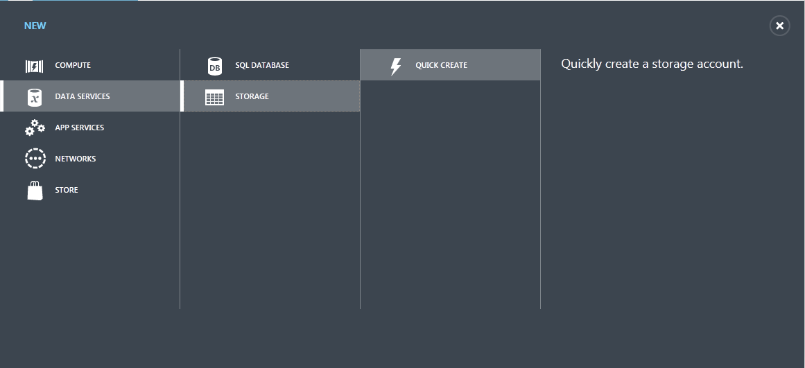
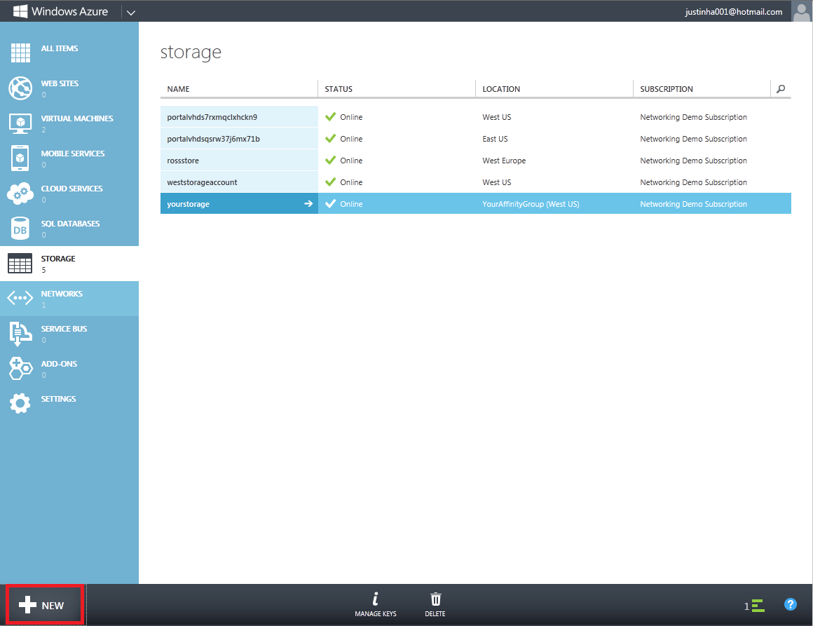
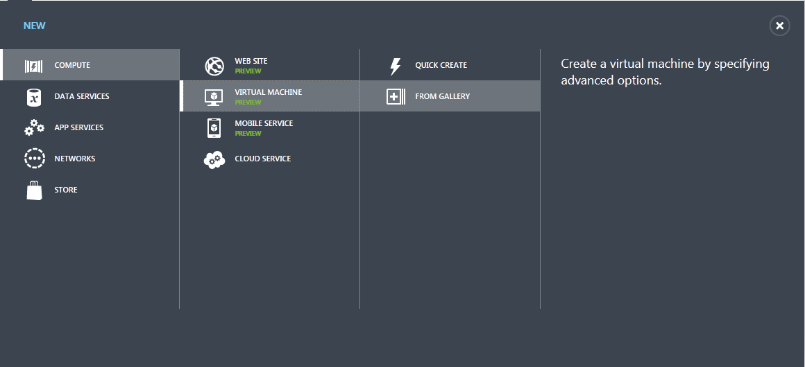
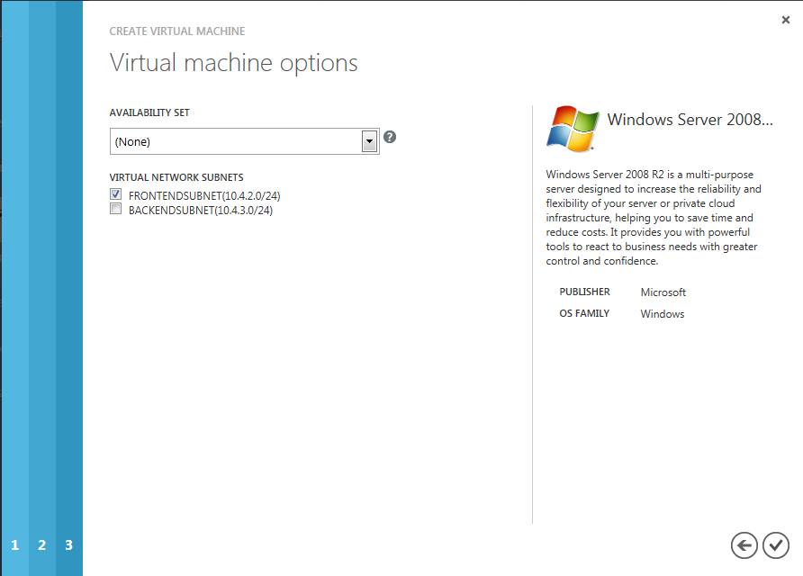
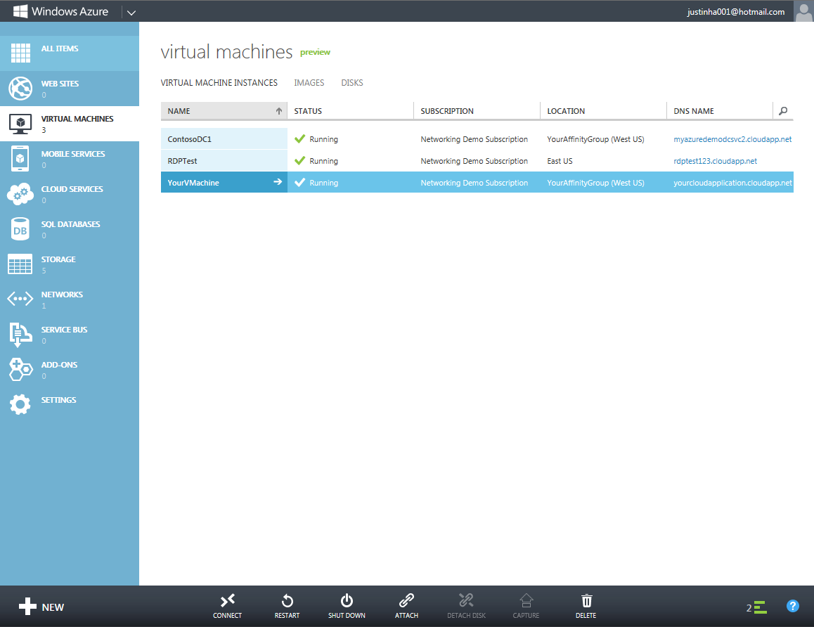
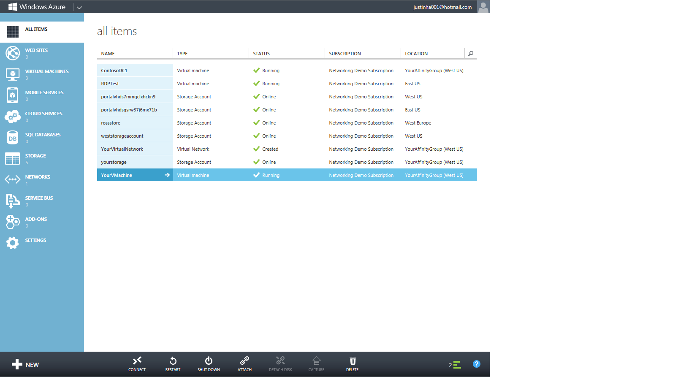

<properties linkid="manage-services-add-a-vm-to-a-virtual-network" urlDisplayName="Add a VM to virtual network" pageTitle="Add a virtual machine to a virtual network - Azure" metaKeywords="" description="A tutorial that teaches you how to create a storage account and virtual machine (VM) that you add to an Azure virtual network." metaCanonical="" services="virtual-machines,virtual-network" documentationCenter="" title="Add a Virtual Machine to a Virtual Network" authors="" solutions="" manager="" editor="" />

<h1 id="vnet3">Add a Virtual Machine to a Virtual Network</h1>

<!--SOMEWHERE IN THIS TUTORIAL I NEED TO XREF TO THE OTHER VMACHINE TUTORIAL -->

This tutorial walks you through the steps to create an Azure storage account and virtual machine (VM) that you add to a [virtual network](http://msdn.microsoft.com/en-us/library/windowsazure/jj156007.aspx).

This tutorial assumes you have no prior experience using Azure.

 
<b>Important</b>

If you plan on creating a VM in order to install a new Active Directory forest, follow the instructions in <a href="../active-directory-forest/">Install a new Active Directory forest in Azure</a>.

## Objectives ##

In this tutorial you will learn:

-  <a href="#CreateStorageAcct">How to create a storage account</a>

-  <a href="#CreateVM">How to create a virtual machine and deploy it to a virtual network</a>

## Prerequisites ##

-  Complete one of the following tutorials: 

	-  [Create a Virtual Network in Azure](/en-us/manage/services/networking/create-a-virtual-network/)

		-OR- 
	-  [Create a Virtual Network for cross-premises connectivity](/en-us/manage/services/networking/cross-premises-connectivity/)

-  Windows Live account with at least one valid, active subscription.	

-  Names of the following from [Create a Virtual Network in Azure](/en-us/manage/services/networking/create-a-virtual-network/) or [Create a Virtual Network for cross-premises connectivity](/en-us/manage/services/networking/cross-premises-connectivity/):

	-	Affinity group you assigned your virtual network.

	-	Name of your virtual network.

	-   Names of your subnet(s).

## <a name="CreateStorageAcct">Create Storage Account</a> ##

1.	After you have created your virtual network in the [Azure Management Portal](http://manage.windowsazure.com/), on the lower left-hand corner of the screen, click **New**.

	

2.	In the navigation pane, click **DATA SERVICES**, **STORAGE**, and then **QUICK CREATE**.

	

3.	Enter the following information, and then click the check mark on the bottom right of the screen.

-  **URL:** Type *yourstorage*.

-  **REGION/AFFINITY GROUP:** From the drop-down list, select **YourAffinityGroup**.

-  **ENABLE GEO-REPLICATION:** Leave this box checked.
 
	

4.	On the **Storage** page, the **STATUS** column will display **Online** when the process is complete.
 
	

## <a name="CreateVM">Create Virtual Machine and Deploy to Virtual Network</a> ##
**To create a virtual machine and deploy to a virtual network:**

1.	After you have created your storage account, on the lower left-hand corner of the screen, click **New**.

	

2.	In the navigation pane, click **COMPUTE**, **VIRTUAL MACHINE**, and then click **FROM GALLERY**.
 
	

3.	On the **VM OS Selection** screen, select **Windows Server 2008 R2 SP1, October 2012** (or the most recent version available), and then click the next arrow.
 
	

4.	On the **Virtual machine configuration** screen, enter the following information, and then click the next arrow. 
	<!-- SHOULD WE TELL USERS TO WRITE DOWN USER NAME AND PASS?? -->

	**Tip:** Write down the user name and password because these are the credentials you will use to log in to your new virtual machine.

-  **VIRTUAL MACHINE NAME:** Type *YourVMachine*.

-  **NEW USER NAME:** Read-only.

-  **NEW PASSWORD:** Enter a strong password.

-  **CONFIRM PASSWORD:** Re-enter password.

-  **SIZE:** Select **Small**.
 
	

5.	On the **Virtual machine mode** screen, enter the following information, and then click the next arrow.

-  **Standalone Virtual Machine:** Leave this option selected.

-  **DNS NAME:** Type *yourcloudapplication*.

-  **STORAGE ACCOUNT:** Select **yourstorage**.

-  **REGION/AFFINITY GROUP/VIRTUAL NETWORK:** From the drop-down list, select **YourVirtualNetwork**.
 
	

6.	On the **Virtual machine options** screen, enter the following information, and then click the check mark button. Your virtual machine will now be created. It can take up to 10 minutes for the new machine to be created.
	<!-- CONFIRM HOW LONG IT CAN TAKE ON AVG FOR VMACHINE TO BE CREATED -->

-  **AVAILABILITY SET:** Select **none**.

-  **VIRTUAL NETWORK SUBNETS:** Select **FrontEndSubnet**.
	
	
 
	<b>NOTE</b> 

	
You should select at least one subnet and DO NOT select the gateway subnet.

	
 
 
	

7.	When your virtual machine has been created, on the virtual machines screen, the **STATUS** will be **Running**.
 
	

8.	In the navigation pane, click **ALL ITEMS**. All your objects you've created will be displayed with their current status.
 
	

## Next Steps ##
To install an additional domain controller for your on-premises Active Directory domain on the VM you just created, see [Install a Replica Active Directory Domain Controller in Azure Virtual Network](/en-us/manage/services/networking/replica-domain-controller/).

## See Also

-  [Azure Virtual Network](http://msdn.microsoft.com/en-us/library/windowsazure/jj156007.aspx)

-  [Configuring a Virtual Network Using Network Configuration Files](http://msdn.microsoft.com/en-us/library/windowsazure/jj156097.aspx)

<!-- LINKS -->

[wa_com]: http://manage.windowsazure.com/
[Tut2_VN]: ..Tutorial2_CreateVNetCrossPrem 
[Tut1_VN]: ..Tutorial1_CreateVirtualNetwork

