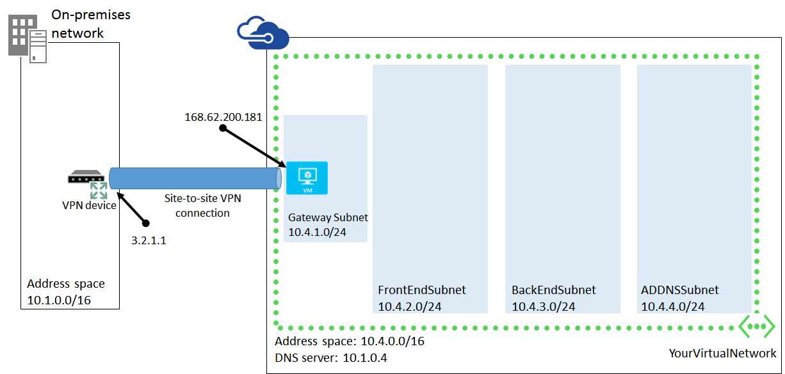
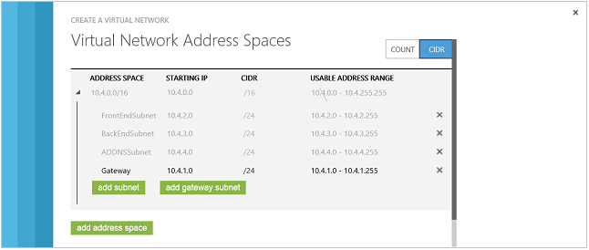

<properties 
	pageTitle="Tutorial: Create a Cross-Premises Virtual Network for Site-to-Site Connectivity" 
	description="Learn how to create an Azure Virtual Network with cross-premises connectivity in this tutorial." 
	services="virtual-network" 
	documentationCenter="" 
	authors="cherylmc" 
	manager="adinah" 
	editor="tysonn"/>

<tags 
	ms.service="virtual-network" 
	ms.workload="infrastructure-services" 
	ms.tgt_pltfrm="na" 
	ms.devlang="na" 
	ms.topic="article" 
	ms.date="04/28/2015" 
	ms.author="cherylmc"/>

# Tutorial: Create a Cross-Premises Virtual Network for Site-to-Site Connectivity

This tutorial walks you through the steps to create an example cross-premises virtual network with a site-to-site connection. 

If you want to create a cloud-only virtual network, see [Tutorial: Create a Cloud-Only Virtual Network in Azure](create-virtual-network.md). If you want to create a point-to-site VPN by using certificates and a VPN client, see [Configure a Point-to-Site VPN in the Management Portal](http://go.microsoft.com/fwlink/p/?LinkId=296653).

This tutorial assumes you have no prior experience using Azure. It's meant to help you become familiar with the steps required to create an example cross-premises virtual network. If you're looking for design scenarios and advanced information about Virtual Network, see the [Azure Virtual Network Overview](http://msdn.microsoft.com/library/windowsazure/jj156007.aspx).

After completing this tutorial, you will have an example cross-premises virtual network. The following figure shows the details, based on the example settings in this tutorial.

For a copy of this figure and one that you can use to depict your own cross-premises virtual network, see [Example cross-premises virtual network figure from tutorial topic](http://gallery.technet.microsoft.com/Example-cross-premises-e5ecb8bb).

Note that the example configuration settings used in this tutorial are not customized for your organization's network. If you configure the virtual network and the site-to-site connection using the example configuration settings described in this topic, it will not work. To configure a cross-premises virtual network that does work, you must work with your IT department and network administrator to obtain the correct settings. For more information, see the **Prerequisites** section of this topic.

For information about adding a virtual machine and extending your on-premises Active Directory to Azure Virtual Network, see the following:

-  [How to Custom Create a Virtual Machine](http://go.microsoft.com/fwlink/p/?LinkID=294356)

-  [Install a Replica Active Directory Domain Controller in Azure Virtual Network](http://go.microsoft.com/fwlink/p/?LinkId=299877)

For guidelines about deploying AD DS on Azure Virtual Machines, see [Guidelines for Deploying Windows Server Active Directory on Azure Virtual Machines](http://msdn.microsoft.com/library/windowsazure/jj156090.aspx).

For additional Virtual Network configuration procedures and settings, see [Azure Virtual Network Configuration Tasks](http://go.microsoft.com/fwlink/p/?LinkId=296652).

##  Objectives

In this tutorial you will learn:

-  How to setup an example cross-premises Azure virtual network to which you can add Azure services.

-  How to configure the virtual network to communicate with an organization's network.

##  Prerequisites

-  A Microsoft account with at least one valid, active Azure subscription.  If you do not already have an Azure subscription, you can sign up for a free trial at [Try Azure](http://azure.microsoft.com/pricing/free-trial/). If you have an MSDN Subscription, see [Microsoft Azure Special Pricing: MSDN, MPN, and Bizspark Benefits](http://azure.microsoft.com/pricing/member-offers/msdn-benefits-details/).

If you are using this tutorial to configure a working cross-premises virtual network that is customized for your organization, you need the following:

-  The private IPv4 address spaces (in CIDR notation) for the virtual network and its subnets.

-  The name and IP address of an on-premises DNS server.

-  A VPN device with a public IPv4 address. You'll need the IP address in order to complete the wizard. The VPN device cannot be located behind a network address translator (NAT) and must meet the minimum device standards. See [About VPN Devices for Virtual Network](http://go.microsoft.com/fwlink/p/?LinkID=248098) for more information. 

	Note: You can use Routing and Remote Access Service (RRAS) in Windows Server as part of your VPN solution. However, this tutorial doesn't walk you through the RRAS configuration steps. 
	For RRAS configuration information, see [Routing and Remote Access Service templates](http://msdn.microsoft.com/library/windowsazure/dn133801.aspx). 

-  Experience with configuring a router for an IPsec tunnel mode connection or someone that can help you with this step.

-  The set of address spaces (in CIDR notation) that summarize the reachable locations of your on-premises network (also known as your local network).

## High-Level Steps

1.	[Create a Virtual Network](#CreateVN)

2.	[Start the gateway and gather information for your network administrator](#StartGateway)

3.  [Configure your VPN device](#ConfigVPN)

##  <a name="CreateVN">Create a Virtual Network</a>

To create an example virtual network that connects to a company network:

1.	Log in to the [Azure Management Portal](http://manage.windowsazure.com/).

2.	In the lower left-hand corner of the screen, click **New**. In the navigation pane, click **Networks**, and then click **Virtual Network**. Click **Custom Create** to begin the configuration wizard. 

	

3.	On the **Virtual Network Details** page, enter the following information, and then click the next arrow on the lower right. For more information about the settings on the details page, see the **Virtual Network Details** section in [About Configuring a Virtual Network using the Management Portal](http://go.microsoft.com/fwlink/p/?LinkID=248092).

	-  **Name:** Name your virtual network. For the example in this tutorial, type **YourVirtualNetwork**.

	-  **Location:** From the drop-down list, select the desired region. Your virtual network will be created at the Azure datacenter located in the specified region.

	
4.	On the **DNS Servers and VPN Connectivity** page, enter the following information, and then click the forward arrow on the lower right. 

> [AZURE.NOTE] It's possible to select both **Point-To-Site** and **Site-To-Site** configurations on this page concurrently. For the purposes of this tutorial, we will select to configure only **Site-To-Site**. For more information about the settings on this page, see the **DNS Servers and VPN Connectivity** page in [About Configuring a Virtual Network using the Management Portal](http://go.microsoft.com/fwlink/p/?LinkID=248092).

	-  **DNS SERVERS:** Enter the DNS server name and IP address that you want to use for name resolution. Typically this would be a DNS server that you use for on-premises name resolution. This setting does not create a DNS server. For the example in this tutorial, type **YourDNS** for the name and **10.1.0.4** for the IP address.
	-  **Configure Point-To-Site VPN:** Leave this field blank. 
	-  **Configure Site-To-Site VPN:** Select checkbox.
	-  **LOCAL NETWORK:** Select **Specify a New Local Network** from the drop-down list.
 
	

5.	On the **Site-To-Site Connectivity** page, enter the information below, and then click the checkmark in the lower right of the page. For more information about the settings on this page, see the **Site-to-Site Connectivity** page section in [About Configuring a Virtual Network using the Management Portal](http://go.microsoft.com/fwlink/p/?LinkID=248092). 

	-  **NAME:** For the example in this tutorial, type **YourCorpHQ**.

	-  **VPN DEVICE IP ADDRESS:** For the example in this tutorial, type **3.2.1.1**. Otherwise, enter the public IP address of your VPN device. If you don't have this information, you'll need to obtain it before moving forward with the next steps in the wizard. Note that your VPN device cannot be behind a NAT. For more information about VPN devices, see [About VPN Devices for Virtual Network](http://msdn.microsoft.com/library/windowsazure/jj156075.aspx).

	-  **ADDRESS SPACE:** For the example in this tutorial, type **10.1.0.0/16**.
	-  **Add address space:** This tutorial does not require additional address space.

	

6.  On the **Virtual Network Address Spaces** page, enter the  information below, and then click the checkmark on the lower right to configure your network. 

	Address space must be a private address range, specified in CIDR notation from the 10.0.0.0/8, 172.16.0.0/12, or 192.168.0.0/16 address spaces (as specified by RFC 1918). For more information about the settings on this page, see **Virtual Network Address Spaces page** in [About Configuring a Virtual Network using the Management Portal](http://go.microsoft.com/fwlink/?LinkID=248092).

	-  **Address Space:** For the example in this tutorial, click **CIDR** in the upper right corner, then enter the following:
		-  **Starting IP:** 10.4.0.0
		-  **CIDR:** /16
	-  **Add subnet:** For the example in this tutorial, enter the following:
		-  Rename **Subnet-1** to **FrontEndSubnet** with the starting IP **10.4.2.0/24**.
		-  Add a subnet called **BackEndSubnet** with the starting IP **10.4.3.0/24**.
		-  Add a subnet called **ADDNSSubnet** with the starting IP **10.4.4.0/24**.
		-  Add a gateway subnet with the starting IP **10.4.1.0/24**.
	-  For the example in this tutorial, verify that you now have three subnets and a gateway subnet created, and then click the checkmark on the lower right to create your virtual network.

	

7.	After clicking the checkmark, your virtual network will begin to create. When your virtual network has been created, you will see **Created** listed under **Status** on the networks page in the Management Portal. 

	

##  <a name="StartGateway">Start the Gateway</a>

After creating your Azure Virtual Network, use the following procedure to configure the virtual network gateway in order to create your site-to-site VPN. This procedure requires that you have a VPN device that meets the minimum requirements. For more information about VPN devices and device configuration, see [About VPN Devices for Virtual Network](http://go.microsoft.com/fwlink/p/?LinkID=248098).

**To start the gateway:**

1.	When your virtual network has been created, the **networks** page will show **Created** as the status for your virtual network.

	In the **NAME** column, click **YourVirtualNetwork** (for the example created in this tutorial) to open the dashboard.
 
	

2.	Click **DASHBOARD** at the top of the page. On the Dashboard page, on the bottom of the page, click **CREATE GATEWAY**. Select either **Dynamic Routing** or **Static Routing** for the type of Gateway that you want to create. 

	Note that if you want to use this virtual network for point-to-site connections in addition to site-to-site, you must select **Dynamic Routing** as the gateway type. Before creating the gateway, verify that your VPN device will support the gateway type that you want to create. See [About VPN Devices for Virtual Network](http://go.microsoft.com/fwlink/p/?LinkID=248098). When the system prompts you to confirm that you want the gateway created, click **YES**.

	

3.	When the gateway creation starts, you will see a message letting you know that the gateway has been started.

	It may take up to 15 minutes for the gateway to be created.

4.	After the gateway has been created, you'll need to gather the following information that will be used to configure the VPN device. 

	-  Gateway IP address
	-  Shared key
	-  VPN device configuration script template

	The next steps walk you through this process.

5.	To locate the Gateway IP Address: The Gateway IP address is located on the virtual network **DASHBOARD** page. Here is an example:

	

6.	To acquire the Shared Key: The shared key is located on the virtual network **DASHBOARD** page. Click **Manage Key** at the bottom of the screen, and then copy the key displayed in the dialog box. You will need this key to configure the IPsec tunnel on your company's VPN device.

	

7.	To download the VPN device configuration script template: On the dashboard, click **Download VPN Device Script**.

8.	On the **Download a VPN Device Configuration Script** dialog box, select the vendor, platform, and operating system for your company's VPN device. Click the checkmark button and save the file. 

	

If you don't see your VPN device in the drop-down list, see [About VPN Devices for Virtual Network](http://go.microsoft.com/fwlink/p/?LinkID=248098) in the MSDN library for additional script templates.

##  <a name="ConfigVPN">Configure the VPN Device (Network Administrator)</a>

Because each VPN device is different, this is only a high-level procedure. This procedure should be done by your network administrator.

You can get the VPN configuration script from the Management Portal or from the [About VPN Devices for Virtual Network](http://go.microsoft.com/fwlink/p/?LinkId=248098), which also explains routing types and the devices that are compatible with the routing configuration that you select to use.

For additional information about configuring a virtual network gateway, see [Configure the Virtual Network Gateway in the Management Portal](http://go.microsoft.com/fwlink/p/?LinkId=299878) and consult your VPN device documentation.

This procedure assumes the following:

-  The person configuring the VPN device is proficient at configuring the device that has been selected. Due to the number of devices that are compatible with virtual network and the configurations that are specific to each device family, these steps do not walk through device configuration at a granular level. Therefore, it's important that the person configuring the device is familiar with the device and its configuration settings. 

-  The device that you have selected to use is compatible with virtual network. Check [here](http://go.microsoft.com/fwlink/p/?LinkID=248098) for device compatibility.

**To configure the VPN device:**

1.	Modify the VPN configuration script. You will configure the following:

	a.	Security policies

	b.	Incoming tunnel

	c.	Outgoing tunnel

2.	Run the modified VPN configuration script to configure your VPN device.

3.	Test your connection by running one of the following commands:

	<table border="1">
	<tr>
	<th>-</th>
	<th>Cisco ASA</th>
	<th>Cisco ISR/ASR</th>
	<th>Juniper SSG/ISG</th>
	<th>Juniper SRX/J</th>
	</tr>
	
	<tr>
	<td><b>Check main mode SAs</b></td>
	<td>show crypto isakmp sa</td>
	<td>show crypto isakmp sa</td>
	<td>get ike cookie</td>
	<td>show security ike security-association</td>
	</tr>
	
	<tr>
	<td><b>Check quick mode SAs</b></td>
	<td>show crypto ipsec sa</td>
	<td>show crypto ipsec sa</td>
	<td>get sa</td>
	<td>show security ipsec security-association</td>
	</tr>
	</table>

##  Next Steps
To extend your on-premises Active Directory to the virtual network you just created, continue with the following tutorials:

-  [How to Custom Create a Virtual Machine](http://go.microsoft.com/fwlink/p/?LinkID=294356)

-  [Install a Replica Active Directory Domain Controller in Azure Virtual Network](http://go.microsoft.com/fwlink/p/?LinkId=299877)

If you want to export your virtual network settings to a network configuration file in order to back up your configuration or to use it as a template, see [Export Virtual Network Settings to a Network Configuration File](http://go.microsoft.com/fwlink/p/?LinkID=299880).

## See Also

-  [Azure Virtual Network Technical Overview](http://msdn.microsoft.com/library/windowsazure/jj156007.aspx)

-  [Virtual Network FAQ](http://msdn.microsoft.com/library/windowsazure/dn133803.aspx)

-  [Configuring a Virtual Network Using Network Configuration Files](virtual-networks-using-network-configuration-file.md)

-  [Add a Virtual Machine to a Virtual Network](virtual-machines-create-custom.md)

-  [About VPN Devices for Virtual Network](http://msdn.microsoft.com/library/windowsazure/jj15] 75.aspx)

-  [Name Resolution for VMs and Role Instances](http://go.microsoft.com/fwlink/p/?LinkId=248097)
-  [Set up a hybrid cloud environment for testing](virtual-networks-setup-hybrid-cloud-environment-testing.md)

