<properties linkid="manage-services-networking-replica-domain-controller" urlDisplayName="Replica domain controller" pageTitle="Install a replica domain controller in Azure" metaKeywords="" description="A tutorial that teaches you how to install a domain controller from your Corp Active Directory forest on your Azure virtual machine." metaCanonical="" services="virtual-network" documentationCenter="" title="Install a Replica Active Directory Domain Controller in Azure Virtual Networks" authors="Justinha" solutions="" writer="Justinha" manager="TerryLan" editor="LisaToft" />

#Install a Replica Active Directory Domain Controller in Azure Virtual Networks

This tutorial walks you through the steps to install an additional domain controller from your Corp Active Directory forest on a virtual machine (VM) on [Azure Virtual Network](http://msdn.microsoft.com/en-us/library/windowsazure/jj156007.aspx). In this tutorial, the virtual network for the VM is connected to the network at your company. For conceptual guidance about installing Active Directory Domain Services (AD DS) on Azure Virtual Network, see [Guidelines for Deploying Windows Server Active Directory on Azure Virtual Machines](http://msdn.microsoft.com/en-us/library/windowsazure/jj156090.aspx).

##Table of Contents##

* [Prerequisites](#Prerequisites)
* [Step 1: Verify static IP address for YourPrimaryDC](#verifystaticip)
* [Step 2: Install Corp forest](#installforest)
* [Step 3: Create subnets and sites](#subnets)
* [Step 4: Install an additional domain controller in the CloudSite](#cloudsite)
* [Step 5: Validate the installation](#validate)
* [Step 6: Provisioning a Virtual Machine that is Domain Joined on Boot](#provisionvm)
* [Step 7: Backup the domain controller](#backup)
* [Step 8: Test authentication and authorization](#test)

<h2>Prerequisites</h2>

-	[Configure a Site-to-Site VPN in the Management Portal](http://msdn.microsoft.com/en-us/library/dn133795.aspx) configured between Azure Virtual network and Corp network.
-	Create a cloud service in the virtual network.
-	Deploy two VMs in the Cloud Service that are part of the virtual network (specify the subnet where you want to place the VM). For more information, see [Add a Virtual Machine to a Virtual Network](http://azure.microsoft.com/en-us/documentation/articles/virtual-networks-add-virtual-machine/). One VM must be size L or greater in order to attach two data disks to it. The data disks are needed to store:
	- The Active Directory database and logs.
	- System state backups.
-	A Corp network with two VMs (YourPrimaryDC and FileServer).
-	Domain Name System (DNS) infrastructure deployed if you need to have external users resolve names for accounts in Active Directory. In this case, you should create a DNS zone delegation before you install DNS server on the domain controller, or allow the Active Directory Domain Services Installation Wizard create the delegation. For more information about creating a DNS zone delegation, see [Create a Zone Delegation](http://technet.microsoft.com/library/cc753500.aspx).
-	On the DC that you install on an Azure VM, configure DNS client resolver settings as follows:
	- Preferred DNS server: on-premises DNS server 
	- Alternate DNS server: loopback address or, if possible, another DNS server running on a DC on the same virtual network.

 
<b>Note</b>

You need to provide your own DNS infrastructure to support AD DS on Azure Virtual Network. The Azure-provided DNS infrastructure for this release does not support some features that AD DS requires, such as dynamic SRV resource record registration. 

 
<b>Note</b>

If you already completed the steps in <a href="/en-us/manage/services/networking/active-directory-forest/">Install a new Active Directory forest in Azure</a>, you might need to remove AD DS from the domain controller on the Azure virtual network before you begin this tutorial. For more information about how to remove AD DS, see <a href="http://technet.microsoft.com/en-us/library/cc771844(v=WS.10).aspx">Removing a Domain Controller from a Domain</a>.

<h2>Step 1: Verify static IP address for YourPrimaryDC</h2>

1. Log on to YourPrimaryDC on the Corp network.

2. In Server Manager, click View Network Connections.

3. Right-click the local area network connection and click Properties.

4. Click Internet Protocol Version 4 (TCP/IPv4) and click Properties.

5. Verify that the server is assigned a static IP address. 

	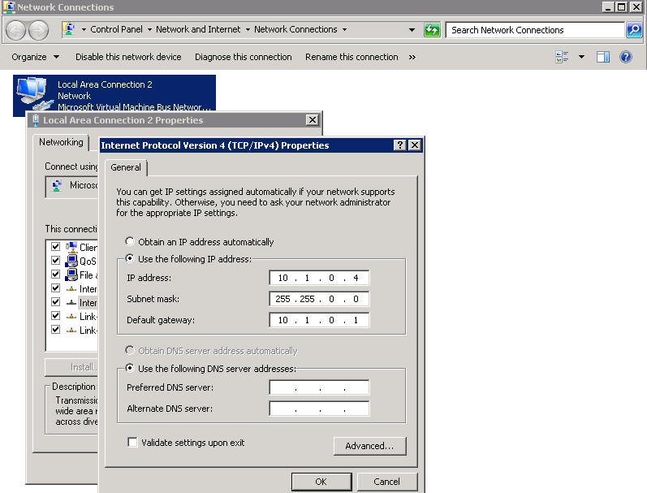

<h2>Step 2: Install Corp forest</h2>

1. In the RDP session for the VM, click **Start**, type **dcpromo**, and press ENTER.

	

2. On the Welcome page, click **Next**.

	

3. On the Operating System Compatibility page, click **Next**.

	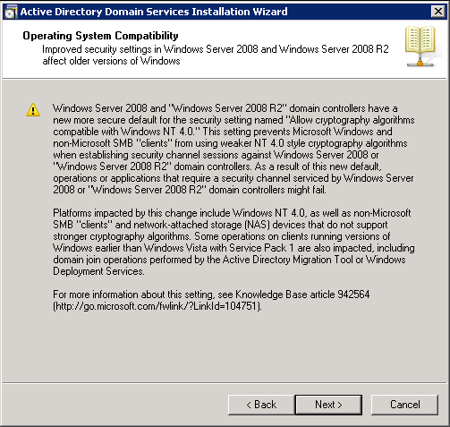

4. On the Choose a Deployment Configuration page, click **Create a new domain in a new forest**, and click **Next**. 

	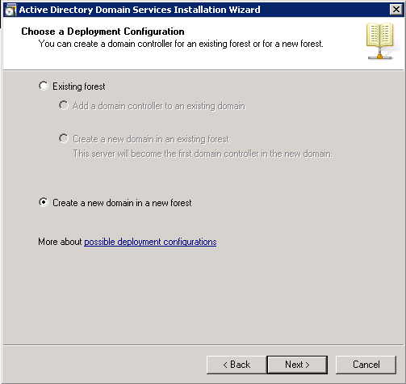

5. On the Name the Forest Root Domain page, type **corp.contoso.com** the fully qualified domain name (FQDN) of the forest root domain and click **Next**. 

	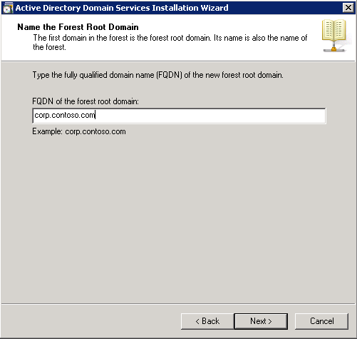

6. On the Set Forest Functional level page, click **Windows Server 2008 R2** and then click **Next**.

	

7. On the Additional Domain Controller Options page, click **DNS server** and click **Next**.

	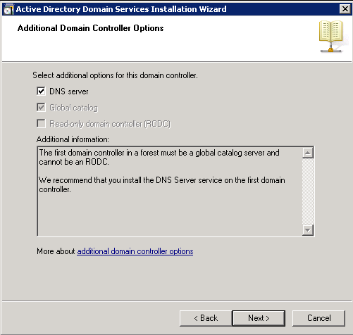

8. If the following DNS delegation warning appears, click **Yes**.

	

9. On the Location for Active Directory database, log files and SYSVOL page, type or select the location for the files and click **Next**.

	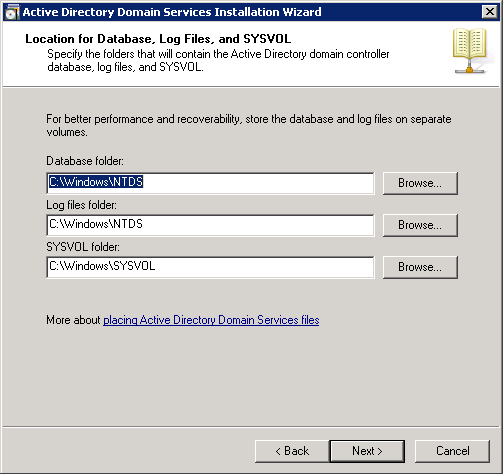

10. On the Directory Services Restore Administrator page, type and confirm the DSRM password and click **Next**.

	

11. On the Summary page, confirm your selections and click **Next**. 

	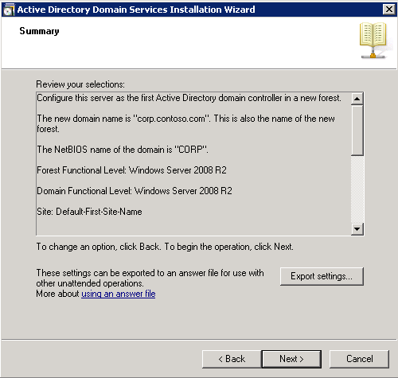

12. After the Active Directory Installation Wizard finishes, click **Finish** and then click **Restart Now** to complete the installation. 

	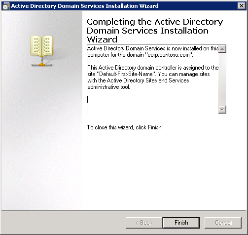

<h2>Step 3: Create subnets and sites</h2>

1. On YourPrimaryDC, click Start, click Administrative Tools and then click Active Directory Sites and Services.
2. Click **Sites**, right-click **Subnets**, and then click **New Subnet**.

	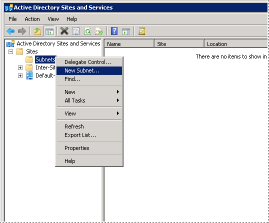

3. In **Prefix::**, type **10.1.0.0/24**, select the **Default-First-Site-Name** site object and click **OK**.

	

4. Right-click **Sites** and click **New Site**.

	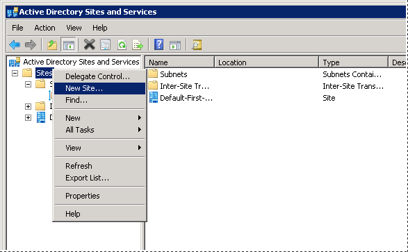

5. In Name, type **CloudSite**, select **DEFAULTIPSITELINK** and click **OK**. 

	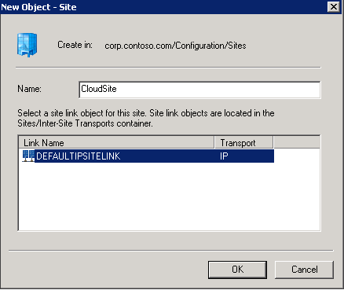

6. Click **OK** to confirm the site was created. 

	

7. Right-click **Subnets**, and then click **New Subnet**.

	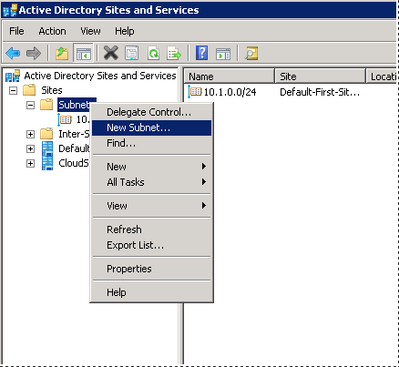

8. In **Prefix::**, type **10.4.2.0/24**, select the **CloudSite** site object and click **OK**.

	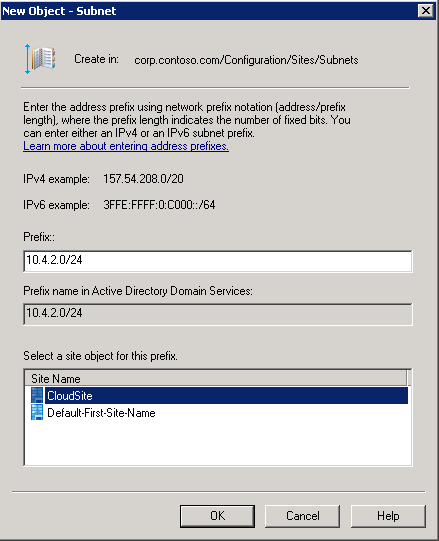

<h2>Step 4: Install an additional domain controller in the CloudSite</h2>

1. Log on to YourVMachine, click **Start**, type **dcpromo**, and press ENTER.

	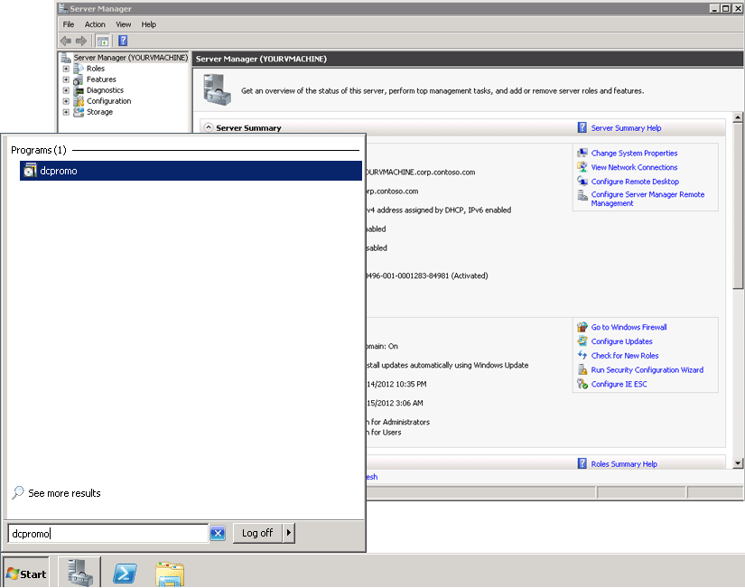

2. On the Welcome page, click **Next**.

	

3. On the Operating System Compatibility page, click **Next**.

	

4. On Choose a Deployment Configuration page, click **Existing forest**, click **Add a domain controller to an existing domain**, and click **Next**.

	

5. On the Network Credentials page, make sure you are installing the domain controller in **corp.contoso.com** domain and type credentials of a member of the Domain Admins group (or use corp\administrator credentials). 

	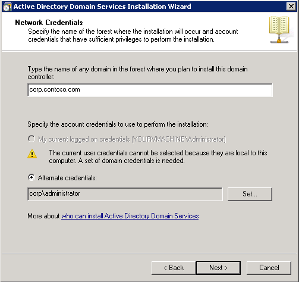

6. On the Select a Domain page, click **Next**. 

	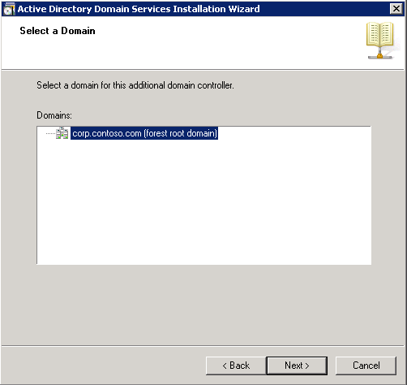

7. On the Select a Site page, make sure that CloudSite is selected and click **Next**.

	

8. On the Additional Domain Controller Options page, click **Next**. 

	

9. On the Static IP assignment warning, click **Yes, the computer will use an IP address automatically assigned by a DHCP server (not recommended)**

	**Important** 

	Although the IP address on the Azure Virtual Network is dynamic, its lease lasts for the duration of the VM. Therefore, you do not need to set a static IP address on the domain controller that you install on the virtual network. Setting a static IP address in the VM will cause communication failures.

	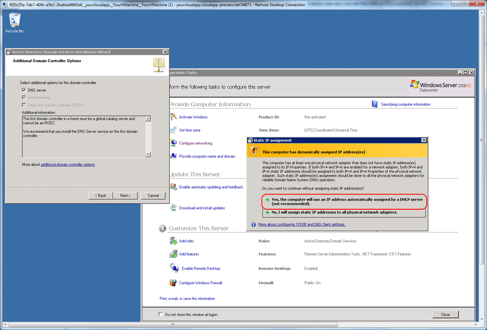

10. When prompted about the DNS delegation warning, click **Yes**.

	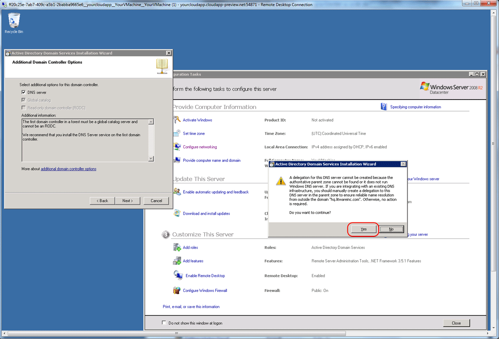

11. On the Location for Active Directory database, log files and SYSVOL page, click Browse and type or select a location on the data disk for the Active Directory files and click **Next**. 

	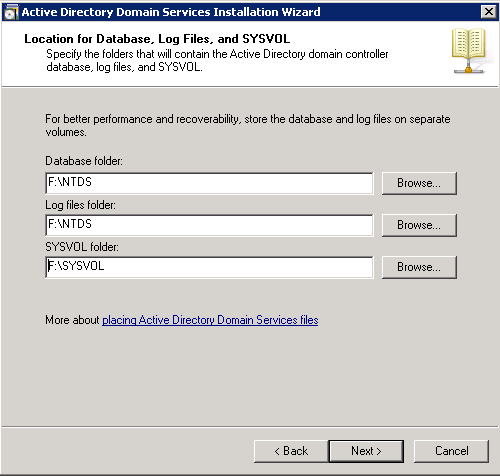

12. On the Directory Services Restore Administrator page, type and confirm the DSRM password and click **Next**.

	

13. On the Summary page, click **Next**.

	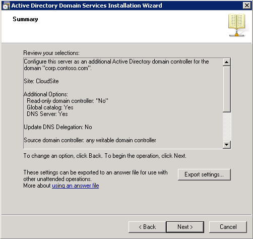

14. After the Active Directory Installation Wizard finishes, click **Finish** and then click **Restart Now** to complete the installation. 

	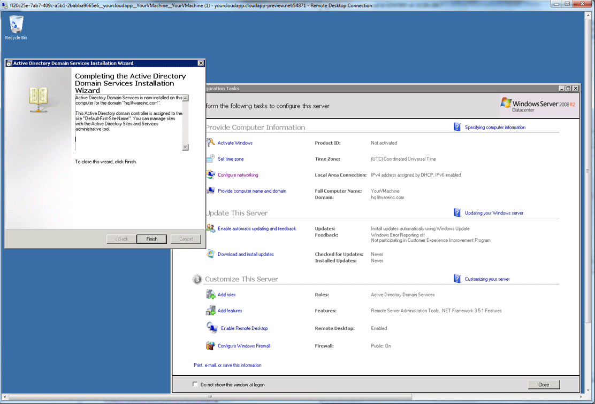

<h2>Step 5: Validate the installation</h2>

1. Reconnect to the VM.

2. Click **Start**, right-click **Command Prompt** and click **Run as Administrator**. 

3. Type the following command and press ENTER:  'Dcdiag /c /v'

4. Verify that the tests ran successfully. 

After the DC is configured, run the following Windows PowerShell cmdlet to provision additional virtual machines and have them automatically join the domain when they are provisioned. The DNS client resolver settings for the VMs must be configured when the VMs are provisioned. Substitute the correct names for your domain, VM name, and so on. 

For more information about using Windows PowerShell, see [Getting Started with Azure PowerShell](http://msdn.microsoft.com/en-us/library/windowsazure/jj156055.aspx) and [Azure Management Cmdlets](http://msdn.microsoft.com/en-us/library/windowsazure/jj152841).

<h2>Step 6: Provisioning a Virtual Machine that is Domain Joined on Boot</h2>

1. To create an additional virtual machine that is domain-joined when it first boots, open Azure PowerShell ISE, paste the following script, replace the placeholders with your own values and run it. 

	To determine the Internal IP address of the domain controller, click the name of virtual network where it is running. 

	In the following example, the Internal IP address of the domain controller is 10.4.3.1.The Add-AzureProvisioningConfig also takes a -MachineObjectOU parameter which if specified (requires the full distinguished name in Active Directory) allows for setting Group Policy settings on all of the virtual machines in that container.

	After the virtual machines are provisioned, log on by specifying a domain account using User Principal Name (UPN) format, such as administrator@corp.contoso.com. 

		#Deploy a new VM and join it to the domain
		#-------------------------------------------
		#Specify my DC's DNS IP (10.4.3.1)
		$myDNS = New-AzureDNS -Name 'ContosoDC13' -IPAddress '10.4.3.1'
		
		# OS Image to Use
		$image = 'MSFT__Sql-Server-11EVAL-11.0.2215.0-08022012-en-us-30GB.vhd'
		$service = 'myazuresvcindomainM1'
		$AG = 'YourAffinityGroup'
		$vnet = 'YourVirtualNetwork'
		$pwd = 'p@$$w0rd'
		$size = 'Small'
		
		#VM Configuration
		$vmname = 'MyTestVM1'
		$MyVM1 = New-AzureVMConfig -name $vmname -InstanceSize $size -ImageName $image |
		    Add-AzureProvisioningConfig -WindowsDomain -Password $pwd -Domain 'corp' -DomainPassword 'p@$$w0rd' -DomainUserName 'Administrator' -JoinDomain 'corp.contoso.com'|
		    Set-AzureSubnet -SubnetNames 'BackEnd'
		
		New-AzureVM -ServiceName $service -AffinityGroup $AG -VMs $MyVM1 -DnsSettings $myDNS -VNetName $vnet
		

<h2>Step 7: Backup the domain controller</h2>

1. Connect to YourVMachine.

2. Click **Start**, Click **Server Manager**, click **Add Features**, and then select **Windows Server Backup Features**. Follow the instructions to install Windows Server Backup.

3. Click **Start**, Click **Windows Server Backup**, click **Backup once**.
 
4. Click **Different options** and click **Next**.

5. Click **Full Server** and click **Next**.

6. Click **Local drives** and click **Next**.

7. Select the destination drive that does not host the operating system files or the Active Directory database, and click Next.

	

8. Confirm the backup settings you selected and then click **Backup**.

<h2>Step 8: Test authentication and authorization</h2>

1. In order to test authentication and authorization, create a domain user account in Active Directory. 
Log on to the client VM in each site and create a shared folder on the VM

2. Test access to the shared folder using different accounts and groups and permissions. 

## See Also

-  [Azure Virtual Network](http://msdn.microsoft.com/en-us/library/windowsazure/jj156007.aspx)

-  [Windows Azure IT Pro IaaS: (01) Virtual Machine Fundamentals](http://channel9.msdn.com/Series/Windows-Azure-IT-Pro-IaaS/01)

-  [Windows Azure IT Pro IaaS: (05) Creating Virtual Networks and Cross-Premises Connectivity](http://channel9.msdn.com/Series/Windows-Azure-IT-Pro-IaaS/05)

-  [Azure PowerShell](http://msdn.microsoft.com/en-us/library/windowsazure/jj156055.aspx)

-  [Azure Management Cmdlets](http://msdn.microsoft.com/en-us/library/windowsazure/jj152841)
