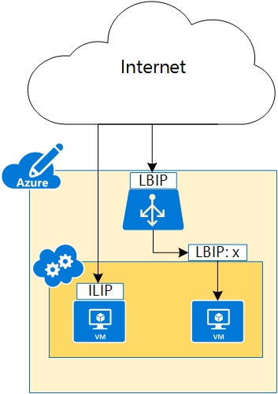

<properties 
   pageTitle="Instance-level Public IP (ILIP)"
   description="Instance-level Public IP (ILIP, PIP)"
   services="virtual-networks"
   documentationCenter="na"
   authors="telmosampaio"
   manager="adinah"
   editor="tysonn" />
<tags 
   ms.service="virtual-networks"
   ms.devlang="na"
   ms.topic="article"
   ms.tgt_pltfrm="na"
   ms.workload="infrastructure-services"
   ms.date="04/22/2015"
   ms.author="telmos" />

# Instance-Level Public IP Overview
An Instance-Level Public IP (ILIP) is an IP address that you can assign directly to your VM or role instance, rather than to the cloud service that your VM or role instance reside in. This doesn’t take the place of the Load Balanced Public IP (LBIP) that is assigned to your cloud service. Rather, it’s additional IP address that you can use to connect directly to your VM or role instance.

[AZURE.NOTE] In the past, an ILIP was referred to as a ILIP, and an LBIP was referred to as a VIP.

As shown in Figure 1, the cloud service is accessed using a LBIP, while the individual VMs are normally accessed using LBIP:<port number>. By assigning an ILIP to a specific VM, that VM can be accessed directly using that ILIP.

When you create a cloud service in Azure, corresponding DNS A records are created automatically to allow access to the service through a fully qualified domain name (FQDN) instead of using the actual LBIP. The same process happens for ILIP, allowing access to the VM or role instance by FQDN instead of the ILIP.  

[AZURE.NOTE] You can assign only one ILIP for each VM or role instance. You can use up to 5 ILIPs per subscription. At this time, ILIP is not supported for multi-NIC VMs.

## Why should I request an ILIP?
If you want to be able to connect to your VM or role instance by an IP address assigned directly to it, rather than using the cloud service LBIP:<port number>, request an ILIP for your VM or your role instance.
- **Passive FTP** - By having an ILIP on your VM, you can receive traffic on just about any port, you will not have to open up an endpoint to receive traffic. This enables scenarios like passive FTP where the ports are chosen dynamically.
- **Outbound IP** - Outbound traffic originating from the VM goes out with the ILIP as the source and this uniquely identifies the VM to external entities.

[AZURE.NOTE]The use of reserved ILIPs may incur an extra cost to your Azure subscription. For more information on ILIP pricing, see [IP Address pricing](http://azure.microsoft.com/en-us/pricing/details/ip-addresses/).

## How to request an ILIP during VM creation
The PowerShell script below creates a new cloud service named *FTPService*, then retrieves an image from Azure, and creates a VM named *FTPInstance* using the retrieved image, sets the VM to use an ILIP, and adds the VM to the new service:

	New-AzureService -ServiceName FTPService -Location "Central US"
	$image = Get-AzureVMImage|?{$_.ImageName -like "*RightImage-Windows-2012R2-x64*"}
	New-AzureVMConfig -Name FTPInstance -InstanceSize Small -ImageName $image.ImageName `
	| Add-AzureProvisioningConfig -Windows -AdminUsername adminuser -Password MyP@ssw0rd!! `
	| Set-AzurePublicIP -PublicIPName ftpip | New-AzureVM -ServiceName FTPService -Location "Central US"

## How to retrieve ILIP information for a VM
To view the ILIP information for the VM created with the script above, run the following PowerShell command and observe the values for *PublicIPAddress* and *PublicIPName*:

	Get-AzureVM -Name FTPInstance -ServiceName FTPService

	DeploymentName              : FTPService
	Name                        : FTPInstance
	Label                       : 
	VM                          : Microsoft.WindowsAzure.Commands.ServiceManagement.Model.PersistentVM
	InstanceStatus              : ReadyRole
	IpAddress                   : 100.74.118.91
	InstanceStateDetails        : 
	PowerState                  : Started
	InstanceErrorCode           : 
	InstanceFaultDomain         : 0
	InstanceName                : FTPInstance
	InstanceUpgradeDomain       : 0
	InstanceSize                : Small
	HostName                    : FTPInstance
	AvailabilitySetName         : 
	DNSName                     : http://ftpservice888.cloudapp.net/
	Status                      : ReadyRole
	GuestAgentStatus            : Microsoft.WindowsAzure.Commands.ServiceManagement.Model.GuestAgentStatus
	ResourceExtensionStatusList : {Microsoft.Compute.BGInfo}
	PublicIPAddress             : 104.43.142.188
	PublicIPName                : ftpip
	NetworkInterfaces           : {}
	ServiceName                 : FTPService
	OperationDescription        : Get-AzureVM
	OperationId                 : 568d88d2be7c98f4bbb875e4d823718e
	OperationStatus             : OK

## How to remove an ILIP from a VM
To remove the ILIP added to the VM in the script above, run the following PowerShell command:
	
	Get-AzureVM -ServiceName FTPService -Name FTPInstance `
	| Remove-AzurePublicIP `
	| Update-AzureVM

## How to add an ILIP to an existing VM
To add an ILIP to the VM created using the script above, runt he following command:

	Get-AzureVM -ServiceName FTPService -Name FTPInstance `
	| Set-AzurePublicIP -PublicIPName ftpip2 `
	| Update-AzureVM

## How to associate an ILIP to a VM by using a service configuration file
You can also associate an ILIP to a VM by using a service configuration (CSCFG) file. The sample xml below shows how to configure a cloud service to use a reserved IP named *MyReservedIP* as an ILIP for a role instance: 
	
	<?xml version="1.0" encoding="utf-8"?>
	<ServiceConfiguration serviceName="ReservedIPSample" xmlns="http://schemas.microsoft.com/ServiceHosting/2008/10/ServiceConfiguration" osFamily="4" osVersion="*" schemaVersion="2014-01.2.3">
	  <Role name="WebRole1">
	    <Instances count="1" />
	    <ConfigurationSettings>
	      <Setting name="Microsoft.WindowsAzure.Plugins.Diagnostics.ConnectionString" value="UseDevelopmentStorage=true" />
	    </ConfigurationSettings>
	  </Role>
      <NetworkConfiguration>
	    <VirtualNetworkSite name="VNet"/>
	    <AddressAssignments>
	      <InstanceAddress roleName="VMRolePersisted">
	        <Subnets>
	          <Subnet name="Subnet1"/>
	          <Subnet name="Subnet2"/>
	        </Subnets>
	        <PublicIPs>
	          <PublicIP name="MyReservedIP" domainNameLabel="MyReservedIP" />
	        </PublicIPs>
	      </InstanceAddress>
	    </AddressAssignments>
	  </NetworkConfiguration>
	</ServiceConfiguration>

## See Also

[Reserved Private IP (DIP)](../virtual-networks-reserved-private-ip)

[Reserved Public IP (LBIP)](../virtual-networks-reserved-public-ip)

[Virtual Network Overview](https://msdn.microsoft.com/library/azure/jj156007.aspx)

[Reserved IP REST APIs](https://msdn.microsoft.com/library/azure/dn722420.aspx)