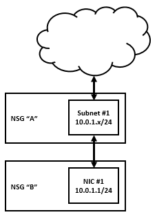

<properties 
   pageTitle="Create a VM with Multiple NICs"
   description="How to create vms with multiple nics"
   services="virtual-network, virtual-machines"
   documentationCenter="na"
   authors="telmosampaio"
   manager="adinah"
   editor="tysonn" />
<tags 
   ms.service="virtual-network"
   ms.devlang="na"
   ms.topic="article"
   ms.tgt_pltfrm="na"
   ms.workload="infrastructure-services"
   ms.date="04/30/2015"
   ms.author="telmos" />

# Create a VM with Multiple NICs

The Multi-NIC feature lets you create and manage multiple virtual network interface cards (NICs) on your Azure virtual machines (VMs). Multi-NIC is a requirement for many network virtual appliances, such as application delivery and WAN optimization solutions. Multi-NIC also provides more network traffic management functionality, including isolation of traffic between a frontend NIC and backend NIC(s), or separation of data plane traffic from management plane traffic. 

The figure above shows a VM with three NICs, each connected to a different subnet.

## Requirements and constraints

At this time, Multi-NIC has the following requirements and constraints: 

- Multi-NIC VMs must be created in Azure virtual networks (VNets). Non-VNet VMs are not supported. 
- Multi-NIC is an all-or-nothing feature in the context of VMs in a cloud service. Within a single cloud service, only two states are allowed: 
	- All VMs in that cloud service must be Multi-NIC enabled, or 
	- All VMs in that cloud service must each have a single NIC 

>[AZURE.IMPORTANT] If you try to add a Multi-NIC VM to a deployment (cloud service) that already contains a single-NIC VM (or vice-versa), you will receive the following error: 
Virtual machines with secondary network interfaces and virtual machines with no secondary network interfaces are not supported in the same deployment, also a virtual machine having no secondary network interfaces cannot be updated to have secondary network interfaces and vice-versa.
 
- Multi-NIC VMs cannot forward traffic acting as Layer 3 (IP) gateways or routers. The packets MUST be destined to or sourced from one of the VNet IP addresses on the VM. 
- Internet-facing VIP is only supported on the “default” NIC. There is only one VIP to the IP of the default NIC. 
- At this time, Instance-Level Public IP addresses are not supported for Multi-NIC VMs. 
- The order of the NICs from inside the VM will be random, and could also change across Azure infrastructure updates. However, the IP addresses, and the corresponding ethernet MAC addresses will remain the same. For example, assume **Eth1** has IP address 10.1.0.100 and MAC address 00-0D-3A-B0-39-0D; after an Azure infrastructure update and reboot, it could be changed to Eth2, but the IP and MAC pairing will remain the same. When a restart is customer-initiated, the NIC order will remain the same. 
- The address for each NIC on each VM must be located in a subnet, multiple NICs on a single VM can each be assigned addresses that are in the same subnet. 
- The VM size determines the number of NICS that you can create for a VM. The table below lists the numbers of NICs corresponding to the size of the VMs: 

|VM Size (Standard SKUs)|NICs (max allowed per VM)|
|---|---|
|All Basic Sizes|1|
|A0\extra small|1|
|A1\small|1|
|A2\medium|1|
|A3\large|2|
|A4\extra large|4|
|A5|1|
|A6|2|
|A7|4|
|A8|2|
|A9|4|
|A10|2|
|A11|4|
|D1|1|
|D2|2|
|D3|4|
|D4|8|
|D11|2|
|D12|4|
|D13|8|
|D14|16|
|DS1|1|
|DS2|2|
|DS3|4|
|DS4|8|
|DS11|2|
|DS12|4|
|DS13|8|
|DS14|16|
|G1|1|
|G2|2|
|G3|4|
|G4|8|
|G5|16|
|All Other Sizes|1|

## Network Security Groups
Any NIC on a VM may be associated with a Network Security Group (NSG), including any NICs on a VM that has Multi-NIC enabled. If a NIC is assigned an address within a subnet where the subnet is associated with an NSG, then the rules in the subnet’s NSG also apply to that NIC. 

In addition to associating subnets with NSGs, any individual NIC can also be associated with an NSG, regardless of whether the subnet containing the NIC’s IP address is associated with the same NSG. 

If a subnet is associated with an NSG, and a NIC within that subnet is individually associated with an NSG, the associated NSG rules are applied in “**flow order**” according to the direction of the traffic being passed into or out of the NIC: 

- **Incoming traffic **whose destination is the NIC in question flows first through the subnet, triggering the subnet’s NSG rules, before passing into the NIC, then triggering the NIC’s NSG rules. 
- **Outgoing traffic** whose source is the NIC in question flows first out from the NIC, triggering the NIC’s NSG rules, before passing through the subnet, then triggering the subnet’s NSG rules. 

The figure above represents how NSG rules application is done based on traffice flow (from VM to subnet, or from subnet to VM).

## How to Configure a Multi-NIC VM

The instructions below will help you create a Multi-NIC VM containing 3 NICs: a default NIC and two additional NICs. The configuration steps will create a VM that will be configured according to the service configuration file fragment below:

	<VirtualNetworkSite name="MultiNIC-VNet" Location="North Europe">
	<AddressSpace>
	  <AddressPrefix>10.1.0.0/16</AddressPrefix>
	    </AddressSpace>
	    <Subnets>
	      <Subnet name="Frontend">
	        <AddressPrefix>10.1.0.0/24</AddressPrefix>
	      </Subnet>
	      <Subnet name="Midtier">
	        <AddressPrefix>10.1.1.0/24</AddressPrefix>
	      </Subnet>
	      <Subnet name="Backend">
	        <AddressPrefix>10.1.2.0/23</AddressPrefix>
	      </Subnet>
	      <Subnet name="GatewaySubnet">
	        <AddressPrefix>10.1.200.0/28</AddressPrefix>
	      </Subnet>
	    </Subnets>
	… Skip over the remainder section …
	</VirtualNetworkSite>

You need the following prerequisitesbefore trying to run the PowerShell commands in the example.

- An Azure subscription.
- A configured virtual network. See [Virtual Network Overview](https://msdn.microsoft.com/library/azure/jj156007.aspx) for more information about VNets.
- The latest version of Azure PowerShell downloaded and installed. See [How to install and configure Azure PowerShell](../install-configure-powershell).

1. Select a VM image from Azure VM image gallery. Note that images change frequently and are available by region. The image specified in the example below may change or might not be in your region, so be sure to specify the image you need. 

    $image = Get-AzureVMImage `
    	-ImageName "a699494373c04fc0bc8f2bb1389d6106__Windows-Server-2012-R2-201410.01-en.us-127GB.vhd"

1. Create a VM configuration. 

	$vm = New-AzureVMConfig -Name "MultiNicVM" -InstanceSize "ExtraLarge" `
		-Image $image.ImageName –AvailabilitySetName "MyAVSet"

1. Create the default administrator login. 

	Add-AzureProvisioningConfig –VM $vm -Windows -AdminUserName "<YourAdminUID>" `
		-Password "<YourAdminPassword>"

1. Add additional NICs to the VM configuration. 

	Add-AzureNetworkInterfaceConfig -Name "Ethernet1" `
		-SubnetName "Midtier" -StaticVNetIPAddress "10.1.1.111" -VM $vm 
	Add-AzureNetworkInterfaceConfig -Name "Ethernet2" `
		-SubnetName "Backend" -StaticVNetIPAddress "10.1.2.222" -VM $vm

1. Specify the subnet and IP address for the default NIC. 

	Set-AzureSubnet -SubnetNames "Frontend" -VM $vm Set-AzureStaticVNetIP  `
		-IPAddress "10.1.0.100" -VM $vm

1. Create the VM your virtual network. 

>[AZURE.NOTE] The VNet that you specify here must already exist (as mentioned in the prerequisites). The example below specifies a virtual network named “MultiNIC-VNet”. 

	New-AzureVM -ServiceName "MultiNIC-CS" –VNetName "MultiNIC-VNet" –VMs $vm

## See Also

[Virtual Network Overview](https://msdn.microsoft.com/library/azure/jj156007.aspx)

[Virtual Network Configuration Tasks](https://msdn.microsoft.com/library/azure/jj156206.aspx)

[Blog Post - Multiple VM NICs and VNet Appliances in Azure](../multiple-vm-nics-and-network-virtual-appliances-in-azure)

