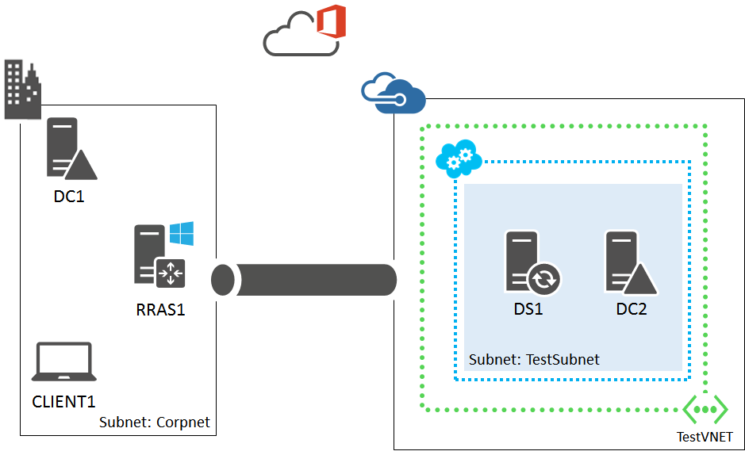
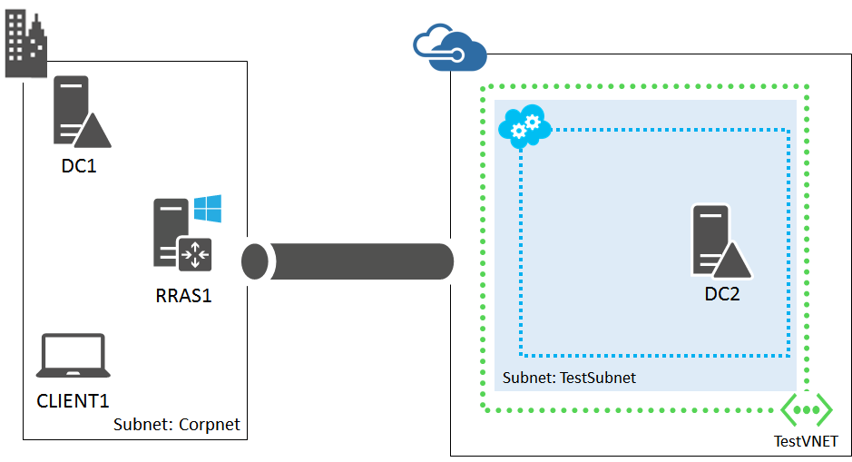
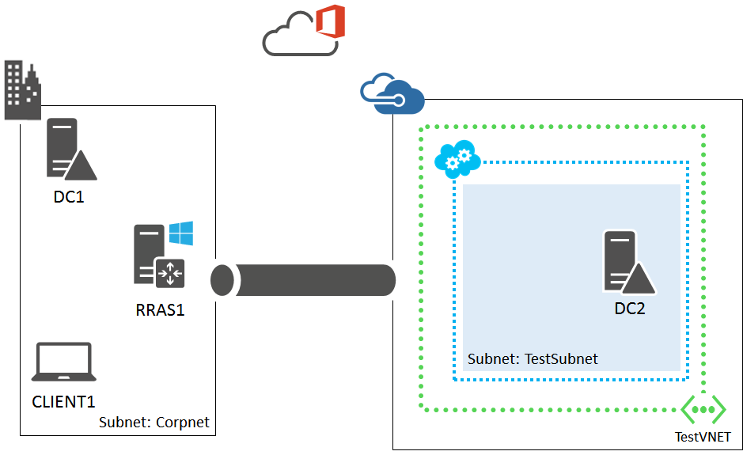

<properties 
	pageTitle="Set up Office 365 Directory Synchronization (DirSync) in a hybrid cloud for testing" 
	description="Learn how to configure an Office 365 Directory Synchronization (DirSync) server in a hybrid cloud for IT pro or development testing." 
	services="virtual-network" 
	documentationCenter="" 
	authors="JoeDavies-MSFT" 
	manager="timlt" 
	editor=""/>

<tags 
	ms.service="virtual-network" 
	ms.workload="infrastructure-services" 
	ms.tgt_pltfrm="na" 
	ms.devlang="na" 
	ms.topic="article" 
	ms.date="04/07/2015" 
	ms.author="josephd"/>

# Set up Office 365 Directory Synchronization (DirSync) in a hybrid cloud for testing

This topic steps you through creating a hybrid cloud environment for testing Office 365 Directory Synchronization (DirSync) with password synchronization hosted in Microsoft Azure. Here is the resulting configuration.

 
This configuration simulates a DirSync server in Azure production environment from your location on the Internet. It consists of:

- A simplified on-premises network (the Corpnet subnet).
- A cross-premises virtual network hosted in Azure (TestVNET).
- A site-to-site VPN connection.
- An Office 365 FastTrack trial subscription.
- A DirSync server and secondary domain controller in the TestVNET virtual network.

This configuration provides a basis and common starting point from which you can:

- Develop and test applications for Office 365 that rely on synchronization with an on-premises Active Directory domain using password sync.
- Perform testing of this cloud-based IT workload.

There are three major phases to setting up this hybrid cloud test environment:

1.	Set up the hybrid cloud environment for testing.
2.	Configure the Office 365 FastTrack trial.
3.	Configure the DirSync server (DS1).

If you do not already have an Azure subscription, you can sign up for a free trial at [Try Azure](http://azure.microsoft.com/pricing/free-trial/). If you have an MSDN Subscription, see [Azure benefit for MSDN subscribers](http://azure.microsoft.com/pricing/member-offers/msdn-benefits-details/).

> [AZURE.NOTE] The command lines that begin with $ are setting PowerShell variables that later get used in PowerShell commands. [Set up a simulated hybrid cloud environment for testing](virtual-networks-setup-simulated-hybrid-cloud-environment-testing.md)

## Phase 1: Set up the hybrid cloud environment

Use the instructions in the [Set up a hybrid cloud environment for testing](virtual-networks-setup-hybrid-cloud-environment-testing.md) topic. Because this test environment does not require the presence of the APP1 server on the Corpnet subnet, feel free to shut it down for now.

This is your current configuration.

> [AZURE.NOTE] For Phase 1, you can also set up the simulated hybrid cloud test environment. See [Set up a simulated hybrid cloud environment for testing](virtual-networks-setup-simulated-hybrid-cloud-environment-testing.md) for the instructions.

## Phase 2: Configure the Office 365 FastTrack Trial

To start your Office 365 FastTrack trial, you need a fictitious company name and a Microsoft account. We recommend that you use a variant of the company name Contoso for your company name, which is a fictitious company used in Microsoft sample content, but this isn’t required.

Next, sign up for a new Microsoft account. Go to **http://outlook.com** and create an account with an email address like user123@outlook.com. You will sign up for an Office 365 FastTrack trial using this account.

Next, sign up for a new Office 365 FastTrack trial.

1.	Log on to CLIENT1 with the CORP\User1 account credentials.
2.	Open Internet Explorer and go to **http://fasttrack.office.com**.
3.	Click **Getting started with FastTrack**.
4.	On the Getting Started with FastTrack page, under **First, sign up for an Office 365 trial**, click **For enterprises, sign up here**.
5.	On the Step 1 page, fill in the page, specifying your new Microsoft account in **Business email address**, and then click **Next**.
6.	On the Step 2 page, type the name of an initial Office 365 account in the first field, your fictitious company name, and then a password. Record the resulting email address (such as user123@contoso123.onmicrosoft.com) and the password in a secure location. You will need this information to complete the Active Directory Sync tool Configuration Wizard in Phase 3. Click **Next**.
7.	On the Step 3 page, type the phone number of your text message-capable cellular or smart phone, and then click **Text me**.
8.	After you receive the text message on your phone, type the verification code, and then click **Create my account**. 
9.	When Office 365 is done creating your account, click **You're ready to go**.
10.	You should now see the main Office 365 portal page. In the top ribbon, click **Admin**, and then click **Office 365**. The Office 365 admin center page appears. Keep this page open on CLIENT1.

This is your current configuration.

## Phase 3: Configure the DirSync server (DS1)

First, create an Azure Virtual Machine for DS1 with these commands at the Azure PowerShell command prompt on your local computer. Prior to running these commands, fill in the variable values and remove the < and > characters.

	$ServiceName="<The cloud service name for your TestVNET virtual network>"
	$cred1=Get-Credential –Message "Type the name and password of the local administrator account for DS1."
	$cred2=Get-Credential –UserName "CORP\User1" –Message "Now type the password for the CORP\User1 account."
	$image= Get-AzureVMImage | where { $_.ImageFamily -eq "Windows Server 2012 R2 Datacenter" } | sort PublishedDate -Descending | select -ExpandProperty ImageName -First 1
	$vm1=New-AzureVMConfig -Name DS1 -InstanceSize Medium -ImageName $image
	$vm1 | Add-AzureProvisioningConfig -AdminUsername $cred1.GetNetworkCredential().Username -Password $cred1.GetNetworkCredential().Password -WindowsDomain -Domain "CORP" -DomainUserName "User1" -DomainPassword $cred2.GetNetworkCredential().Password -JoinDomain "corp.contoso.com"
	$vm1 | Set-AzureSubnet -SubnetNames TestSubnet
	New-AzureVM –ServiceName $ServiceName -VMs $vm1 -VNetName TestVNET

Next, connect to the DS1 virtual machine.

1.	On the virtual machines page of the Azure Management Portal, click **Running** in the STATUS column for the DS1 virtual machine.
2.	In the task bar, click **Connect**. 
3.	When prompted to open DS1.rdp, click **Open**.
4.	When prompted with a Remote Desktop Connection message box, click **Connect**.
5.	When prompted for credentials, use these:
	- Name: **CORP\User1**
	- Password: [User1 account password]
6.	When prompted with a Remote Desktop Connection message box referring to certificates, click **Yes**.

Next, configure a Windows Firewall rule to allow traffic for basic connectivity testing. From an administrator-level Windows PowerShell command prompt on DS1, run these commands.

	Set-NetFirewallRule -DisplayName "File and Printer Sharing (Echo Request - ICMPv4-In)" -enabled True
	ping dc1.corp.contoso.com

The ping command should result in four successful replies from IP address 10.0.0.1.

Next, install .NET 3.5 on DS1 with this command at the Windows PowerShell command prompt.

	Add-WindowsFeature NET-Framework-Core

Next, install Directory Sync on DS1.

1.	Run Internet Explorer, type **http://go.microsoft.com/fwlink/?LinkID=278924** in the Address bar, and then press ENTER. When prompted to run dirsync.exe, click the arrow next to **Save**, click **Save As**, and then click **Save** to save the file in the Downloads folder. For more information about installing the tool, see [Install or upgrade the Directory Sync tool](http://technet.microsoft.com/library/jj151800).
2.	Open the **Downloads** folder, right-click the **dirsync** file, and then click **Run as administrator**.
3.	On the Welcome page of the Active Directory Sync Setup wizard, click **Next**. 
4.	On the License Terms page, click **I accept**, and then click **Next**.
5.	On the Select Folder Installation page, click **Next**. It may take a several minutes to complete the installation.
6.	On the Finished page, clear **Start Configuration Wizard now**, and then click **Finish**.
7.	From the Start screen, click **user1**, and then click **Sign out**.

Next, enable Directory Synchronization for your Office 365 FastTrack trial.

1.	On CLIENT1, on the **Office 365 admin center** page, in the left pane, click **Users**, and then click **Active Users**.
2.	For **Active Directory synchronization**, click **Set up**.
3.	On the Set up and manage Active Directory synchronization page, in step 3, click **Activate**.
4.	When prompted with **Do you want to activate Active Directory synchronization?**, click **Activate**. After you do this, **Active Directory synchronization is activated** appears in step 3.
5.	Leave the **Set up and manage Active Directory synchronization** page open on CLIENT1.

Next, log on to DC1 with the CORP\User1 account and open an administrator-level Windows PowerShell command prompt. Run these commands one at a time to create a new organizational unit called contoso_users and add two new user accounts for Marci Kaufman and Lynda Meyer.

	New-ADOrganizationalUnit -Name contoso_users -Path "DC=corp,DC=contoso,DC=com"
	New-ADUser -SamAccountName marcik -AccountPassword (Read-Host "Set user password" -AsSecureString) -name "Marci Kaufman" -enabled $true -PasswordNeverExpires $true -ChangePasswordAtLogon $false -Path "OU=contoso_users,DC=corp,DC=contoso,DC=com"
	New-ADUser -SamAccountName lyndam -AccountPassword (Read-Host "Set user password" -AsSecureString) -name "Lynda Meyer" -enabled $true -PasswordNeverExpires $true -ChangePasswordAtLogon $false -Path "OU=contoso_users,DC=corp,DC=contoso,DC=com"

When you run each Windows PowerShell command, you are prompted for the new user’s password. Record these passwords and store them in a secure location. You will need them later.

Next, configure Directory Sync on DS1.

1.	Log in to DS1 with the CORP\User1 account.
2.	On the **Start** screen, type **Directory Sync**.
3.	Right-click **Directory Sync Configuration**, and then click **Run as administrator**. This starts the configuration wizard.
4.	On the Welcome page, click **Next**.
5.	On the Microsoft Azure Active Directory Credentials page, type the email address and password of the initial account you created when you set up the Office 365 FastTrack trial in Phase 2. Click Next. 
6.	On the Active Directory Credentials page, type **CORP\User1** in **User name** and the User1 account password in **Password**. Click **Next**.
7.	On the Hybrid Deployment page, select **Enable Hybrid Deployment**, and then click **Next**.
8.	On the Password Synchronization page, select **Enable Password Sync**, and then click **Next**.
9.	The Configuration page displays. When configuration is complete, click **Next**.
10.	On the Finished page, click **Finish**. When prompted, click **OK**.

Next, verify that the user accounts in the CORP domain are synchronized to Office 365. Note that it can take a few hours before synchronization occurs.

On CLIENT1, on the **Set up and manage Active Directory synchronization** page, click the **users** link in step 6 of this page. If directory synchronization has occurred successfully, you should see something similar to this.

The **Status** column indicates that the account was obtained through synchronization with an Active Directory domain.

Next, demonstrate Office 365 password sync with the Lynda Myer Active Directory account.  

1.	On CLIENT1, on the **Active Users** page, select the **Lynda Meyer** account.
2.	In the properties of the Lynda Meyer account, under **Assigned license**, click **Edit**.
3.	In the **Assign License** tab, select a location in **Set user location** (such as United States).
4.	Select **Microsoft Office 365 Plan E3**, and then click **Save**.
5.	Close Internet Explorer.
6.	Run Internet Explorer and go to **http://portal.microsoftonline.com**. 
7.	Log on with Lynda Meyer’s Office 365 credentials. Her user name will be lyndam@<*Your Fictional Name*>.onmicrosoft.com. The password is the Lynda Meyer Active Directory user account password.
8.	After the successful logon, you see the Office 365 main portal page with **Let's make a difference today**.

This is your current configuration.

 
This environment is now ready for you to perform testing of Office 365 applications that rely on Office 365 DirSync functionality or to test DirSync functionality and performance from DS1.

## Additional Resources

[Deploy Office 365 Directory Synchronization (DirSync) in Microsoft Azure](http://technet.microsoft.com/library/dn635310.aspx)

[Solutions using Office Servers and the Cloud](http://technet.microsoft.com/library/dn262744.aspx)

[Set up a hybrid cloud environment for testing](virtual-networks-setup-hybrid-cloud-environment-testing.md)

[Set up a SharePoint intranet farm in a hybrid cloud for testing](virtual-networks-setup-sharepoint-hybrid-cloud-testing.md)

[Set up a web-based LOB application in a hybrid cloud for testing](virtual-networks-setup-lobapp-hybrid-cloud-testing.md)

[Set up a simulated hybrid cloud environment for testing](virtual-networks-setup-simulated-hybrid-cloud-environment-testing.md)

[Azure hybrid cloud test environments](virtual-machines-hybrid-cloud-test-environments.md)

