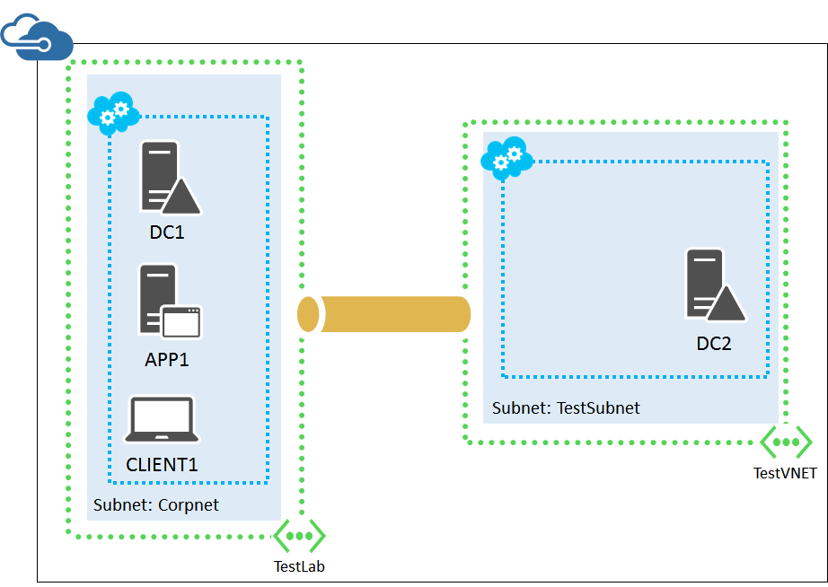
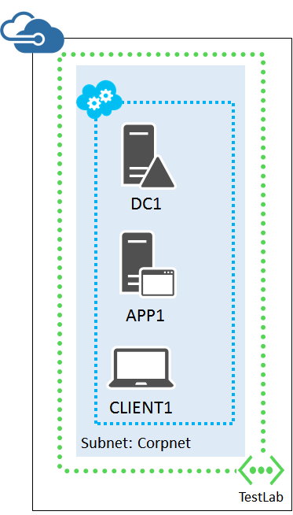
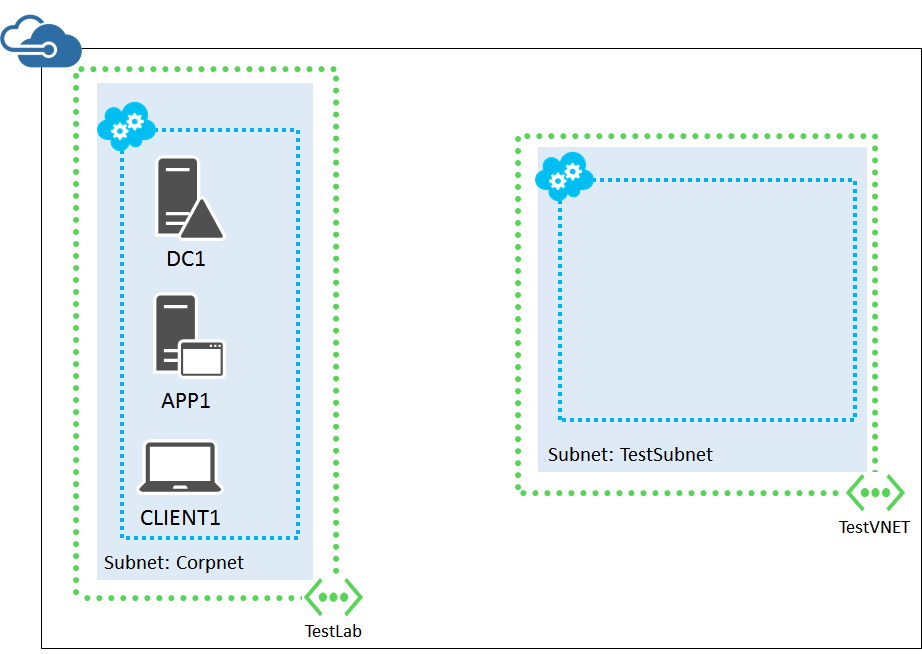
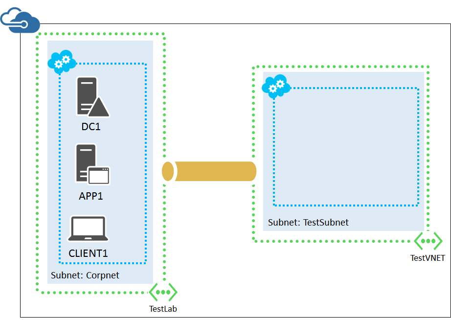

<properties 
	pageTitle="Set up a simulated hybrid cloud environment for testing" 
	description="Learn how to create a simulated hybrid cloud environment for IT pro or development testing, using two Azure virtual networks and a VNet-to-VNet connection." 
	services="virtual-network" 
	documentationCenter="" 
	authors="JoeDavies-MSFT" 
	manager="timlt" 
	editor=""/>

<tags 
	ms.service="virtual-network" 
	ms.workload="infrastructure-services" 
	ms.tgt_pltfrm="na" 
	ms.devlang="na" 
	ms.topic="article" 
	ms.date="04/07/2015" 
	ms.author="josephd"/>

# Set up a simulated hybrid cloud environment for testing

This topic steps you through creating a simulated hybrid cloud environment with Microsoft Azure for testing using two separate Azure virtual networks. Use this configuration as an alternative to 
[Set up a hybrid cloud environment for testing](virtual-networks-setup-hybrid-cloud-environment-testing.md) when you do not have a direct Internet connection and an available public IP address. Here is the resulting configuration.

This simulates a hybrid cloud production environment. It consists of:

- A simulated and simplified on-premises network hosted in an Azure virtual network (the TestLab virtual network).
- A simulated cross-premises virtual network hosted in Azure (TestVNET).
- A VNet-to-VNet connection between the two virtual networks.
- A secondary domain controller in the TestVNET virtual network.

This provides a basis and common starting point from which you can:

- Develop and test applications in a simulated hybrid cloud environment.
- Create test configurations of computers, some within the TestLab virtual network and some within the TestVNET virtual network, to simulate hybrid cloud-based IT workloads.

There are four major phases to setting up this hybrid cloud test environment:

1.	Configure the TestLab virtual network.
2.	Create the cross-premises virtual network.
3.	Create the VNet-to-VNet VPN connection.
4.	Configure DC2. 

If you don't already have an Azure subscription, you can sign up for a free trial at [Try Azure](http://azure.microsoft.com/pricing/free-trial/). If you have an MSDN Subscription, see [Azure benefit for MSDN subscribers](http://azure.microsoft.com/pricing/member-offers/msdn-benefits-details/).

>[AZURE.NOTE] Virtual machines and virtual network gateways in Azure incur an ongoing monetary cost when they are running. This cost is billed against your free trial, MSDN subscription, or paid subscription. To reduce the costs of running this test environment when you are not using it, see [Minimizing the ongoing costs of this environment](#costs) in this topic for more information.

## Phase 1: Configure the TestLab virtual network

Use the instructions in the [Base Configuration Test Environment](virtual-machines-base-configuration-test-environment.md) to configure the DC1, APP1, and CLIENT1 computers in an Azure virtual network named TestLab. 

From the Azure Management Portal on your local computer, connect to DC1 with the CORP\User1 credentials. To configure the CORP domain so that computers and users use their local domain controller for authentication, run these commands from an administrator-level Windows PowerShell command prompt.

	New-ADReplicationSite -Name "TestLab" 
	New-ADReplicationSite -Name "TestVNET"
	New-ADReplicationSubnet –Name "10.0.0.0/8" –Site "TestLab"
	New-ADReplicationSubnet –Name "192.168.0.0/16" –Site "TestVNET"

This is your current configuration.

 
## Phase 2: Create the TestVNET virtual network

First, create a new virtual network named TestVNET.

1.	In the task bar of the Azure Management Portal, click **New > Network Services > Virtual Network > Custom Create**.
2.	On the Virtual Network Details page, type **TestVNET** in **Name**.
3.	In **Location**, select the appropriate location.
4.	Click the Next arrow.
5.	On the DNS Servers and VPN Connectivity page, in **DNS Servers**, type **DC1** in **Select or enter name**, and then click the Next arrow.
6.	On the Virtual Network Address Spaces page:
	- In **Address Space**, in **Starting IP**, select or type **192.168.0.0**.
	- In **Subnets**, click **Subnet-1** and replace the name with **TestSubnet**. 
	- In the **CIDR (Address Count)** column for the TestSubnet, click **/24 (256)**.
7.	Click the Complete icon. Wait until the virtual network is created before continuing.

Next, use the instructions in [How to install and configure Azure PowerShell to install Azure PowerShell on your local computer](install-configure-powershell.md).

Next, create a new cloud service for the TestVNET virtual network. You must pick a unique name. For example, you could name it **TestVNET-***UniqueSequence*, in which *UniqueSequence* is an abbreviation of your organization. For example, if your organization is named Tailspin Toys, you could name the cloud service **TestVNET-Tailspin**.

You can test for the uniqueness of the name with this Azure PowerShell command on your local computer.

	Test-AzureName -Service <Proposed cloud service name>

If this command returns "False", your proposed name is unique. Create the cloud service with this command.

	New-AzureService -Service <Unique cloud service name> -Location "<Same location name as your virtual network>"

This is your current configuration.

 
##Phase 3: Create the VNet-to-VNet connection

First, you create local networks that represent the address space of each virtual network.

1.	From the Azure Management Portal on your local computer, click **New > Network Services > Virtual Network > Add Local Network**.
2.	On the Specify your local network details page, type **TestLabLNet** in **Name**, type **131.107.0.1** in **VPN Device IP Address**, and then click the right arrow.
3.	On the Specify the address space page, in **Starting I**P, type **10.0.0.0**.
4.	In **CIDR (Address Count)**, select **/24 (256)**, and then click the check mark.
5.	Click **New > Network Services > Virtual Network > Add Local Network**.
6.	On the Specify your local network details page, type **TestVNETLNet** in **Name**, type **131.107.0.2** in **VPN Device IP Address**, and then click the right arrow.
7.	On the Specify the address space page, in **Starting IP**, type **192.168.0.0**.
8.	In **CIDR (Address Count)**, select **/24 (256)**, and then click the check mark.

Note that the VPN device IP addresses of 131.107.0.1 and 131.107.0.2 are just temporary placeholder values until you configure gateways for the two virtual networks.

Next, you configure each virtual network to use a site-to-site VPN connection and the local network corresponding to the other virtual network.

1.	From the Azure Management Portal on your local computer, click **Networks** in the left pane, and then verify that the **Status** column for **TestLab** is set to **Created**.
2.	Click **TestLab**, and then click **Configure**. On the TestLab page, in the **Site-to-Site Connectivity** section, click **Connect to the local network**. 
3.	In **Local Network**, select **TestVNETLNet**.
4.	Click **Save** in the task bar. In some cases, you might need to click **Add Gateway Subnet** to create a subnet used by the Azure VPN gateway.
5.	Click **Networks** in the left pane, and then verify that the **Status** column for TestVNET is set to **Created**.
6.	Click **TestVNET**, and then click **Configure**. On the TestVNET page, in the **Site-to-Site Connectivity** section, click **Connect to the local network**. 
7.	In **Local Network**, select **TestLabLNet**.
8.	Click **Save** in the task bar. In some cases, you might need to click **Add Gateway Subnet** to create a subnet used by the Azure VPN gateway.

Next, you create virtual network gateways for the two virtual networks.

1.	From the Azure Management Portal, on the **Networks** page, click **TestLab**. On the Dashboard page, you should see a status of **The Gateway Was Not Created**.
2.	In the task bar, click **Create Gateway**, and then click **Dynamic Routing**. Click **Yes** when prompted. Wait until the gateway is complete and its status changes to **Connecting**. This could take a few minutes.
3.	From the Dashboard page, note the **Gateway IP Address**. This is the public IP address of the Azure VPN gateway for the TestLab virtual network. Record this IP address, as you will need this to configure the VNet-to-VNet connection.
4.	In the task bar, click **Manage Key**, and the click the copy icon next to the key to copy it to your clipboard. Paste this key into a document and save it. You need this key value to configure the VNet-to-VNet connection.
5.	On the Networks page, click **TestVNET**. On the Dashboard page, you should see a status of **The Gateway Was Not Created**.
6.	In the task bar, click **Create Gateway**, and then click **Dynamic Routing**. Click **Yes** when prompted. Wait until the gateway is complete and its status changes to **Connecting**. This could take a few minutes.
7.	From the Dashboard page, note the **Gateway IP Address**. This is the public IP address of the Azure VPN gateway for the TestVNET virtual network. Record this IP address, as you will need this to configure the VNet-to-VNet connection.

Next, you configure the TestLabLNet and TestVNETLNet local networks with the public IP addresses obtained from creating the virtual network gateways.

1.	From the Azure Management Portal, on the Networks page, click **Local Networks**. 
2.	Click **TestLabLNet**, and then click **Edit** in the task bar.
3.	On the Specify your local network details page, type the IP address of the virtual network gateway for the TestLab virtual network (from step 3 in the previous procedure) in **VPN Device IP Address (Optional)**, and then click the right arrow.
4.	On the Specify the address space page, click the check mark.
5.	On the Local Networks page, click **TestVNETLNet**, and then click **Edit** in the task bar.
6.	On the Specify your local network details page, type the IP address of the virtual network gateway for the TestVNET virtual network (from step 7 in the previous procedure) in **VPN Device IP Address (Optional)**, and then click the right arrow.
7.	On the Specify the address space page, click the check mark.

Next, you will configure the pre-shared key for both gateways to use the same value, which is the key value determined by the Azure Management Portal for the TestLab virtual network. Run these commands from an Azure PowerShell command prompt on your local computer, filling in the value of the TestLab pre-shared key.

	$preSharedKey="<The preshared key for the TestLab virtual network>"
	Set-AzureVNetGatewayKey -VNetName TestVNET -LocalNetworkSiteName TestLabLNet –SharedKey $preSharedKey

Next, on the Network page of the Azure Management Portal on your local computer, click the **TestLab** virtual network, click **Dashboard**, and then click **Connect** in the task bar. Wait until the TestLab virtual network shows a connected state.

This is your current configuration.

 
## Phase 4: Configure DC2

First, create an Azure Virtual Machine for DC2. Run these commands at the Azure PowerShell command prompt on your local computer.

	$ServiceName="<Your cloud service name from Phase 2>"
	$cred=Get-Credential –Message "Type the name and password of the local administrator account for DC2."
	$image = Get-AzureVMImage | where { $_.ImageFamily -eq "Windows Server 2012 R2 Datacenter" } | sort PublishedDate -Descending | select -ExpandProperty ImageName -First 1
	$vm1=New-AzureVMConfig -Name DC2 -InstanceSize Medium -ImageName $image
	$vm1 | Add-AzureProvisioningConfig -Windows -AdminUsername $cred.GetNetworkCredential().Username -Password $cred.GetNetworkCredential().Password
	$vm1 | Set-AzureSubnet -SubnetNames TestSubnet
	$vm1 | Set-AzureStaticVNetIP -IPAddress 192.168.0.4
	$vm1 | Add-AzureDataDisk -CreateNew -DiskSizeInGB 20 -DiskLabel ADFiles –LUN 0 -HostCaching None
	New-AzureVM –ServiceName $ServiceName -VMs $vm1 -VNetName TestVNET

Next, log on to the new DC2 virtual machine.

1.	In the left pane of the Azure Management Portal, click **Virtual Machines**, and then click **Running** in the **Status** column for DC2.
2.	In the task bar, click **Connect**. 
3.	When prompted to open DC2.rdp, click **Open**.
4.	When prompted with a Remote Desktop Connection message box, click **Connect**.
5.	When prompted for credentials, use these:
- Name: **DC2\\**[Local administrator account name]
- Password: [Local administrator account password]
6.	When prompted with a Remote Desktop Connection message box referring to certificates, click **Yes**.

Next, configure a Windows Firewall rule to allow traffic for basic connectivity testing. From an administrator-level Windows PowerShell command prompt on DC2, run these commands.

	Set-NetFirewallRule -DisplayName "File and Printer Sharing (Echo Request - ICMPv4-In)" -enabled True
	ping dc1.corp.contoso.com

The ping command should result in four successful replies from IP address 10.0.0.4. This is a test of traffic across the Vnet-to-Vnet connection.

Next, add the extra data disk as a new volume with the drive letter F:.

1.	In the left pane of Server Manager, click **File and Storage Services**, and then click **Disks**.
2.	In the contents pane, in the **Disks** group, click **disk 2** (with the **Partition** set to **Unknown**).
3.	Click **Tasks**, and then click **New Volume**.
4.	On the Before you begin page of the New Volume Wizard, click **Next**.
5.	On the Select the server and disk page, click **Disk 2**, and then click **Next**. When prompted, click **OK**.
6.	On the Specify the size of the volume page, click **Next**.
7.	On the Assign to a drive letter or folder page, click **Next**.
8.	On the Select file system settings page, click **Next**.
9.	On the Confirm selections page, click **Create**.
10.	When complete, click **Close**.

Next, configure DC2 as a replica domain controller for the corp.contoso.com domain. Run these commands from the Windows PowerShell command prompt on DC2.

	Install-WindowsFeature AD-Domain-Services -IncludeManagementTools
	Install-ADDSDomainController -Credential (Get-Credential CORP\User1) -DomainName "corp.contoso.com" -InstallDns:$true -DatabasePath "F:\NTDS" -LogPath "F:\Logs" -SysvolPath "F:\SYSVOL"

Note that you are prompted to supply both the CORP\User1 password and a Directory Services Restore Mode (DSRM) password, and to restart DC2.

Now that the TestVNET virtual network has its own DNS server (DC2), you must configure the TestVNET virtual network to use this DNS server.

1.	In the left pane of the Azure Management Portal, click **Networks**, and then click **TestVNET**.
2.	Click **Configure**.
3.	In **DNS Servers**, remove the 10.0.0.4 entry.
4.	In **DNS Servers**, add an entry with **DC2** as the name and **192.168.0.4** as the IP address. 
5.	In the command bar at the bottom, click **Save**, and then click **Yes** when prompted. Wait until the update to the TestVNet network is complete.

This is your current configuration.

 
Your simulated hybrid cloud environment is now ready for testing.

You can also build these configurations in this test environment:

- [SharePoint intranet farm](virtual-networks-setup-sharepoint-hybrid-cloud-testing.md)
- [Web-based LOB application](virtual-networks-setup-lobapp-hybrid-cloud-testing.md)
- [Office 365 Directory Synchronization (DirSync) server](virtual-networks-setup-dirsync-hybrid-cloud-testing.md)

## Additional Resources

[Set up a hybrid cloud environment for testing](virtual-networks-setup-hybrid-cloud-environment-testing.md)

[Configure a VNet to VNet Connection](http://msdn.microsoft.com/library/azure/dn690122.aspx)

[Base Configuration Test Environment](virtual-machines-base-configuration-test-environment.md)

[Azure hybrid cloud test environments](virtual-machines-hybrid-cloud-test-environments.md)

## Minimizing the ongoing costs of this environment

To minimize the costs of running the virtual machines in this environment, perform your needed testing and demonstration as quickly as possible and then delete them or shut down the virtual machines when you are not using them. For example, you could use Azure automation and a runbook to automatically shut down the virtual machines in the TestLab and Test_VNET virtual networks at the end of each business day. For more information, see [Get started with Azure Automation](automation-create-runbook-from-samples.md). When you start the virtual machines on the Corpnet subnet again, start DC1 first.

An Azure VPN gateway is implemented as a set of two Azure virtual machines that incur an ongoing monetary cost. For the details, see [Pricing - Virtual Network](http://azure.microsoft.com/pricing/details/virtual-network/). To minimize the costs of the two VPN gateways (one for TestLab and one for TestVNET), create the test environment and perform your needed testing and demonstration as quickly as possible or delete the gateways with these steps.
 
1.	From the Azure Management Portal on your local computer, click **Networks** in the left pane, click **TestLab**, and then click **Dashboard**.
2.	In the task bar, click **Delete Gateway**. Click **Yes** when prompted. Wait until the gateway is deleted and its status changes to **The Gateway Was Not Created**.
3.	Click **Networks** in the left pane, click **TestVNET**, and then click **Dashboard**.
4.	In the task bar, click **Delete Gateway**. Click **Yes** when prompted. Wait until the gateway is deleted and its status changes to **The Gateway Was Not Created**.

If you delete the gateways and you want to restore this test environment, you must first create new gateways.

1.	From the Azure Management Portal on your local computer, click **Networks** in the left pane, and then click **TestLab**. On the Dashboard page, you should see a status of **The Gateway Was Not Created**.
2.	In the task bar, click **Create Gateway**, and then click **Dynamic Routing**. Click **Yes** when prompted. Wait until the gateway is complete and its status changes to **Connecting**. This could take a few minutes.
3.	From the Dashboard page, note the **Gateway IP Address**. This is the new public IP address of the Azure VPN gateway for the TestLab virtual network. You need this IP address to re-configure the TestLabLNet local network.
4.	In the task bar, click **Manage Key**, and then click the copy icon next to the key to copy it to your clipboard. Paste this key value into a document and save it. You need this key value to re-configure the VPN gateway for the TestVNET virtual network.
5.	From the Azure Management Portal on your local computer, click **Networks** in the left pane, and then click **TestVNET**. On the Dashboard page, you should see a status of **The Gateway Was Not Created**.
6.	In the task bar, click **Create Gateway**, and then click **Dynamic Routing**. Click **Yes** when prompted. Wait until the gateway is complete and its status changes to Connecting. This could take a few minutes.
7.	From the Dashboard page, note the **Gateway IP Address**. This is the new public IP address of the Azure VPN gateway for the TestVNET virtual network. You need this IP address to re-configure the TestVNETLNet local network.

Next, you configure the TestLabLNet and TestVNETLNet local networks with the new public IP addresses obtained from creating the virtual network gateways.

1.	From the Azure Management Portal, on the Networks page, click **Local Networks**. 
2.	Click **TestLabLNet**, and then click **Edit** in the task bar.
3.	On the Specify your local network details page, type the IP address of the virtual network gateway for the TestLab virtual network (from step 3 in the previous procedure) in **VPN Device IP Address (Optional)**, and then click the right arrow.
4.	On the Specify the address space page, click the check mark.
5.	On the Local Networks page, click **TestVNETLNet**, and then click **Edit** in the task bar.
6.	On the Specify your local network details page, type the IP address of the virtual network gateway for the TestVNET virtual network (from step 7 in the previous procedure) in **VPN Device IP Address (Optional)**, and then click the right arrow.
7.	On the Specify the address space page, click the check mark.

Next, you configure the pre-shared key for both gateways to use the same value, which is the key value determined by the Azure Management Portal for the TestLab virtual network. Run these commands from an Azure PowerShell command prompt on your local computer, filling in the value of the TestLab pre-shared key.

	$preSharedKey="<The preshared key for the TestLab virtual network>"
	Set-AzureVNetGatewayKey -VNetName TestVNET -LocalNetworkSiteName TestLabLNet –SharedKey $preSharedKey

Next, on the Network page of the Azure Management Portal, click the **TestLab** virtual network, and then click **Connect** in the task bar. Wait until the TestLab virtual network shows a connected state to the TestVNET local network.
