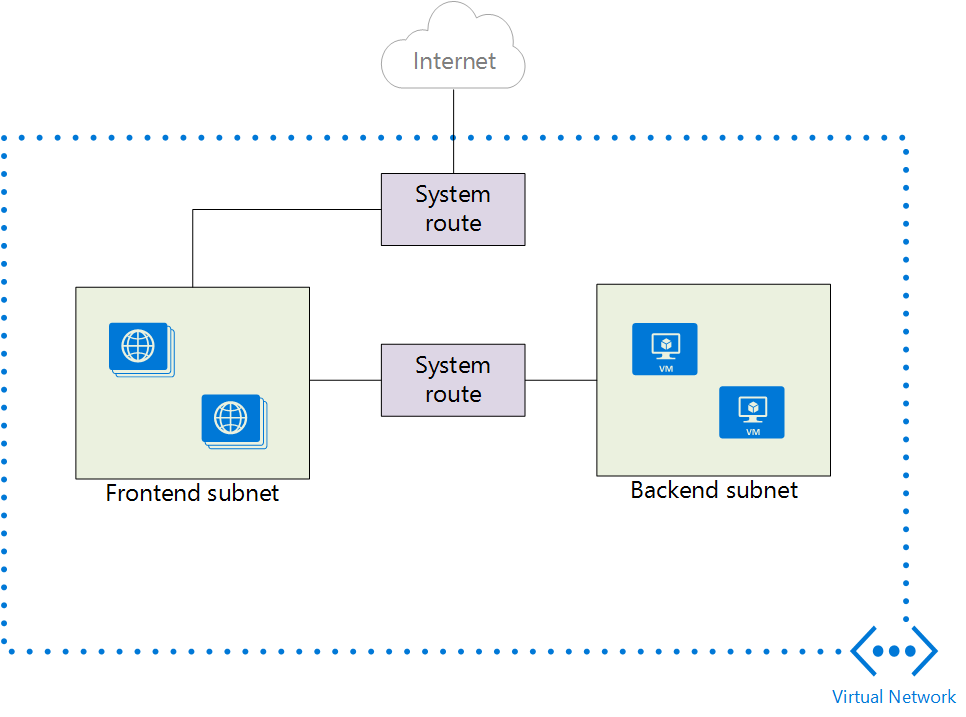

<properties 
   pageTitle="User Defined Routes and IP Forwarding Overview"
   description="Understanding UDR and IP Forwarding"
   services="virtual-network"
   documentationCenter="na"
   authors="telmosampaio"
   manager="adinah"
   editor="tysonn" />
<tags 
   ms.service="virtual-network"
   ms.devlang="na"
   ms.topic="article"
   ms.tgt_pltfrm="na"
   ms.workload="infrastructure-services"
   ms.date="04/22/2015"
   ms.author="telmos" />

# User Defined Routes and IP Forwarding
Azure uses a route table to decide how to forward IP traffic based on the destination of each packet. Although Azure provides a default route table based on your virtual network settings, you may need to add custom routes to that table. 

The most common need for a custom entry in the route table is the use of a virtual appliance in your Azure environment. Take into account the scenario shown in the Figure below. Suppose you want to ensure that all traffic directed to the mid-tier and backed subnets initiated from the front end subnet go through a virtual firewall appliance. Simply adding the appliance to your virtual network and connecting it to the different subnets will not provide this functionality. You must also change the routing table applied to your subnet to ensure packets are forwarded to the virtual firewall appliance. 

The same would be true if you implemented a virtual NAT appliance to control traffic between your Azure virtual network and the Internet. To ensure the virtual appliance is used you have to create a route specifying that all traffic destined to the Internet must be forwarded to the virtual appliance. 

## Routing
Packets are routed over a TCP/IP network based on a route table defined at each node on the physical network. A route table is a collection of individual routes used to decide where to forward packets based on the destination IP address. A route consists of the following:

- **Address Prefix**. The destination CIDR to which the route applies, such as 10.1.0.0/16.
- **Next hop type**. The type of Azure hop the packet should be sent to. Possible values are:
	- **Local**. Represents the local virtual network. For instance, if you have two subnets, 10.1.0.0/16 and 10.2.0.0/16 in the same virtual network, the route for each subnet in the route table will have a next hop value of *Local*.
	- **VPN Gateway**. Represents an Azure S2S VPN Gateway. 
	- **Internet**. Represents the default Internet gateway provided by the Azure Infrastructure 
	- **Virtual Appliance**. Represents a virtual appliance you added to your Azure virtual network.
	- **NULL**. Represents a black hole. Packets forwarded to a black hole will not be forwarded at all.
- **Nexthop Value**. The next hop value contains the IP address packets should be forwarded to. Next hop values are only allowed in routes where the next hop type is *Virtual Appliance*.

## Default Routes
Every subnet created in a virtual network is automatically associated with a route table that contains the following default route rules:
- **Local Vnet Rule**: This rule is automatically created for every subnet in a virtual network. It specifies that there is a direct link between the VMs in the VNet and there is no intermediate next hop.
- **On-premises Rule**: This rule applies to all traffic destined to the on-premises address range and uses VPN gateway as the next hop destination.
- **Internet Rule**: This rule handles all traffic destined to the public Internet and uses the infrastructure internet gateway as the next hop for all traffic destined to the Internet.

## BGP Routes
If you have an ExpressRoute connection between your on-premises network and Azure, you can enable BGP to propagate routes from your on-premises network to Azure. These BGP routes are used in the same way as default routes and user defined routes in each Azure subnet. For more information see [ExpressRoute Introduction](../expressroute-introduction).

>[AZURE.IMPORTANT] You can configure your Azure environment to use force tunneling through your on-premises network by creating a user defined route for subnet 0.0.0.0/0 that uses the VPN gateway as the next hop. However, this only works if you are using a VPN gateway, not ExpressRoute. For ExpressRoute, forced tunneling is configured through BGP.

## User Defined Routes
You cannot view the default routes specified above in your Azure environment, and for most environments, those are the only routes you will need. However, you may need to create a route table and add one or more routes in specific cases, such as:

- Force tunneling to the Internet via your on-premises network.
- Use of virtual appliances in your Azure environment.

In the scenarios above, you will have to create a route table and add user defined routes to it. You can have multiple route tables, and the same route table can be associated to one or more subnets. And each subnet can only be associated to a single route table. All VMs and cloud services in a subnet use the route table associated to that subnet.

Subnets rely on default routes until a route table is associated to the subnet. Once an association exists, routing is done based on Longest Prefix Match (LPM) among both user defined routes and default routes. If there is more than one route with the same LPM match then a route is selected based on its origin in the following order:

1. User defined route
1. BGP route (when ExpressRoute is used)
1. Default route

>[AZURE.IMPORTANT] User defined routes are only applied to Azure VMs and cloud services. For instance, if you want to add a firewall virtual appliance between your on-premises network and Azure, you will have to create a user defined route for your Azure route tables that forward all traffic going to the on-premises address space to the virtual appliance. However, incoming traffic from the on-premises address space will flow through your VPN gateway or ExpressRoute circuit straight to the Azure environment, bypassing the virtual appliance.

## IP Forwarding
As describe above, one of the main reasons to create a user defined route is to forward traffic to a virtual appliance. A virtual appliance is nothing more than a VM that runs an application used to handle network traffic in some way, such as a firewall or a NAT device.

This virtual appliance VM must be able to receive incoming traffic that is not addressed to itself. To allow a VM to receive traffic addressed to other destinations, you must enable IP Forwarding in the VM.

## See Also

[How to Create Routes and Enable IP Forwarding in Azure](../virtual-networks-udr-how-to)

[Instance-Level Public IP (ILIP)](../virtual-networks-instance-level-public-ip)

[Virtual Network Overview](https://msdn.microsoft.com/library/azure/jj156007.aspx)
