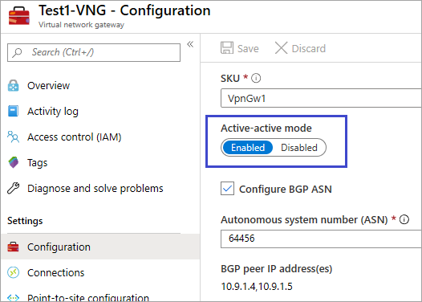
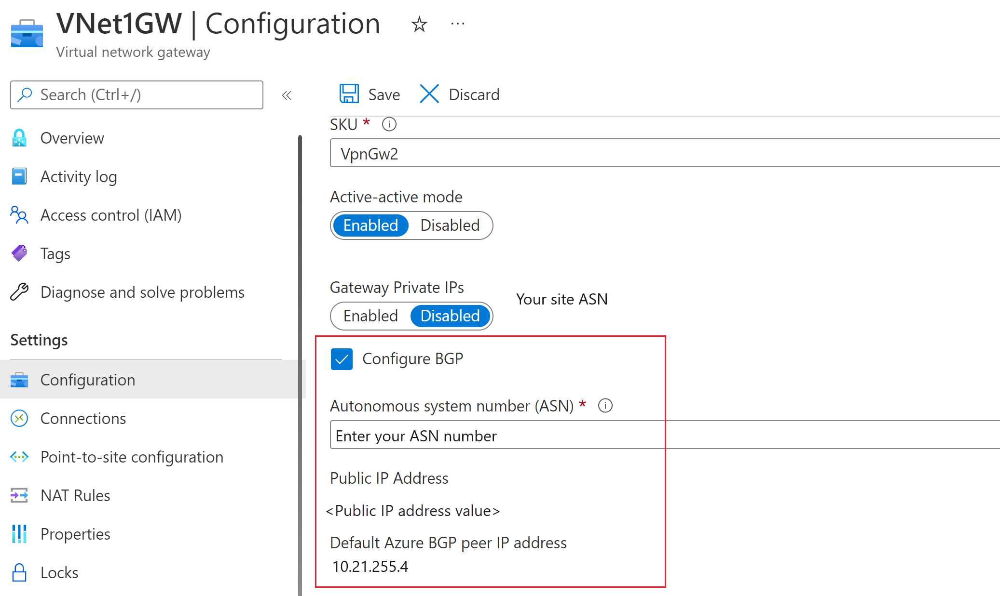
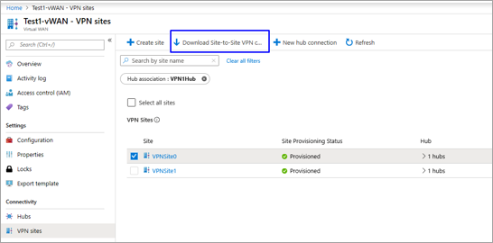
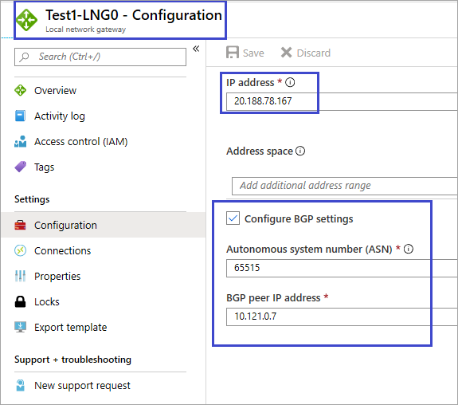
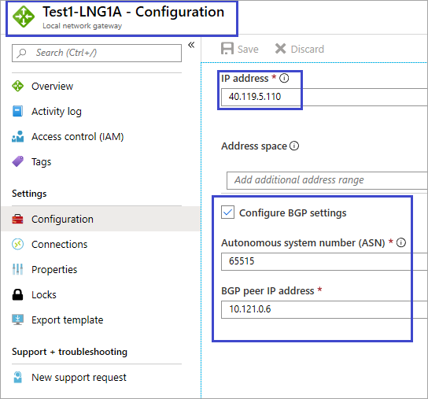
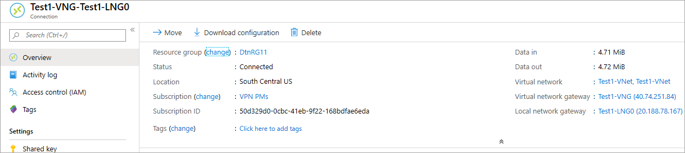

# Connect a VPN Gateway (virtual network gateway) to Virtual WAN

This article helps you set up connectivity from an Azure VPN Gateway (virtual network gateway) to an Azure Virtual WAN (VPN gateway). Creating a connection from a VPN Gateway (virtual network gateway) to a Virtual WAN (VPN gateway) is similar to setting up connectivity to a virtual WAN from branch VPN sites.

In order to minimize possible confusion between two features, we will preface the gateway with the name of the feature that we are referring to. For example, VPN Gateway virtual network gateway, and  Virtual WAN VPN gateway.

## Before you begin

Before you begin, create the following resources:

Azure Virtual WAN

* [Create a virtual WAN](virtual-wan-site-to-site-portal.md#openvwan).
* [Create a hub](virtual-wan-site-to-site-portal.md#hub). The virtual hub contains the Virtual WAN VPN gateway.

Azure Virtual Network

* Create a virtual network without any virtual network gateways. Verify that none of the subnets of your on-premises networks overlap with the virtual networks that you want to connect to. To create a virtual network in the Azure portal, see the [Quickstart](../virtual-network/quick-create-portal.md).

## 1. Create an Azure virtual network gateway

Create a VPN Gateway virtual network gateway for your virtual network in active-active mode for your virtual network. When you create the gateway, you can either use existing public IP addresses for the two instances of the gateway, or you can create new public IPs. You use these public IPs when setting up the Virtual WAN sites. For more information about active-active mode, see [Configure active-active connections](../vpn-gateway/vpn-gateway-activeactive-rm-powershell.md#aagateway).

### Active-active mode setting

### BGP setting

The BGP ASN cannot be 65515. 66515 will be used by Azure Virtual WAN.

### Public IP addresses

When the gateway is created, navigate to the **Properties** page. The properties and configuration settings will be similar to the following example. Notice the two public IP addresses that are used for the gateway.

## 2. Create Virtual WAN VPN sites

To create Virtual WAN VPN sites, navigate your to your virtual WAN and, under **Connectivity**, select **VPN sites**. In this section, you will create two Virtual WAN VPN sites that correspond to the virtual network gateways you created in the previous section.

1. Select **+Create site**.
2. On the **Create VPN sites** page, type the following values:

   * **Region** - (The same region as the Azure VPN Gateway virtual network gateway)
   * **Device vendor** - Enter the device vendor (any name)
   * **Private address space** - (Enter a value, or leave blank when BGP is enabled)
   * **Border Gateway Protocol** - (Set to **Enable** if the Azure VPN Gateway virtual network gateway has BGP enabled)
   * **Connect to Hubs** (Select hub you created in the prerequisites from the dropdown)
3. Under **Links**, enter the following values:

   * **Provider Name** - Enter a Link name and a Provider name (any name)
   * **Speed** - Speed (any number)
   * **IP Address** - Enter IP address (same as the first public IP address shown under the (VPN Gateway) virtual network gateway properties)
   * **BGP Address** and **ASN** - BGP address and ASN. These must be the same as one of the BGP peer IP addresses, and ASN from the VPN Gateway virtual network gateway that you configured in [Step 1](#vnetgw).
4. Review and select **Confirm** to create the site.
5. Repeat the previous steps to create the second site to match with the second instance of the VPN Gateway virtual network gateway. You'll keep the same settings, except using second public IP address and second BGP peer IP address from VPN Gateway configuration.
6. You now have two sites successfully provisioned and can proceed to the next section to download configuration files.

## 3. Download the VPN configuration files

In this section, you download the VPN configuration file for each of the sites that you created in the previous section.

1. At the top of the Virtual WAN **VPN sites** page, select the **Site**, then select **Download Site-to-site VPN configuration**. Azure creates a configuration file with the settings.

   
2. Download and open the configuration file.
3. Repeat these steps for the second site. Once you have both configuration files open, you can proceed to the next section.

## 4. Create the local network gateways

In this section, you create two Azure VPN Gateway local network gateways. The configuration files from the previous step contain the gateway configuration settings. Use these settings to create and configure the Azure VPN Gateway local network gateways.

1. Create the local network gateway using these settings. For information about how to create a VPN Gateway local network gateway, see the VPN Gateway article [Create a local network gateway](../vpn-gateway/vpn-gateway-howto-site-to-site-resource-manager-portal.md#LocalNetworkGateway).

   * **IP address** - Use the Instance0 IP Address shown for *gatewayconfiguration* from the configuration file.
   * **BGP** - If the connection is over BGP, select **Configure BGP settings** and enter the ASN '65515'. Enter the BGP peer IP address. Use 'Instance0 BgpPeeringAddresses' for *gatewayconfiguration* from the configuration file.
   * **Subscription, Resource Group, and Location** are same as for the Virtual WAN hub.
2. Review and create the local network gateway. Your local network gateway should look similar to this example.

   
3. Repeat these steps to create another local network gateway, but this time, use the 'Instance1' values instead of 'Instance0' values from the configuration file.

   

## 5. Create connections

In this section, you create a connection between the VPN Gateway local network gateways and virtual network gateway. For steps on how to create a VPN Gateway connection, see [Configure a connection](../vpn-gateway/vpn-gateway-howto-site-to-site-resource-manager-portal.md#CreateConnection).

1. In the portal, navigate to your virtual network gateway and click **Connections**. At the top of the Connections page, click **+Add** to open the **Add connection** page.
2. On the **Add connection** page, configure the following values for your connection:

   * **Name:** Name your connection.
   * **Connection type:** Select **Site-to-site(IPSec)**
   * **Virtual network gateway:** The value is fixed because you are connecting from this gateway.
   * **Local network gateway:** This connection will connect the virtual network gateway to the local network gateway. Choose one of the local network gateways that you created earlier.
   * **Shared Key:** Enter a shared key.
   * **IKE Protocol:** Choose the IKE protocol.
   * **BGP:** Choose **Enable BGP** if the connection is over BGP.
3. Click **OK** to create your connection.
4. You can view the connection in the **Connections** page of the virtual network gateway.

   
5. Repeat the preceding steps to create a second connection. For the second connection, select the other local network gateway that you created.

## 6. Test connections

You can test the connectivity by creating two virtual machines, one on the side of the VPN Gateway virtual network gateway, and one in a virtual network for the Virtual WAN, and then ping the two virtual machines.

1. Create a virtual machine in the virtual network (Test1-VNet) for Azure VPN Gateway (Test1-VNG). Do not create the virtual machine in the GatewaySubnet.
2. Create another virtual network to connect to the virtual WAN. Create a virtual machine in a subnet of this virtual network. This virtual network cannot contain any virtual network gateways. You can quickly create a virtual network using the PowerShell steps in the [site-to-site connection](virtual-wan-site-to-site-portal.md#vnet) article. Be sure to change the values before running the cmdlets.
3. Connect the VNet to the Virtual WAN hub. On the page for your virtual WAN, select **Virtual network connections**, then **+Add connection**. On the **Add connection** page, fill in the following fields:

    * **Connection name** - Name your connection.
    * **Hubs** - Select the hub you want to associate with this connection.
    * **Subscription** - Verify the subscription.
    * **Virtual network** - Select the virtual network you want to connect to this hub. The virtual network cannot have an already existing virtual network gateway.
4. Click **OK** to create the virtual network connection.
5. Connectivity is now set between the VMs. You should be able to ping one VM from the other, unless there are any firewalls or other policies blocking the communication.

## Next steps

For steps to configure a custom IPsec policy, see [Configure a custom IPsec policy for Virtual WAN](virtual-wan-custom-ipsec-portal.md).
For more information about Virtual WAN, see [About Azure Virtual WAN](virtual-wan-about.md) and the [Azure Virtual WAN FAQ](virtual-wan-faq.md).