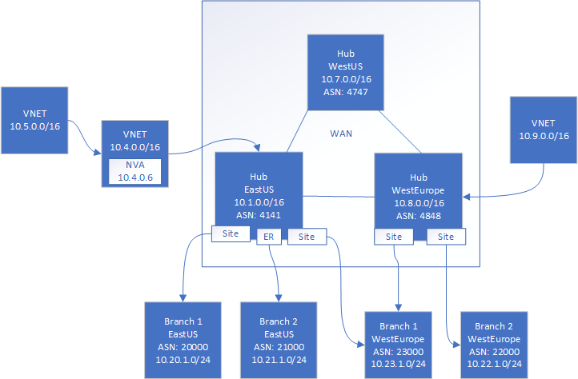

# View effective routes of a virtual hub

You can view all the routes of your Virtual WAN hub in the Azure portal. To view the routes, navigate to the virtual hub, then select **Routing -> View Effective Routes**.

## Understanding routes

The following example can help you better understand how Virtual WAN routing appears.

In this example, we have a virtual WAN with three hubs. The first hub is in the East US region, second hub is in the West Europe region, and the third hub is in the West US region. In a virtual WAN, all hubs are interconnected. In this example, we will assume that the East US and West Europe hubs have connections from on-premises branches (spokes) and Azure virtual networks (spokes).

An Azure VNet spoke (10.4.0.0/16) with a Network Virtual Appliance (10.4.0.6) is further peered to a VNet (10.5.0.0/16). See [Additional information](#abouthubroute) later in this article for more information about the hub route table.

In this example, we also assume that the West Europe Branch 1 is connected to East US hub, as well as to the West Europe hub. An ExpressRoute circuit in East US connects Branch 2 to the East US hub.

## View effective routes

When you select 'View Effective Routes' in the portal, it produces the output shown in the [Hub route table](#routetable) for the East US Hub.

To put this in perspective, the first line implies that the East US hub has learned the route of 10.20.1.0/24 (Branch 1) due to the VPN *Next hop type* connection ('Next hop' VPN Gateway Instance0 IP 10.1.0.6, Instance1 IP 10.1.0.7). *Route Origin* points to the resource ID. *AS Path* indicates the AS Path for Branch 1.

### Hub route table

Use the scroll bar at the bottom of the table to view the "AS Path".

| **Prefix** |  **Next hop type** | **Next hop** |  **Route Origin** |**AS Path** |
| ---        | ---                | ---          | ---               | ---         |
| 10.20.1.0/24|VPN |10.1.0.6, 10.1.0.7| /subscriptions/``/resourceGroups/`<rg>`/providers/Microsoft.Network/vpnGateways/343a19aa6ac74e4d81f05ccccf1536cf-eastus-gw| 20000|
|10.21.1.0/24 |ExpressRoute|10.1.0.10, 10.1.0.11|/subscriptions/``/resourceGroups/`<rg>`/providers/Microsoft.Network/expressRouteGateways/4444a6ac74e4d85555-eastus-gw|21000|
|10.23.1.0/24| VPN |10.1.0.6, 10.1.0.7|/subscriptions/``/resourceGroups/`<rg>`/providers/Microsoft.Network/vpnGateways/343a19aa6ac74e4d81f05ccccf1536cf-eastus-gw|23000|
|10.4.0.0/16|Virtual Network Connection| On-link |  |  |
|10.5.0.0/16| IP Address| 10.4.0.6|/subscriptions/``/resourceGroups/`<rg>`/providers/Microsoft.Network/virtualHubs/easthub_1/routeTables/table_1| |
|0.0.0.0/0| IP Address|	`<Azure Firewall IP>` |/subscriptions/``/resourceGroups/`<rg>`/providers/Microsoft.Network/virtualHubs/easthub_1/routeTables/table_1| |
|10.22.1.0/16| Remote Hub|10.8.0.6, 10.8.0.7|/subscriptions/``/resourceGroups/`<rg>`/providers/Microsoft.Network/virtualHubs/westhub_| 4848-22000 |
|10.9.0.0/16| Remote Hub|  On-link |/subscriptions/``/resourceGroups/`<rg>`/providers/Microsoft.Network/virtualHubs/westhub_1| |

>[!NOTE]
> If the East US and the West Europe hubs were not communicating with each other in the example topology, the route learned (10.9.0.0/16) would not exist. Hubs only advertise networks that are directly connected to them.
>

## Additional information

### About the hub route table

You can create a virtual hub route and apply the route to the virtual hub route table. You can apply multiple routes to the virtual hub route table. This lets you set a route for destination VNet via an IP address (typically the Network Virtual Appliance (NVA) in a spoke VNet). For more information about NVAs, see [Route traffic from a virtual hub to an NVA](virtual-wan-route-table-portal.md). Please note that these routes will not show up in the effective route table. The effective route table contains only the prefixes for local and remote hubs plus connected Virtual Network address space and routes learned via BGP.

### About default route (0.0.0.0/0)

A virtual hub has the ability to propagate a learned default route to a virtual network, a site-to-site VPN, and an ExpressRoute connection if the flag is ‘Enabled’ on the connection. This flag is visible when you edit a virtual network connection, a VPN connection, or an ExpressRoute connection. 'EnableInternetSecurity' is always false by default on Hub VNet, ExpressRoute, and VPN connections.

The default route does not originate in the virtual WAN hub. The default route is propagated if it is already learned by the virtual WAN hub as a result of deploying a firewall in the hub, or if another connected site has forced tunneling enabled.

## Next steps

For more information about Virtual WAN, see the [Virtual WAN Overview](virtual-wan-about.md).
