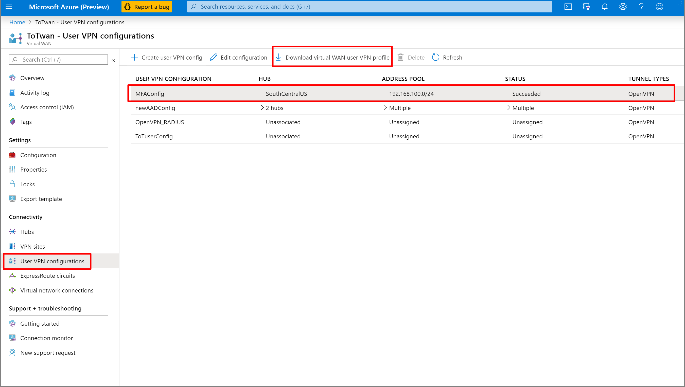
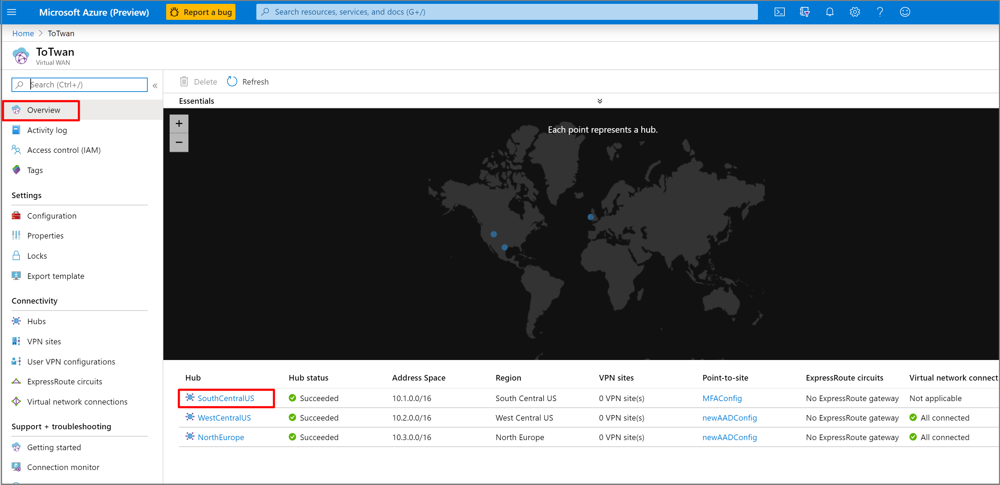
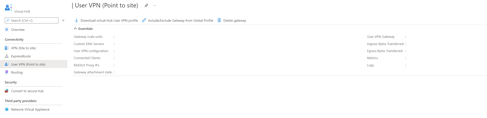
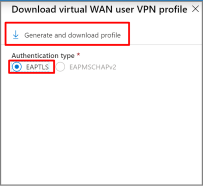

# Download a global or hub-based profile for User VPN clients

Azure Virtual WAN offers two types of connectivity for remote users: Global and Hub-based. Use the following sections to learn about and download a profile. 

> [!IMPORTANT]
> RADIUS authentication supports only the Hub-based profile.

## Global profile

The profile points to a load balancer that includes all active User VPN hubs. The user is directed to the hub that is closest to the user's geographic location. This type of connectivity is useful when users travel to different locations frequently. To download the **global** profile:

1. Navigate to the virtual WAN.
2. Click **User VPN configuration**.
3. Highlight the configuration for which you want to download the profile.
4. Click **Download virtual WAN user VPN profile**.

   

## Hub-based profile

The profile points to a single hub. The user can only connect to the particular hub using this profile. To download the **hub-based** profile:

1. Navigate to the virtual WAN.
2. Click **Hub** in the Overview page.

    
3. Click **User VPN (Point to site)**.
4. Click **Download virtual Hub User VPN profile**.

   
5. Check **EAPTLS**.
6. Click **Generate and download profile**.

   

## Next steps

To learn more about Virtual WAN, see the [Virtual WAN Overview](virtual-wan-about.md) page.
