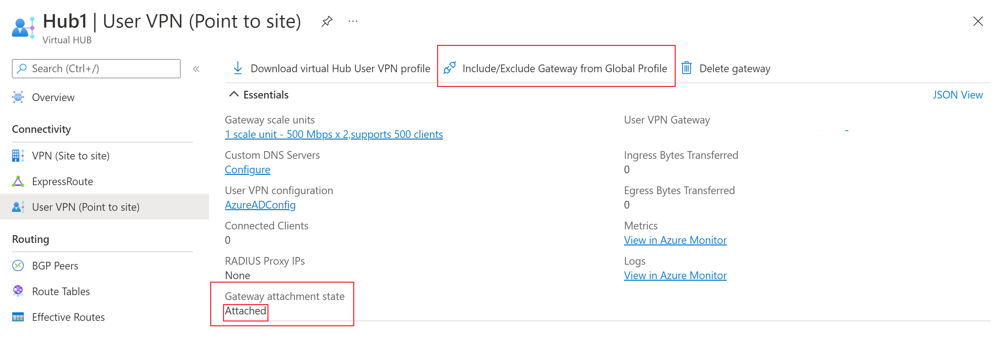

# Download a global or hub-based profile for User VPN clients

Azure Virtual WAN offers two types of connectivity for remote users: Global and Hub-based. Use the following sections to learn about and download a profile. 

> [!IMPORTANT]
> RADIUS authentication supports only the Hub-based profile.

## Global profile

The global profile associated with a User VPN Configuration points to a load balancer that includes all active User VPN hubs using that User VPN Configuration. A user connected to the global profile is directed to the hub that is closest to the user's geographic location. This type of connectivity is useful when users travel to different locations frequently. 

For example, you can associate a VPN configuration to 2 different Virtual WAN hubs, one in West US and one in Southeast Asia. If a user connects to the global profile associated with the User VPN configuration, they will connect to the closest Virtual WAN hub based on their location. 

To download the **global** profile:

1. Navigate to the virtual WAN.
2. Click **User VPN configuration**.
3. Highlight the configuration for which you want to download the profile.
4. Click **Download virtual WAN user VPN profile**.

   

### Include or exclude hub from global profile

By default, every hub using a specific User VPN Configuration is included in the corresponding global VPN profile. You may choose to exclude a hub from the global VPN profile, meaning a user will not be load-balanced to connect to that hub's gateway if they are using the global VPN profile. 

To check whether or not the hub is included in the global VPN profile:

1. Navigate to the hub
1. Navigate to **User VPN (Point to site)** under **Connectivity** on the left-hand panel
1. See **Gateway Attachment State** to determine if this hub is included in the global VPN profile. If the state is **attached**, then the hub is included in the global VPN profile. If the state is **detached**, then the hub is not included in the global VPN profile. 

 :::image type="content" source="./media/global-hub-profile/attachment-state.png" alt-text="Screenshot showing attachment state of gateway."lightbox="./media/global-hub-profile/attachment-state.png":::

To include or exclude a specific hub from the global VPN profile: 

1. Click **Include/Exclude Gateway from Global Profile**

   :::image type="content" source="./media/global-hub-profile/include-exclude-1.png" alt-text="Screenshot showing how to include or exclude hub from profile" lightbox="/media/global-hub-profile/include-exclude-1.png":::

1. Click **Exclude** if you wish to remove this hub's gateway from the WAN Global User VPN Profile. Users who are using the Hub-level User VPN profile will still be able to connect to this gateway. Users who are using the WAN-level profile will not be able to connect to this gateway.

1. Click **Include** if you wish to include this hub's gateway in the Virtual WAN Global User VPN Profile. Users who are using this WAN-level profile will be able to connect to this gateway. 

   

## Hub-based profile

The profile points to a single hub. The user can only connect to the particular hub using this profile. To download the **hub-based** profile:

1. Navigate to the virtual WAN.
2. Click **Hub** in the Overview page.

    
3. Click **User VPN (Point to site)**.
4. Click **Download virtual Hub User VPN profile**.
 :::image type="content" source="./media/global-hub-profile/hub2.png" alt-text="Screenshot showing how to download hub profile."lightbox="./media/global-hub-profile/hub2.png":::

5. Check **EAPTLS**.
6. Click **Generate and download profile**.

   

## Next steps

To learn more about Virtual WAN, see the [Virtual WAN Overview](virtual-wan-about.md) page.
