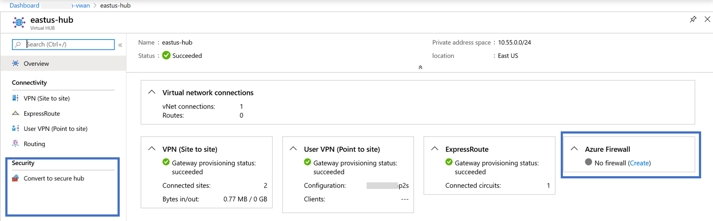
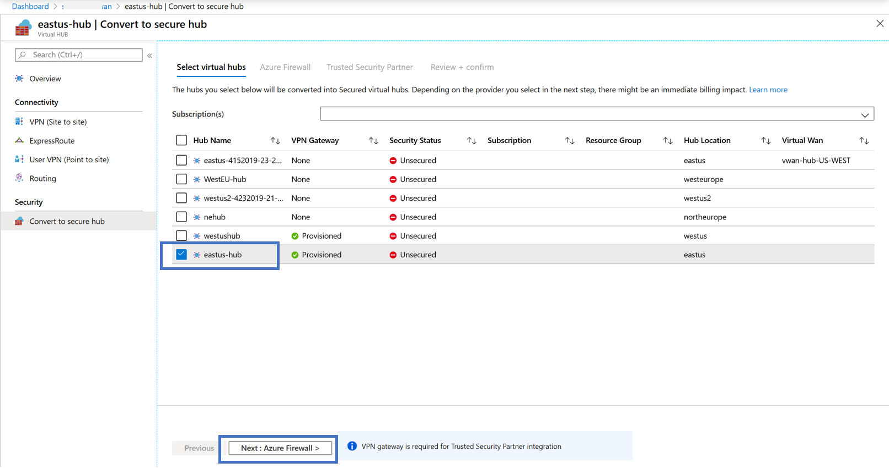
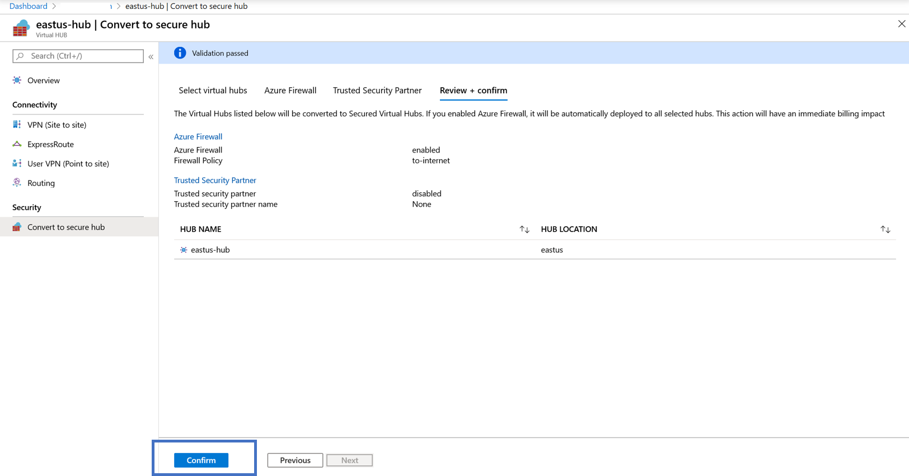
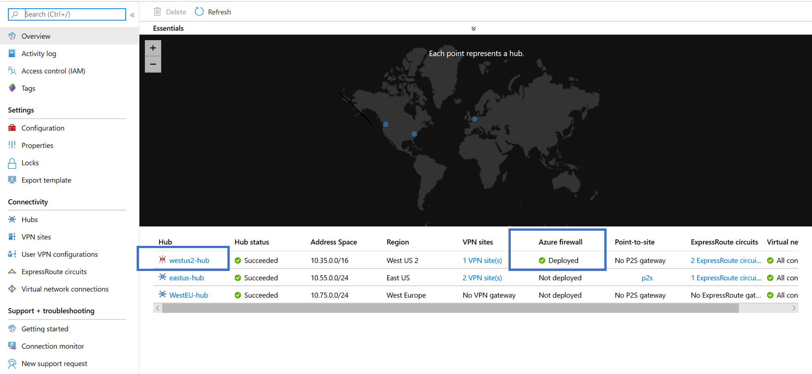
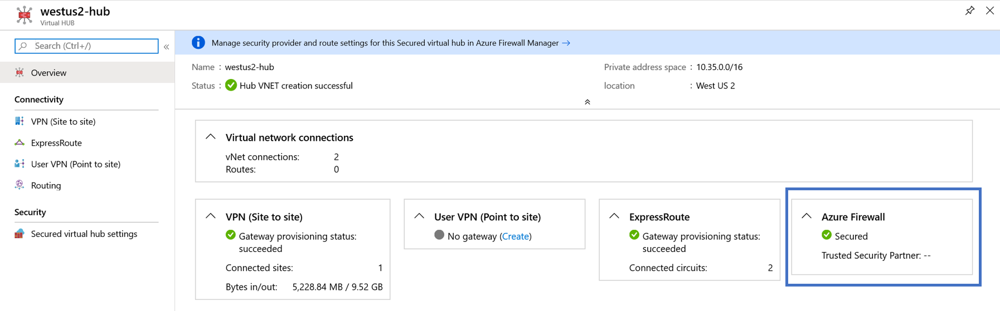
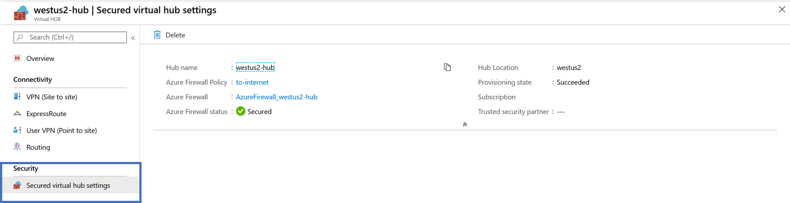
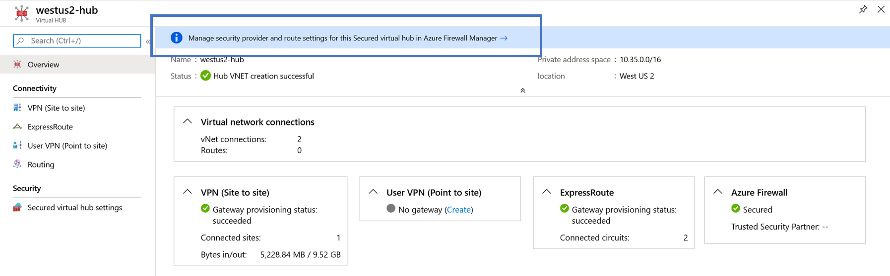
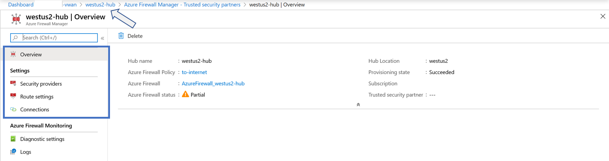

# Configure Azure Firewall in a Virtual WAN hub

A **secured hub** is an Azure Virtual WAN hub with Azure Firewall. This article walks you through the steps to convert a virtual WAN hub to a secured hub by installing Azure Firewall directly from the Azure Virtual WAN portal pages.

## Before you begin

The steps in this article assume that you have already deployed a virtual WAN with one or more hubs.

To create a new virtual WAN and a new hub, use the steps in the following articles:

* [Create a virtual WAN](virtual-wan-site-to-site-portal.md#openvwan)
* [Create a hub](virtual-wan-site-to-site-portal.md#hub)

## View virtual hubs

The **Overview** page for your virtual WAN shows a list of virtual hubs and secured hubs. The following figure shows a virtual WAN with no secured hubs.

## Convert to secured hub

1. On the **Overview** page for your virtual WAN, select the hub that you want to convert to a secured hub. On the virtual hub page, you see two options to deploy Azure Firewall into this hub. Select either option.

   

1. After you select one of the options, you see the **Convert to secure hub** page. Select a hub to convert, and then select **Next: Azure Firewall** at the bottom of the page.

   
1. After completing the workflow, select **Confirm**.

   

1. After the hub has been converted to a secured hub, you can view it on the virtual WAN **Overview** page.

   

## View hub resources

From the virtual WAN **Overview** page, select the secured hub. On the hub page, you can view all the virtual hub resources, including Azure Firewall.

To view Azure Firewall settings from the secured hub, under **Security**, select **Secured virtual hub settings**.

## Configure additional settings

To configure additional Azure Firewall settings for the virtual hub, select the link to **Azure Firewall Manager**. For information about firewall policies, see [Azure Firewall Manager](../firewall-manager/secure-cloud-network.md#create-a-firewall-policy-and-secure-your-hub).

To return to the hub **Overview** page, you can navigate back by clicking the path, as shown by the arrow in the following figure.

## Next steps

For more information about Virtual WAN, see the [FAQ](virtual-wan-faq.md).
