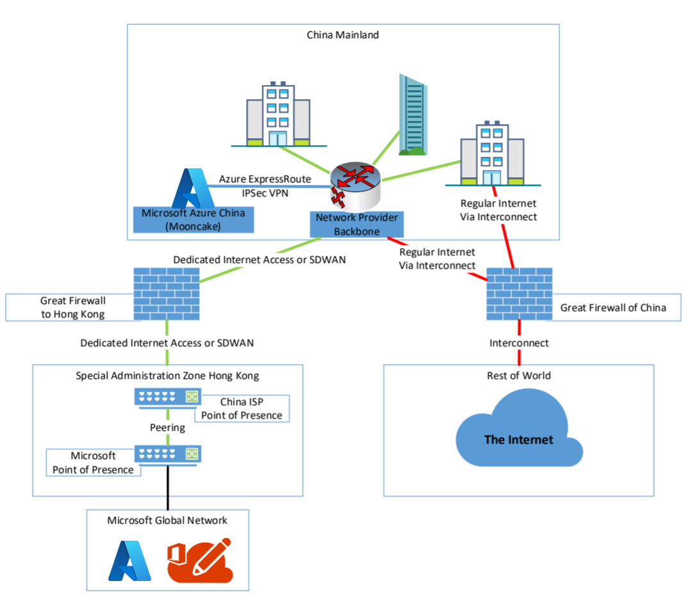
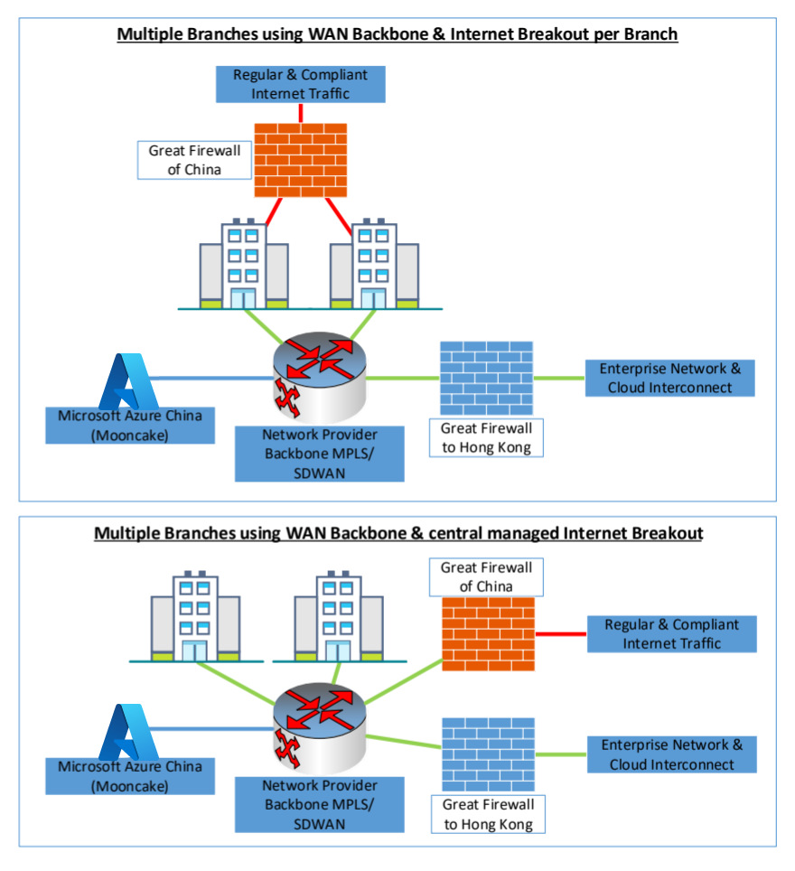
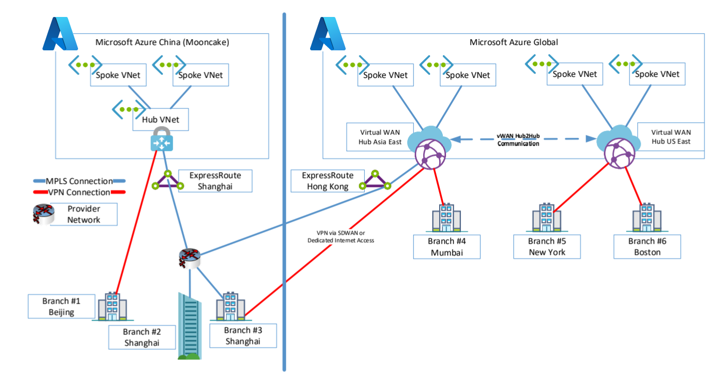
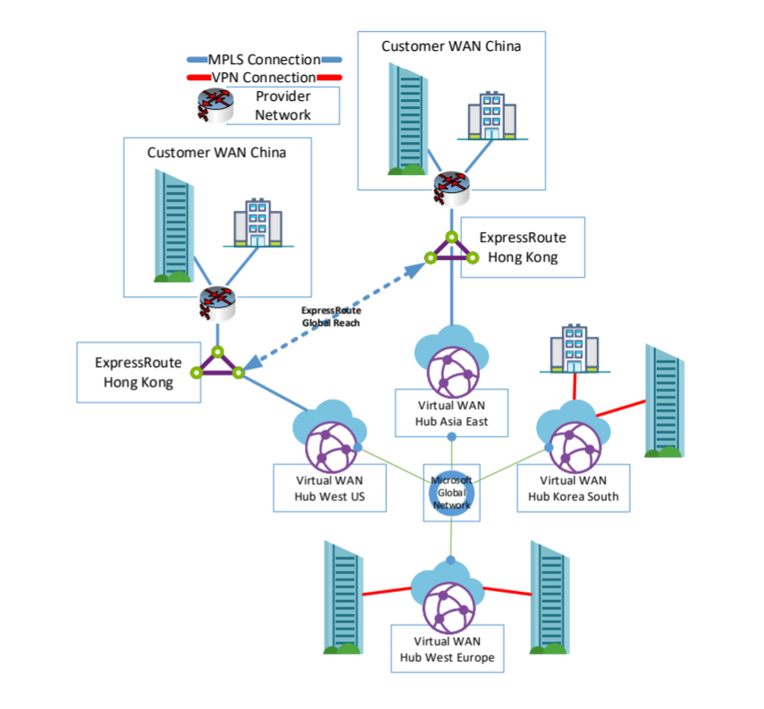
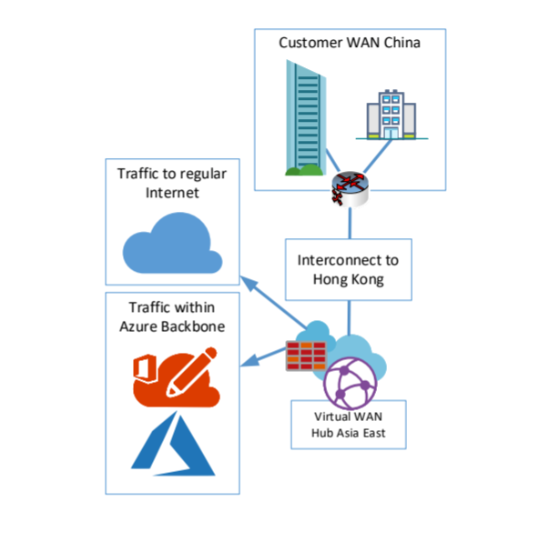
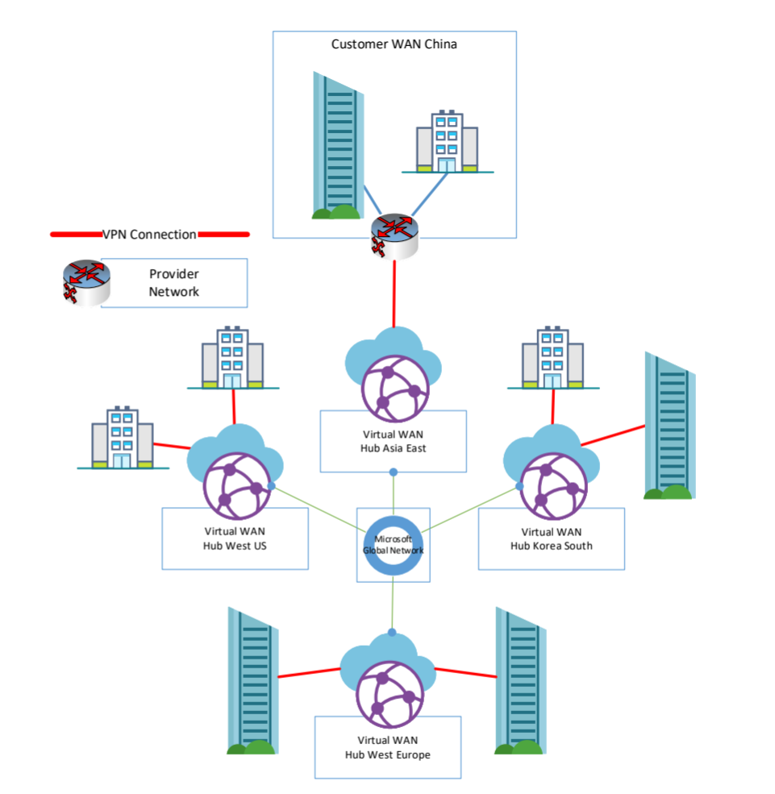
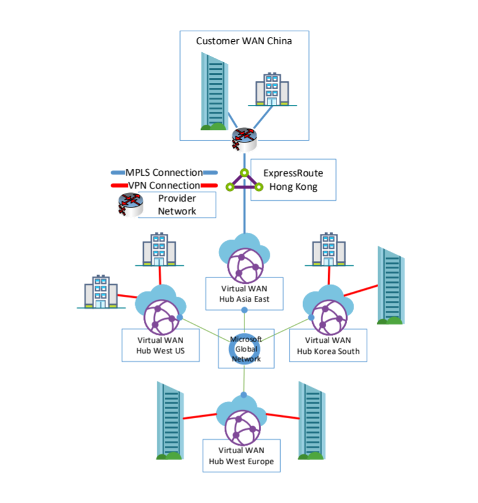
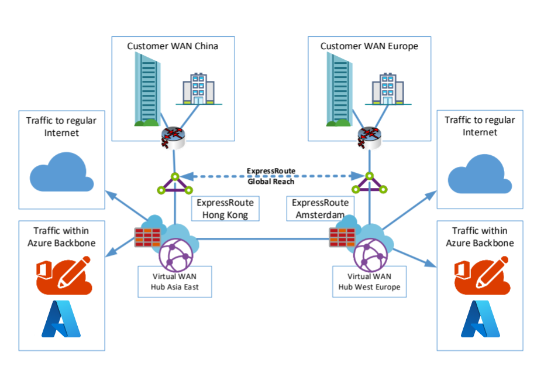

# Interconnect with China using Azure Virtual WAN and Secure Hub

When looking at common automotive, manufacturing, logistics industries or other institutes like embassies, there is often the question about how to improve interconnection with China. Those improvements are mostly relevant for using Cloud Services like Office 365, Azure Global Services, or interconnect branches inside of China with a customer backbone.

In most of the cases, customers are struggling with high latencies, low bandwidth, unstable connection, and high costs connecting to outside of China (for example, Europe or the United States).

A reason for these struggles is the "Great Firewall of China", which protects the Chinese part of the Internet and filters traffic to China. Nearly all traffic running from China Mainland to outside of China, except the special administration zones like Hong Kong and Macau, passes the Great Firewall. The traffic running through Hong Kong and Macau does not hit the Great Firewall in full force, it is handled by a subset of the Great Firewall.

Using Virtual WAN, a customer can establish a more performant and stable connection to Microsoft Cloud Services and a connection to their enterprise network without breaking the Chinese cybersecurity law.

## Requirements and workflow

If you want to stay compliant to the Chinese cybersecurity law, you need to meet a set of certain conditions.

First, you need to work together with a network and ISP who owns an ICP (Internet Content Provider) license for China. In most cases, you'll end up with one of the following providers:

* China Telecom Global Ltd.
* China Mobile Ltd.
* China Unicom Ltd.
* PCCW Global Ltd.
* Hong Kong Telecom Ltd.

Depending on the provider and your needs, you now need to purchase one of the following network connectivity services to interconnect your branches within China.

* A MPLS/IPVPN Network 
* A Software Defined WAN (SDWAN)
* Dedicated Internet Access

Next, you need to agree with that provider to give a breakout to the Microsoft Global Network and its Edge Network in Hong Kong, not in Beijing or Shanghai. In this case, Hong Kong is very important because of its physical connection and location to China.

While most customers think using Singapore for interconnect is the best case because it looks nearer to China when looking on the map, this is not true. When you follow network fiber maps, nearly all network connects go through Beijing, Shanghai, and Hong Kong. This makes Hong Kong a better location choice to interconnect to China.

Depending on the provider, you may get different service offerings. The table below shows an example of providers and the service they offer, based on information at the time this article was written.

| Service | Provider examples |
| --- | --- |
| MPLS/IPVPN Network |PCCW, China Telecom Global |
|SDWAN| PCCW, China Telecom Global|
| Dedicated Internet Access | PCCW, Hong Kong Telecom, China Mobil|

With your provider, you can agree on which of the following two solutions to use to reach the Microsoft global backbone:

* Getting a Microsoft Azure ExpressRoute terminated in Hong Kong. That would be the case for the use of MPLS/IPVPN. Currently, only the only ICP license provider with ExpressRoute to Hong Kong is China Telecom Global. However, they can also talk to the other providers if they leverage Cloud Exchange Providers like Megaport or InterCloud. For more information, see [ExpressRoute connectivity providers](../expressroute/expressroute-locations-providers.md#partners).

* Using a Dedicated Internet Access directly at one of the following Internet Exchange Points, or using a private network interconnect.

The following list shows Internet Exchanges possible in Hong Kong:

* AMS-IX Hong Kong
* BBIX Hong Kong
* Equinix Hong Kong
* HKIX

When using this connect, your next BGP hop for Microsoft Services must be Microsoft Autonomous System Number (AS#) 8075. If you use a single location or SDWAN solution, that would be the choice of connection.

Either way, we still recommend that you have a second and regular Internet Breakout into the Chinese Mainland. This is to split the traffic between enterprise traffic to cloud services like Microsoft 365 and Azure, and by-law regulated Internet traffic.

A compliant network architecture within China could look like the following example:

In this example, having an interconnect with the Microsoft Global Network in Hong Kong, you can now start to leverage the [Azure Virtual WAN Global Transit Architecture](virtual-wan-global-transit-network-architecture.md) and additional services, like Azure secure Virtual WAN hub, in order to consume services and interconnect to your branches and datacenter outside China.

## Hub-to-hub communication

In this section, we use Virtual WAN hub-to-hub communication to interconnect. In this scenario, you create a new Virtual WAN hub resource to connect to a Virtual WAN hub in Hong Kong, other regions you prefer, a region where you already have Azure resources, or where want to connect.

A sample architecture could look like following example:

In this example, the China branches connect to Azure Cloud China and each other by using VPN or MPLS connections. Branches that need to be connected to Global Services use MPLS or Internet-based services that are connected directly to Hong Kong. If you want to use ExpressRoute in Hong Kong as well as in the other region, you need to configure [ExpressRoute Global Reach](../expressroute/expressroute-global-reach.md) to interconnect both ExpressRoute Circuits.

ExpressRoute Global Reach is not available in some regions. If you need to interconnect with Brazil or India, for example, you need to leverage [Cloud Exchange Providers](../expressroute/expressroute-locations.md#connectivity-through-exchange-providers) to provide the routing services.

The figure below shows both examples for this scenario.

## Secure Internet breakout for Office 365

Another consideration is network security as well as logging for the entry point between China and the Virtual WAN established backbone component, and the customer backbone. In most cases, there is a need to breakout to the Internet in Hong Kong to directly reach the Microsoft Edge Network and, with that, the Azure Front Door Servers used for Microsoft 365 Services.

For both scenarios with Virtual WAN, you would leverage the [Azure Virtual WAN secured hub](../firewall-manager/secured-virtual-hub.md). Using Azure Firewall Manager, you can change a regular Virtual WAN hub to a secured hub, and then deploy and manage an Azure Firewall within that hub.

The following figure shows an example of this scenario:

## Architecture and traffic flows

Depending on your choice regarding the connection to Hong Kong, the overall architecture may change slightly. This section shows three available architectures in different combination with VPN or SDWAN and/or ExpressRoute.

All of these options make use of Azure Virtual WAN secured hub for direct M365 connectivity in Hong Kong. These architectures also support the compliance requirements for [Office 365 Multi-Geo](https://docs.microsoft.com/office365/enterprise/office-365-multi-geo) and keep that traffic near the next Office 365 Front Door location. As a result, it's also an improvement for the usage of Microsoft 365 out of China.

When using Azure Virtual WAN together with Internet connections, every connection can benefit from additional services like [Microsoft Azure Peering Services (MAPS)](https://docs.microsoft.com/azure/peering-service/about). MAPS was built to optimize traffic coming to the Microsoft Global Network from 3rd Party Internet Service Providers.

### Option 1: SDWAN or VPN

This section discusses a design that uses SDWAN or VPN to Hong Kong and to other branches. This option shows the use and traffic flow when using pure Internet connection on both sites of the Virtual WAN backbone. In this case, the connection is brought to Hong Kong using dedicated Internet access, or an ICP provider SDWAN solution. Other branches are using pure Internet or SDWAN Solutions as well.

In this architecture, every site is connected to the Microsoft Global Network by using VPN and Azure Virtual WAN. The traffic between the sites and Hong Kong is transmitted trough the Microsoft Network and only uses regular Internet connection on the last mile.

### Option 2: ExpressRoute and SDWAN or VPN

This section discusses a design that uses ExpressRoute in Hong Kong and other Branches with VPN/SDWAN Branches. This option shows the use of and ExpressRoute terminated in Hong Kong and other branches connected via SDWAN or VPN. ExpressRoute in Hong Kong is currently limited to a short list of Providers, which you can find in the list of [Express Route Partners](../expressroute/expressroute-locations-providers.md#global-commercial-azure).

There are also options to terminate ExpressRoute from China, for example, in South Korea or Japan. But, given compliance, regulation, and latency, Hong Kong is currently the best choice.

### Option 3: ExpressRoute only

This section discusses a design that where ExpressRoute is used for Hong Kong and other Branches. This option shows the interconnect using ExpressRoute on both ends. Here you have a different traffic flow than the other. The Microsoft 365 traffic will flow to the Azure virtual WAN secured hub and from there to the Microsoft Edge Network and the Internet.

The traffic that goes to the interconnected branches or from them to the locations in China will follow a different approach within that architecture. Currently virtual WAN does not support ExpressRoute to ExpressRoute transit. The traffic will leverage ExpressRoute Global Reach or the 3rd Party interconnect without passing the virtual WAN Hub. It will directly flow from one Microsoft Enterprise Edge (MSEE) to another.

Currently ExpressRoute Global Reach is not available in every country/region, but you can configure a solution using Azure Virtual WAN.

You can, for example, configure an ExpressRoute with Microsoft Peering and connect a VPN tunnel through that peering to Azure Virtual WAN. Now you have enabled, again, the transit between VPN and ExpressRoute without Global Reach and 3rd party provider and service, such as Megaport Cloud.

## Next steps

See the following articles for more information:

* [Global Transit network architecture with Azure Virtual WAN](virtual-wan-global-transit-network-architecture.md)

* [Create a Virtual WAN hub](virtual-wan-site-to-site-portal.md)

* [Configure a Virtual WAN secured hub](../firewall-manager/secure-cloud-network.md)

* [Azure Peering Service Preview Overview](https://docs.microsoft.com/azure/peering-service/about)
