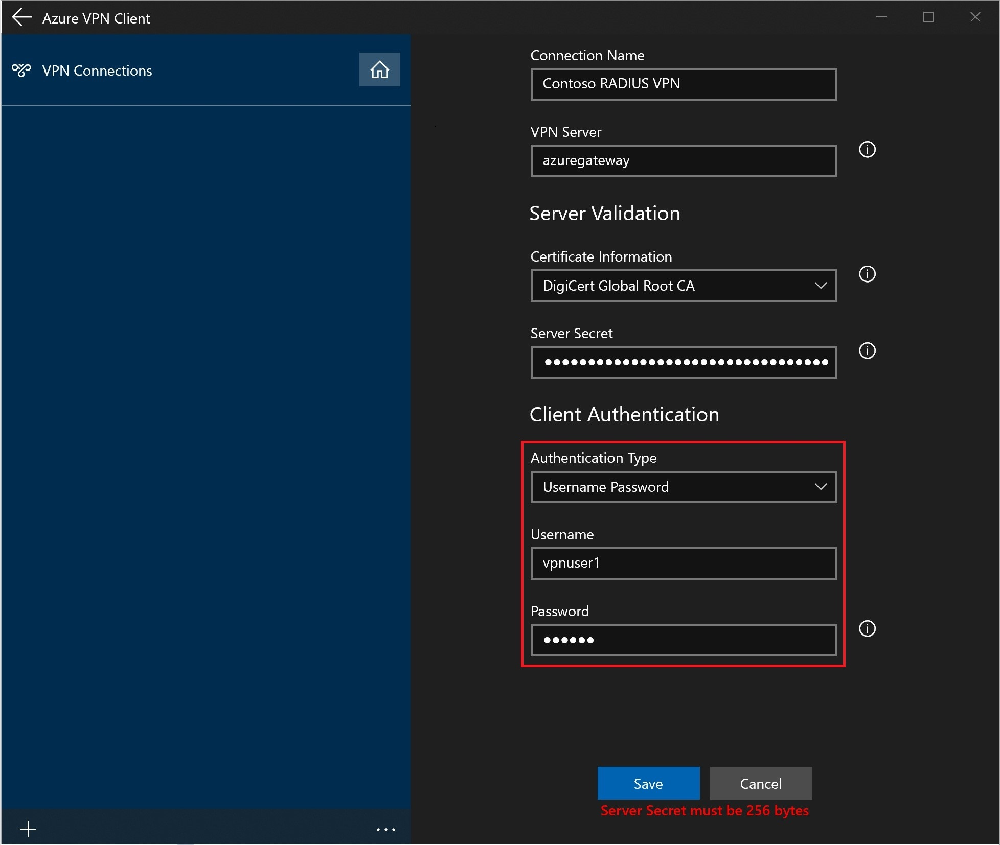
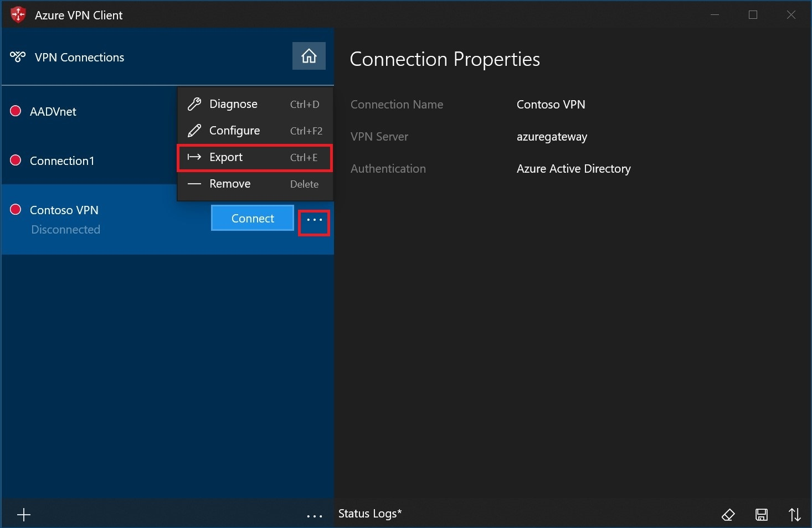
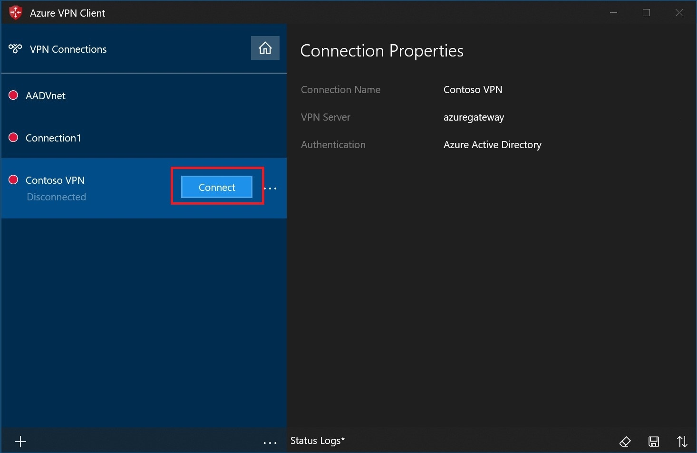
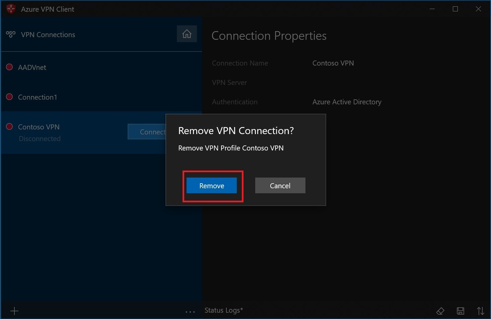
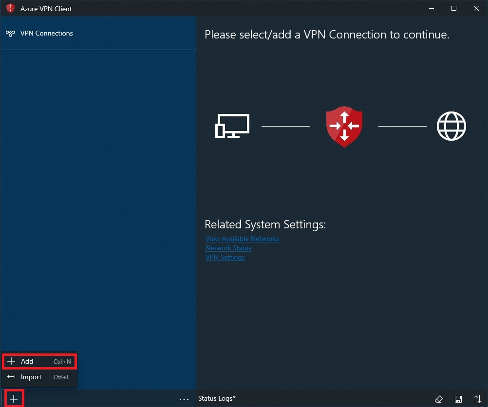
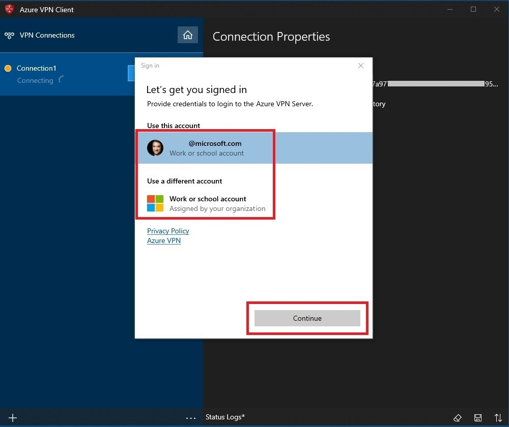
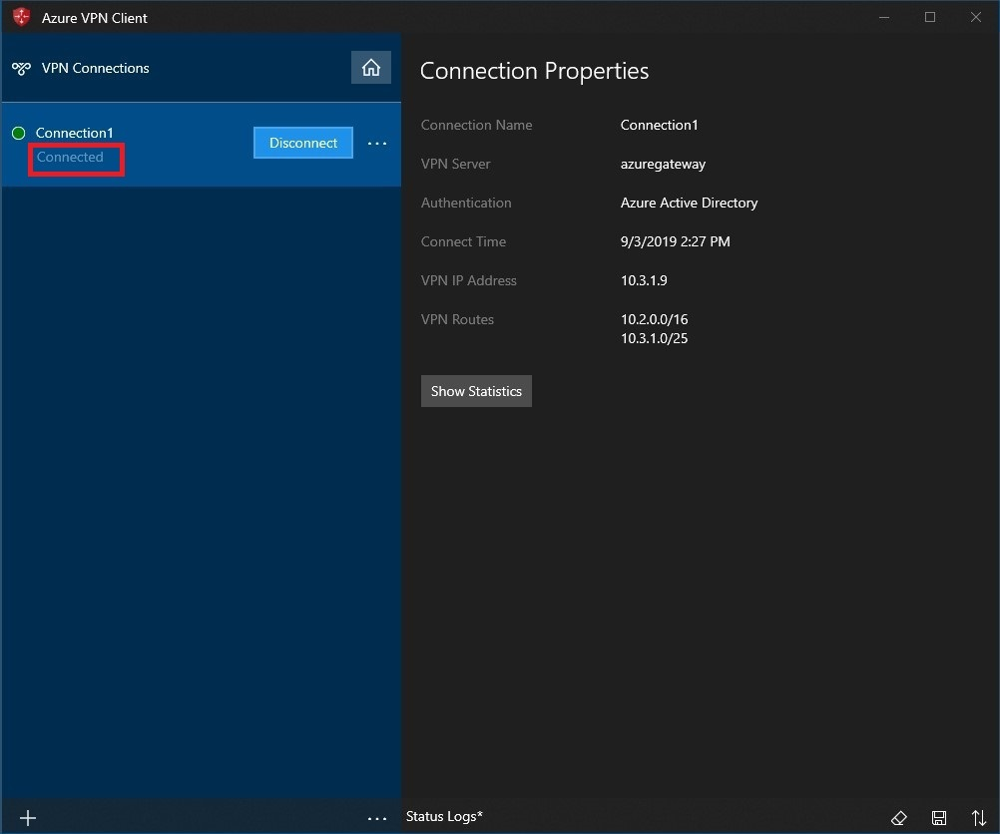
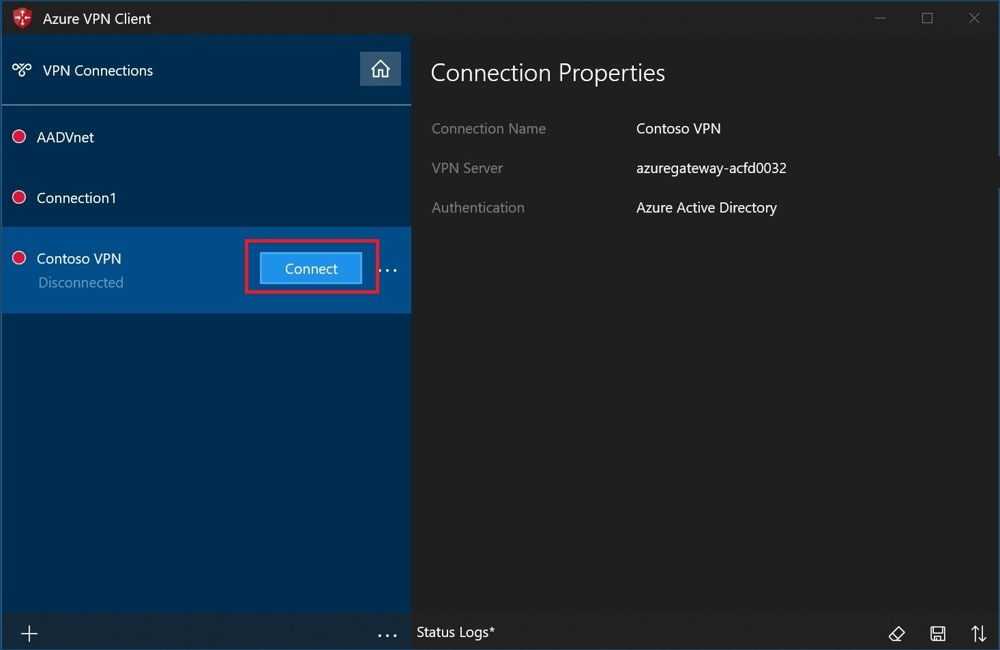
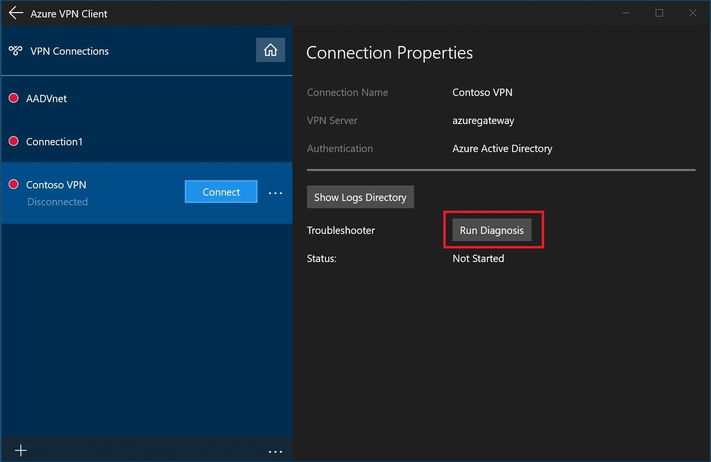

# Configure a VPN client for P2S OpenVPN protocol connections: Azure AD authentication

This article helps you configure a VPN client to connect to a virtual network using Point-to-Site VPN and Azure Active Directory authentication. Before you can connect and authenticate using Azure AD, you must first configure your Azure AD tenant. For more information, see [Configure an Azure AD tenant](openvpn-azure-ad-tenant.md).

> [!NOTE]
> Azure AD authentication is supported only for OpenVPN® protocol connections.
>

## <a name="profile"></a>Working with client profiles

To connect, you need to download the Azure VPN Client and configure a VPN client profile on every computer that wants to connect to the VNet. You can create a client profile on a computer, export it, and then import it to additional computers.

### To download the Azure VPN client

Use this [link](https://go.microsoft.com/fwlink/?linkid=2117554) to download the Azure VPN Client. Please ensure that the Azure VPN Client has permission to run in the background. To check/enable the permission follow the steps below:

1. Go to Start , then select Settings  > Privacy > Background apps.
2. Under Background Apps, make sure **Let apps run in the background** is turned On.
3. Under Choose which apps can run in the background, turn settings for Azure VPN Client to **On**.

  

### <a name="cert"></a>To create a certificate-based client profile

When working with a certificate-based profile, make sure that the appropriate certificates are installed on the client computer. For more information about certificates, see [Install client certificates](certificates-point-to-site.md).

  

### <a name="radius"></a>To create a RADIUS client profile

  
  
> [!NOTE]
> The Server Secret can be exported in the P2S VPN client profile.  Instructions on how to export a client profile can be found [here](about-vpn-profile-download.md).
>

### <a name="export"></a>To export and distribute a client profile

Once you have a working profile and need to distribute it to other users, you can export it using the following steps:

1. Highlight the VPN client profile that you want to export, select the **...**, then select **Export**.

    

2. Select the location that you want to save this profile to, leave the file name as is, then select **Save** to save the xml file.

    

### <a name="import"></a>To import a client profile

1. On the page, select **Import**.

    

2. Browse to the profile xml file and select it. With the file selected, select **Open**.

    

3. Specify the name of the profile and select **Save**.

    

4. Select **Connect** to connect to the VPN.

    

5. Once connected, the icon will turn green and say **Connected**.

    

### <a name="delete"></a>To delete a client profile

1. Select the ellipses next to the client profile that you want to delete. Then, select **Remove**.

    

2. Select **Remove** to delete.

    

## <a name="connection"></a>Create a connection

1. On the page, select **+**, then **+ Add**.

    

2. Fill out the connection information. If you are unsure of the values, contact your administrator. After filling out the values, select **Save**.

    

3. Select **Connect** to connect to the VPN.

    

4. Select the proper credentials, then select **Continue**.

    

5. Once successfully connected, the icon will turn green and say **Connected**.

    

### <a name="autoconnect"></a>To connect automatically

These steps help you configure your connection to connect automatically with Always-on.

1. On the home page for your VPN client, select **VPN Settings**.

    

2. Select **Yes** on the switch apps dialogue box.

    

3. Make sure the connection that you want to set is not already connected, then highlight the profile and check the **Connect automatically** check box.

    

4. Select **Connect** to initiate the VPN connection.

    

## <a name="diagnose"></a>Diagnose connection issues

1. To diagnose connection issues, you can use the **Diagnose** tool. Select the **...** next to the VPN connection that you want to diagnose to reveal the menu. Then select **Diagnose**.

    

2. On the **Connection Properties** page, select **Run Diagnosis**.

    

3. Sign in with your credentials.

    

4. View the diagnosis results.

    

## FAQ

### How do I add DNS suffixes to the VPN client?

You can modify the downloaded profile XML file and add the **\<dnssuffixes>\<dnssufix> \</dnssufix>\</dnssuffixes>** tags

```
<azvpnprofile>
<clientconfig>

    <dnssuffixes>
          <dnssuffix>.mycorp.com</dnssuffix>
          <dnssuffix>.xyz.com</dnssuffix>
          <dnssuffix>.etc.net</dnssuffix>
    </dnssuffixes>
    
</clientconfig>
</azvpnprofile>
```

### How do I add custom DNS servers to the VPN client?

You can modify the downloaded profile XML file and add the **\<dnsservers>\<dnsserver> \</dnsserver>\</dnsservers>** tags

```
<azvpnprofile>
<clientconfig>

	<dnsservers>
		<dnsserver>x.x.x.x</dnsserver>
        <dnsserver>y.y.y.y</dnsserver>
	</dnsservers>
    
</clientconfig>
</azvpnprofile>
```

> [!NOTE]
> The OpenVPN Azure AD client utilizes DNS Name Resolution Policy Table (NRPT) entries, which means DNS servers will not be listed under the output of `ipconfig /all`. To confirm your in-use DNS settings, please consult [Get-DnsClientNrptPolicy](https://docs.microsoft.com/powershell/module/dnsclient/get-dnsclientnrptpolicy?view=win10-ps) in PowerShell.
>

### How do I add custom routes to the VPN client?

You can modify the downloaded profile XML file and add the **\<includeroutes>\<route>\<destination>\<mask> \</destination>\</mask>\</route>\</includeroutes>** tags

```
<azvpnprofile>
<clientconfig>

	<includeroutes>
		<route>
			<destination>x.x.x.x</destination><mask>24</mask>
		</route>
	</includeroutes>
    
</clientconfig>
</azvpnprofile>
```
### How do I direct all traffic to the VPN tunnel (force tunnel)?

You can modify the downloaded profile XML file and add the **\<includeroutes>\<route>\<destination>\<mask> \</destination>\</mask>\</route>\</includeroutes>** tags

```
<azvpnprofile>
<clientconfig>

	<includeroutes>
		<route>
			<destination>0.0.0.0</destination><mask>1</mask>
		</route>
		<route>
			<destination>128.0.0.0</destination><mask>1</mask>
		</route>
	</includeroutes>
    
</clientconfig>
</azvpnprofile>
```

### How do I block (exclude) routes from the VPN client?

You can modify the downloaded profile XML file and add the **\<excluderoutes>\<route>\<destination>\<mask> \</destination>\</mask>\</route>\</excluderoutes>** tags

```
<azvpnprofile>
<clientconfig>

	<excluderoutes>
		<route>
			<destination>x.x.x.x</destination><mask>24</mask>
		</route>
	</excluderoutes>
    
</clientconfig>
</azvpnprofile>
```

## Next steps

For more information, see [Create an Azure Active Directory tenant for P2S Open VPN connections that use Azure AD authentication](openvpn-azure-ad-tenant.md).
