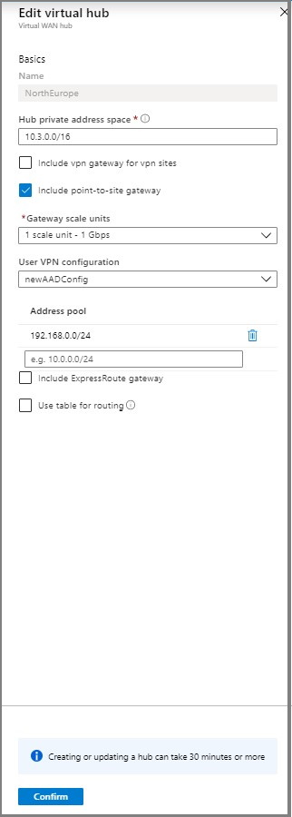
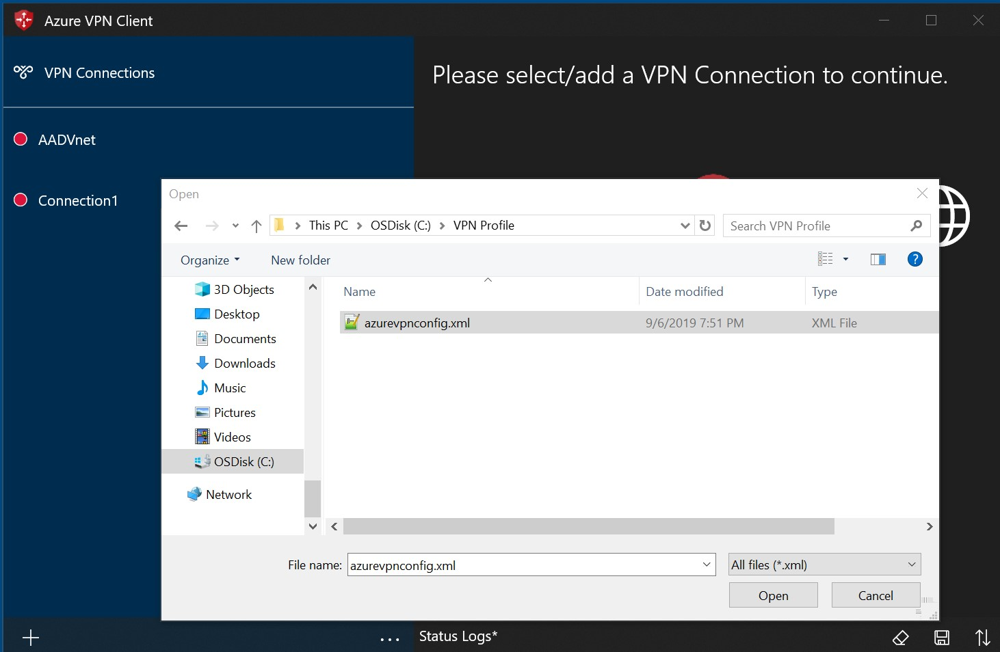
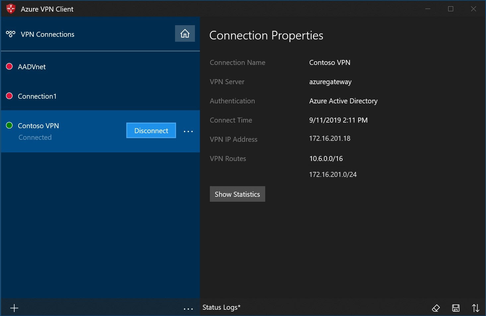
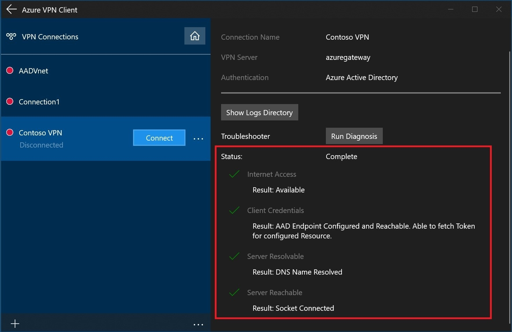

# Create an Azure Active Directory (AD) tenant for P2S OpenVPN protocol connections

When connecting to your VNet, you can use certificate-based authentication or RADIUS authentication. However, when you use the Open VPN protocol, you can also use Azure Active Directory authentication. If you want different set of users to be able to connect to different gateways, you can register multiple apps in AD and link them to different gateways.

This article helps you set up an Azure AD tenant for P2S OpenVPN authentication, and create and register multiple apps in Azure AD to allow different access for different users and groups.

> [!NOTE]
> Azure AD authentication is supported only for OpenVPN&reg; protocol connections.
>

[!INCLUDE [create](../../includes/openvpn-azure-ad-tenant-multi-app.md)]

## <a name="site"></a>6. Create a new P2S configuration

A P2S configuration defines the parameters for connecting remote clients.

1. Set the following variables, replacing values as needed for your environment.

   ```azurepowershell-interactive
   $aadAudience = "00000000-abcd-abcd-abcd-999999999999"
   $aadIssuer = "https://sts.windows.net/00000000-abcd-abcd-abcd-999999999999/"
   $aadTenant = "https://login.microsoftonline.com/00000000-abcd-abcd-abcd-999999999999"    
   ```

2. Run the following commands to create the configuration:

   ```azurepowershell-interactive
   $aadConfig = New-AzVpnServerConfiguration -ResourceGroupName <ResourceGroup> -Name newAADConfig -VpnProtocol OpenVPN -VpnAuthenticationType AAD -AadTenant $aadTenant -AadIssuer $aadIssuer -AadAudience $aadAudience -Location westcentralus
   ```

   > [!NOTE]
   > Do not use the Azure VPN client's application ID in the commands above: It will grant all users access to the gateway. Use the ID of the application(s) you registered.

## <a name="hub"></a>7. Edit hub assignment

1. Navigate to the **Hubs** blade under the virtual WAN.

2. Select the hub that you want to associate the vpn server configuration to and click the ellipsis (...).

    

3. Click **Edit virtual hub**.

4. Check the **Include point-to-site gateway** check box and pick the **Gateway scale unit** that you want.

    

5. Enter the **Address pool** from which the VPN clients will be assigned IP addresses.

6. Click **Confirm**.

7. The operation can take up to 30 minutes to complete.

## <a name="device"></a>8. Download VPN profile

Use the VPN profile to configure your clients.

1. On the page for your virtual WAN, click **User VPN configurations**.

2. At the top of the  page, click **Download user VPN config**.

3. Once the file has finished creating, you can click the link to download it.

4. Use the profile file to configure the VPN clients.

5. Extract the downloaded zip file.

6. Browse to the unzipped "AzureVPN" folder.

7. Make a note of the location of the "azurevpnconfig.xml" file. The azurevpnconfig.xml contains the setting for the VPN connection and can be imported directly into the Azure VPN Client application. You can also distribute this file to all the users that need to connect via e-mail or other means. The user will need valid Azure AD credentials to connect successfully.

## 9. Configure User VPN clients

To connect, you need to download the Azure VPN Client and import the VPN client profile that was downloaded in the previous steps on every computer that wants to connect to the VNet.

> [!NOTE]
> Azure AD authentication is supported only for OpenVPN&reg; protocol connections.
>

#### To download the Azure VPN client

Use this [link](https://go.microsoft.com/fwlink/?linkid=2117554) to download the Azure VPN Client.

#### <a name="import"></a>To import a client profile

1. On the page, select **Import**.

    

2. Browse to the profile xml file and select it. With the file selected, select **Open**.

    

3. Specify the name of the profile and select **Save**.

    

4. Select **Connect** to connect to the VPN.

    

5. Once connected, the icon will turn green and say **Connected**.

    

#### <a name="delete"></a>To delete a client profile

1. Select the ellipsis (...) next to the client profile that you want to delete. Then, select **Remove**.

    

2. Select **Remove** to delete.

    

#### <a name="diagnose"></a>To diagnose connection issues

1. To diagnose connection issues, you can use the **Diagnose** tool. Select the ellipsis (...) next to the VPN connection that you want to diagnose to reveal the menu. Then select **Diagnose**.

    

2. On the **Connection Properties** page, select **Run Diagnosis**.

    

3. Sign in with your credentials.

    

4. View the diagnosis results.

    

3. Sign in with your credentials.

    

4. View the diagnosis results.

    

## <a name="viewwan"></a>10. View your virtual WAN

1. Navigate to the virtual WAN.

2. On the Overview page, each point on the map represents a hub.

3. In the Hubs and connections section, you can view hub status, site, region, VPN connection status, and bytes in and out.

## <a name="cleanup"></a>Clean up resources

When you no longer need these resources, you can use [Remove-AzureRmResourceGroup](/powershell/module/azurerm.resources/remove-azurermresourcegroup) to remove the resource group and all of the resources it contains. Replace "myResourceGroup" with the name of your resource group and run the following PowerShell command:

```azurepowershell-interactive
Remove-AzureRmResourceGroup -Name myResourceGroup -Force
```

## Next steps

To learn more about Virtual WAN, see the [Virtual WAN Overview](virtual-wan-about.md) page.
