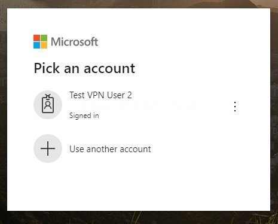
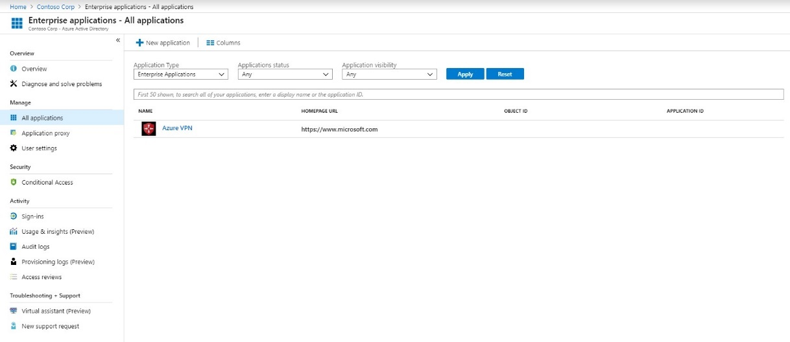

# Prepare Azure Active Directory tenant for User VPN OpenVPN protocol connections

When connecting to your Virtual Hub over the IKEv2 protocol, you can use certificate-based authentication or RADIUS authentication. However, when you use the OpenVPN protocol, you can also use Azure Active Directory authentication. This article helps you set up an Azure AD tenant for Virtual WAN User VPN (point-to-site) using OpenVPN authentication.

> [!NOTE]
> Azure AD authentication is supported only for OpenVPN&reg; protocol connections.
>

## <a name="tenant"></a>1. Create the Azure AD tenant

Verify that you have an Azure AD tenant. If you don't have an Azure AD tenant, you can create one using the steps in the [Create a new tenant](../active-directory/fundamentals/active-directory-access-create-new-tenant.md) article:

* Organization name
* Initial domain name

Example:

   

## <a name="users"></a>2. Create Azure AD tenant users

Next, create two user accounts in the newly created Azure AD tenant, one Global administrator account and one user account. The user account can be used to test OpenVPN authentication and the Global administrator account will be used to grant consent to the Azure VPN app registration. After you have created an Azure AD user account, you assign a **Directory Role** to the user in order to delegate administrative permissions.

Use the steps in [this article](../active-directory/fundamentals/add-users-azure-active-directory.md) to create the two users for your Azure AD tenant. Be sure to change the **Directory Role** on one of the created accounts to **Global administrator**.

## <a name="enable-authentication"></a>3. Grant consent to the Azure VPN app registration

1. Sign in to the Azure Portal as a user that is assigned the **Global administrator** role.

2. Next, grant admin consent for your organization, this allows the Azure VPN application to sign in and read user profiles. Copy and paste the URL that pertains to your deployment location in the address bar of your browser:

    Public

    ```
    https://login.microsoftonline.com/common/oauth2/authorize?client_id=41b23e61-6c1e-4545-b367-cd054e0ed4b4&response_type=code&redirect_uri=https://portal.azure.com&nonce=1234&prompt=admin_consent
    ````

    Azure Government

    ```
    https://login-us.microsoftonline.com/common/oauth2/authorize?client_id=51bb15d4-3a4f-4ebf-9dca-40096fe32426&response_type=code&redirect_uri=https://portal.azure.us&nonce=1234&prompt=admin_consent
    ````

    Microsoft Cloud Germany

    ```
    https://login-us.microsoftonline.de/common/oauth2/authorize?client_id=538ee9e6-310a-468d-afef-ea97365856a9&response_type=code&redirect_uri=https://portal.microsoftazure.de&nonce=1234&prompt=admin_consent
    ````

    Azure China 21Vianet

    ```
    https://https://login.chinacloudapi.cn/common/oauth2/authorize?client_id=49f817b6-84ae-4cc0-928c-73f27289b3aa&response_type=code&redirect_uri=https://portal.azure.cn&nonce=1234&prompt=admin_consent
    ```

3. Select the **Global administrator** account if prompted.

    

4. Select **Accept** when prompted.

    

5. Under your Azure AD, in **Enterprise applications**, you should now see **Azure VPN** listed.

    

## Next steps

In order to connect to your virtual networks using Azure AD authentication, you must create a User VPN configuration and associate it to a Virtual Hub. See [Configure Azure AD authentication for Point-to-Site connection to Azure](virtual-wan-point-to-site-azure-ad.md).
