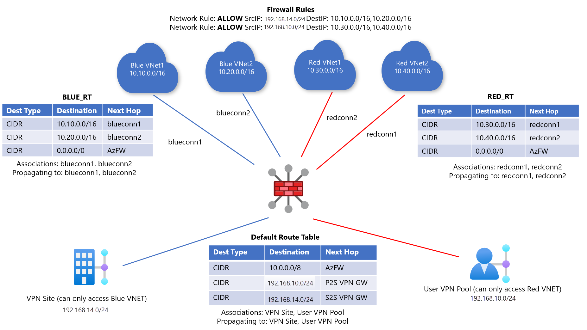

# Scenario: Custom Isolation for Virtual Networks and Branches

When working with Virtual WAN virtual hub routing, there are quite a few available scenarios. In a custom isolation scenario for both Virtual Networks (VNets) and branches, the goal is to prevent a specific set of VNets from reaching another  set of VNets. Likewise, branches (VPN/ER/User VPN) are only allowed to reach certain sets of VNets.

We also introduce the additional requirement that Azure Firewall should inspect branch to Vnet and Branch to Vnet traffic but **not**  Vnet to Vnet traffic.  

For more information about virtual hub routing, see [About virtual hub routing](about-virtual-hub-routing.md).

## Design

In order to figure out how many route tables will be needed, you can build a connectivity matrix. For this scenario it will look like the following, where each cell represents whether a source (row) can communicate to a destination (column):

| From | To:| *Blue VNets* | *Red VNets* | *Red Branches*| *Blue Branches*| 
|---|---|---|---|---|---|
| **Blue VNets** |   &#8594;|   Direct     |           |   |  AzFW|
| **Red VNets**  |   &#8594;|              |   Direct  |  AzFW  | 
| **Red Branches**   |   &#8594;|   |   AzFW  |  Direct | Direct
| **Blue Branches**| &#8594;| AzFW  |   |Direct   | Direct

Each of the cells in the previous table describes whether a Virtual WAN connection (the "From" side of the flow, the row headers) communicates with a destination (the "To" side of the flow, the column headers in italics). **Direct** implies the traffic flows directly through Virtual WAN while **AzFW** implies that the traffic is inspected by Azure Firewall before being forwarded to the destination. A blank entry means that flow is blocked in the setup.

In this case, the two route tables for the VNets are required to achieve the goal of VNet isolation without Azure Firewall in the path. We will call these routes tables **RT_BLUE** and **RT_RED**.

In addition, branches must always be associated to the  **Default** Route Table. To ensure that traffic to and from the branches is inspected by Azure Firewall,  we add static routes in the **Default**, **RT_RED** and **RT_BLUE** route tables pointing traffic to Azure Firewall and set up Network Rules to allow desired traffic. We also ensure that the branches do **not** propagate to **RT_BLUE** and **RT_RED**.

As a result, this is the final design:

* Blue virtual networks:
  * Associated route table: **RT_BLUE**
  * Propagating to route tables: **RT_BLUE**
* Red virtual networks:
  * Associated route table: **RT_RED**
  * Propagating to route tables: **RT_RED** 
* Branches:
  * Associated route table: **Default**
  * Propagating to route tables: **Default**
* Static Routes:
    * **Default Route Table**: Virtual Network Address Spaces with next hop Azure Firewall
    * **RT_RED**: 0.0.0.0/0 with next hop Azure Firewall
    * **RT_BLUE**: 0.0.0.0/0 with next hop Azure Firewall
* Firewall Network Rules:
    * **ALLOW RULE** **Source Prefix**: Blue Branch Address Prefixes **Destination Prefix**: Blue VNet Prefixes 
    * **ALLOW RULE**  **Source Prefix**: Red Branch Address Prefixes **Destination Prefix**: Red Vnet Prefixes

> [!NOTE]
> Since all branches need to be associated to the Default route table, as well as to propagate to the same set of routing tables, all branches will have the same connectivity profile. In other words, the Red/Blue concept for VNets cannot be applied to branches. However, to achieve custom routing for branches, we can forward traffic from the branches to Azure Firewall.

> [!NOTE]
> Azure Firewall by default denies traffic in a zero-trust model. If there is no explicit **ALLOW** rule that matches the inspected packet, Azure Firewall will drop the packet.

For more information about virtual hub routing, see [About virtual hub routing](about-virtual-hub-routing.md).

## Workflow

In **Figure 1**, there are Blue and Red VNets as well as branches that can access either Blue or Red VNets.

* Blue-connected VNets can reach each other and can reach all blue branches (VPN/ER/P2S) connections. In the diagram, the blue branch is the Site-to-site VPN site.
* Red-connected VNets can reach each other and can reach all red  branches (VPN/ER/P2S) connections. In the diagram, the red branch is the Point-to-site VPN users.

Consider the following steps when setting up routing.

1. Create two custom route tables in the Azure portal, **RT_BLUE** and **RT_RED** in order to customize traffic to these VNets.
2. For route table **RT_BLUE**,  apply the following settings to ensure Blue VNets learn the address prefixes of all other Blue VNets.:
   * **Association**: Select all Blue VNets.
   * **Propagation**: Select all Blue VNets.
3. Repeat the same steps for **RT_RED** route table for Red VNets.
4. Provision an Azure Firewall in Virtual WAN. For more information about Azure Firewall in the Virtual WAN hub, see [Configuring Azure Firewall in Virtual WAN hub](howto-firewall.md).
5. Add a static route to the **Default** Route Table of the Virtual Hub directing all traffic destined for the Vnet address spaces (both blue and red) to Azure Firewall. This step ensures any packets from your branches will be sent to Azure Firewall for inspection.
    * Example: **Destination Prefix**:  10.0.0.0/8 **Next Hop**: Azure Firewall
    >[!NOTE]
    > This step can also be done via Firewall Manager by selecting the "Secure Private Traffic" option. This will add a route for all RFC1918 private IP addresses applicable to VNets and branches. You will need to manually add in any branches or virtual networks that are not compliant with RFC1918. 

6. Add a static route to **RT_RED** and **RT_BLUE** directing all traffic to Azure Firewall. This step ensures VNets will not be able to access branches directly. This step cannot be done via Firewall Manager because these Virtual Networks are not associated with the Default Route Table.
    * Example: **Destination Prefix**: 0.0.0.0/0 **Next Hop**: Azure Firewall

    > [!NOTE]
    > Routing is performed using Longest Prefix Match (LPM). As a result, the 0.0.0.0/0 static routes will **NOT** be preferred over the exact prefixes that exist in **BLUE_RT** and **RED_RT**. As a result, intra-Vnet traffic will not be inspected by Azure Firewall.

This will result in the routing configuration changes as seen in the figure below.

**Figure 1**

## Next steps

* For more information about Virtual WAN, see the [FAQ](virtual-wan-faq.md).
* For more information about virtual hub routing, see [About virtual hub routing](about-virtual-hub-routing.md).
