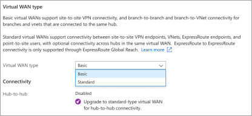
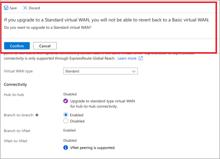
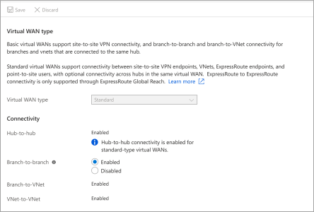

# Upgrade a virtual WAN from Basic to Standard

This article helps you upgrade a Basic WAN to a Standard WAN. A 'Basic' WAN type creates all hubs inside of it as Basic SKU hubs. In a Basic hub, you are limited to site-to-site VPN functionality only. A 'Standard' WAN type creates all the hubs inside of it as Standard SKU hubs. When you use Standard hubs, you can enable ExpressRoute, User (Point-to-site) VPN, a full mesh hub, and VNet-to-VNet transit through the Azure hubs.

The following table shows the configurations available for each WAN type:

[!INCLUDE [Basic and Standard SKUs](../../includes/virtual-wan-standard-basic-include.md)]

## To change the virtual WAN type

1. On the page for your virtual WAN, select **Configuration** to open the Configuration page.

   
2. For the Virtual WAN type, select **Standard** from the dropdown.

   
3. Understand that if you upgrade to a Standard virtual WAN, you cannot revert back to a Basic virtual WAN. Select **Confirm** if you want to upgrade.

   
4. Once the change has been saved, your virtual WAN page looks similar to this example.

   

## Next steps

To learn more about Virtual WAN, see the [Virtual WAN Overview](virtual-wan-about.md) page.