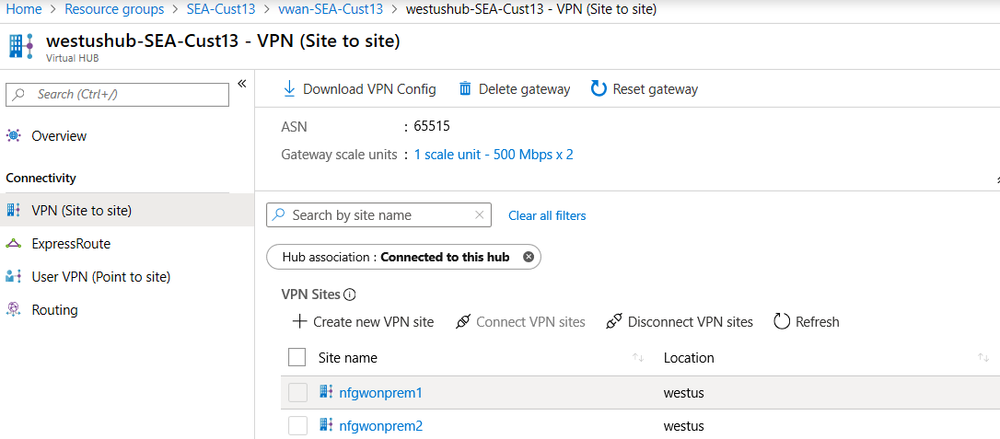
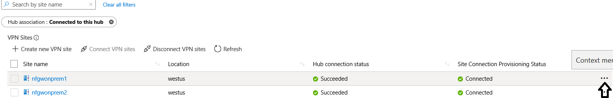
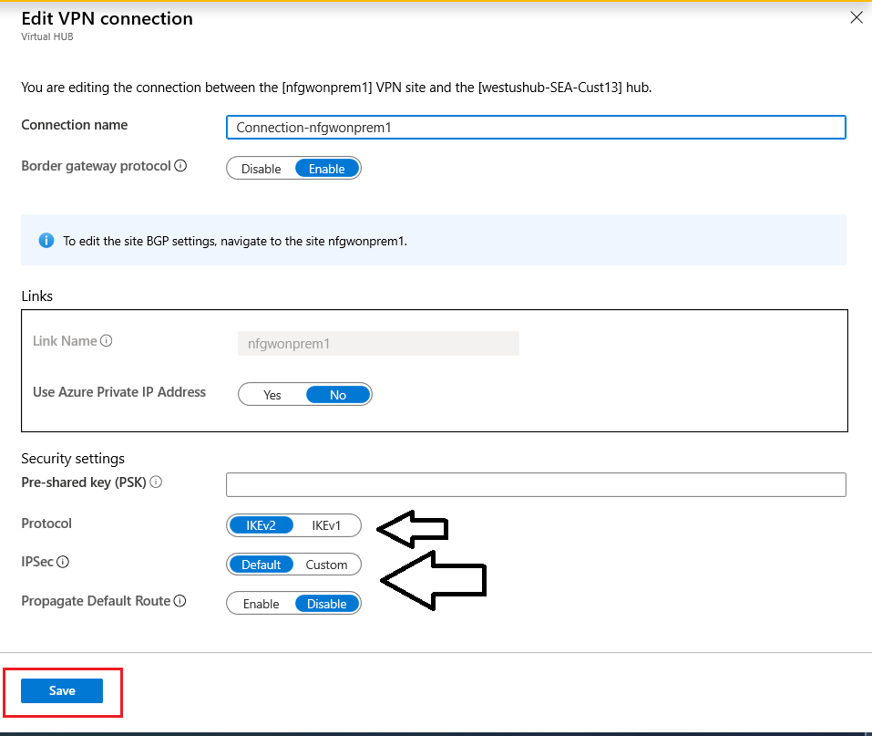

# Configure a custom IPsec policy for Virtual WAN using the portal

You can configure a custom IPsec policy for a Virtual WAN VPN connection in the Azure portal. Custom policies are helpful when you want both sides (on-premises and Azure VPN gateway) to use the same settings for IKE Phase 1 and IKE Phase 2.

## Working with custom policies

[!INCLUDE [IPsec](../../includes/virtual-wan-ipsec-custom-include.md)]

## Configure a policy

1. **Locate the virtual hub**. In the Azure portal, go to your Virtual WAN resource and locate the virtual hub that your VPN site is connected to.
2. **Select the VPN site**. From the hub overview page, click **VPN (Site to site)** and select the VPN Site for which you want to set up a custom IPsec policy.

   
3. **Edit the VPN connection**. From the **Context menu** **...**, select **Edit VPN Connection**.

   
4. **Configure the settings**. On the **Edit VPN connection** page, change the IPsec setting from default to custom and customize the IPsec policy. Select **Save** to save your settings.

   

## Next steps

To learn more about Virtual WAN, see the [Virtual WAN Overview](virtual-wan-about.md) page.