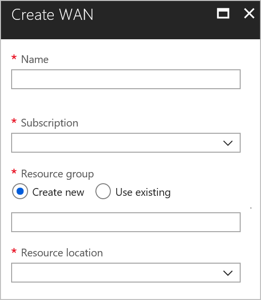

# Tutorial: Create an ExpressRoute association using Azure Virtual WAN (Preview)

This tutorial shows you how to use Virtual WAN to connect to your resources in Azure over using an ExpressRoute circuit and association. For more information about Virtual WAN, see the [Virtual WAN Overview](virtual-wan-about.md)


In this tutorial, you learn how to:

> [!div class="checklist"]
> * Create a vWAN
> * Create a hub
> * Find and associate a circuit to the hub
> * Associate the circuit to a hub(s)
> * Connect a VNet to a hub
> * View your virtual WAN
> * View resource health
> * Monitor a connection

> [!IMPORTANT]
> Azure Virtual WAN is currently a managed public preview. To use Virtual WAN, you must [Enroll in the Preview](#enroll).
>
> This public preview is provided without a service level agreement and should not be used for production workloads. Certain features may not be supported, may have constrained capabilities, or may not be available in all Azure locations. See the [Supplemental Terms of Use for Microsoft Azure Previews](https://azure.microsoft.com/support/legal/preview-supplemental-terms/) for details.

## Before you begin

Verify that you have met the following criteria before beginning your configuration:

* If you already have a virtual network that you want to connect to, verify that none of the subnets of your on-premises network overlap with the virtual networks that you want to connect to. Your virtual network does not require a gateway subnet and cannot have any virtual network gateways. If you do not have a virtual network, you can create one using the steps in this article.
* Obtain an IP address range for your hub region. The hub is a virtual network and the address range that you specify for the hub region cannot overlap with any of your existing virtual networks that you connect to. It also cannot overlap with your address ranges that you connect to on premises. If you are unfamiliar with the IP address ranges located in your on-premises network configuration, you need to coordinate with someone who can provide those details for you.
* If you don't have an Azure subscription, create a [free account](https://azure.microsoft.com/free/?WT.mc_id=A261C142F) before you begin.

## <a name="enroll"></a>1. Enroll in the Preview

Before you can configure Virtual WAN, you must first enroll your subscription in the Preview. Otherwise, you will not be able to work with Virtual WAN in the portal. To enroll, send an email to **azurevirtualwan@microsoft.com** with your subscription ID. You will receive an email back once your subscription has been enrolled.

## <a name="vnet"></a>2. Create a virtual network

If you do not already have a VNet, you can quickly create one using PowerShell. You can also create a virtual network using the Azure portal.

* Be sure to verify that the address space for the VNet that you create does not overlap with any of the address ranges for other VNets that you want to connect to, or with your on-premises network address spaces. 
* If you already have a VNet, verify that it meets the required criteria and does not have a virtual network gateway.

You can easily create your VNet by clicking "Try It" in this article to open a PowerShell console. Adjust the values, then copy and paste the commands into the console window.

### Create a resource group

Adjust the PowerShell commands, then create a resource group.

```azurepowershell-interactive
New-AzureRmResourceGroup -ResourceGroupName WANTestRG -Location WestUS
```

### Create a VNet

Adjust the PowerShell commands to create the VNet that is compatible for your environment.

```azurepowershell-interactive
$fesub1 = New-AzureRmVirtualNetworkSubnetConfig -Name FrontEnd -AddressPrefix "10.1.0.0/24"
$vnet   = New-AzureRmVirtualNetwork `
            -Name WANVNet1 `
            -ResourceGroupName WANTestRG `
            -Location WestUS `
            -AddressPrefix "10.1.0.0/16" `
            -Subnet $fesub1
```

## <a name="wan"></a>3. Create a virtual WAN

1. From a browser, navigate to the [Azure portal](https://portal.azure.com) and sign in with your Azure account.
2. At this time, you can find Virtual WAN by navigating to **All services** and searching for Virtual WAN. Or, you can search for Virtual WAN in the search box at the top of the Azure portal. Click **Virtual WAN** to open the page.
3. Click **Create** to open the **Create WAN** page. If the page is not available, you have not yet been approved for this Preview.

  
4. On the Create WAN page, fill in the following fields.

  * **Name** - Select the Name that you want to call your WAN.
  * **Subscription** - Select the subscription that you want to use.
  * **Resource Group** - Create new or use existing.
  * **Resource Location** - Choose a resource location from the dropdown. A WAN is a global resource and does not live in a particular region. However, you must select a region in order to more easily manage and locate the WAN resource that you create.


5. Click **Create** to create the configuration.

## <a name="hub"></a>4. Create a hub

1. On the page for your virtual WAN, click **Hubs**
2. On the blade opened, click **New Hub** and fill in the following files:

* **Region** - Select the region where you want your hub deployed
* **Name** - Provide a name of the hub
* **Address Space** - Provide an address space that is larger than /27
3. Select **Include ExpressRoute Gateway** and select number of scale units you want deplooyed. 
**Note: During managed preview, this cannot be scale in or out.**


## <a name="hub"></a>5. Find and associate a circuit to the hub

1. Select your vWAN and under **Virtual WAN Architecture**, select **ExpressRoute Circuits**
2. If the ExpressRoute circuit is in the same subscription as your vWAN,click **Select ExpressRoute circuit** from your subscription(s) 
3. Using the pull-down, select your ExpressRoute you would like to assicate to the hub.
4. If the ExpressRoute circuit is not in the same subscription or you have been provdied [an authorization key and peer ID](expressroute-howto-linkvnet-portal-resource-manager.md), select **Find a circuit redeeming an authorization key**
5. Enter the following details:
* **Authorization key** - Generated by the circuit owner as described above
* **Peer circuit URI** - Circuit URI that is provided by the circuit owner and is the unique identifier for the circuit
* **Routing weight** - [Routing Weight](expressroute-optimize-routing.md) allows you to prefer certain paths when multiple circuits from different peering lcoations are connected to the same hub
6. Click **Find circuit** and select the circuit, if found
7. Select 1 or more hubs from the drop down and click **Save**


## <a name="vnet"></a>6. Connect your VNet to a hub

In this step, you create the peering connection between your hub and a VNet. Repeat these steps for each VNet that you want to connect.

1. On the page for your virtual WAN, click **Virtual network connection**.
2. On the virtual network connection page, click **+Add connection**.
3. On the **Add connection** page, fill in the following fields:

    * **Connection name** - Name your connection.
    * **Hubs** - Select the hub you want to associate with this connection.
    * **Subscription** - Verify the subscription.
    * **Virtual network** - Select the virtual network you want to connect to this hub. The virtual network cannot have an already existing virtual network gateway.


## <a name="viewwan"></a>7. View your virtual WAN

1. Navigate to the virtual WAN.
2. On the Overview page, each point on the map represents a hub. Hover over any point to view the hub health summary.
3. In the Hubs and connections section, you can view hub status, site, region, VPN connection status, and bytes in and out.

## <a name="viewhealth"></a>8. View your resource health

1. Navigate to your WAN.
2. On your WAN page, in the **SUPPORT + Troubleshooting** section, click **Health** and view your resource.

## <a name="connectmon"></a>9. Monitor a connection

Create a connection to monitor communication between an Azure VM and a remote site. For information about how to set up a connection monitor, see [Monitor network communication](~/articles/network-watcher/connection-monitor.md). The source field is the VM IP in Azure, and the destination IP is the Site IP.

## <a name="cleanup"></a>10. Clean up resources

When you no longer need these resources, you can use [Remove-AzureRmResourceGroup](/powershell/module/azurerm.resources/remove-azurermresourcegroup) to remove the resource group and all of the resources it contains. Replace "myResourceGroup" with the name of your resource group and run the following PowerShell command:

```azurepowershell-interactive
Remove-AzureRmResourceGroup -Name myResourceGroup -Force
```

## <a name="feedback"></a>Preview feedback

We would appreciate your feedback. Please send an email to <azurevirtualwan@microsoft.com> to report any issues, or to provide feedback (positive or negative) for Virtual WAN. Include your company name in “[ ]” in the subject line. Also include your subscription ID if you are reporting an issue.

## Next steps

In this tutorial, you learned how to:

> [!div class="checklist"]
> * Create a vWAN
> * Create a hub
> * Find and associate a circuit to the hub
> * Associate the circuit to a hub(s)
> * Connect a VNet to a hub
> * View your virtual WAN
> * View resource health
> * Monitor a connection

To learn more about Virtual WAN, see the [Virtual WAN Overview](virtual-wan-about.md) page.