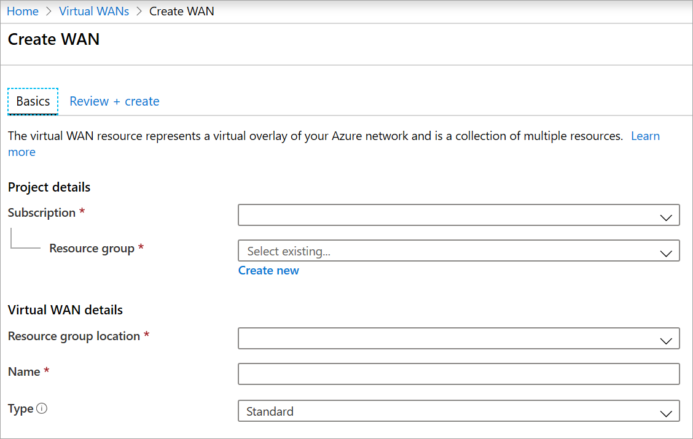
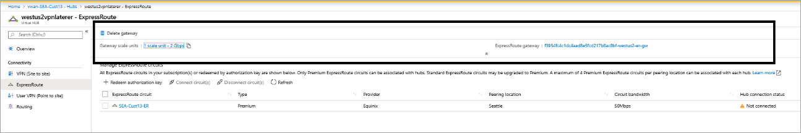
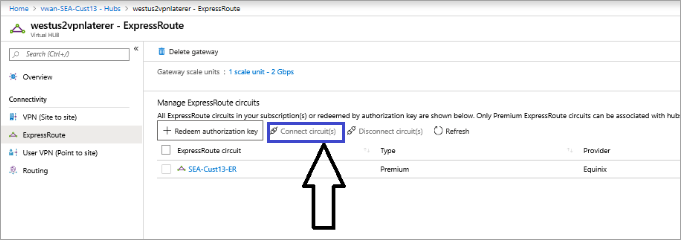
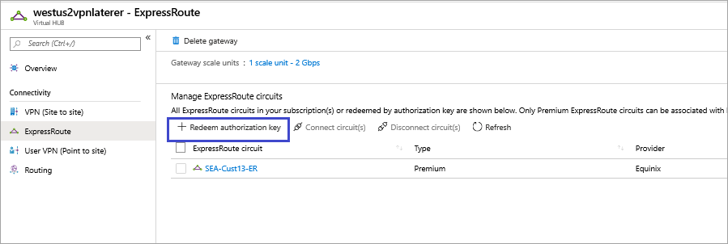
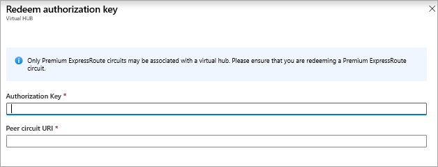
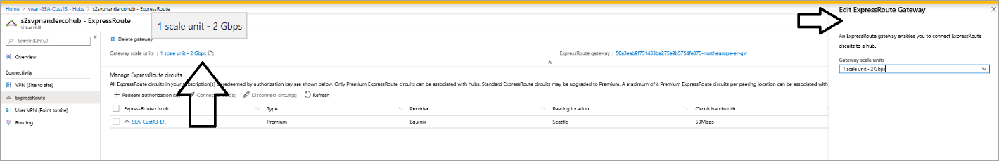
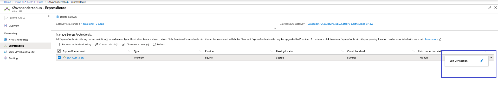
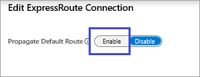

# Tutorial: Create an ExpressRoute association using Azure Virtual WAN

This tutorial shows you how to use Virtual WAN to connect to your resources in Azure over an ExpressRoute circuit. For more information about Virtual WAN and Virtual WAN resources, see the [Virtual WAN Overview](virtual-wan-about.md).

In this tutorial, you learn how to:

> [!div class="checklist"]
> * Create a virtual WAN
> * Create a hub and a gateway
> * Connect a VNet to a hub
> * Connect a circuit to a hub gateway
> * Test connectivity
> * Change a gateway size
> * Advertise a default route

## Before you begin

Verify that you have met the following criteria before beginning your configuration:

* You have a virtual network that you want to connect to. Verify that none of the subnets of your on-premises networks overlap with the virtual networks that you want to connect to. To create a virtual network in the Azure portal, see the [Quickstart](../virtual-network/quick-create-portal.md).

* Your virtual network does not have any virtual network gateways. If your virtual network has a gateway (either VPN or ExpressRoute), you must remove all gateways. This configuration requires that virtual networks are connected instead, to the Virtual WAN hub gateway.

* Obtain an IP address range for your hub region. The hub is a virtual network that is created and used by Virtual WAN. The address range that you specify for the hub cannot overlap with any of your existing virtual networks that you connect to. It also cannot overlap with your address ranges that you connect to on premises. If you are unfamiliar with the IP address ranges located in your on-premises network configuration, coordinate with someone who can provide those details for you.

* The ExpressRoute circuit must be a Premium circuit in order to connect to the hub gateway.

* If you don't have an Azure subscription, create a [free account](https://azure.microsoft.com/free/?WT.mc_id=A261C142F).

## Create a virtual WAN

From a browser, navigate to the [Azure portal](https://portal.azure.com) and sign in with your Azure account.

1. Navigate to the Virtual WAN page. In the portal, click **+Create a resource**. Type **Virtual WAN** into the search box and select Enter.
2. Select **Virtual WAN** from the results. On the Virtual WAN page, click **Create** to open the Create WAN page.
3. On the **Create WAN** page, on the **Basics** tab, fill in the following fields:

   

   * **Subscription** - Select the subscription that you want to use.
   * **Resource Group** - Create new or use existing.
   * **Resource group location** - Choose a resource location from the dropdown. A WAN is a global resource and does not live in a particular region. However, you must select a region in order to more easily manage and locate the WAN resource that you create.
   * **Name** - Type the name that you want to call your WAN.
   * **Type** - Select **Standard**. You can't create an ExpressRoute gateway using the Basic SKU.
4. After you finish filling out the fields, select **Review +Create**.
5. Once validation passes, select **Create** to create the virtual WAN.

## Create a virtual hub and gateway

A virtual hub is a virtual network that is created and used by Virtual WAN. It can contain various gateways, such as VPN and ExpressRoute. In this section, you will create an ExpressRoute gateway for your virtual hub. You can either create the gateway when you [create a new virtual hub](#newhub), or you can create the gateway in an [existing hub](#existinghub) by editing it. 

ExpressRoute gateways are provisioned in units of 2 Gbps. 1 scale unit = 2 Gbps with support up to 10 scale units = 20 Gbps. It takes about 30 minutes for a virtual hub and gateway to fully create.

### To create a new virtual hub and a gateway

Create a new virtual hub. Once a hub is created, you'll be charged for the hub, even if you don't attach any sites.

[!INCLUDE [Create a hub](../../includes/virtual-wan-tutorial-er-hub-include.md)]

### To create a gateway in an existing hub

You can also create a gateway in an existing hub by editing it.

1. Navigate to the virtual hub that you want to edit and select it.
2. On the **Edit virtual hub** page, select the checkbox **Include ExpressRoute gateway**.
3. Select **Confirm** to confirm your changes. It takes about 30 minutes for the hub and hub resources to fully create.

   

### To view a gateway

Once you have created an ExpressRoute gateway, you can view gateway details. Navigate to the hub, select **ExpressRoute**, and view the gateway.

## Connect your VNet to the hub

In this section, you create the peering connection between your hub and a VNet. Repeat these steps for each VNet that you want to connect.

1. On the page for your virtual WAN, click **Virtual network connection**.
2. On the virtual network connection page, click **+Add connection**.
3. On the **Add connection** page, fill in the following fields:

    * **Connection name** - Name your connection.
    * **Hubs** - Select the hub you want to associate with this connection.
    * **Subscription** - Verify the subscription.
    * **Virtual network** - Select the virtual network you want to connect to this hub. The virtual network cannot have an already existing virtual network gateway (neither VPN, nor ExpressRoute).

## Connect your circuit to the hub gateway

Once the gateway is created, you can connect an [ExpressRoute circuit](../expressroute/expressroute-howto-circuit-portal-resource-manager.md) to it. ExpressRoute Premium circuits that are in ExpressRoute Global Reach-supported locations can connect to a Virtual WAN ExpressRoute gateway.

### To connect the circuit to the hub gateway

In the portal, go to the **Virtual hub -> Connectivity -> ExpressRoute** page. If you have access in your subscription to an ExpressRoute circuit, you will see the circuit you want to use in the list of circuits. If you don’t see any circuits, but have been provided with an authorization key and peer circuit URI, you can redeem and connect a circuit. See [To connect by redeeming an authorization key](#authkey).

1. Select the circuit.
2. Select **Connect circuit(s)**.

   

### To connect by redeeming an authorization key

Use the authorization key and circuit URI you were provided in order to connect.

1. On the ExpressRoute page, click **+Redeem authorization key**

   
2. On the Redeem authorization key page, fill in the values.

   
3. Select **Add** to add the key.
4. View the circuit. A redeemed circuit only shows the name (without the type, provider and other information) because it is in a different subscription than that of the user.

## To test connectivity

After the circuit connection is established, the hub connection status will indicate 'this hub', implying the connection is established to the hub ExpressRoute gateway. Wait approximately 5 minutes before you test connectivity from a client behind your ExpressRoute circuit, for example, a VM in the VNet that you created earlier.

If you have sites connected to a Virtual WAN VPN gateway in the same hub as the ExpressRoute gateway, you can have bidirectional connectivity between VPN and ExpressRoute end points. Dynamic routing (BGP) is supported. The ASN of the gateways in the hub is fixed and cannot be edited at this time.

## To change the size of a gateway

If you want to change the size of your ExpressRoute gateway, locate the ExpressRoute gateway inside the hub, and select the scale units from the dropdown. Save your change. It will take approximately 30 minutes to update the hub gateway.

## To advertise default route 0.0.0.0/0 to endpoints

If you would like the Azure virtual hub to advertise the default route 0.0.0.0/0 to your ExpressRoute end points, you will need to enable 'Propagate default route'.

1. Select your **Circuit ->…-> Edit connection**.

   

2. Select **Enable** to propagate the default route.

   

## Next steps

To learn more about Virtual WAN, see the [Virtual WAN Overview](virtual-wan-about.md) page.
