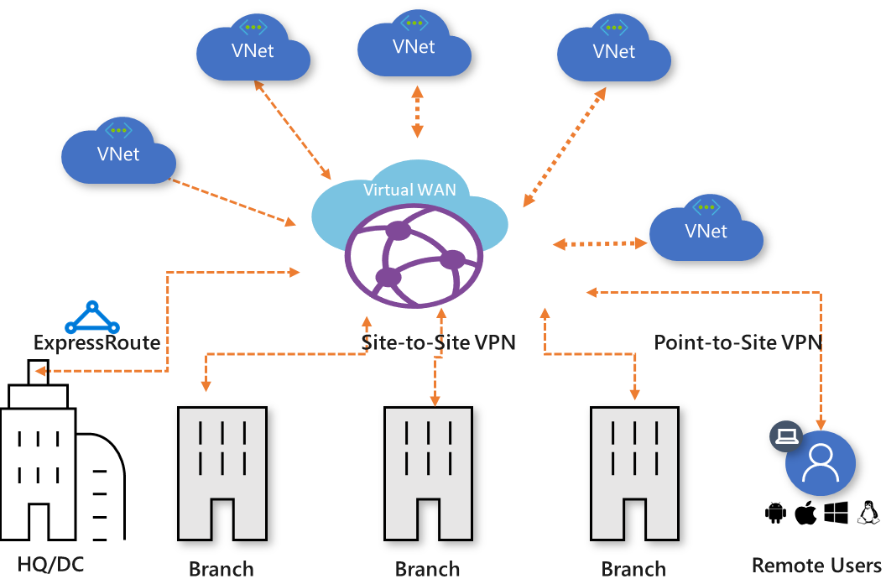
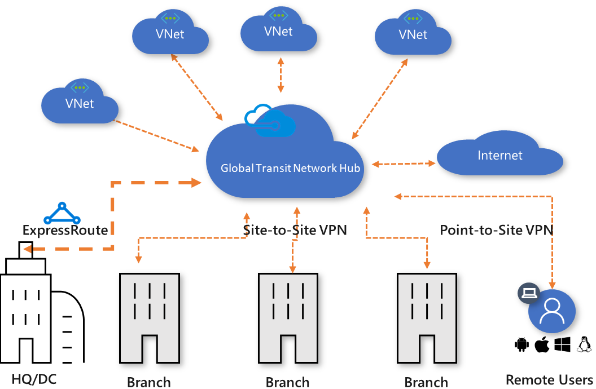
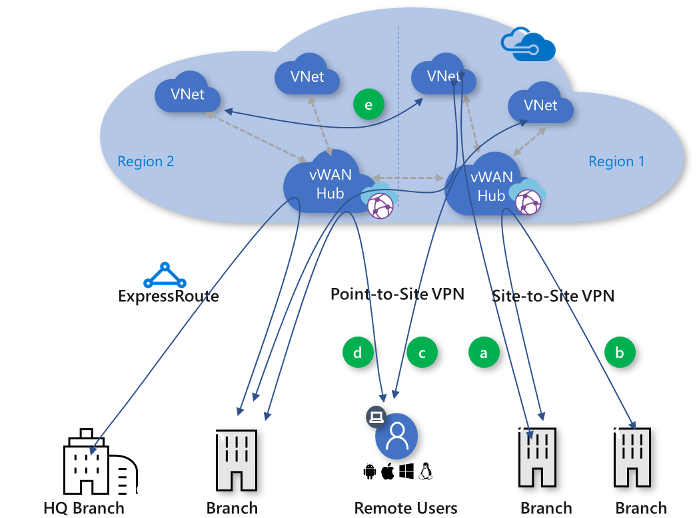

# Global transit network architecture and Virtual WAN

Global transit network architecture is being adopted by enterprises to consolidate, connect, and control the cloud-centric modern enterprise IT footprint. In a modern cloud-centric enterprise, network traffic does not need to be backhauled to HQ. Global transit network architecture is based on both familiar networking concepts, and new concepts that are unique to cloud and cloud-based architectures.

**Figure 1: Global transit network with Virtual WAN**

Modern enterprises require ubiquitous connectivity between hyper-distributed applications, data, and users across the cloud and on-premises. Azure Virtual WAN allows a global transit network architecture by enabling ubiquitous, any-to-any connectivity between globally distributed sets of VNets, sites, applications, and users. Azure Virtual WAN is a Microsoft-managed service. All the networking components that this service is composed of are hosted and managed by Microsoft. For more information about Virtual WAN, see the [Virtual WAN Overview](virtual-wan-about.md) article.

In the Azure Virtual WAN architecture, Azure regions serve as hubs to which you can choose to connect your branches. Once the branches are connected, you can leverage the Azure backbone to establish branch-to-VNet and, optionally, branch-to-branch connectivity.

You can establish a virtual WAN by creating a single Virtual WAN hub in the region that has the largest number of spokes (branches, VNets, users), and then connecting the spokes that are in other regions to the hub. Alternatively, if spokes are geographically distributed, you can also instantiate regional hubs and interconnect the hubs. The hubs are all part of the same virtual WAN, but they can be associated with different regional policies.

## Hub-and-spoke transit

The global transit network architecture is based on a classic hub-and-spoke connectivity model where the cloud hosted network 'hub' enables transitive connectivity between endpoints that may be distributed across different types of 'spokes'.
  
In this model, a spoke can be:

* Virtual network (VNets)
* Physical branch site
* Remote user
* Internet

**Figure 2: Hub-and-spoke**

Figure 2 shows the logical view of the global network where geographically distributed users, physical sites, and VNets are interconnected via a networking hub hosted in the cloud. This architecture enables logical one-hop transit connectivity between the networking endpoints. The spokes are connected to the hub by various Azure networking services such as ExpressRoute or site-to site-VPN for physical branches, VNet peering for VNets, and point-to-site VPN for remote users.

## Cross-region connectivity

For an enterprise, a cloud footprint typically follows the physical footprint. Most enterprises access the cloud from a region closest to their physical site and users. One of the key principals of global network architecture is to enable cross-region connectivity between network entities and endpoints. A cloud footprint can span multiple regions. This means that traffic from a branch that is connected to the cloud in one region can reach another branch or a VNet in a different region using hub-to-hub connectivity which is currently in preview.

## Any-to-any connectivity

Global transit network architecture enables *any-to-any connectivity* via a central network hub. This architecture eliminates or reduces the need for full mesh or partial mesh connectivity models that are more complex to build and maintain. In addition, routing control in hub-and-spoke vs. mesh networks is easier to configure and maintain.

Any-to-any connectivity, in the context of a global architecture, allows an enterprise with globally distributed users, branches, datacenters, VNets, and applications to connect to each other through the transit hub. The transit hub acts as the global transit system.

**Figure 3: Virtual WAN traffic paths**

Azure Virtual WAN supports the following global transit connectivity paths. The letters in parentheses map to Figure 3.

* Branch-to-VNet (a)  
* Branch-to-branch (b)
* Remote User-to-VNet (c)
* Remote User-to-branch (d)
* VNet-to-VNet using VNet peering (e)
* ExpressRoute Global Reach 

### Branch-to-VNet

Branch-to-VNet is the primary path supported by Azure Virtual WAN. This path allows you to connect branches to Azure IAAS enterprise workloads that are deployed in Azure VNets. Branches can be connected to the virtual WAN via ExpressRoute or site-to-site VPN. The traffic transits to VNets that are connected to the virtual WAN hubs via VNet connections.

### Branch-to-branch

Branches can be connected to an Azure Virtual WAN hub using ExpressRoute circuits and/or site-to-site VPN connections. You can connect the branches to the Virtual WAN hub that is in the region closest to the branch.

This option lets enterprises leverage the Azure backbone to connect branches. However, even though this capability is available, you should weigh the benefits of connecting branches over Azure Virtual WAN vs. using a private WAN.

### Remote User-to-VNet

You can enable direct, secure remote access to Azure using point-to-site connections from a remote user client to a virtual WAN. Enterprise remote users no longer have to hairpin to the cloud using a corporate VPN.

### Remote User-to-branch

The Remote User-to-branch path lets remote users who are using a point-to-site connection to Azure access on-premises workloads and applications by transiting through the cloud. This path gives remote users the flexibility to access workloads that are both deployed in Azure and on-premises. Enterprises can enable central cloud-based secure remote access service in Azure Virtual WAN.

### VNet-to-VNet transit using VNet peering

To connect VNets to each other in order to support multi-tier applications that are implemented across multiple VNets, use VNet peering. A VNet-to-VNet transit scenario via Azure Virtual WAN is currently not supported, but is on the Azure roadmap. Connecting VNets through VNet Peering is the recommend solution for VNets that need to be connected to each other. [Gateway transit](../virtual-network/virtual-network-peering-overview.md#gateways-and-on-premises-connectivity) (in the context of VNet peering) is not required for Virtual WAN because Virtual WAN automatically enables gateway transit.

### ExpressRoute Global Reach

ExpressRoute is a private and resilient way to connect your on-premises networks to the Microsoft Cloud. ExpressRoute Global Reach is an add-on feature for ExpressRoute. With Global Reach, you can link ExpressRoute circuits together to make a private network between your on-premises networks. Branches that are connected to Azure Virtual WAN using ExpressRoute require the ExpressRoute Global Reach to communicate with each other.

In this model, each branch that is connected to the Virtual WAN hub using ExpressRoute can connect to VNets using the branch-to-VNet path. Branch-to-branch traffic won't transit the hub because ExpressRoute Global Reach enables a more optimal path over Azure WAN.

## Security and policy control

The virtual network hub interconnects and potentially sees all transit traffic. It can be the place to host central networking functions and services such as such a cloud routing, network policy and security, and Internet access control.

## Next steps

Create a connection using Virtual WAN.

* [Site-to-site connections using Virtual WAN](virtual-wan-site-to-site-portal.md)
* [Point-to-site connections using Virtual WAN](virtual-wan-point-to-site-portal.md)
* [ExpressRoute connections using Virtual WAN](virtual-wan-expressroute-portal.md)
