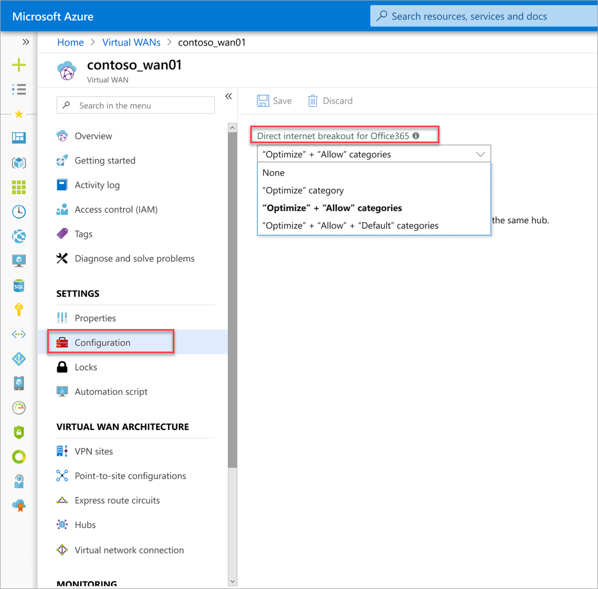

# Office 365 control plane in Virtual WAN

Virtual WAN customers with select SDWAN devices can configure O365 Internet breakout policies for trusted traffic in the Azure portal. This enables:
- O365 traffic to enter Microsoft network close to user giving optimal user experience.
- Avoids traffic back-hauling and hair pining, thus saving WAN costs.
- Delivering on the O365 connectivity principles.

## FAQs
### What is the customer benefit?
Using this feature in Virtual WAN, customers can now specify the Office 365 traffic categories that they trust for direct internet breakout. This trusted O365 traffic will by-pass proxies and route directly from the user location to the nearest Microsoft POP. This avoids traffic back-hauling and hair pining, thus providing optimal user experience and saving WAN costs. 

### What are the Office 365 traffic categories?
Office 365 endpoints represent network addresses and subnets. Endpoints may be URLs, IP addresses, or IP ranges. URLs can either be an FQDN like *account.office.net*, or a wildcard URL like **.office365.com*. Endpoints are segregated into three categories - **Optimize**, **Allow**, and **Default**, based on their criticality. More details about the endpoint categories are [here](https://docs.microsoft.com/office365/enterprise/office-365-network-connectivity-principles#BKMK_Categories).

### Which Office 365 traffic category is recommended by Microsoft for direct internet breakout?
The **Optimize** category is the most critical network endpoints and is required to bypass SSL break and inspect and other network security devices. It should have direct Internet egress close to users. These endpoints represent Office 365 scenarios that are the most sensitive to network performance, latency, and availability. This category includes a small (on the order of ~10) set of key URLs and a defined set of IP subnets dedicated to core Office 365 workloads such as Exchange Online, SharePoint Online, Skype for Business Online and Microsoft Teams. 

The **Allow** category is recommended for direct Internet egress also. Allow network traffic can tolerate some network latency though. Endpoints in the Optimize and Allow categories are all hosted in Microsoft datacenters and managed as part of Office 365. The Default category can be directed to a default Internet egress location and does not require direct Internet egress or bypass of SSL break and inspect devices.

### How do I set my O365 policies via Virtual WAN?
You can enable policies via the **Virtual WAN** -> **Settings** -> **Configuration** tab. Here you can specify your preferred categories of O365 traffic for direct internet breakout.

### How does this work?

1.	O365 traffic enters Microsoft network close to user giving optimal experience.
2.	Route policies are consumed by SDWAN. It then bypasses security proxies for the trusted categories and performs local direct breakout for these categories.
3.	Back hauling and traffic hair pining are avoided saving WAN costs.

### Which partner devices support this via Virtual WAN?
Currently, Citrix supports these policies via Virtual WAN.

### What happens to the remaining categories of (untrusted) O365 traffic?
Remaining O365 traffic will follow the customers default internet traffic path.

###	What if I have already specified my O365 policies via my SDWAN provider?
If you specify policies via both the SDWAN UX and Azure Virtual WAN, the policies set in Virtual WAN will take precedence.

## Next steps
- Learn more about [Virtual WAN](virtual-wan-about.md).