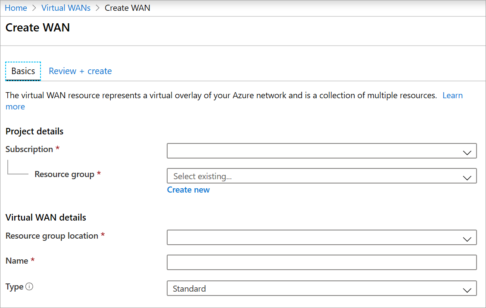
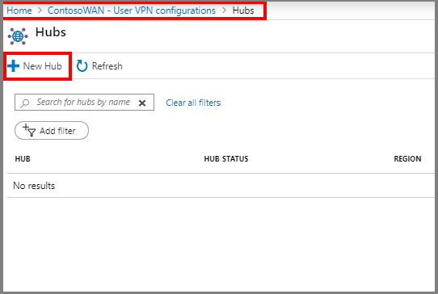
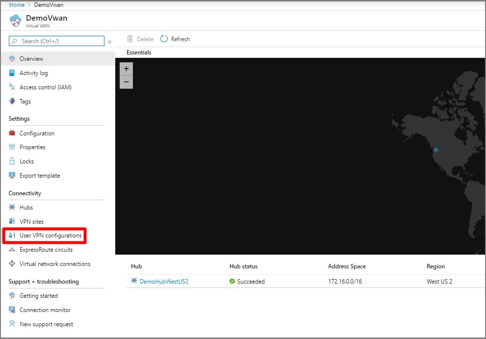
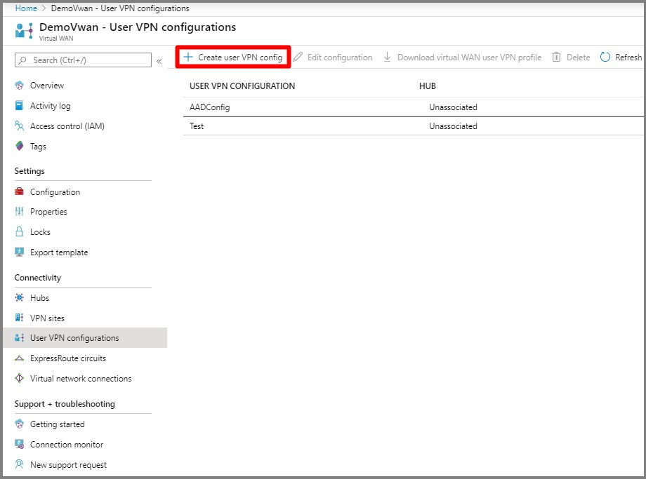
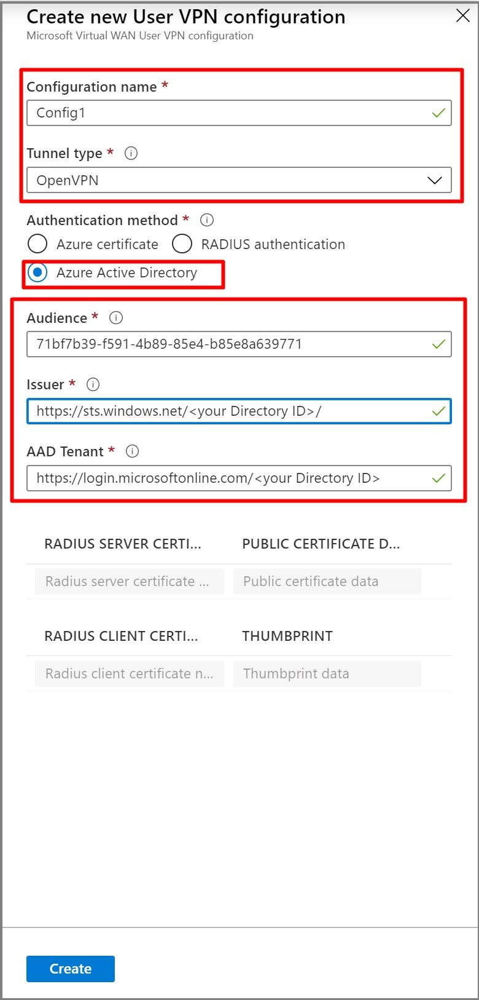

# Configure Azure Active Directory authentication for User VPN

This article shows you how to configure Azure AD authentication for User VPN in Virtual WAN to connect to your resources in Azure over an OpenVPN VPN connection. Azure Active Directory authentication is only available for gateways using OpenVPN protocol and clients running Windows.

This type of connection requires a client to be configured on the client computer. For more information about Virtual WAN, see the [Virtual WAN Overview](virtual-wan-about.md).

In this article, you learn how to:

> [!div class="checklist"]
> * Create a WAN
> * Create a hub
> * Create a P2S configuration
> * Download a VPN client profile
> * Apply P2S configuration to a hub
> * Connect a VNet to a hub
> * Download and apply the VPN client configuration
> * View your virtual WAN


## Before you begin

Verify that you have met the following criteria before beginning your configuration:

* You have a virtual network that you want to connect to. Verify that none of the subnets of your on-premises networks overlap with the virtual networks that you want to connect to. To create a virtual network in the Azure portal, see the [Quickstart](../virtual-network/quick-create-portal.md).

* Your virtual network does not have any virtual network gateways. If your virtual network has a gateway (either VPN or ExpressRoute), you must remove all gateways. This configuration requires that virtual networks are connected instead, to the Virtual WAN hub gateway.

* Obtain an IP address range for your hub region. The hub is a virtual network that is created and used by Virtual WAN. The address range that you specify for the hub cannot overlap with any of your existing virtual networks that you connect to. It also cannot overlap with your address ranges that you connect to on premises. If you are unfamiliar with the IP address ranges located in your on-premises network configuration, coordinate with someone who can provide those details for you.

* If you don't have an Azure subscription, create a [free account](https://azure.microsoft.com/free/?WT.mc_id=A261C142F).

## <a name="wan"></a>Create a virtual WAN

From a browser, navigate to the [Azure portal](https://portal.azure.com) and sign in with your Azure account.

1. Navigate to the Virtual WAN page. In the portal, click **+Create a resource**. Type **Virtual WAN** into the search box and select Enter.
2. Select **Virtual WAN** from the results. On the Virtual WAN page, click **Create** to open the Create WAN page.
3. On the **Create WAN** page, on the **Basics** tab, fill in the following fields:

   

   * **Subscription** - Select the subscription that you want to use.
   * **Resource group** - Create new or use existing.
   * **Resource group location** - Choose a resource location from the dropdown. A WAN is a global resource and does not live in a particular region. However, you must select a region in order to more easily manage and locate the WAN resource that you create.
   * **Name** - Type the Name that you want to call your WAN.
   * **Type:** Standard. If you create a Basic WAN, you can create only a Basic hub. Basic hubs are capable of VPN site-to-site connectivity only.
4. After you finish filling out the fields, select **Review +Create**.
5. After validation passes, select **Create** to create the virtual WAN.

## <a name="site"></a>Create an empty virtual hub

1. Under your virtual WAN, select Hubs and click **+New Hub**.

   
2. On the create virtual hub page, fill in the following fields.

   **Region** - Select the region that you want to deploy the virtual hub in.

   **Name** - Enter the name that you want to call your virtual hub.

   **Hub private address space** - The hub's address range in CIDR notation.

     
3. Click **Review + create**.
4. On the **validation passed** page, click **create**.

## <a name="site"></a>Create a new P2S configuration

A P2S configuration defines the parameters for connecting remote clients.

1. Under your virtual WAN, select **User VPN configurations**.

   

2. click **+Create user VPN config**.

   

3. Enter the information and click **Create**

   

## <a name="hub"></a>Edit hub assignment

1. Navigate to the **Hubs** blade under the virtual WAN.
2. Select the hub that you want to associate the vpn server configuration to and click the ellipsis (...).

   
3. Click **Edit virtual hub**.
4. Check the **Include point-to-site gateway** check box and pick the **Gateway scale unit** that you want.

   
5. Enter the **Address pool** from which the VPN clients will be assigned IP addresses.
6. Click **Confirm**.
7. The operation will can take up to 30 minutes to complete.

## <a name="device"></a>Download VPN profile

Use the VPN profile to configure your clients.

1. On the page for your virtual WAN, click **User VPN configurations**.
2. At the top of the  page, click **Download user VPN config**.
3. Once the file has finished creating, you can click the link to download it.
4. Use the profile file to configure the VPN clients.

## Configure user VPN clients

To connect, you need to download the Azure VPN Client and import the VPN client profile that was downloaded in the previous steps on every computer that wants to connect to the VNet.

> [!NOTE]
> Azure AD authentication is supported only for OpenVPN&reg; protocol connections.
>

#### To download the Azure VPN client

Use this [link](https://www.microsoft.com/p/azure-vpn-client-preview/9np355qt2sqb?rtc=1&activetab=pivot:overviewtab) to download the Azure VPN Client.

#### <a name="import"></a>To import a client profile

1. On the page, select **Import**.

    

2. Browse to the profile xml file and select it. With the file selected, select **Open**.

    

3. Specify the name of the profile and select **Save**.

    

4. Select **Connect** to connect to the VPN.

    

5. Once connected, the icon will turn green and say **Connected**.

    

#### <a name="delete"></a>To delete a client profile

1. Select the ellipsis (...) next to the client profile that you want to delete. Then, select **Remove**.

    

2. Select **Remove** to delete.

    

#### <a name="diagnose"></a>Diagnose connection issues

1. To diagnose connection issues, you can use the **Diagnose** tool. Select the ellipsis (...) next to the VPN connection that you want to diagnose to reveal the menu. Then select **Diagnose**.

    

2. On the **Connection Properties** page, select **Run Diagnosis**.

    

3. Sign in with your credentials.

    

4. View the diagnosis results.

    

## <a name="viewwan"></a>View your virtual WAN

1. Navigate to the virtual WAN.
2. On the Overview page, each point on the map represents a hub.
3. In the Hubs and connections section, you can view hub status, site, region, VPN connection status, and bytes in and out.


## <a name="cleanup"></a>Clean up resources

When you no longer need these resources, you can use [Remove-AzureRmResourceGroup](/powershell/module/azurerm.resources/remove-azurermresourcegroup) to remove the resource group and all of the resources it contains. Replace "myResourceGroup" with the name of your resource group and run the following PowerShell command:

```azurepowershell-interactive
Remove-AzureRmResourceGroup -Name myResourceGroup -Force
```

## Next steps

To learn more about Virtual WAN, see the [Virtual WAN Overview](virtual-wan-about.md) page.
