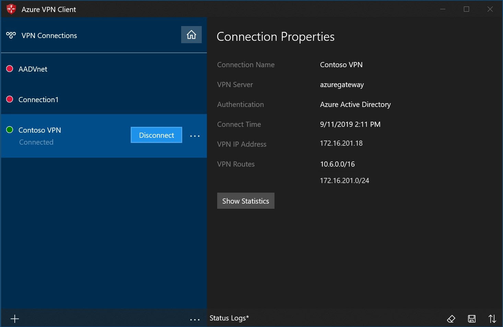
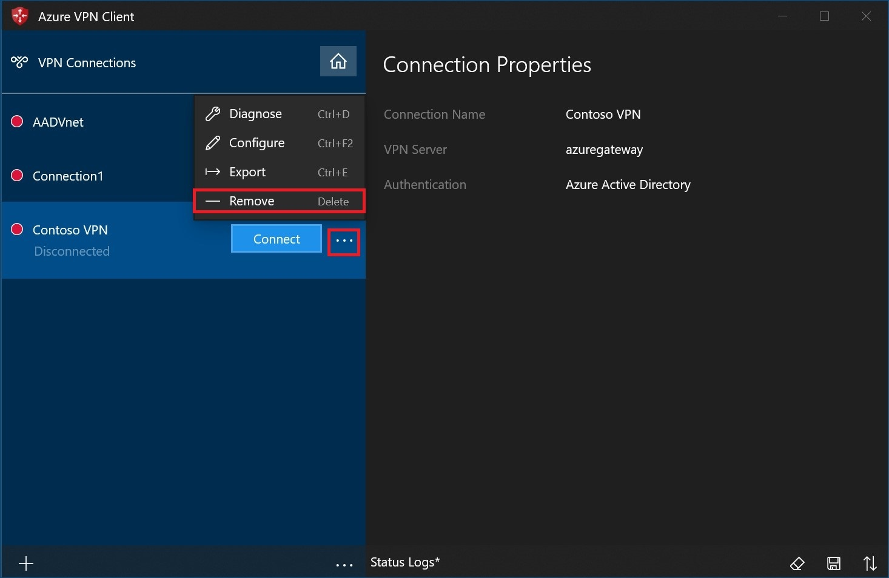
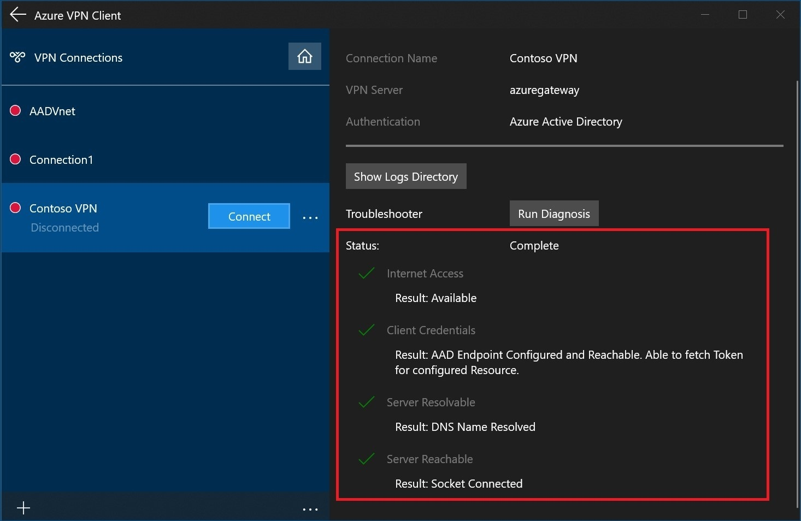

# Create a P2S User VPN connection using Azure Virtual WAN - Microsoft Entra authentication

This article shows you how to use Virtual WAN to connect to your resources in Azure. In this article, you create a point-to-site User VPN connection to Virtual WAN that uses Microsoft Entra authentication. Microsoft Entra authentication is only available for gateways that use the OpenVPN protocol.

[!INCLUDE [OpenVPN note](../../includes/vpn-gateway-openvpn-auth-include.md)]

In this article, you learn how to:

* Create a virtual WAN
* Create a User VPN configuration
* Download a virtual WAN User VPN profile
* Create a virtual hub
* Edit a hub to add P2S gateway
* Connect a VNet to a virtual hub
* Download and apply the User VPN client configuration
* View your virtual WAN

:::image type="content" source="./media/virtual-wan-about/virtualwanp2s.png" alt-text="Virtual WAN diagram.":::

## Before you begin

Verify that you've met the following criteria before beginning your configuration:

* You have a virtual network that you want to connect to. Verify that none of the subnets of your on-premises networks overlap with the virtual networks that you want to connect to. To create a virtual network in the Azure portal, see the [Quickstart](../virtual-network/quick-create-portal.md).

* Your virtual network doesn't have any virtual network gateways. If your virtual network has a gateway (either VPN or ExpressRoute), you must remove all gateways. This configuration requires that virtual networks are connected instead, to the Virtual WAN hub gateway.

* Obtain an IP address range for your hub region. The hub is a virtual network that is created and used by Virtual WAN. The address range that you specify for the hub can't overlap with any of your existing virtual networks that you connect to. It also can't overlap with your address ranges that you connect to on premises. If you're unfamiliar with the IP address ranges located in your on-premises network configuration, coordinate with someone who can provide those details for you.

* If you don't have an Azure subscription, create a [free account](https://azure.microsoft.com/free/?WT.mc_id=A261C142F).

## Create a virtual WAN

From a browser, navigate to the [Azure portal](https://portal.azure.com) and sign in with your Azure account.

[!INCLUDE [Create a virtual WAN](../../includes/virtual-wan-create-vwan-include.md)]

## Create a User VPN configuration

A User VPN configuration defines the parameters for connecting remote clients. It's important to create the User VPN configuration before configuring your virtual hub with P2S settings, as you must specify the User VPN configuration you want to use.

1. Navigate to your **Virtual WAN ->User VPN configurations** page and click **+Create user VPN config**.

   :::image type="content" source="./media/virtual-wan-point-to-site-azure-ad/user-vpn.png" alt-text="Screenshot of the Create User V P N configuration." lightbox="./media/virtual-wan-point-to-site-azure-ad/user-vpn.png":::
1. On the **Basics** page, specify the parameters.

   :::image type="content" source="./media/virtual-wan-point-to-site-azure-ad/basics.png" alt-text="Screenshot of the Basics page." lightbox="./media/virtual-wan-point-to-site-azure-ad/basics.png":::

    * **Configuration name** - Enter the name you want to call your User VPN Configuration.
    * **Tunnel type** - Select OpenVPN from the dropdown menu.

1. Click **Microsoft Entra ID** to open the page.

   :::image type="content" source="./media/virtual-wan-point-to-site-azure-ad/values.png" alt-text="Screenshot of the Microsoft Entra ID page." lightbox="./media/virtual-wan-point-to-site-azure-ad/values.png":::

    Toggle **Microsoft Entra ID** to **Yes** and supply the following values based on your tenant details. You can view the necessary values on the Microsoft Entra ID page for Enterprise applications in the portal.
   * **Authentication method** - Select Microsoft Entra ID.
   * **Audience** - Type in the Application ID of the [Azure VPN](openvpn-azure-ad-tenant.md) Enterprise Application registered in your Microsoft Entra tenant.
   * **Issuer** - `https://sts.windows.net/<your Directory ID>/`
   * **Microsoft Entra tenant:** TenantID for the Microsoft Entra tenant. Make sure there is no `/` at the end of the Microsoft Entra tenant URL. 

     * Enter `https://login.microsoftonline.com/{AzureAD TenantID}` for Azure Public AD
     * Enter `https://login.microsoftonline.us/{AzureAD TenantID}` for Azure Government AD
     * Enter `https://login-us.microsoftonline.de/{AzureAD TenantID}` for Azure Germany AD
     * Enter `https://login.chinacloudapi.cn/{AzureAD TenantID}` for China 21Vianet AD

1. Click **Create** to create the User VPN configuration. You'll select this configuration later in the exercise.

## Create an empty hub

For this exercise, we create an empty virtual hub in this step and, in the next section, you add a P2S gateway to this hub. However, you can combine these steps and create the hub with the P2S gateway settings all at once. The result is the same either way. After configuring the settings, click **Review + create** to validate, then **Create**.

[!INCLUDE [Create an empty hub](../../includes/virtual-wan-hub-basics.md)]

## Add a P2S gateway to a hub

This section shows you how to add a gateway to an already existing virtual hub. This step can take up to 30 minutes for the hub to complete updating. 

1. Navigate to the **Hubs** page under the virtual WAN.
1. Click the name of the hub that you want to edit to open the page for the hub.
1. Click **Edit virtual hub** at the top of the page to open the **Edit virtual hub** page.
1. On the **Edit virtual hub** page, check the checkboxes for **Include vpn gateway for vpn sites** and **Include point-to-site gateway** to reveal the settings. Then configure the values.

   :::image type="content" source="./media/virtual-wan-point-to-site-azure-ad/hub.png" alt-text="Screenshot shows the Edit virtual hub." lightbox="./media/virtual-wan-point-to-site-azure-ad/hub.png":::

   * **Gateway scale units**: Select the Gateway scale units. Scale units represent the aggregate capacity of the User VPN gateway. If you select 40 or more gateway scale units, plan your client address pool accordingly. For information about how this setting impacts the client address pool, see [About client address pools](about-client-address-pools.md). For information about gateway scale units, see the [FAQ](virtual-wan-faq.md#p2s-concurrent).
   * **User VPN configuration**: Select the configuration that you created earlier.
   * **User Groups to Address Pools Mapping**: For information about this setting, see [Configure user groups and IP address pools for P2S User VPNs (preview)](user-groups-create.md).

1. After configuring the settings, click **Confirm** to update the hub. It can take up to 30 minutes to update a hub.

## Connect VNet to hub

In this section, you create a connection between your virtual hub and your VNet.

[!INCLUDE [Connect virtual network](../../includes/virtual-wan-connect-vnet-hub-include.md)]

## Download User VPN profile

All of the necessary configuration settings for the VPN clients are contained in a VPN client configuration zip file. The settings in the zip file help you easily configure the VPN clients. The VPN client configuration files that you generate are specific to the User VPN configuration for your gateway. You can download global (WAN-level) profiles, or a profile for a specific hub. For information and additional instructions, see [Download global and hub profiles](global-hub-profile.md). The following steps walk you through downloading a global WAN-level profile.

[!INCLUDE [Download profile](../../includes/virtual-wan-p2s-download-profile-include.md)]

##  Configure User VPN clients

Each computer that connects must have a client installed. You configure each client by using the VPN User client profile files that you downloaded in the previous steps. Use the article that pertains to the operating system that you want to connect.

### To configure macOS VPN clients (Preview)

For **macOS** client instructions, see [Configure a VPN client - macOS (Preview)](openvpn-azure-ad-client-mac.md).

### To configure Windows VPN clients

[!INCLUDE [Download Azure VPN client](../../includes/vpn-gateway-download-vpn-client.md)]

#### To import a VPN client profile (Windows)

1. On the page, select **Import**.

   :::image type="content" source="./media/virtual-wan-point-to-site-azure-ad/import/import-1.png" alt-text="Screenshot shows import page.":::

1. Browse to the profile xml file and select it. With the file selected, select **Open**.

    

1. Specify the name of the profile and select **Save**.

    

1. Select **Connect** to connect to the VPN.

    

1. Once connected, the icon will turn green and say **Connected**.

    

#### To delete a client profile - Windows

1. Select the ellipsis (...) next to the client profile that you want to delete. Then, select **Remove**.

    

1. Select **Remove** to delete.

    

#### Diagnose connection issues - Windows

1. To diagnose connection issues, you can use the **Diagnose** tool. Select the ellipsis (...) next to the VPN connection that you want to diagnose to reveal the menu. Then select **Diagnose**.

    

1. On the **Connection Properties** page, select **Run Diagnosis**.

    

1. Sign in with your credentials.

    

1. View the diagnosis results.

    

## View your virtual WAN

1. Navigate to the virtual WAN.
2. On the Overview page, each point on the map represents a hub.
3. In the Hubs and connections section, you can view hub status, site, region, VPN connection status, and bytes in and out.

## Clean up resources

When you no longer need the resources that you created, delete them. Some of the Virtual WAN resources must be deleted in a certain order due to dependencies. Deleting can take about 30 minutes to complete.

[!INCLUDE [Delete resources](../../includes/virtual-wan-resource-cleanup.md)]

## Next steps

For Virtual WAN frequently asked questions, see the [Virtual WAN FAQ](virtual-wan-faq.md).
