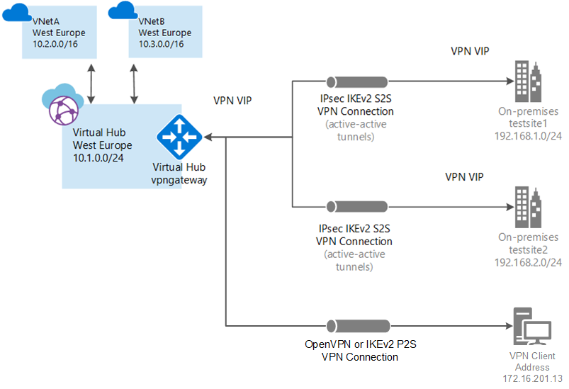

---

title: 'Tutorial: Use Azure Virtual WAN to create a Point-to-Site connection to Azure'
description: In this tutorial, learn how to use Azure Virtual WAN to create a User VPN (point-to-site) connection to Azure.
services: virtual-wan
author: cherylmc

ms.service: virtual-wan
ms.topic: tutorial
ms.date: 07/29/2021
ms.author: cherylmc

---
# Tutorial: Create a User VPN connection using Azure Virtual WAN

This tutorial shows you how to use Virtual WAN to connect to your resources in Azure over an IPsec/IKE (IKEv2) or OpenVPN VPN connection. This type of connection requires the VPN client to be configured on the client computer. For more information about Virtual WAN, see the [Virtual WAN Overview](virtual-wan-about.md).

In this tutorial, you learn how to:

> [!div class="checklist"]
> * Create a virtual WAN
> * Create a P2S configuration
> * Create a virtual hub
> * Generate VPN client profile configuration package
> * Configure VPN clients
> * View your virtual WAN
> * Modify settings

## Prerequisites

[!INCLUDE [Before beginning](../../includes/virtual-wan-before-include.md)]

## Create a virtual WAN

[!INCLUDE [Create a virtual WAN](../../includes/virtual-wan-create-vwan-include.md)]

## Create a P2S configuration

A point-to-site (P2S) configuration defines the parameters for connecting remote clients.

[!INCLUDE [Create P2S configuration](../../includes/virtual-wan-p2s-configuration-include.md)]

## Create virtual hub and gateway

[!INCLUDE [Create hub](../../includes/virtual-wan-p2s-hub-include.md)]

## Generate VPN client profile package

Generate and download the VPN client profile package to configure your VPN clients.

[!INCLUDE [Download profile](../../includes/virtual-wan-p2s-download-profile-include.md)]

## Configure VPN clients

Use the downloaded profile package to configure the remote access VPN clients. The procedure for each operating system is different. Follow the instructions that apply to your system.
Once you have finished configuring your client, you can connect. The following instructions are for Windows VPN clients.

[!INCLUDE [Configure clients](../../includes/virtual-wan-p2s-configure-clients-include.md)]

## View your virtual WAN

1. Navigate to the virtual WAN.
1. On the **Overview** page, each point on the map represents a hub.
1. In the **Hubs and connections** section, you can view hub status, site, region, VPN connection status, and bytes in and out.

## To modify settings

### Modify client address pool

[!INCLUDE [Modify client address pool](../../includes/virtual-wan-client-address-pool-include.md)]

### Modify DNS servers

1. Navigate to your **Virtual HUB -> User VPN (Point to site)**, then click **Configure**.

1. On the **Edit User VPN gateway** page, edit the **Custom DNS Servers** field. Enter the DNS server IP address(es) in the **Custom DNS Servers** text box(es). You can specify up to five DNS Servers.

1. Click **Edit** at the bottom of the page to validate your settings. Then, click to update this setting.

## Clean up resources

When you no longer need the resources that you created, delete them. Some of the Virtual WAN resources must be deleted in a certain order due to dependencies. Deleting can take about 30 minutes to complete.

[!INCLUDE [Delete resources](../../includes/virtual-wan-resource-cleanup.md)]

## Next steps

To connect a virtual network to a hub, see:

> [!div class="nextstepaction"]
> * [Connect a VNet to a hub](howto-connect-vnet-hub.md)
